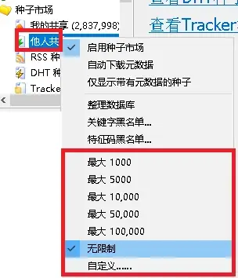
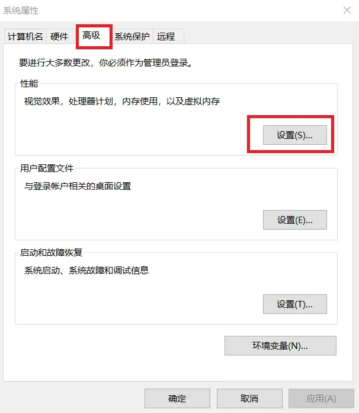
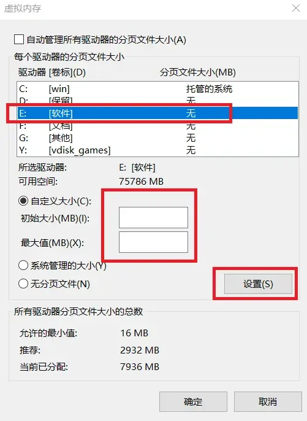

---
sidebar_label:内存占用过高问题
---

# 比特彗星常见问题-内存占用过高问题

2023.10.04  

**问：** 比特彗星内存占用过高怎么办？  

**答：** 请打开 [专家模式](./BC-expert-mode.md) 并查看统计中 展开 内存使用 选项 以查看是什么占用了内存  

**问：** 一般哪些项目容易占用较多的内存？  

**答：**  

## Torrent列表

如果启用了 **种子市场** 并且加载的其中有大量的种子就会造成此项占用大  
解决办法： **限制种子市场最大条数** 右键弹出菜单以选择限制条目数  

如果不使用种子市场请 **直接禁用以避免不必要的内存占用**  
右键种子市场 取消勾选启用种子市场  

如果确实有使用种子市场的需要 且内存确实不足的话请 **调整系统虚拟内存**  
**请把虚拟内存设置在SSD固态硬盘分区** 否则机械盘4K读写性能很差 会严重影响系统运行速度  
**如果电脑没有固态硬盘或只有C盘是固态则不建议虚拟内存**  

### 调整虚拟内存

win+R键 打开运行 输入 `control sysdm.cpl,,3` 点击确定  

高级》性能 点击设置按钮  

高级》虚拟内存 点击更改按钮  

取消勾选 自动管理分页文件大小  
选择C盘 设置为无分页文件  

**注意！**  
**虚拟内存默认在 C盘 如果要手动调整虚拟内存 建议选择 C盘以外的分区**  
**如果不得不选择 C盘 请确保 C盘有足够的空间 虚拟内存大小参考 将在后文给出**  

会弹出警告 不用担心 我们会在其他分区设置虚拟内存 点是  

选择其他分区并设置虚拟内存 **一定要选择使用固态硬盘的分区**  

**选择自定义大小 初始大小和最大值相同**
虚拟内存设置大小参考：  

* 2G物理内存，设置6G虚拟内存，系统可用总提交大小8G
* 4G物理内存，设置12G虚拟内存，系统可用总提交大小16G
* 8G物理内存，设置16G虚拟内存，系统可用总提交大小24G
* 16G物理内存，设置24G虚拟内存，系统可用总提交大小40G
* 32G物理内存，设置16G虚拟内存，系统可用总提交大小48G
* 64G物理内存，设置无分页文件，系统可用总提交大小64G

完成后点击 确定 **重启电脑后生效**  

---

## UDP传输缓冲区

**UDP缓冲区占用过大** 可能是由于限制了总UDP发包量后  
没有修改DHT发送队列造成的  

在 UDP 发起量为10 的情况下 可以设置为 300 或更小  
在 UDP 发起量为200-500 时可以设置为 1000 或更小  

---

## 磁盘写操作缓冲区

磁盘写操作缓冲区占用过大 **说明硬盘的写入速度跟不上下载的速度**  
**有可能是硬盘读写性能差 导致数据无法及时写入磁盘**  

也可以手动进行下载速度限制，使硬盘可以及时写入数据  
也可以先下载到固态硬盘，然后再移动到机械硬盘存储  

这在移动存储设备上也十分常见  
建议先下载到内置硬盘后再移动到移动存储设备  
在彗星中可以设置下载后移动文件  

例如默认下载到 D盘其为固态硬盘 完成后移动到 E盘即机械硬盘  
**针对移动硬盘也是相同的道理**  

---

## 磁盘缓存

使用内存做缓存加快硬盘读写速度 对机械硬盘来说十分重要  
一般来说在内存足够的情况下缓存越大越好  

官方版的磁盘缓存设置相当保守  
如果使用的是调整过参数的版本 磁盘缓存大小会有所区别  
缓存设置过小也会影响下载和上传  

BT传输缓存和长效种子上传缓存 **最小不应小于512**  
**如果觉得内存占用多可以手动进行调整**  

### 设置建议

假设总物理内存为8GB即 8192 MB （实际要略小一些）  
希望为空闲内存为3GB即保留3GB内存(3072MB)  
减小缓存填写3072 **空闲内存小于此数值时会减小缓存**  

BT缓存和长效缓存之和 即为 8192-3072=5120 MB  
可以各分配一半即 2560MB 也可以为BT下载多分配一些  
HTTP连接缓存：不调整（1MB） **勾选 自动调整**  

---

参考和引用：  

* https://www.cometbbs.com/t/84274
* https://www.cometbbs.com/t/86678
* https://www.cometbbs.com/t/86353
* https://bbs.itzmx.com/thread-102123-1-1.html

