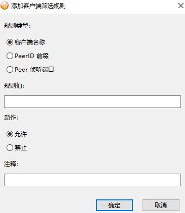

# 比特彗星常见问题-反吸血 设置IP过滤和客户端过滤 

2025.10.03  

在之前的教程中我们已经介绍了 如何配置比特彗星中 基于流量的自动反吸血  
以及通过peeID和客户端名称来屏蔽吸血客户端  

[比特彗星常见问题-屏蔽吸血客户端和设置自动反吸血](./BC-anti-leech)

在v2.10 版本后比特彗中 **内置了IP过滤器**  
无需再使用 外置的防火墙实现IP屏蔽  

早期的外置防火墙屏蔽方案：  

* [「反吸血」使用命令操作Windows防火墙以实现全自动/半自动的批量IP屏蔽](./win-firewall-anti-leech.md)
* [「反吸血」在Windows下使用Fort Firewall全自动批量屏蔽IP](./fort-firewall-anti-leech.md)


而v2.15版本后 **重置了客户端过滤器** 设置方法与之前大不相同  
此外随着webGUI的更新一些外置的反吸血程序  
也对比特彗星进行了适配了  

---

## 外置反吸血程序

外置反吸血程序通过BT客户端的WEB UI/API 获取信息  
主要为已连接用户(peers)的IP与端口号、客户端名称/peeID、上传/下载量  
再通过可灵活配置的规则来判断其是否构成吸血或其他恶意行为  

此处推荐使用[PeerBanHelper](https://github.com/PBH-BTN/PeerBanHelper) 由于PeerBanHelper的更新速度较快  
安装和配置教程详见其官方文档：[链接](https://docs.pbh-btn.com/docs/intro)  

---


## 配置 IP过滤


* 支持黑白名单切换 
* 支持从文件中添加IP地址
* 支持从网络订阅IP列表
* 支持定期刷新订阅
* 支持手动添加IP
* 支持导入/导出现有列表
* 支持格式检查 自动剔除无效内容

其中“替换现有IP地址列表”表示  
通过订阅到的IP列表将会 **完全替换** 现有订阅IP列表  
**使得本地订阅与远程服务器上的IP列表保持同步**  

而“合并到现有IP地址列表”表示  
将订阅中获得到IP列表 **添加** 到现有订阅IP列表中  
相当于添加新的IP封禁 但不会删除旧的  

长期积累会导致封禁IP的数量越来越多  
IP地址的分配是动态 不应该长期的封禁这些地址  
故一般情况下不使用该选项  

此处推荐使用 由[PeerBanHelper](https://github.com/PBH-BTN/PeerBanHelper) 整理的IP黑名单  
同时也建议已经使用上 PeerBanHelper 的用户在此处订阅该列表  
订阅后列表上的IP直接由BC客户端屏蔽 从而减轻PBH的处理压力  

项目地址：[BTN-Collected-Rules](https://github.com/PBH-BTN/BTN-Collected-Rules)
订阅地址：[链接](https://bcr.pbh-btn.ghorg.ghostchu-services.top/combine/all.txt)

**手动列表** 用于手动追加需要屏蔽的IP  
外置反吸血程序在进行封禁时也会使用手动列表  

相比起订阅列表其可视性更好 可以在文本框中直接看到填写的内容  
此外其还支持注释 以 `#` 开头


### 用户列表中的IP过滤器

在用户列表中发现异常的用户 可以通过右键菜单中IP过滤 进行封禁  
可以选择封禁 5分钟 1小时 24小时 和永久封禁  
也可以对已经封禁的用户进行解封  

若是选择永久封禁 其IP会自动添加到上文中的手动列表里  
其他非永久封禁则不会 计时结束后会自动取消封禁  


---

## 客户端过滤

在2.15版本后客户端过滤功能发生了很大的变化  

### 客户端列表

客户端列表功能从之前 **BT下载** 选项中移到了 新增加的 **客户端过滤选项** 内  
可以识别更多种类的客户端  


原先在高级设置中的peeid 封禁 端口封禁和客户端名称封禁  
都已被取消 功能全部由新的 **客户端过滤** 承担  

### 客户端过滤详解


客户端过滤与IP过滤类似有 **手动列表** 和 **订阅列表** 之分  

两个列表都有一个不可删除的兜底规则  
也就是控制 那些没有被其他规则匹配到客户端是阻止还是允许  
**通过调整这个默认规则 以实现白名单和黑名单的切换**  

右下角的箭头用于调整规则的优先级  
而复选框则表示启用或禁用规则  

**规则从上到下的进行匹配 序号越小的规则优先级越高**  
手动列表的优先级高于订阅列表而客户端列表的优先级又高于手动列表  

 
**全局过滤顺序：**  
```
用户连入
   ↓
IP过滤器（手动规则合并订阅规则）
   ↓
客户端列表
   ↓
客户端过滤器（手动规则）
   ↓
客户端过滤器（订阅规则）
   ↓
保持连接
```



客户端过滤规则分为四个部分 **类型 值 动作 注释**  

* **类型**用于选择匹配的类型 
  可以匹配传入用户的 客户端名称 peerID 和监端口号
* **动作** 为操作条件 可选择运行允许或阻止连接
* **注释** 用于说明该规则的含义

#### 匹配方式

端口号匹配与之前的版本没有区别  
直接填写需要屏蔽的端口号即可  

**而peerID和客户端名称的匹配有较大的变化**  
匹配比之前更加严格 之前版本中的 peerID和客户端名称匹配

相当于检查连接的客户端中 **是否包含** 有要求的内容  
并不是严格的按照从左到又的顺序进行匹配的  

例如需要匹配的peerID为`-XL0018-`  
在过去填写`XL0018`就能匹配 最前面的连字符可以忽略  
依靠后面的部分（至少6个字符）也可以匹配上  

而在现在需要填写`-XL0018` **缺失最前面的连字符会导致无法匹配**  
字符匹配数量与之前相同至少需要6个字符

虽然看起来麻烦了一些不过这个精准匹配与新加入的通配符配合起来  
**可以解决之前版本中 无法匹配那些固定部分小于6个字符的客户端的问题**  

现在允许使用`?`作为 **通配符** 表示匹配任意单个字符  
例如需要屏蔽的客户端名称为 `ABC123`  
其中ABC为固定部分 而123为变化的版本号  

就可以通过 填写 `ABC???` 可以直接匹配上 
客户端名称中以ABC开头而后面为不同版本号的客户端  

示例:  
```
ABC123
ABC456
ABC789
```

这里准备了 一个过滤列表 屏蔽了常见的有害客户端 可供直接使用和编写参考  

* GitHub项目地址链接：`https://github.com/bitcomet-post-bar/BC-Client-Filter`
* GitHub订阅地址：`https://github.com/bitcomet-post-bar/BC-Client-Filter/blob/main/Client_Filter.json`
* Gitee项目地址：`https://gitee.com/bitcomet-post-bar/BC-Client-Filter`
* Gitee订阅地址：`https://gitee.com/bitcomet-post-bar/BC-Client-Filter/raw/main/Client_Filter.json`

手动过滤列表和订阅列表 所对应的 client_filter.json 文件  
存储在BC配置文件夹内的rules文件夹中  


---

## 参考资料

https://wiki.bitcomet.com/bitcomet_options#ip_filter