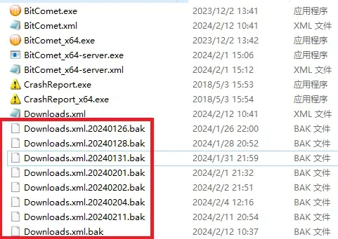

# 比特彗星常见问题-意外退出程序后下载列表清空的解决方法

2024.02.14  

**问：** 程序意外退出后（如停电） 下载列表清空了该怎么办？

**答：** 这应该是 下载列表没有正常保存导致的  
不过好在 彗星本身其实有配置备份机制  

便携版配置文件保存在程序安装目录中  
而安装版则在 C盘的用户文件夹 AppData 中即`%appdata%\BitComet`  

打开目录可以看到一些 名为 **Downloads.xml.[日期].bak** 的文件  
这些就是下载列表的备份文件日期部分表示其备份的时间  

**恢复方法**  

1. 退出比特彗星
2. 删除现在的Downloads.xml文件
3. 选择备份文件中日期最靠近现在的一个文件将其后面的 ".[日期].bak"后缀删去即变成Downloads.xml
4. 现在再打开彗星就可以看到下载列表已经恢复了

**问：** 要是目录下 **没有备份文件呢？**  

**答：** 一般来说都会有 要是没有生成的话就比较麻烦了  
不过依然有办法那就是使用 **种子存档**  

种子存档功能默认启用 **在添加任务时会自动保存一份种子文件**  
右键可以重新添加到下载列表中 其保存在torrents文件夹中和配置文件在同一个目录  

不过**我们不需要重新下载文件**  
在创建任务的时候 **选择之前任务下载的目录**  

注意多文件任务会生成文件夹 不要选择这个文件夹  
要选择其上一层的目录  

选择好目录创建好任务后 **立刻停止任务**  
检查下载目录 可能会生成临时文件其应该和之前下载的文件在一起  
**这说明目录选择正确 删除这些临时文件**  

**右键任务>重新检查完整性 校验完成后任务进度即可恢复**  
**注意要是之前只选择下载了部分文件那么现在也需要重新选择**  
**默认状态会下载全部文件**  

**问：** 那程序配置有备份吗？  

**答：** 程序配置 BitComet.xml 文件并没有备份  

**问：** 那要是丢失了就无法恢复了吗？  

**答：** 确实是这样的 不过程序配置应该不太容易丢失  
如果实在担心的话可以对这两个文件进行备份比如FreeFileSync等备份软件  

---

参考：  
* https://www.cometbbs.com/t/42493

