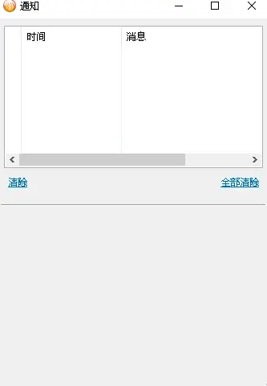

# 比特彗星常见问题-磁盘提速服务问题

2023.07.28  

**问：** 磁盘提速服务出现 未安装\拒绝访问\其他错误 该怎么办？  

**答：** **磁盘提速服务有异常** 可以通过重新安装服务来解决  
通常在彗星启动的时候会检查提速服务状态 若有异常会弹出通知提示修复

**问：** 服务有异常 但没有弹出任何通知  

**答：** 这可能是Windows阻止BC弹出通知，需要在通知中心进行设置  
打开始菜单 点击账户头像下的齿轮进入 **设置**   
（v2.01 Beta1 [20230529]之前）  

在Windows设置中选择 **系统**  

侧边栏选择 **通知和操作**  

确保 **获取来自应用和其他发送者的通知** 开关打开  

继续往下 找到比特彗星的通知控制开关 **设置为开**  

重启比特彗星 右下角应会弹出通知  

点击通知 提示修复服务 选择 是  

提速服务已在运行  
在v2.01 Beta1 后 引入了内置通知栏  
可以无需Windows中设置通知权限 直接在内置通知栏中显示通知  

当磁盘提速服务有问题时 内置通知栏会弹出通知  

点击立即修复即可  
省去了设置Windows通知权限的过程  

**若点击修复后依然无效**  
请退出比特彗星 右键主程序或其快捷方式 选择 **以管理员身份运行**  
或者 属性 兼容性 勾选 以管理员身份运行此程序  

---

参考与引用：  
* https://www.cometbbs.com/t/54968
* https://www.cometbbs.com/t/78670
* https://www.cometbbs.com/t/86510

