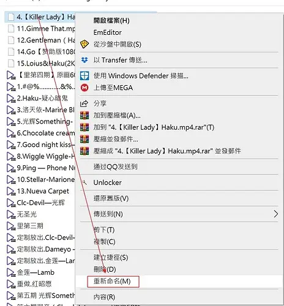
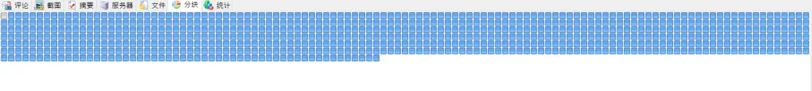
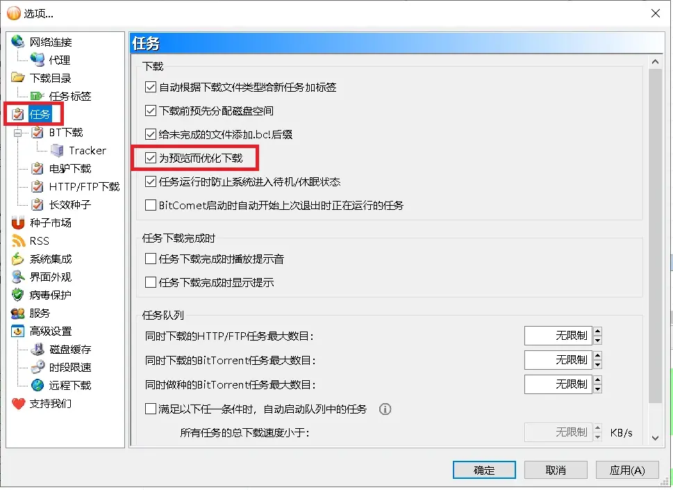

# 比特彗星常见问题-下载进度卡在 99.9% 问题

2023.10.22  

**问：** 为什么有的任务下载进度卡在了99.9% 就是无法完成？  

**答：** 可以尝试 **重新启动任务** 看看有没有效果？

**问：** **有些任务好了** 但是还有些任务还是这样

**答：** 官方wiki中有以下解释：

> ## 为什么有的BT任务下载到99.9%后等了很长时间都无法完成?  
> 可能造成这个现象的原因比较多，目前已知的原因包括：  
> 
> * torrent文件发布时间较早，已经没有完整的BT种子可供下载了，BT任务健康度小于100%。  
> 这种情况>下除非有人补种，或有人提供长效种子上传，或在emule插件里能够找到相同文件继续下载，否则永远无法完成。  
> 不过对于视频文件而言，差一点点数据基本不会影响正常播放了。  
>
> * BT任务里除了有视频文件外还有一些很小的图片或文本文件，视频文件已经通过长效种子很快下载完成了  
> 图片等小文件没有长效种子源，下载很慢。这种情况可以选择不下载图片等小文件。  

> * 早期BitComet软件的bug。对于相邻文件边界处的分块，早期BitComet软件可能会由于下载到错误数据而反复重新下载，造成长时间无法完成。  
> 对这种情况首先推荐升级到最新版BitComet。对旧版BitComet可以尝试先停止任务后再重新启动任务，也能提高快速下载完成的几率。  

> ## 为什么有的BT任务下载完成后文件进度会变成99.9%?
>
> 可能造成这个现象的原因比较多，目前已知的原因包括：  
>
> * 用户不小心删除了”任务名.piece_part.bc!“文件。这个文件里含有相邻文件边界处的分块数据  
> 删除后会造成文件边界处的分块数据无法进行Hash检查，从而使文件进度下降到99.9%  
> 遇到这种情况可以先对BT任务进行完整性检查，然后再启动任务下载一会儿即可恢复到100%  
>
> * 用户退出BitComet后删除了下载的部分文件，下次运行BitComet时再切换相关文件的选中下载状态，未删除的文件进度也可能会变成99.9%。  
> 这是由于用户手工删除的文件含有相邻文件边界处的分块数据，造成未删除的文件头尾分块不完整、无法进行Hash检查，从而引起文件进度下降。  
> 解决方法同上。为避免发生这种情况，对要删除的文件应先在BitComet中切换为禁止下载后再删除。  
> 这样操作的话BitComet就会将文件边界处的分块数据保存到”任务名.piece_part.bc!“文件，从而避免之后发生文件进度下降。  
>
> * 早期BitComet软件的bug。早期BitComet软件在切换文件选中下载状态时的bug会造成文件进度下降。  
> 这种情况只需要重新检查任务完整性即可恢复到100%。  

**问：** 如何确定是哪一种情况呢？  

**答：** 选中要查看的 **任务** 再点开 **文件选项卡**  
查看 任务中包含的文件 **及其下载进度**  

**问：** 我这里有很多文件 **其中大部分文件都下载完了**  
**只有一些小文件没有下载完**  

**答：** 对 一些小文件 **例如广告或者说明文件** 很少有人会去下载 自然也就没什么人上传  
可以在文件列表中 **取消勾选** 即不下载这些文件  

**这样排除这些文件后进度就能到达100%了**  
当然这里是字幕文件 可以到其他的字幕站去下载字幕  

**问：** 还有些任务像这样的 **是视频**  
但是有很多 大部都下载完了 **有一些没有下载完**  

**答：** 这种情况可以尝试多等待一段时间 或者看看 下载缓慢和无法下载问题  
[比特彗星常见问题-下载缓慢和无法下载问题[重置]](./BC-download-speed-issues-2.md)  
如果等待了很长时间依然无法下载 可能这些文件那些小文件一样没人上传了  

**问：** 还有些任务只有一个视频文件 但也卡在了99.9%

**答：** 可以看一下 **分块图**  

**问：**  

**答：** **有一个分块没有下载完成 好在不是头部分块**  
不过这个不影响播放 点击预览按钮就能播放了  
可能是在制作资源的时候 没有对齐分块造成的  

**问：** 但是我想直接通过 **点文件来播放播放**  

**答：** 把文件 .bc! 的后缀名去掉即可  
**建议复制一份修改后缀名** 这样不会影响彗星继续上传  

**问：** 刚才说 还好 好在不是头部分块 是什么意思?  

**答：** 如果是头部分块没有下载 即使其他分块都下载完成  
仍有可能会无法播放像这样  

**问：** 为什么呢？  

**答：** 因为这部分的分块可能包含了视频的描述信息  
即告诉播放器这是一个什么样的视频文件  

如果没有些信息播放器就可能无法播放 也有人说 PotPlayer 能播放  
即使缺失了这部分的关键信息  

**问：** 怎么预防这样的问题呢？  

**答：** 可以启用 **为预览而优化下载 和 顺序下载**  
设置>任务>勾选 为预览而优化下载 这样会优先下头部和尾部分块  

**右键任务 弹出菜单 勾选顺序下载**  

---

参考：  

* https://www.cometbbs.com/t/57166
* https://www.cometbbs.com/t/29345/7
* [为什么有的bt任务下载到999_后等了很长时间都无法完成](http://https://wiki-zh.bitcomet.com/%E5%AE%8C%E6%95%B4%E5%88%97%E8%A1%A8#%E4%B8%BA%E4%BB%80%E4%B9%88%E6%9C%89%E7%9A%84bt%E4%BB%BB%E5%8A%A1%E4%B8%8B%E8%BD%BD%E5%88%B0999_%E5%90%8E%E7%AD%89%E4%BA%86%E5%BE%88%E9%95%BF%E6%97%B6%E9%97%B4%E9%83%BD%E6%97%A0%E6%B3%95%E5%AE%8C%E6%88%90)
* https://www.cometbbs.com/t/87880
* https://www.cometbbs.com/t/63264
* https://www.cometbbs.com/t/33880
* https://www.cometbbs.com/t/40701
* https://www.cometbbs.com/t/30858
* http://wiki-zh.bitcomet.com/%E8%A7%86%E9%A2%91%E9%A2%84%E8%A7%88

