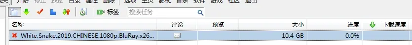
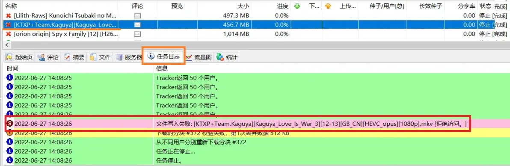
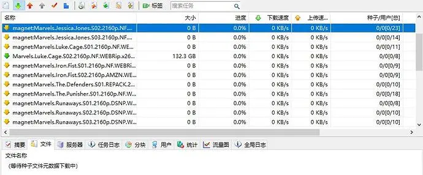
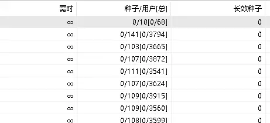

# 比特彗星常见问题-下载缓慢和无法下载问题[重置]

2023.10.10  

**问：** 使用彗星**下载资源缓慢/没有下载速度/无法下载**怎么办？  

**答：** 这有很多可能 先看一下任务的 **状态**  

**问：** 任务前面有一个红叉 从新启动任务也是这样  

**答：** 这说明任务出错了可以选中任务看一下**任务日志**或者**摘要**  

**问：** 遇到这些报错要这么解决呢？  

**答：** 如果是**拒绝访问**  

可能是文件夹权限问题  
尝试手动在当前下载目录中创建文件 看看是否有权限问题  
或者直接更换下载目录  

如果是**系统找不到指定的路径**  

* 这可能是文件路径过长导致的 可以尝试更换路径更短的位置再进行下载
* 也有可能是下载路径中包含空格不过这个问题应该只在很旧的版本中才会发生（1.79之前的版本）
* 在1.99中似乎有一个小bug 右键任务移动文件时似乎也会出现这个问题
* 还有可能是硬盘发生问题比如掉盘了整个分区直接在Windows里就识别不到了

如果不是硬件故障的话更换目录下载基本都可解决  

**问：** 那如果是**感叹号**呢？  

**答：** 黄色感叹号表示**下载完成的文件丢失 即文件不在原来的位置了**  

**问：** 我把文件移动到其他的地方了 要如何让任务恢复正常呢？  

**答：** 可以删除任务然后再重新添加 将下载路径选择到现在文件所在的位置  

如果生成了临时文件就将其删除右键任务》重新检查完整性  
校验完成后即可恢复正常  

或者选择任务右键》文件移动到 选择现在文件所在的目录即可  
移动后右键任务》重新检查完整性  

**注意目录不要搞错了 多文件任务会生成文件夹**  
**不要选择这个文件夹要选择其上一层的目录**  

**问：** 更换完目录后任务变成了黄色的向下的箭头 显示 **“等待种子元数据下载中”**  

**答：** 这是元数据下载问题 在之前的教程中有讲解过  
教程链接：[比特彗星常见问题-元数据获取问题](./BC-get-metadata-error.md) 

**问：** 按照这个教程中的内容操作过了 **一些任务有下载速度了**
但是**还是有一些任务 没有下载速度** 元数据已经获取到了
任务名称和文件列表 也都显示了 下载箭头也变成了绿色

**答：** 选中任务查看 **种子/用户[总]这一列** 鼠标放在上面会有悬浮显示  

也可以选择任务 后点开 **用户选项卡** 可以更直观的看到  
连接上的用户及其详情  

**问：** 全部用户数很少 用户选项卡里是空的  

**答：** 这样的话**说明这个种子可能已经 “凉了” 也就是死种了 没法下载了**  

>官方维基的解释：
>种子/用户[总]：BT任务时表示种子、用户的连接情况(不含长效种子数量)；
>BT任务“5/42[7/364]“表示已经连接42个用户数，其中有5个种子；所有可以连接的用户为364个，其中有7个种子。

**问：** 种子凉了？ **不是我设置的问题吗？**  

**答：** 不完全是，这其实**和bt下载的原理有关系**  

**问：** 难道**不是服务器提供**的下载吗？  

**答：** 不完全正确 一般的下载确实是这样的 包括网页上的下载  
网盘里的下载而bt下载不是  

简单的来说在bt下载中你的下载依靠的不是巨大的服务器**即文件不存在服务器里**  
而是依靠其他和你一样的普通用户**即文件存在这些用户的电脑里**  

其他人给你上传 你才有下载速度 而你上传给其他人 其他人也才有下载速度  
更详细的讲解:  
[比特彗星-端口阻塞解决方案-1.7 P2P模式 和C/S模式的差异](../bitcomet-port-forwarding/08-cs-and-p2p.md)  

**问：** 这么说来是需要连接到其他有文件的用户才能获取到下载速度？  

**答：** 是的  

**问：** 那么刚才看到的 用户很少 也都没连上 这就是下载不了的原因？  

**答：** 对  

**问：** 等一下，软件这么知道有哪些其他的用户？这里的用户数是这么计算出来的？  

**答：** 这里的用户数是查找到的用户数量，需要先找到用户后才能尝试进行连接  

**问：** 如何找到更多其他有这个任务的用户？  

**答：** 可以通过添加tracker服务器 来发现更多用户 从而提高下载速度  

**问：** 如何操作？  

**答：** 按照截图 进行操作即可  
如果是使用的贴吧解锁版则无需此操作 已经设置好了  
贴吧解锁版：[链接](https://github.com/bitcomet-post-bar/BC-modified/tree/main/bitcomet-modified)  

填写如下内容 `https://cf.trackerslist.com/best.txt` 保存即可  
如果这里的地址失效了可以到项目主页查看新的地址(https://trackerslist.com/)  

**问：** 用户数量 确实变多了 有的任务开始有下载速度了！  
那用户选项卡里的 下载速度、上传速度、下载大小、上传大小 都是什么意思？  

**答：**  

* 下载速度： 从这个用户身上获取下载的速度
* 上传速度： 给这个用户的上传速度
* 下载大小： 从这个用户下载的数据量
* 上传大小： 给这个用户上传的数据量
* 对方下载速度： 对方下载这个任务时的总速度

每一行是一个用户  
**你的下载是别人的上传，你的上传也是别人的下载**  

如第一行，你从第一个用户那里获得了3KB/s的下载速度  
同时你为他上传23KB/s 相当于为他提供23KB/s的下载速度  
对方下载的总速度速度是 546KB/s 其中也包含着你提供的32KB/s  

因为连接了多个用户所以对方下载速度是对方从他连接到的每个用户身上获取的下载速度的和  

**问：** 但tracker服务器是这么让客户端发现更多用户的呢？  

**答：** 简单的来说 tracker服务器相当于一个**公告栏**  
用户可以在这个公告栏**留下自己的信息**  
比如自己正在下载什么资源 以及自己的地址即IP和端口号  

这样就可以通过查这个看公告栏来知道还有哪些用户也在这个资源  
就可以尝试连接这些用户 从而获取到下载速度  
同样的留下你自己的信息 别的用户也会尝试来连接你  

**问：**原来如此** 那用户越多下载速度就越快了？**  

**答：** 是的 虽然每个用户为你提供的下载速度并不多但用户数多起来 速度也就快起来了  
**同样的你也许需要为其他用户提供下载速度（上传）** 众人拾柴火焰高  

**问：** 那为什么有些种子会没有用户呢？  

**答：** 可能是因为资源本身不行没人喜欢  
当然更多的是因为时间比较久了 没有人保留这个资源并上传了  
如果遇到这样的情况 恐怕只能换个资源了  

**问：** 这样的话bt下载的速度和可靠性岂不是没有保障？  
快的很快 慢的很慢 甚至无法下载？  

**答：** 是的 我们已经习惯了中心化服务器下载的“可靠性”  
**以至认为成功的下载一个资源是理所应当的**  

**问：** 我大概了解了 那经常说的开端口或者绿灯什么的能提高下载速度吗？  
端口阻塞影响下载吗？  

**答：** 端口阻塞**对下载的影响较小 对上传的影响大**  
阻塞依然可以下载 但开放端口确实有助于提升下载速度  

详见：  
比特彗星-端口阻塞解决方案-1.7 P2P模式 和C/S模式的差异  

**问：** 那为什么有些种子迅雷下载的快？但是彗星下载的很慢甚至无法下载  
是因为迅雷能发现更多的用户吗？  

**答：** 某种程度上来说是的，现在的迅雷不是纯P2P下载它**有服务器支持**   
外加上庞大的用户数量 使其确实可以获得较好的下载速度  

**问：** 那迅雷连服务器 我连迅雷是不是也可以实现高速下载？  

**答：** 并不能 **因为大部分的迅雷不会给非迅雷客户端上传** 但会从非迅雷客户端下载 我们称之为**“吸血”**  

**问：** 意思是迅雷之间互相下载和上传 也从我这里下载 **但是不给我上传这样它就有速度 我就没速度？**  

**答：** 差不多是这个意思关于 反吸血和屏蔽迅雷可以看看这篇：  
比特彗星常见问题-屏蔽吸血客户端和设置自动反吸血  

**问：** 那迅雷网盘以及其网盘的离线下载似乎下载的更快这是什么原理？  

**答：** 简单的来说 是**网盘的服务器伪装成bt下载者从正常的bt用户哪里下载**  
大型的服务器拥有更好的软硬件资源可以同时伪装成大量的用户 同时下载  
使其自身获得极快的下载速度  

**问：** 那这样会给普通用户上传吗？  

**答：** 应该是不会的  

迅雷论坛中客服对离线下载是否有上传的回复  

**问：** 那这不也是一种吸血行为吗？  

**答：** 是的，这也是一种吸血行为  

不过也有人认为这不完全是一件坏事 服务器在下载完一个任务后应该会保存很长时间  
虽然不会给其他bt用户上传 但也算是提高了资源的生存时间  
甚至产生了利用这些离线服务器 救活老旧资源的方法  

**问：** 那用梯子可以下载的更快吗？  

**答：** 一般来说不能  

**问：** 用梯子不是能连接到更多国外用户吗？  

**答：** 一般的机场或者梯子都是禁止BT的 国外版权方面查的比较严  

而且一般的屏蔽并不会屏蔽P2P流量  
倒是运营商可能会干扰bt下载 可以开个**协议加密**  
设置为优先即可  

---

参考：

* https://www.cometbbs.com/t/85870
* https://www.cometbbs.com/t/69214
* https://www.cometbbs.com/t/57026
* https://www.cometbbs.com/t/34470
* https://web.archive.org/web/20110228194538/http://helpbbs.xunlei.com/read.php?tid=241338
* https://cloud.tencent.com/developer/news/62193
* https://bbs.itzmx.com/thread-102666-1-1.html
* https://trackerslist.com/#/zh
* https://www.cometbbs.com/t/74411
* https://www.cometbbs.com/t/35932
* https://www.cometbbs.com/t/41888
* https://www.cometbbs.com/t/61382
* https://www.cometbbs.com/t/83622/185
* https://www.cometbbs.com/t/35335