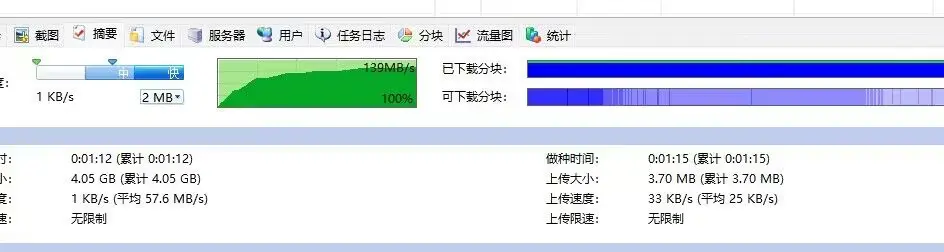

# 测试BT下载速度的方法和测速种子的选择

2023.12.09  

## 进行测速的原因和目的

在使用 BT下载的时候常会遇到下载速度缓慢的问题   
尽管在 **大多数情况下是资源自身的问题**  
但也有可能是在BT的客户端**设置上或者自身网络存在问题**  

通过下载速度测试即可 判断问题所在
在测试BT下载速度前其实 **应该先进行宽带测速**  
以排除网络本身存在问题的可能性  

例如墙上的插口8芯线只接4芯导致速度只有百兆  
同时对上行和下行宽带有一个较为清楚的了解  

关于资源自身的问题 可以看一下之前的章节  
[比特彗星常见问题-下载缓慢和无法下载问题[重置]](./BC-download-speed-issues-2.md)  

下载速度测试不仅可以测试下载速度 **也可以提前发现一些潜在的问题**  
比如 内存占用过高 网络变慢甚至断网  
这些问题在之前的系列教程中有所讲解  

---

## 测速的方法

### 宽带测速

使用在线测速网站即可进行测试 使用较多的是 speedtest  
https://www.speedtest.net/  
点击GO即可开始测速  

### BT下载速度测试

方法很简单  下载 一个热门资源 **观察其峰值下载速度是否跑满带宽 或达到预期值**  
BT下载一开始的速度比较慢后面缓慢升高 最终达到峰值  

即从开始下载到速度达峰需一段时间  
千兆带宽下载时的速度曲线  

---

### 测速种子的选择

**其实任意热门资源都可以用作测速**  
只要该资源 所能连接到的 做种/上传者 所提供的下载速度大于你的下行带宽  
或你预期的下载速度即可  

这里选择这里选用 乌班图镜像 （Ubuntu）作为测速种子  
虽然大部分的做种者在国外 但足够热门 仍可满足测速需求  
**建议下载LTS版本的**  

https://cn.ubuntu.com/download/alternative-downloads  
（需要往下翻一点）  

