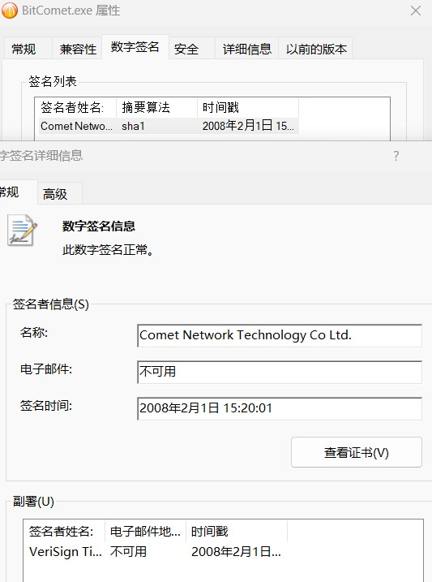
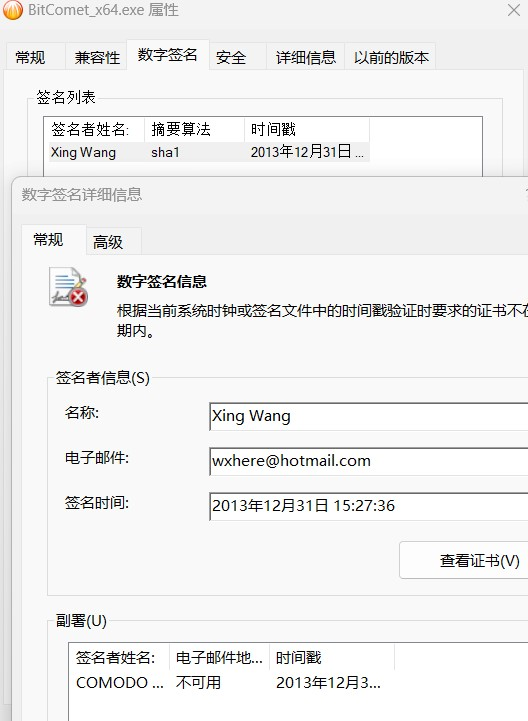

# 有关比特彗星若干历史遗留问题的整理

2025.02.13  

本文用于记录和整理有个比特彗星的各种历史遗留问题  
所以研究均基于“考古发现”  

大部分的问题其实在维基百科有记录：[链接](https://zh.wikipedia.org/zh-cn/%E6%AF%94%E7%89%B9%E5%BD%97%E6%98%9F)  
当然也有些问题并不在其中  


总结和拓展自之前所进行的研究和记录：

* 第一部分：[链接](https://www.cometbbs.com/t/%E6%9C%AA%E5%8F%91%E7%8E%B0%E6%AF%94%E7%89%B9%E5%BD%97%E6%98%9F%E4%B8%8E%E8%BF%85%E9%9B%B7%E6%9C%89%E4%BD%95%E5%85%B3%E7%B3%BB/95248/4?u=ie12)  
* 第二部分：[链接](https://www.cometbbs.com/t/212%E6%B5%8B%E8%AF%95%E7%89%88/95033/36?u=ie12)  


---

## DHT网络问题

比特彗星在早期会对私有种子错误的启用DHT  
年份为2005年 那时DHT网络刚诞生  
**此问题发生在0.60版本在0.61被修复（2006.1.10）**  


有DHT问题报道：[链接](https://web.archive.org/web/20070124131627/http://www.slyck.com/story1021.html)  

修复日志：[链接](https://www.bitcomet.com/tw/changelog)  

**截图**  


---

## Tracker汇报流量不准确问题

这个说法似乎出现的非常早 早在BC的维基百科中文页面被创建的时候就有  
（2005 年 6 月 30 日） 但没有给出引用来源  [页面链接](https://zh.wikipedia.org/w/index.php?title=%E6%AF%94%E7%89%B9%E5%BD%97%E6%98%9F&oldid=589505)  

中文版面基本是翻译自对应的英文版面的  
英文版面的添加的时间要稍早一些 [页面链接](https://en.wikipedia.org/w/index.php?title=BitComet&direction=next&oldid=13219877)（2005 年 5 月 4日）  

我没有找到这个说法的直接来源  
但是BC的更新日志和一些彗星论坛内的反馈帖子  
间接的证明的了tracker流量汇报存在一些问题  

**其应属于bug而非刻意的设计**  
不过这个问题的传播度远没有DHT问题那样的广泛  
其可能是在PT用户和内部论坛之间流传的  

**彗星论坛中关于tracker流量汇报问题的反馈：**[链接1](https://www.cometbbs.com/t/pt%E7%A7%8D%E5%AD%90%EF%BC%8Cuploaded%E5%92%8Cdownloaded%E6%B5%81%E9%87%8F%E6%B1%87%E6%8A%A5%E5%BC%82%E5%B8%B8/29584?u=ie12) [链接2](https://www.cometbbs.com/t/bitcomet%E6%98%AF%E5%90%B8%E8%A1%80%E8%BD%AF%E4%BB%B6%E5%90%97%EF%BC%9F/45917/2)  


简单收集一些可能涉及tracker流量汇报问题的修复记录：  
更新记录发布地址：[链接](https://www.bitcomet.com/tw/changelog)  

> v1.15 2009.09.25  
> ...  
> 核心修正：選中部分文件下載完成後會向Tracker發送完成信息(v1.13及v1.14)  
> ...  
>  
> ---  
> v1.26 2011.01.27  
> ...  
> 核心改進：私有種子每次只連接一個tracker，切換tracker時清除所有已知用戶  
> ...  
>   
> ---  
> v1.58 [Windows] [macOS] 2019.7.6  
> ...  
> 核心修正：BT任務選擇下載部分檔時，向tracker彙報的left大小應為全部檔未下載大小  
> 核心修正：BT任務停止後再次啟動，tracker首次announce的上傳、下載量有誤  
> 核心修正：BT任務停止後立即啟動，tracker失效  
> ...  
> 核心修正：HTTPS tracker首次announce後的資料傳輸出現協定錯誤  
> ...  


---


## eMule插件问题

有关eMule插件方面的问题又可以分为两个方面  
违反GPL开源协议和被xtreme-mod 反吸血插件屏蔽这个两方面  

来自维基百科中文版面上的描述：  

>  
> “eMule插件”  
BitComet官方提供了“eMule插件”和“eMule插件（Xtreme版）”，可以通过eDonkey网络（即eD2k或电驴网络）下载来源。[6]  
>  
> BitComet官方声明插件在eMule基础上修改而成[6]，BitComet有提供“eMule插件”source code的下载链接。[7]，但代码似乎跟发布版本不匹配，可能违反eMule的GPL开源协议；同时，官方声明的“遵循 P2P共享精神”[6]也有一定争议。BitComet的“eMule插件”在连接到eDonkey网络时，被eMule Xtreme Mod等eMule Mod的动态反吸血驴保护功能所屏蔽。[8]  
>  

### GPL协议问题

由于不会验证当前或历史版本的插件是否是由公开的源码编译而来的故无法确认此问题  
维基百科中版面没有标注来源 也使用了较为模糊的描述  

>…但代码似乎跟发布版本不匹配，可能违反eMule的GPL开源协议；…

英文版面上的似乎没有没有这样的内容只是写着：  

>  
> An optional plugin is available to connect to the eD2K network. The plugin is a modified version of the GPL eMule program. When installed, it connects automatically to a server.[10]  
>  

有关emule GPL协议的问题的条目是在2010的时候被加上的：[链接](https://zh.wikipedia.org/w/index.php?title=%E6%AF%94%E7%89%B9%E5%BD%97%E6%98%9F&diff=prev&oldid=14705719)  


**截图**  


### 被DLP插件屏蔽问题

维基百科上关于被DLP反吸血插件屏蔽的引用来源  
指向了第八号注释 “参见eMule Xtreme Mod源码。”  
其超链接到了 eMule Xtreme 的wiki页面上  

其实DLP反吸血插件是一个单独的DLL文件  
与eMule mod 的主体是分开的  

结合上文中 此部分被添加到wiki的时间  
当时最新版本的DLP文件应为 v44：[下载链接](http://prdownloads.sourceforge.net/emulextreme/antileech-sources.rar?downloadp://)  

通过查看v44 版本的DLP反吸血插件源码  
**其中确实存在屏蔽BC eMule 插件的内容**  

antiLeech.cpp 第474行  
似乎其mod名称为“FreeCD” 但现在的插件似乎已经不使用这个名字了  

```
_tcsstr(modversion, _T("FreeCD")) || //BitComet, changed to hardban
```

**截图**  


---


## 分块填充问题

分块填充文件即padding_file这也是一个影响比较大的问题  
这个东西其实BC官方wiki上有明确的说明：

* [中文版wiki](https://wiki-zh.bitcomet.com/%E5%AE%8C%E6%95%B4%E5%88%97%E8%A1%A8?s%5B%5D=%E5%88%86%E5%9D%97#%E6%96%87%E4%BB%B6%E5%88%97%E8%A1%A8%E9%87%8C%E4%B8%BA%E4%BB%80%E4%B9%88%E4%BC%9A%E5%87%BA%E7%8E%B0_padding_file_%E5%A6%82%E6%9E%9C%E6%82%A8%E7%9C%8B%E5%88%B0%E6%AD%A4%E6%96%87%E4%BB%B6_%E8%AF%B7%E5%8D%87%E7%BA%A7%E5%88%B0bitcomet_%E6%AF%94%E7%89%B9%E5%BD%97%E6%98%9F_085%E6%88%96%E4%BB%A5%E4%B8%8A%E7%89%88%E6%9C%AC)  

* [英文版wiki](https://wiki.bitcomet.com/known_client_issues_and_incompatibilities?s%5B%5D=padding#what_are_these_padding_file_things_in_the_filelist)  

最主要的问题就是**出现的太早** 应该是是彗星首创的 (应在v0.85被加入即2007.03.19) 当时其他客户端并不支持  
导致会下载这些无用填充文件 从而浪费带宽 在过去那个低带宽的时代是个比较大的问题  

其实这个填充文件有对应的BEP规范（BEP47） 不过这个规范2016年才被创建  
而且直到现在还是草稿状态 [链接](https://www.bittorrent.org/beps/bep_0047.html)  

好在绝大部分的现代BT客户端在事实上已经支持 BEP47  
但一些在线torrent站点会展示种子文件结构 它们大都不支持忽略这个填充文件  

当然还有一个问题就是这个分块填充文件的名字  
```
_____padding_file_?_如果您看到此文件，请升级到BitComet(比特彗星)0.85或以上版本____
```
如果只有`padding_file`这个两个词的话 情况也许就会不一样了  
不过在英文状态下生成的填充文件名似乎只有`_padding_file_?`  


---

## 长效种子

这可能是所有问题中吵的最凶的一个了其实主要是两方面的争论  
**长效种子是否会对私有种子启用** 以及 **长效种子是否是一种吸血行为:** [链接](https://github.com/c0re100/qBittorrent-Enhanced-Edition/issues/39)  

其实关于长效种子官方wiki有非常详细的解释：[链接](https://wiki.bitcomet.com/long-term_seeding)（英文版比中文版更详细）  

### 长效种子和私有种子

这个问题其实很好回答那就是 **不会**  
**长效种子不会对私有种子启用**  

之所以有这方面的担心也许因为之前DHT网络问题  
所以对PT来说一刀切会比较省事：[链接](https://tieba.baidu.com/p/7180851364)  

### 长效种子是否构成吸血问题  

这个问题比较复杂   

长效不使用BT协议的 其更类似于eMule中的ed2k模式  
即eMule从eDonkey 2000 中传承下来的部分  
需要连接到专用的服务器以来搜索持有相同文件的用户

其以单文件进行传输 没有BT中任务的概念  
**由于不存在任务概念 其不受BT任务停止和运行的影响**  
**与eMule中的共享列表相似 若文件存在则始终可以进行上传**  

同时由于以单文件进行传输 **可以跨越BT的任务/种子**  
即在BT中若两个任务之间包含有一个或多个相同的文件 它们并不能互相传输  
因为分属于不同的任务/种子中  

而长效则可以解决这一问题 使得相同的文件  
通过长效种子在不同的任务间传递  

---

**个人对吸血的判断标准：即客户端从公共网络汲取的流量是否只在特定的范围内传播**  
**无法为其他客户端做贡献**  

典型的就是 迅雷的排他性上传  
即迅雷使用BT协议从其他非迅雷客户端下载数据  
上传给其他迅雷客户端 但不会给其他非迅雷客户端上传  

这使得其从公共BT网络汲取的流量只在迅雷客户端之间流转  
形成了一个仅限迅雷可用的私有流量池 无法反哺其他非迅雷客户端  

---

而BC的长效种子情况有所不同  
由于其是私有协议 所以只能在比特彗星之间传输流量  
**但BC可以通过BT协议将这些流量贡献给其他非BC客户端**  

正如上文所说的其在文件存在的情况下始终可以上传  
且打通了不同种子之间相同文件的传输 **对延长种子的生存是有很大帮助的**  

而且想要成功进行长效种子传输也是有条件  
由于采取类似ed2k的模式 所以其是不能进行进行反向连连接的  

也就是其只能被动的接受来自其他用户的连接 而无法去主动连接其他用户  
**这就意味着若一个BC客户端没有开放端口 那他就无法成为一个可用的长效种子**  
就一点足以刷掉大量的BC客户端 与此同时**长效上传的优先级是低于BT任务的**  

再考虑到官方协调服务器的稳定性和不同资源下客户端分布的情况  
从我观察到来看 可用的长效种子是可遇而不可求的  
没有长效种子才是常态  

不过还是有人认为 只要存在私有流量池  
无论其是否可以对回馈公共流量池 都是一种吸血行为  

或者认为无论优先级如何 长效的存在都挤占了  
一部分本可被分配给bt上传流量 这对其他客户端来讲是不公平的  

至于为什么要使用外挂的eMule插件而不是直接接入eMule  
我认为还是GPL感染的问题  

也许对于一些有开源洁癖的人来说 任何非开源软件  
都是非常“邪恶” “恶心”的  


---

## BC与迅雷的关系 

说实话这是我觉得最莫名其妙的一个问题  
**先说结论：没有什么关系**  

也不知道什么时候 开始流传这样观点：  
“比特彗星和迅雷有关系” “比特彗星的部分商标掌握在迅雷手中”  
等暗示比特彗星和迅雷存在某种联系 **以至于推导出迅雷吸血 “比特彗星和迅雷有关系”**  
**所以也吸血 这样的奇怪结论**  

**简单来说就是其认为“比特彗星是魔鬼（迅雷）的仆从”**  
我对持有这样奇怪观点的用户们请求了这个说法来源  
其源头基本都指向了一篇个人博客：[扒一扒Bitcomet（比特彗星）背后的运营实体](https://orvilleyang.github.io/2022/04/24/Bitcomet/)  

在文末博客作者提出了三个疑问：

>  
>...  
但是也有几点难以解释：1、为何使用个人签名而非公司签名；2、这一BT工具非常受欢迎，对公司而言应当是巨大的声誉，为何没有进行宣传？
在正文的最后，提一件更有趣的事情。Bitcomet和Bittorrent的部分商标掌握在千兆科技(深圳)有限公司手中，而其为迅雷的全资子公司。
>  

通过之前的考古研究其实可以非常清楚的回答这些问题  
**事实上在早期BC是使用公司签名的 改为个人签名是后来的事情**  
至少从0.99版本开始比特彗星使用 “Comet Network Technology Co Ltd.” 作为签名

直到1.35和1.36版本变成了“Shuang Wu”  
再后面的版本就是现在的“Xing Wang”了  

**截图**  







关于BC发展过程的考察内容较多 之后会单独进行讲解(已完成：[有关比特彗星的奇谈怪论](./BC-rumor.md))  
**此处先给出结论：比特彗星最早为个人客户端后尝试做曾作为商业软件开发 可能商业化不顺利再次转为个人开发**  
其可以解释签名的变化以及没有宣传的原因  

签名的验证也很简单下载旧版本查看签名即可
旧版本官网上依然可以下载：[链接](https://www.bitcomet.com/cn/archive)

至于商标问题 其实彗星论坛内的一位用户说的很清楚：[链接](https://www.cometbbs.com/t/%E6%9C%AA%E5%8F%91%E7%8E%B0%E6%AF%94%E7%89%B9%E5%BD%97%E6%98%9F%E4%B8%8E%E8%BF%85%E9%9B%B7%E6%9C%89%E4%BD%95%E5%85%B3%E7%B3%BB/95248)  

> 
>好久没上来，刚才发现有人说比特彗星被迅雷“收购”，觉得不太可能，于是查了一下。。。
>Bitcomet 和 Bittorrent 的部分商标，06年就被注册成“网站服务”类商标。大概率是迅雷旗下的千兆科技(深圳)有限公司抢注的。>大家都知道，软件名与商品名称不是同一回事，如果你认为某个商标有价值，你可以抢先注册的。
>真正的比特彗星所属公司：上海柯慧网络科技有限公司，在2013年以“文件共享软件”为名注册了BitComet 商标。
>上海柯慧网络科技有限公司为独立公司，没有上层公司。
>我们没有看到它与迅雷有什么关系 。。。
> 

这让我想起了当年 [奇瑞和腾讯的商标之争](https://baike.baidu.com/item/QQ%E5%95%86%E6%A0%87%E4%BA%89%E5%A4%BA%E6%A1%88/15814535)  
如果按照这样的逻辑推导岂不是可以认为 “腾讯收购了奇瑞” 或者 “奇瑞其实是邪恶腾讯的仆从”？  
这完全是没有道理的事情  

---

再进一步的挖掘后 又有了新的发现
我想来自美国专利和商标局的这份商标注册记录  
可以彻底的终结这个问题 [链接](https://tsdr.uspto.gov/#caseNumber=78932292&caseSearchType=US_APPLICATION&caseType=DEFAULT&searchType=statusSearch)  
PDF版本：<a href="../../图片/BC历史遗留问题/BC-注册商标.pdf">链接</a>


