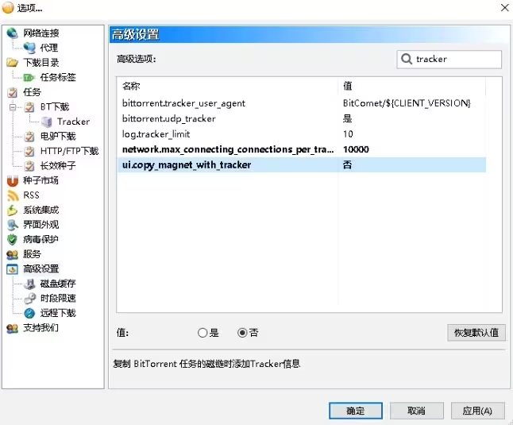

# 比特彗星常见问题-磁力链接长度问题

2023.07.28  

**问：** 为什么从彗星中复制出的磁力链接为什么这么长？  

**答：** 从比特彗星中复制的磁力链接默认包含了完整的tracker服务器所以链接显的很长 可以手动删除tracker  

**问：** 如何删除？  

**答：** 删除“&”连字符后面的部分即可 较短磁力链接更便于分享  

>`magnet:?xt=urn:btih:T7BAXHUY5KMLJI26MIRQIGS67FHKE6AJ&`~~dn=%5B%E6%A1%9C%E9%83%BD%E5%AD%97%E5%B9%95%E7%BB%84%5D%5B190906%5D%5B%E3%83%A1%E3%83%AA%E3%83%BC%E3%83%BB%E3%82%B8%E3%82%A7%E3%83%BC%E3%83%B3%5D%E5%B0%91%E5%A5%B3%E6%95%99%E8%82%B2RE%20%E7%AC%AC2%E8%A9%B1%20%E7%99%BD%E7%9F%B3%E9%82%A3%E5%A5%88%E3%81%A8%E9%81%8E%E3%81%94%E3%81%99%E6%97%A5%E3%80%85&xl=430796618~~  

**问：** 如何设置在复制磁力链接的时候不包含tracker服务器？  

**答：** 在高级设置中找到 `ui.copy_magnet_with_tracker` 改成 **否** 这样复制磁力时就不会包含tracker服务器了  

---

参考：

* [cometbbs-我是萌新问一下为什么，我自己做种的磁力链接那么长](https://www.cometbbs.com/t/80362)
* [cometbbs-磁力链接为什么这么长](https://www.cometbbs.com/t/23093)

