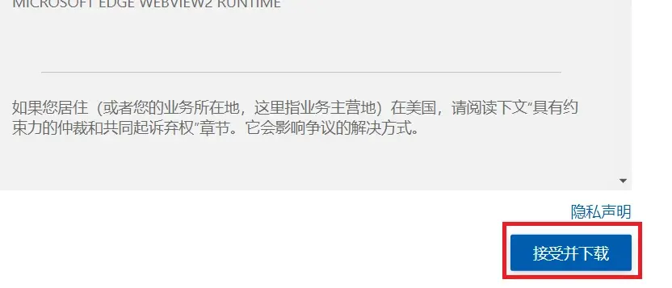
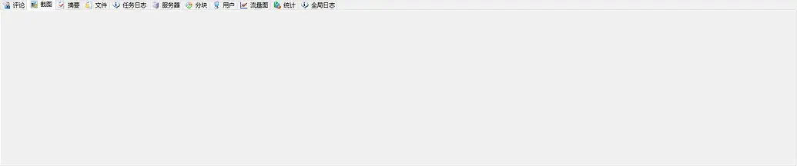
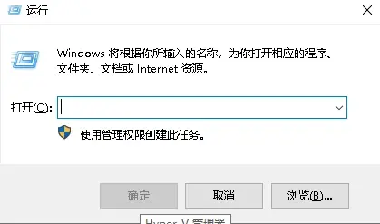
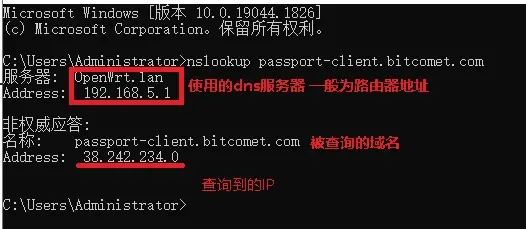
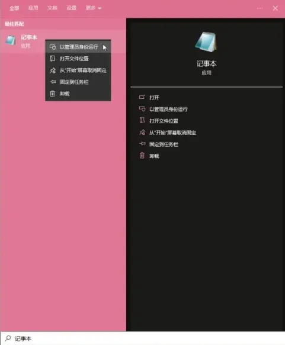
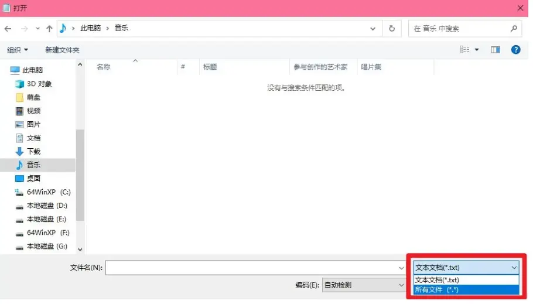
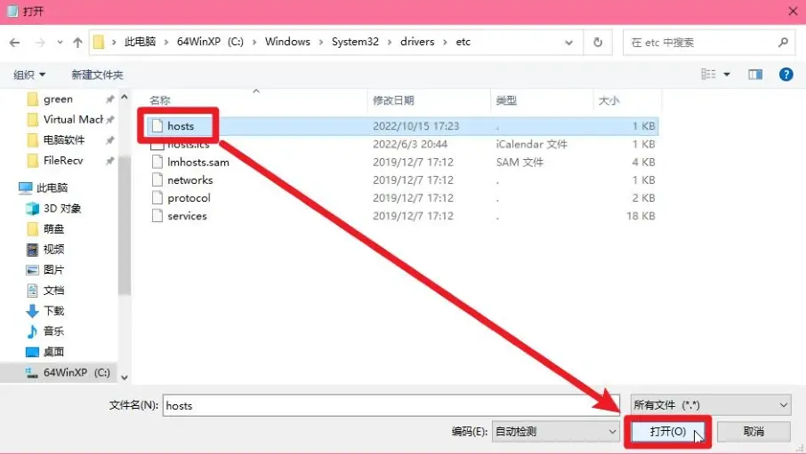
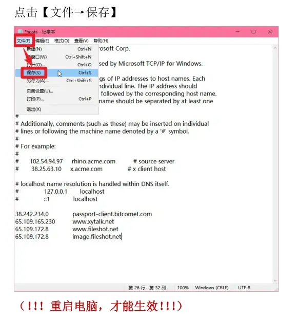
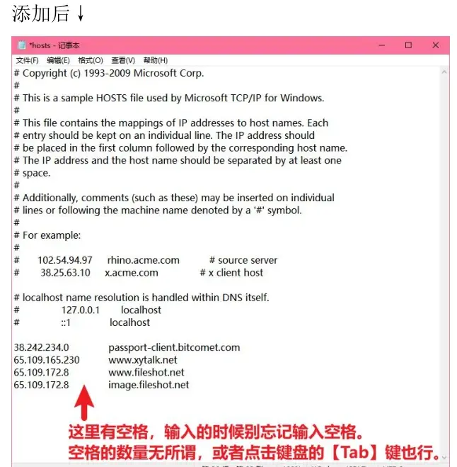
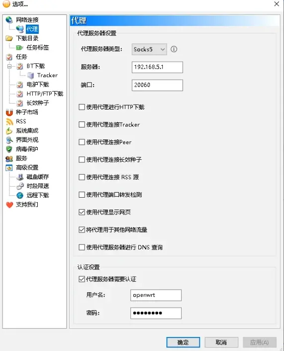

---
sidebar_label:截图和评论显示问题
---


# 比特彗星常见问题-截图和评论显示问题

2023.08.04  

**问：** 评论和截图无法显示该怎么办？  

**答：** 评论和截图无法显示可能由多方面的原因造成，要具体情况具体分析  
这里分为 **软件问题** 和 **网络问题** 两大类  

---

## 软件问题部分

**问：** 打开评论和截图显示以下内容  


**答： 未安装WebView2** 造成的  

**问：** WebView2 是什么？为什么之前的版本不需要？  

**答：**  

>v1.99 Beta1 [20230222]  
>界面改进：增加深色模式，默认跟随系统设置，可在主窗口查看菜单切换（需 Win10 1809 或更高版本）  
>界面改进：任务截图及任务评论改为使用WebView2显示界面（需 Win7 或更高版本，若系统缺少相关组件可自行安装）  
>界面改进：左下角通行证页面改用WebView2显示界面  
>界面修正：磁链任务下方没有显示截图  
>核心改进：任务截图及任务评论改用新的传输协议  
>核心改进：任务截图增加本地缓存，避免每次显示重新下载  
>核心修正：UDP tracker缓存数据没有及时清理，导致程序退出时卡顿  
>核心修正：RSS自动下载器关键字为空时，应允许下载  

**在v1.99 Beta1 之后** 任务截图及任务评论改为**使用WebView2显示**  
WebView2 可以简单的理解为一个简易的 Edge 浏览器 API  
任务是替代老旧的IE浏览器API来显示网页  

在v1.99 Beta1之前 评论、截图、通行证  
都是通过旧的IE浏览器API显示的 更新后默认使用WebView2  

在Windows10 或更高版本的Windows中已经预装了WebView2  
~~（就像以前的IE一样）~~ 而在Windows7 中需要自行安装  

下载 WebView2 的在线安装程序：[链接](https://go.microsoft.com/fwlink/p/?LinkId=2124703)  
如果网络不好无法通过线安装程序下载 可尝试使用离线安装程序：[链接](http://https://developer.microsoft.com/zh-cn/microsoft-edge/webview2/)  
如果连不上微软的网站 这里还准备了网盘下载地址：[链接](https://www.aliyundrive.com/s/SSfU2Nyqigd)  

（本来想用磁力链接来分享的，但考虑一下可靠性还是用了网盘）  
下载并运行安装程序，在安装向导的指引下即可完成安装  
安装完成后重新BC或电脑即可  




**问：** 我已经安装了WebView2\我无需安装 评论、截图显示为一片空白
也没有任何提示或报错  




**答：** 这可能是WebView2 控件没有及时创建造成的，应该算是1.99版本一个小bug   
2.0预览版好像已经修复了 **在1.99版本可以通过重启BC的方式来解决**  
或者取消勾选 始终显示 右键评论或截图选项卡弹出此菜单  

>1.99正式版开始windows10下如果启用始终显示选项卡会无法显示截图  
>未选中BT任务的时候，点击了截图选项卡，灰屏无法加载出来，后续点击BT任务在点截图也没用，必须重启软件了  


v1.99 Beta1 [20230222]之前的版本的解决方法：  
* https://www.cometbbs.com/t/83650
* https://www.cometbbs.com/t/63859

---

## 网络问题部分

**问：** 评论、截图区出现报错\白屏仍然存在  


**答：** 这应该是网络问题造成的  

**问：** 如何解决  

**答：** 先从DNS问题开始排查  

**问：** DNS是什么？改如何操作？  

**不想看原理也可以直接跳到后面的操作部分**  

**答：** 简单来说dns就是将好记忆的域名和不好记忆的IP地址联系起来的东西  
（这里只是简单讲一下，实际过程更加复杂，看不懂也没关系，知道这个东西比较重要即可）  
我们访问百度的时候在浏览器里输入 **百度的域名**  

但是电脑不能从这个域名直接连接百度的服务器 要使用IP地址才行  
但很显然这个域名里并没有包含IP 这时就需要dns服务器了 将域名变成（解析为）IP  

电脑会向DNS服务器发起请求，询问 `www.baidu.com` 对应的IP地址  
不出意外的话，DNS服务器会告诉你百度的IP 有了IP就可以连百度的服务器了  

如果在这个过程中出现了问题 比如返回的IP是虚假或错误的  
（DNS污染、劫持）那就无法正常访问了  
截图和评论区就相当于一个网页 想要正常显示也需要经过上述的过程  

**问：** 我大概理解了 我们需要让电脑知道评论和截图服务器的IP地址  
但将域名变成（解析为）IP的DNS存在问题 无法获得正确的IP从而显示评论和截图？  

**答：** 是的  

**问：** 有方法跳过DNS服务器直接让电脑知道域名对应的IP地址吗？  

**答：** 有方法 通过修改host文件实现  

**问：** host文件有又是什么？  

**答：** 简单来说 host 文件用于记录 域名和IP的对应关系  
如果在这个文件中记录了某个域名和IP的对应关系 那么系统就会跳过dns查询  
直接使用文件中的记录 相当于直接告诉电脑某个域名对应的IP地址  

**问：** 这样说来 我可以将任意的域名和IP地址对应在一起  
甚至可以吧百度的域名对应上QQ的IP地址？  

**答：** 是的 可以这么做  

**问：** 不过如果电脑通过DNS无法获得正确的IP地址  
修改host文件需要填写上正确的IP 我该如何或者获得这个正确的IP从而告诉电脑呢？  

**答：** 可以通过在线dns查询工具获得 建议选择国外的  
比如：https://www.nslookup.io/  

**问：** 我现在大概理解了 但具体的操作要怎么做呢？  

**答：** 要先确定dns存在问题 如果dns是正常的就不需要修改了  

已知 截图、评论和通行证使用以下这些域名  

```
passport-client.bitcomet.com
#彗星通行证的域名

www.xytalk.net
#评论使用的域名

www.fileshot.net
image.fileshot.net
#截图使用的域名
```

先通过系统自带的查询功能进行查询IP  
同时按下 **win和R键** 弹出运行  


输入 **cmd** 点确定 弹出命令提示符 窗口  


输入 nslookup 并加上想要查询的域名 例如：  
`nslookup passport-client.bitcomet.com`  

输入后回车 查看查询结果  


这就是本地查询得到的结果，下面使用在线工具进行查询  
访问：https://www.nslookup.io/  

输入域名 并查询  


查看结果  


其他的几个域名也是同样的做法  
比较两种查询得到的IP地址 如果一致则dns没有问题  
**如果不一致则说明存在问题** 可以通过修改host文件来解决  

---

（此部分来自 像素帝 的教程 ）~~https://www.cometbbs.com/t/83650~~  

搜索“记事本”，右键，以管理员身份运行  


点击【文件→打开】  


选择显示【所有文件】  


选中【C:\Windows\System32\drivers\etc\hosts】，点击【打开】  
**注意 如果C:\Windows\System32\drivers\etc 中没有hosts文件**  
**请手动创建 右键空白处>新建>文本文档>重命名为hosts 并删除 .txt 扩展名**  



在 host 文件添加以下文本：  

```
38.242.234.0 passport-client.bitcomet.com
65.109.165.230 www.xytalk.net
65.109.172.8 www.fileshot.net
65.109.172.8 image.fileshot.net
```

注意，服务器的IP可能会发生变化，请以在线工具查询的结果为准  





DNS 部分排查到此结束

---

**问：** 通过刚才的操作后依然无法显示 该怎么办？  

**答：** 如果排除了DNS问题，那有可能是IP被阻断了  
也可能是提供截图和评论的服务器本身存在问题  

**问：** 如果IP被阻断了该怎么做？  

**答：** 这种情况下就需要挂代理了  

**问：** 如何设置？  

**答：** 可以在彗星内设置代理服务器  


勾选 **使用代理显示网页** 和 **将代理用于其他网络流量**  
这样显示截图和评论时会通过代理服务器来连接，以防止直接连接时被阻断  

推荐使用socks5协议 这样可以 可以勾选 **使用代理服务器进行 DNS 查询**  
**勾选后 DNS查询也会通过代理服务器，防止直接查询时受到污染或劫持**  

**问：** 如何获得代理服务器  

**答：** 代理服务器的搭建和选择请自行探索  

---

参考和引用:
* https://www.cometbbs.com/t/85353/6
* https://www.cometbbs.com/t/86231
* https://www.cometbbs.com/t/83622
* https://www.cometbbs.com/t/86151
* https://www.cometbbs.com/t/83650


