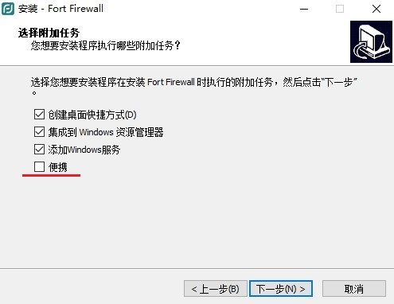
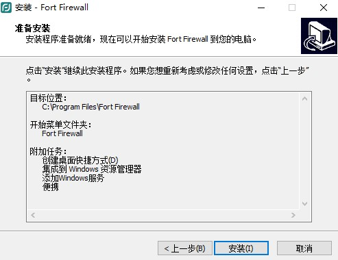
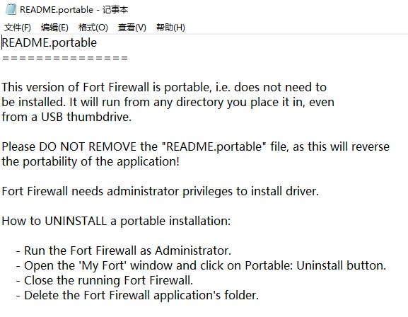
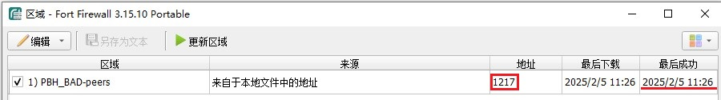
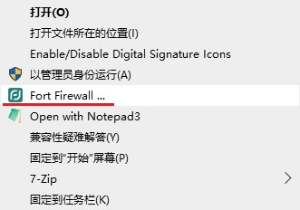
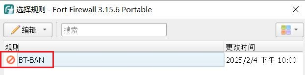
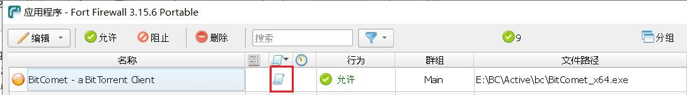

# 「反吸血」在Windows下使用Fort Firewall全自动批量屏蔽IP

2025.02.06  

## 关于Fort Firewall

在之前的教程中我们已经用Windows防火墙实现了类似的效果 教程：[链接](https://www.bilibili.com/read/cv34787408/)  
其使用到了高版本Windows才具有的动态关键字来容纳IP地址 此外更新动态关键字需要手写脚本  
**使用难度较高易用性较差**  

而Fort Firewall 与Windows防火墙类似 使用 **Windows筛选平台** 进行过滤者意味着其也为系统级别的过滤  
效率高 而且可以切断已经建立的连接 其依赖依筛选平台而非Windows防火墙  

**更重要的是其支持订阅IP列表 以及完全的图像界面操作**  
**由于使用 Windows筛选平台 其可以在win7及以后的系统上使用**  

---

## 使用场景

比特彗星在2.10后已经支持IP过滤列表  
而像qbittorrent对[PBH](https://github.com/PBH-BTN/PeerBanHelper)等对外置反吸血程序支持效果较好  
的客户端都不是非常需要防火墙进行拦截  

但像 transmission 这样的客户端情况就不一样了  
其虽然支持IP过滤列表 但是载入列表后无法切断已经建立的连接  
需要重启任务/软件后才能生效 也正是因为这个原因[PBH正在逐步取消对TR的支持](https://docs.pbh-btn.com/docs/downloader/Transmission)  

更不用说那些完全不支持IP过滤的BT客户端  
**而使用防火墙软件进行过滤 效率高更且适用于任何软件**  

---

## 安装Fort Firewall

下载地址：[Github](https://github.com/tnodir/fort/releases)

下载安装程序 根据系统情况选择 这里使用的是64位版本  


安装位置可自定义 之后可以选择安装为便携版  


可以选择安装为便携版 这样配置文件就存储在程序目录下  
而不是AppDat中 这里勾选便携版  







**便携版说明**  

```
此版本的 Fort Firewall 是便携式的，即无需安装。它将从您放置它的任何目录运行，甚至从 USB 闪存盘运行。

请不要删除“README.portable”文件，因为这将破坏应用程序的可移植性！

Fort Firewall 需要管理员权限才能安装驱动程序。

如何卸载便携式安装：

- 以管理员身份运行 Fort Firewall。
- 打开“我的 Fort”窗口并单击便携式：卸载按钮。
- 关闭正在运行的 Fort Firewall。
- 删除 Fort Firewall 应用程序的文件夹。
```

---

## 配置Fort Firewall

安装完成后首先需要修改 堡垒 的过滤模式  
默认为自动学习 改为 **“如果未被阻止或允许则忽略”**  

这样一来堡垒就不会主动拦截任何程序 只有在我们设置后才会拦截  
如果在修改期间已经拦截了程序则应进行放行  

**修改拦截模式：**  


**放行程序：**  
右键托盘图标》应用程序  


### 订阅IP列表

右键托盘图标》选项》区域  


编辑》添加  
这里使用PBH的IP列表：[链接](https://github.com/PBH-BTN/BTN-Collected-Rules)  

名称可自定义 这里使用“PBH_BAD-peers”
来源选择 “来自本地文件中的地址”  
勾选 自定义URL 填写订阅地址：  

```
https://bcr.pbh-btn.ghorg.ghostchu-services.top/combine/all.txt
```





**配置自动更新规则**  

右键托盘图标》选项》选项》计划  
勾选区域下载器 时间设置为1小时 确定以保存规则  
在点击确定/应用后列表中的时间才会更新  


### 设置规则

在订阅完成IP后我们还需要设置规则  
右键托盘图标》选项》规则 编辑》添加  

名称可自定义 这里使用“BT-BAN”  
勾选之前订阅的区域 操作选择阻止  


**设置端口过滤**  

对于迅雷这样使用特定端口的客户端 我们可以通过端口号进行过滤  

有关不同版本迅雷吸血情况的总结请看之前的教程：[链接](https://www.bilibili.com/read/cv26104181)  
此处过滤的是`15000`和`15001`这个两个端口  

再新建一个规则 类型为 **预设规则**  
名称可自定义 这里使用 “XL-port” 操作为 阻止  
填写下列内容：

```
0.0.0.0/0:(15000,15001)
[::]/0:(15000,15001)
```


其表示过滤所有IPv4和IPv6地址中有15000和15001端口的流量  
堡垒默认不处理内网流量 不用担心其会影响其他程序  
编辑之前设置好的程序规则 将此预设规则叠加上去  


现在可以**分配规则**了 右键托盘图标》应用程序  
可以查看到针对应用程序的规则  

如果BT客户端在此处已经有了规则 直接修改即可  
若没有则需要手动添加  

可以手写规则 但是更简单的方法是使用右键菜单进行快捷添加  
找到要添加的程序 右键选择 “Fort Firewall...”  



点击后会弹出编辑窗口 这里为了方便演示依然使用比特彗星  
点击右侧的 纸卷图标 即可分配规则 每个程序应只能分配一条规则  
要叠加多个规则 可以使用之前的附加预设规则的方式  






### 检视效果

打开BT客户端 运行任务  
托盘》统计数据》已阻止的连接  
可以看到已经被过滤的连接  


### 调整日志记录设置

调整日志设置已避免日志文件占用过多空间  
流量记录日志可以改短保留时间  

收集已经阻止的连接 选项可以关闭  
需要进行诊断和故障排除时再打开 以节约磁盘空间  


---

## 结尾

至此我们便完成了在Windows下使用Fort Firewall全自动批量IP屏蔽的设置  

