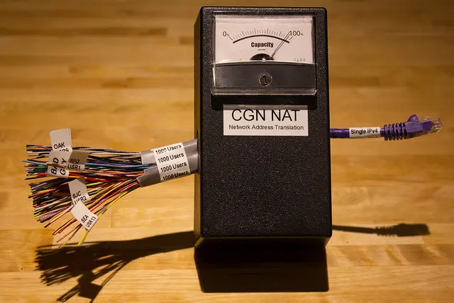

# 1.2 什么是 NAT

2023.07.30  

**问：** NAT是什么？  

**答：** **NAT技术即 NAT（Network Address Translation 网络地址转换）技术**  
简单的来说它可以让多个使用私网IP的设备**共用一个公网IP来上网**

**问：** 看来想要上网还是需要公网IP地址 那NAT是如何 **共享** 这公网地址的呢？  

**答：** 还是一开始大楼和房间的例子  

在直接使用 **公网IP** 的情况下整个电脑是一栋独立的大楼  
而程序住在大楼的房间内 由门牌号即端口号来区分 大楼之外就是互联网世界  
其相当于独门独栋的房子  

在家庭网络中NAT转换过程一般由家用路由器负责  
此时电脑是依然是一栋大楼 程序依然住在大楼的房间内  
只不过在这座大楼之外不是互联网世界  
而是 **局域网** 相当于一个小区而 **路由器** 则是这个小区的出入口  

当电脑发送请求数据到互联网上的服务器时 它们会 **先到达路由器**  
路由器上的NAT会检查这个这个数据的 **发件地址** 和 **收件地址**  

此时这个数据的 **发件地址** 为 **电脑获取到的局域网IP+发送这个数据的程序使用的端口**  
而 **收件地址** 则是 **服务器的IP地址+端口**  

**NAT将发件人地址改成自己的公网地址**  
而端口一般选择一个随机的端口 **收件人地址不变**  
并记录下这次改写 并将数据发出  

当数据数据到达服务器时  
**在服务器看来是路由器在向自己发送请求**  
因为发件地址写的是 路由器的公网地址  

于是服务器发送了响应数据  
**发件地址 服务器自己的IP+服务端程序的使用的端口**  
**收件地址 是路由器的公网地址+路由器发送请求时使用的端口**  
即请求数据中的 发件地址  

当路由器收到这个响应数据后再次修改地址  
发件地址不变 收件地址改成电脑最初发送请求时的 收件地址  
**即电脑获取到的局域网IP+最初发送这个数据的程序使用的端口**  

**在电脑看来是服务器直接回复了他的请求**  
毕竟收件地址写的是自己  
而发件地址是服务器  

**问：** 这还挺复杂的 不过大概是明白  
想要共用一个公网地址还不是件简单的事情  

那绕来绕去最终上网还是要公网IP为什么不在每个电脑弄两个IP  
一个公网 一个私网这样不是会更简单吗？  

**答：** 这就涉及到公网IP不够用的问题  

**问：** **公网IP地址不够用？**  

**答：** 是的IP地址的数量是有限的  
IP地址的范围是从 0.0.0.0到255.255.255.255  
其总数 **约为43亿个** 实际可用的IP数量会更少 要除去一些特殊地址  

**问：** 这看起来挺多还是不够用吗？  

**答：** 不够用，一开始设计的时候认为是够用的 然而在 **2019年地址就分配完了**  

**问：** 那后来的用户岂不是没网上了？  

**答：** 不会 还记得我们刚才说的 **NAT和私有IP吗？**  
私有IP是 **可以重复的** 而NAT又可以让多个使用私网IP地址的设备 **共用一个公网IP上网**  
这样后来的用户还是可以 **通过NAT转换来上网**  

**问：** 这样能容纳的用户还是有限的吧？  

**答：** 是的 **但是通过增加NAT层数来解决**  
在之前的例子中 是家里的设备共用一个公网IP地址来上网  

我们可以再加一层NAT即 **运营商级别的NAT**  
这样路由器获得的也是私网地址  
运营商可以让多个家庭共用一个公网IP上网  

**问：** 老是这样套娃也不是办法吧？  

**答：** 对 一直增加NAT不能从根本上解决问题 于是有了 **IPV6**

