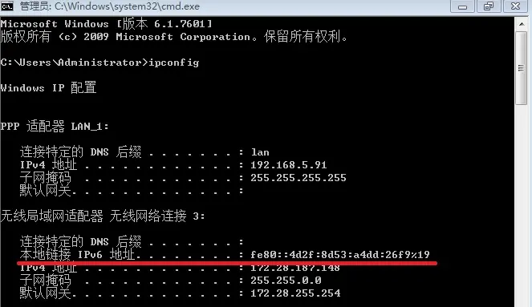
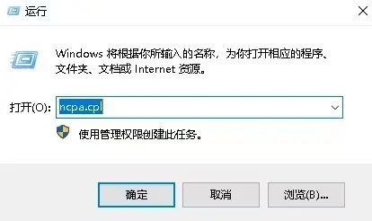
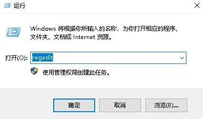
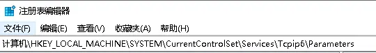
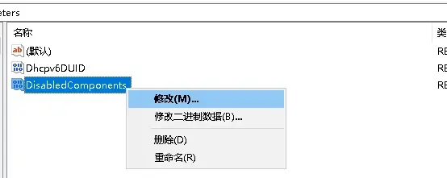
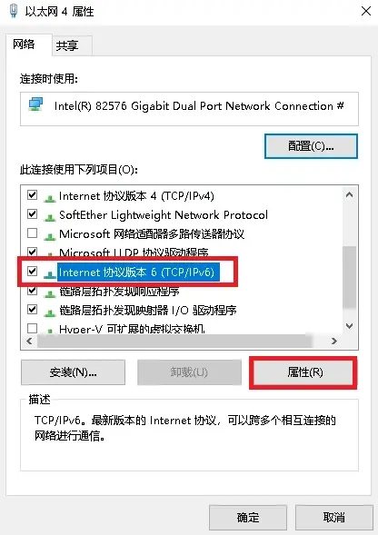
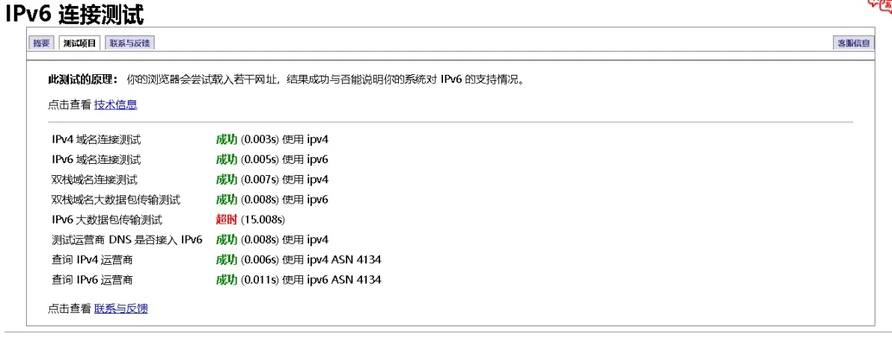

# 2.2 可用的解决方法 （Windows部分）

2024.01.06  

## 2.2.4 Windows 上的IPv6设置

在上一篇中我们已经讲解了在路由器上需要修改和设置的内容  
这篇将讲主要解 Windows上的要调整的设置 以及对STUN穿透的简单介绍  

### 2.2.4.1 检查并启用IPv6协议

**问：** 在Windows上还有什么需要注意的吗？  

**答：** 在Windows上IPv4方面并没有什么问题 无非是Windows防火墙放行的问题  

**问：** 那IPv6方面呢？  

**答：** IPv6方面需要注意的是 **IPv6协议是否启用问题** 以及 **IPv6 访问优先级的问题**  

**问：** IPv6协议是否启用？  

**答：** 从观察来看一些用户网卡上的IPv6协议没有勾选  
**导致上级已经有IPv6下发了但电脑上无法获取到地址**  

**问：** IPv6协议不应该是默认勾选上的吗？

**答：** 一般来说是这的 不过有些人的系统可能是调整过参数  
也有可能是做了某种“优化”导致IPv6协议被取消勾选了  

**问：去掉IPv6是优化？**  

**答：** 这个问题待会讲 现在先讲 **如何启用IPv6协议**  

win+R 键 弹出 **运行** 
输入 `cmd` 点确定 打开命令提示符  


输入 `ipconfig` 回车 查看网卡信息  
查看当前使用的网卡是否有 本地链接 IPv6 地址 
这一项如果有则说明IPv6协议已经启用反之则没有




当然也可以直接到 网络适配器选项 里去查看 
win+R 弹出运行 输入 `ncpa.cpl` 点击 确定  


弹出 **网络连接** 窗口  
选择 正在使用的网卡 **右键** 选择 **属性**  


查看 Internet协议版本 6 （TCP/IPv6） 是否勾选上  
将 IPv6协议 勾选上 后点击确定 即可  


---

### 2.2.4.2-设置IPv4访问优先

**问：** 还有什么别的需要设置吗？  

**答：最好再设置一下 IPv4访问优先**  

**问：** Windows默认是IPv6优先吧？有什么不好的吗？  

**答：** 其实IPv6优先本身并没有什么问题  

只是现阶段很多地区的IPv6表现可能尚不如IPv4主要是在延迟和稳定性上  
这并不是IPv6本身的问题 **而应该是运营商DNS光猫/路由器或者网站本身的问题**  

一些网站有IPv6地址但实际无法访问或者  
其IPv6的CDN数量和位置不如IPv4造成使用体验下降  

且在IPv6优先的情况下 **一些代理配置可能也会出现问题**  
在访问目标站点时使用IPv6直接访问而不是按照预期使用IPv4通过代理进行访问  
简而言之就是IPv6环境的建设还不完善 可能会影响日常的上网体验  


**问：** 那设置IPv4优先后会有什么变化吗？

**答：** 其实这个主要针对双栈网站  

**问：** 双栈是什么？  

**答： 是指同时支持IPv6和IPv4访问的网站**  

默认配置下是IPv6访问优先 这意味着 当一个网站同时支持IPv6和IPv4时  
Windows会优先使用IPv6进行访问 失败后再尝试使用IPv4连接

而修改为IPv4优先后会和以前一样直接使用IPv4进行访问  
当遇到纯IPv6站点时才使用IPv6  

**问：** 那该如何设置IPv4优先呢？  

**答：** 比较好的方法是通过 **修改注册表** 实现  

win+R 弹出运行 输入 `regedit` 确定 打开注册表编辑器  



转到以下路径 （win10及以上版本可以直接复制粘贴路径 win7下要手动选择）
```
HKEY_LOCAL_MACHINE\SYSTEM\CurrentControlSet\Services\Tcpip6\Parameters
```


找到 **DisabledComponents** 右键 修改  
如果没有这一项 则需要手动创建 或者直接用后文中的命令  


选择 **十进制** 值 填写 **32** 填写完成后点确定  
**重启计算机后生效**  


**问：** 有更简单的方法吗？手动改注册表还是麻烦  

**答：** **有直接使用命令提示符**运行以下指令也可以达到相同的效果  

**需要管理员权限 重启后生效**  

```
reg add "HKEY_LOCAL_MACHINE\SYSTEM\CurrentControlSet\Services\TCPIP6\Parameters" /v "DisabledComponents" /t REG_DWORD /d 32 /f
```

**问： 那如何判断IPv4优先访问是否生效？**  

**答：** 命令提示符运行 `ping www.qq.com`  

查看响应的地址是IPv6还是IPv4  
若为IPv4地址则策略已经生效反则之没有  

也可以访问一下IPv6测试网站 https://testipv6.cn/ 评分应达到10/10  
并且显示 “你已经有 IPv6 地址了，但你的浏览器不太愿意用，这一点比较令人担心。”
**这说明IPv4优先策略已经生效**  


**问：** ping 测试中是响应的 **是IPv4地址 但是浏览器测试中没有显示这段话 ** 

**答：** 可能一些浏览器已经 **开始强制IPv6优先了**  

**问：** 强制IPv6优先？  

**答：** 是的其不再遵从Windows中的优先策略 而在可以使用IPv6的情况下强制使用IPv6  

**问：** 那该怎么办呢？  

**答：** 应该可以通过Windows防火墙拦截IPv6请求  
使其只能使用IPv4连接 之后会出专门的教程  

---

### 2.2.4.3-IPv6 DNS 设置

**问：** 设置IPv4 优先后 DNS查询也是优先使用IPv4吗？**这会影响IPv6的解析吗？**  

**答：** 在设置IPv4优先访问后Windows还是会优先使用IPv6 DNS  
服务器进行解析的不过这应该 **不太会直接影响IPv6或者IPv4地址的解析**  

**问：** 难道不是IPv6DNS服务器解析IPv6地址 而IPv4DNS服务器解析IPv4地址吗？  

**答：** 其实这里所说的 DNS服务器 **其实是指DNS解析器（递归服务器）**  

简单来说由于DNS查询的完整过程比较复杂 将其交给DNS解析器处理会更简单  
复杂的查询过程由解析器处理了你只需要等结果就行了  

其实DNS解析器自己也并不知道你请求的域名所对应的IP所以它所做的是帮你四处“打听”  
这里的IPv6和IPv4只是在与DNS通信的过程使用不同的协议  
最终能不能解析出来还要看 解析器能否“打听到”  

**问：** 也就是说 使用IPv4连接的解析器也可以解析出IPv6地址   
而使用IPv6连接的解析器也可以解析出IPv4地址？  

**答：** 是的  

**问：** 但我这里运营商下发的DNS似乎不太靠谱，我要如何修改DNS呢？  

**答：** 在Windows上修改方法如下  

按照上文 2.2.4.1 节中的方法找到 网卡上的 **IPv6协议** 点击属性  


选择 **使用下面的DNS服务器地址**  


这里收集了一些公共 IPv6 DNS 服务器地址  
在填入前可以先 ping 一下选择延迟较低的填写  完成以后点 确定  

```
#天地互联
#介绍页面
https://www.ipv6dns.com/index
http://www.biigroup.com/dns/s/?888.html

#DNS地址
首选：240c::6666
备用：240c::6644

#################

#阿里公共DNS
#介绍页面
https://www.alidns.com/

#DNS地址
首选：2400:3200::1
备用：2400:3200:baba::1

#################

腾讯 （DNSPod）
#介绍页面
https://docs.dnspod.cn/public-dns/public-dns-illustrate/

#DNS地址
2402:4e00::

#################

百度公共DNS
#介绍页面
https://dudns.baidu.com/support/localdns/Address/index.html

#DNS地址
#似乎禁止ping
2400:da00::6666

##备用DNS地址可不填写
```

**问：** 那可以在路由器上这么设置吗？这样局域网内的设备都能用上吧？  

**答：** 是的 在路由器上设置后就无需在每台设备上单独设置了  
可以看一下上一篇 [路由器设置](./11-router-settings.md) 中的2.2.3.5 节  

---

### 2.2.4.4 IPv6大数据包传输失败问题

**问：** IPv6测试出现一这个 **“大数据包传输失败”**  




**答：** 可以先尝试刷新几次后再次进行测试或者是访问其他镜像站点  
以排除测试网站自身的问题 [测试站点列表](http://testipv6.cn/mirrors.html.zh_CN)  

**问：** 还是一样的错误 这和使用IPv6访问网页是非常缓慢有关系吗？  
 
**答：** 很有可能  

**问：** 那该怎么办？  

**答：** 可以先尝试一下这两条指令在命令提示符里运行 **（需要管理员权限）**  
会添加两条规则使得Windows防火墙 放行 ICMPv6消息 **以排除Windows防火墙的问题**  

```
netsh advfirewall firewall add rule name="All ICMP V6-IN" protocol=icmpv6:any,any dir=in action=allow

netsh advfirewall firewall add rule name="All ICMP V6-OUT" protocol=icmpv6:any,any dir=out action=allow
```

**问：** 题解决了/似乎没有效果应该不是Windows防火墙的问题  

**答：** 若错误提示消失则说明是Windows防火墙拦截了ICMP消息  

**若仍然存在 那就比较复杂了**  
可能是路由器/光猫上的防火墙或者是传输路径上的某些设备过滤了ICMP消息
不过若路由器/光猫支持针对IPv6的MSS 钳制（MSS Clamping）的话应该也可以避免这种问题  

若当前网络是光猫拨号可以尝试桥接光猫使用路由进行拨号反之亦然  
软路由一般都可以开启 MSS 钳制功能 可以根据实际使用的系统进行搜索  

如果使用的硬路由的话出现这种情况就有可能是不支持针对 IPv6的 MSS 钳制  
这样的话就需要更换对IPv6支持更好的设备了  
关于MSS钳制可以看看这篇：[链接](https://zhuanlan.zhihu.com/p/621371177)  

---

### 2.2.4.5 STUN穿透的简单介绍

**问：** 那STUN穿透要这么设置呢  

**答：** 关于STUN 穿透设置可以先先看看这篇文章  
[基于stun穿透工具LUCKY，使BT客户端绿灯、开放TCP端口的办法（进化版）](https://www.bilibili.com/read/cv21198136/?jump_opus=1)

之后应该会出专门的教程 （已经完成）  
[LUCKY STUN穿透在Windows上使用UPnP工具为BT客户端自动添加内外端口号不同的映射规则](https://www.bilibili.com/read/cv31006420/?jump_opus=1)

**问：** 必须是全锥形NAT才可以吗？  

**答：** 其实在有多层NAT的情况下 **应该只需要最外层的NAT为全锥形就可以**  
运营商NAT一般是全锥形的不过这个也要看地区 但相比NAT类型 防火墙的问题可能会更大一些  

**问：** 防火墙？在路由器或者光猫上的吗？  

**答：** 对 目前在关闭了IPv4防火墙且不能调整NAT类型的光猫取得了成功  
即穿透了一层端口受限锥形NAT和运营商的全锥形NAT 其他情况还需要进一步实验  

**问：** 不过教程中讲解了这么多不同的情况和对应的解决方法  
在实际修改的时候要如何确定使用哪些方法呢？  

**答：** 这就是下一章要介绍的内容了 **网络环境检测**  
现在的家庭网络环境也是比较复杂的 需要先搞清楚网络结构才能进行修改  

---

参考：  
* https://blog.csdn.net/qishine/article/details/103399693
* https://www.tingtao.org/archives/1879.html
* https://learn.microsoft.com/zh-CN/troubleshoot/windows-server/networking/configure-ipv6-in-windows#use-registry-key-to-configure-ipv6
* https://zhuanlan.zhihu.com/p/621371177
* https://hostloc.com/thread-1136973-1-2.html
* https://www.v2ex.com/t/914404
* https://bbs.itzmx.com/forum.php?mod=viewthread&tid=101252
* https://www.cloudflare.com/zh-cn/learning/network-layer/what-is-mtu/
* https://www.cloudflare.com/zh-cn/learning/network-layer/what-is-mss/
* https://www.cloudflare.com/zh-cn/learning/dns/what-is-dns/


