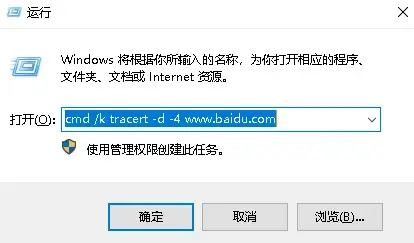
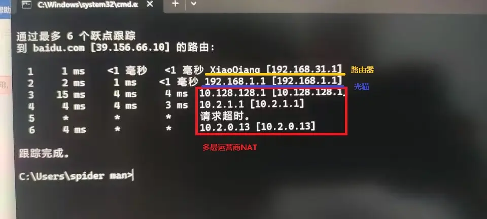
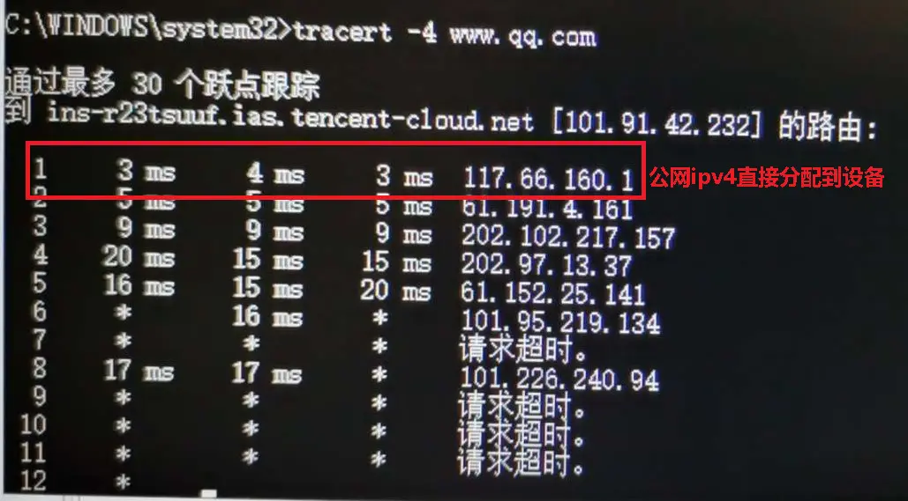

# 2.3 网络环境检测和优化

2024.01.29  

在之前的教程中我们已经讲解了基础知识以及各种具体的操作方法并确定了最终目标  
但每个人的网络环境都不一样 需要根据实际的网络情况来使用不同的方法  
**本文讨论针对一般家庭网络**  

---

## 2.3.1网络环境检测方法

**问：** 每个人的网络环境都不一样 要如何检测网络环境呢？  

**答：** 我们可以使用 **路由追踪命令** 来确定自己的网络环境  
**不要开启代理软件 游戏加速器 会影响测试结果**  

win+r 弹出运行 输入这段命令  
`cmd /k tracert -d -4 www.baidu.com`  
点击确定后会弹出命令提示符窗口  



显示 **跟踪完成后** 即可截图保存进行分析  


---

## 2.3.2运营商NAT识别

**问：** 这些IP地址是什么意思呢？  

**答：** 这些IP地址表示在连接到 `www.baidu.com` 所要经过的路径  

**问：** 那从中能看出什么呢？  

**答： 可以看出是否有IPv4公网以及经过了多少层NAT**  

**问：** 这是这么看出来的呢？  

**答：** 我们先讲怎么样判断有没有 IPv4公网  
这就涉及到对运营商级NAT（在1.1章和2.1章中有简单的讲过）的识别了  

**运营商级 NAT 网关 可能会使用以下 3 个私有地址范围：**  
* 100.64.0.0/10，即 100.64.0.0 - 100.127.255.255
* 172.16.0.0/12，即 172.16.0.0 - 172.31.255.255
* 10.0.0.0/8，      即 10.0.0.0 - 10.255.255.255

**所以一般 看到以 100 、10、 172 开头的IP地址就说明存在运营商级NAT**  
若看不到运营商级NAT则一般认为是有IPv4公网 当然也有例外情况之后会讲  

**问：** 那192.168.开头的地址属于是私有地址吧？  

**答：** 是的192.168开头的地址也是私有地址  
一般用在家庭网络或者其他小型局域网中  

你也可以认为这是光猫或者路由器使用IP地址  
**一般来说光猫的地址是192.168.1.1** 当然也有一些路由器会使用这个地址  

**问：** 这样就能看出网络结构了吗？相当于知道网络中有哪些设备？  

**答：** 路由追踪 **反映的是数据传递的路径 不能直接反映出现实中的网络环境**  
像交换机和无线AP 这样无路由功能或者在旁路上的设备是看不出来的  
这里主要是用来探测NAT层数  

**问：** 那知道了网络结构后要如何优化呢？  

**答：** 这就需要具体情况具体分析了 不过其中也是有规律的  

---

## 2.3.3常见网络结构分析

图片来自网络和QQ群  

### 情况一


**问：** 这样是一种什么样的结构呢？  

**答：** 这其实是一种很常见的网络结构  

* 第一层（跳）192.168.5.1  [路由器]
* 第二层（跳）192.168.1.1  [光猫]
* 第三层（跳）100.69.128.1 [运营商NAT]

（图不全 就当第四跳返回的地址是共用的公网IP...）  

**问：** 那这个是没有IPv4公网的？  

**答： 确切的来说是没有独立的公网IP**  
因为有100开头的运营商NAT 但我们习惯说成没有公网IP  
（关于IP和NAT的内容请看第一章的基知识部分）  

**问：** 那大致的网络结构是怎么样的呢？  

**答：** 看起来像这样 ：  

```
===============
  互 联 网
    ↑↓
运营商级NAT
    ↑↓
   光猫
    ↑↓
 路 由 器
    ↑↓
   电 脑
```

在这个网络中 **有运营商级NAT 即我们常说的无IPv4公网** 准确的来说是没有独立的公网IP  
光猫拨号其后面连接了一个路由器而电脑则连接在路由器上  

**问：** 那应该要如何优化呢？  

**答：**  

#### IPv4方面

1. **向运营商获取IPv4公网以消除运营商级NAT**

    **修改光猫为桥接模式** 拨号功能将交给路由器可提高网络稳定性同时减少了一层NAT  
    这样一来就只有一层NAT了在路由器上做端口映射等即可开放IPv4端口获得绿灯  
    是最理想的情况  

2. **运营商不给/无法获取IPv4公网即运营商NAT无法消除**

    建议修改光猫模式为桥接模式以消除光猫的NAT **路由器承接拨号功能**  
    可以尝试通过stun穿透运营商NAT开放IPv4端口获得绿灯  

3. **在光猫不方便修改为桥接则可以将路由器修改为桥接**  

    这不会影响路由器的WiFi功能还减少了一层NAT 尽管使用光猫拨号可能存在性能瓶颈  
    但在不能动光猫的情况下 也算是尽可能的优化了  

 若可以获取到IPv4公网则在光猫上做端口映射等即可开放IPv4端口获得绿灯  
 若不能获取 依然可以可以尝试通过stun穿透运营商NAT开放端口获得IPv4绿灯   


### IPv6方面

**首先需要在光猫上确认已经开启IPv6**  

1. **桥接光猫由路由器负责拨号**

    关闭路由器上的IPv6防火墙或者在IPv6防火墙上开放端口  
    即可实现IPv6绿灯 这是最理想的情况  

2. **路由器不支持IPv6或者支持IPv6上网但不支持操作IPv6防火墙**  

    这种情况下建议更换对IPv6支持更好的路由器  
    即能操作IPv6防火墙的路由器 这样就可以和 IPv6方面（1）一样  

    若不想更换路由器则可以桥接路由器 这不会影响路由器的WiFi功能  
    保持光猫拨号就像上面IPv4方面（3）一样  
    不过这需要关闭光猫上面的IPv6防火墙如果可以关闭也能获得IPv6绿灯  

3. **如果光猫无法桥接也无法关闭IPv6防火墙**  

    建议再尝试联系运营改桥接或者更换可以关闭IPv6防火墙的光猫  
    如果依然不行那还是试试stun穿透吧  

    最好的状态是获得双绿灯 即IPv4和IPv6端口都开放  
    这是在向IPv6过渡的漫长时间里所能做到最好的状态  

**问：** 那具体操作的方法就是之前在的章节 可以用的解决方案 中所讲的吗？  

**答：** 是的 在之前的章节中分别讲述了在光猫 路由器和Windows  
中所要修改的内容及其方法  

* 2.2 可用的解决方法 （光猫部分）
* 2.2 可用的解决方法（路由器部分）
* 2.2 可用的解决方法 （Windows部分）

**！注意！**  
**运营商获取IPv4公网的教程在光猫部分中**  
**光猫上设置端口映射（虚拟服务器） UPnP DMZ 的教程在路由器部分**  
**STUN穿透教程的链接在 Windows部分中**  

**问：** 那可能的网络情况有很多吧？很难每种都介绍到吧？  

**答：** 是的 现实中的网络环境当然是各有不同  

使用着不同品牌的设备和固件以及有着不同的布线方式  
但是我们在这里其实不需要太关心这些特别具体的情况  
重点是数据在传递路径上的障碍 **确切的来说是有哪些东西阻止了我们开放端口**  

我们所需要做的就是发现它们并解决它们  
**事实上我们刚才已经讲解完了网络环境检测中最重点内容**  

**问：** 可是这才分析了一种情况啊？  

**答：** 是的 因为其他的情况基本都是这种的变体即多一些或者少一些东西  

---

### 情况二


这种结构和刚才的情况一差不多  
不过在此结构中并没有路由器 电脑直接连接在光猫上  

* 第一层（跳）192.168.1.1   [光猫]
* 第二层（跳）100.64.01     [运营商NAT]
* 第三层（跳）118.121.3.241 [共用的公网IP地址]

其网络结构看起来像这样：
```
================
  互 联 网
    ↑↓
运营商级NAT
    ↑↓
   光猫
    ↑↓
   电 脑
```

**问：** 这看起来和 情况一 差不多 **只是少了个路由器？**  

**答：** 除了少个路由器外其他情况和 **情况一** 基本相同  

**问：** 那优化建议也和 情况一 相同吗？  
可是没有路由器的话就不能进行桥接光猫的操作了吧？不然只能电脑拨号了？  

**答：** 其实可以加个路由器就和情况一 **相同了** 可以桥接光猫使用路由器拨号了  
当然要根据实际情况 比如摆放位置的空间 IPv6的情况等  
当然有条件最好使用路由器拨号使用光猫拨号也不是不行  


---

### 情况三


这种情况依然是 **情况一** 的变体  
相比之下 **光猫处于桥接模式** 所以我们从路由追踪上 **看不出来**  

* 第一层（跳）192.168.10.1 [路由器]
* 第二层（跳）172.26.0.1   [运营商级NAT]
* 第三层（跳）182.233.9.93 [共用的公网IP]

其网络结构看起来像这样：  
```
================
  互 联 网
    ↑↓
运营商级NAT
    ↑↓
   路由器
    ↑↓
   电 脑
```

**问：** 这个相当于优化过的 **情况一？**  

**答：** 是的 相当于是优化过一些的 **情况一**  
即完成了光猫改桥接 路由器负责拨号的步骤 后续优化和 **情况一** 相同  

---

### 情况四




此结构和 **情况一** 相比 **运营商从一层变成了多层**  

* 第一层（跳）192.168.31.1 [小米路由器]
* 第二层（跳）192.168.1.1  [光猫]
* 第三层（跳）10.128.128.1 [一层运营商级NAT]
* 第四层（跳）10.2.1.1     [一层运营商级NAT]
* 第五层（跳）请求超时      [应该也是一层运营商级NAT]
* 第六层（跳）10.2.0.13    [一层运营商级NAT]

（图片不全就当第七跳到达了共用的公网IP地址...）  

其网络结构看起来像这样：  

```
================
  互 联 网
    ↑↓
   ....
多层运营商级NAT
   ....
    ↑↓
   光猫
    ↑↓
 路 由 器
    ↑↓
   电 脑
```

**问：** 中间有一个超时了是什么情况？  

**答： 那应该也是一层运营商NAT 只不过它没有返回信息** 所以显示超时了  

**问：** 这么说使用路由追踪也有检测不出来的时候？  

**答：** 是的 这是一种情况 还有一些其他的情况我们放在最后讲  

**问：** 那这种情况下还能使用stun穿透吗？  

**答：** 恐怕不太行 NAT层数太多了  
建议优先考虑IPv6如果 IPv6没有的话就只能尝试frp穿透了  

---

### 情况五


* 第一层（跳）192.168.31.1 [小米路由器]
* 第二层（跳）192.168.1.1  [光猫]
* 第三层（跳）221.235.76.1 [公网IP]

其网络结构看起来像这样：  

```
===============
  互 联 网
    ↑↓
   光猫
    ↑↓
 路 由 器
    ↑↓
   电 脑
```

**这相当于获取到公网后的 情况一 没有了运营商级NAT**  
其他优化建议和 情况一 基本相同 省去了获取公网IPv4或stun穿透的过程  

---

### 情况六


* 第一层（跳）192.168.0.1  [路由器1]
* 第二层（跳）192.168.3.1  [路由器2]
* 第三层（跳）192.168.1.1  [光猫]
* 第四层（跳）119.180.16.1 [公网IP]

其网络结构看起来像这样  

```
===============
  互 联 网
    ↑↓
   光猫
    ↑↓
 路 由 器2
    ↑↓
 路 由 器1
    ↑↓
   电 脑
```

相当于 **情况五** 的基础上有多了一个路由器  
优化建议和 情况五 的建议基本相同  
**建议桥接光猫和路由器1和2中的一个 以减少NAT层数**  

**问：** 那路由器1和路由器2应该桥接哪一个呢？  

**答： 一般来讲我们会 桥接路由器1** 修改光猫为桥接让路由器2承担拨号的工作  
这样 路由器1 就变成了一个 **无线AP** 不再有路由功能  

**问：** 那能不能反过来把路由器2桥接了让路由器1来拨号？  

**答：** 也可以 但是这样的话路由器1的WiFi就无法上网了  
因为其在负责拨号的路由器2的前面 除非你的无线设备也支持PPPoE拨号  
**不然在这种结构下连接路由器2的WiFi是无法上网的**  

**问：** 那我把 **两个路由器都桥接了** 当无线AP使用 拨号依然是光猫负责这样可以吗？  

**答：** 这倒是可以 不过由于光猫的性能和质量不能确定  
**所以在一般情况下我们还是尽可能的让路由器来拨号**  
当然在光猫不方便桥接的情况下这样的也是可以的  

**问：** 如果有更多的路由器要让那个负责拨号比较好呢？

**答：** 一般是 **就近和性能** 即哪个路由器靠光猫近  
哪个路由器性能强 就让它承担拨号功能  

其他路由器全部桥接 较好的性能能保证网络的稳定  
而紧跟在光猫后面可以保证后面的路由器桥接后WiFi依然可以直接上网  

**问：** 那我性能最好的路由器不是直接在光猫后面的怎么办？  

**答：** 这很简单 换个位置就行  

---

### 情况七


* 第一层（跳）192.168.10.1 [路由器]
* 第二层（跳）219.131.76.1 [公网IP]

其网络结构看起来像这样  

```
================
  互 联 网
    ↑↓
   路由器
    ↑↓
   电 脑
```

**这种是最理想的情况是前面所有情况所优化的目标**  
在此情况中 只需要在路由器上设置端口转发等打开IPv4端口 **即可实现IPv4绿灯**  

光猫已经桥接 若有IPv6下发且路由器可以调整IPv6防火墙  
那调整完IPv6防火墙后即可获得IPv6绿灯 从而实现双绿灯  

**问： 看起来电脑和互联网之所间隔的东西越来越少了 这就是优化的目的？**  

**答： 是的 间隔的层数少了 传输的效率自然提升 而且开放端口也方便**  

**问：** 那这就是效率最高 间隔最少的网络结构了吗？  

**答：** 其实也不是  

---

### 情况八

在这个网络结构中 IPv4 公网地址直接分配到电脑  



```
================
  互 联 网
    ↑↓
   电 脑
```

**问：** 公网IP地址直接到设备？  
**那就是说连端口映射之类的都不用设置端口就能开放端口了吗**  

**答：** 是的 毕竟没有NAT自然用不到这些 不过还要注意一下Windows防火墙  

**问：** 所以这种结构是最好的？  

**答：** 其实也不是 在这种结构下 电脑拨号上网  
并没有专门负责拨号的设备其他设备要上网也需要自己拨号  

**问：** 那这种结构常见吗？  

**答：** 现在不常见了 不过在以前还是十分常见的  

**问：** 以前？  

**答：** 是的 在NAT还没有广泛使用的时候  
在IPv4地址还不是那么紧缺的时候  

---

### 2.3.3-小结

**问：** 所以在家庭网络中不同的网络结构基本都是  

* **运营商级NAT**
* **光猫**
* **路由器**

这三样东西的不同组合？  

**答：** 是的 正是这三样的不同组合形成了各种不同的网络环境  

**问：** 那其实各种优化方法都是针对这三样展开的？  

**答：** 没错 毕竟我们所遇到的各种问题几乎都是这三样东西带来的  

这个其实在之前的2.1目标与困难 中已经讲过 而具体解决方法则在2.2 可用的解决方法 里
（在情况一的分析中有链接）  

---

### 2.3.4 检测方法的局限性

**问： 之前说过路由追踪也有显示不出来的情况？**  

**答： 是的 要想正确显示的的前提是NAT网关会正确返回ICMP报文**  
否则该跃点会显示超时而无法判断 目前大部分的家用路由器以及运营商级NA网关  
都不会禁止ICMP 不过这也不是绝对的  

一些二级网络运营商会伪装IP 拨号获取到的 WAN IP是公网 IP  
路由跟踪返回的结果也没有显示电信级 NAT 网关  

但这个“公网 IP”在经过运营商的设备时会被映射端口 且用户不可控  
所以在事实上是存在运营商级NAT的  

从观察来看一些地区的移动似乎已经开始隐藏运营商NAT了  
**这导致从路由追踪看起来是有IPv4公网的**  


相对保险的方式是 **登录到光猫/路由器的后台查看其获取到IP地址**  
不过对使用移动宽带的用户来说其实也不需要这一步  

**直接默认移动无IPv4公网即可** 毕竟移动自己也缺不过其在部署IPv6方面比较积极  
**对于移动的宽带用户来说 IPv6+stun穿透 是比较好的组合**  


