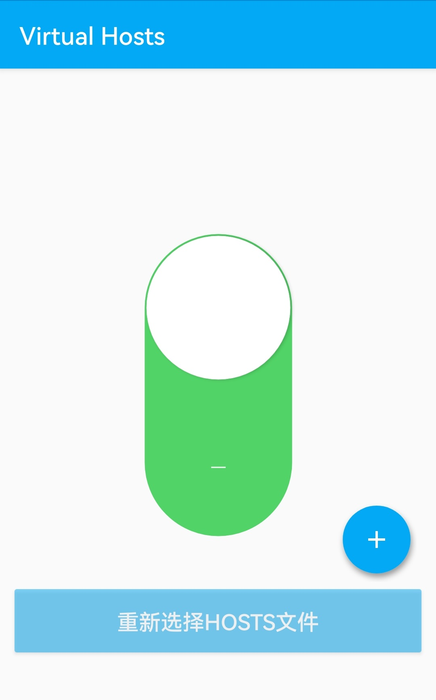

# 使用Cloudflare代理为纯IPv6站点添加IPv4访问

2024.08.24  

<details>

<summary>文章结构</summary>

```
索引
│
├─关于本教程
│
├─可用的解决方法
│ ├─服务端侧
│ │ ├─STUN穿透方案
│ │ ├─FRP穿透方案
│ │ └─CloudFlare双栈代理
│ └─客户端侧
│   ├─使用IPv6过度技术
│   └─组网方案
│
├─设置CloudFlare代理
│ └─设置DNS解析
│
├─设置回源规则
│ ├─关于回源规则
│ └─添加回源规则
│
├─设置 SSL/TLS 加密模式
│ └─检验设置
│   ├─注意 Host 请求头
│   ├─520错误
│   └─SSL握手错误
│
├─设置 Cloudflare IP 优选
│ ├─关于IP 优选
│ ├─Windows 优选方法
│ ├─安卓设备 优选方法
│ └─在线网站优选
│
└─结尾
```

</details>

---

## 关于本教程

随着IPv6的普及 使用家庭宽带进行建站变得更加容易  
这免去了获取IPv4公网或者使用STUN进行穿透的麻烦   
**相当于纯IPv6站点**   

不过需要注意光猫和路由器上的防火墙  
IPv6教程开放端口教程：[链接](https://www.bilibili.com/read/cv32811550/)  

而在客户端侧 也就是访问方面  
移动设备主要是手机 其**移动数据**（也就所谓的手机流量）  
几乎都已经提供IPv6了  

家庭宽带方面 情况略差 但IPv6的渗透率也在不断的增加  
尤其是新办理的宽带  

而公共网络方面的情况就比较复杂了  
一些学校/公司/大型商业场所 的公共网络可能已经在提供IPv6了  
不过更多的地方可能还没有   

在IPv6推广上这些公共网络可能是 最后一批提供IPv6支持的  
**所以在无IPv6的环境下访问纯IPv6站点就成为了一个亟待解决的问题**  

---

其实本教程原本是设计给 搭建了家庭影音服务器 但只有IPv6公网 不能使用STUN穿透  
且无法使用或不想组网的用户在外访问使用的   
由于观看视频所耗费的流量较多 故不太适合使用移动数据需要使用公共网络进行观影  

所以其设计指标被定为 无额外花费 拥有较高传输速率 可以忍受较高延迟  
从实践上来看使用CF进行双栈代理确实可以解决在纯IPv4环境下访问纯IPv6服务器的难题  
不过由于客观网络环境的问题其稳定性和速度其实较难保障  

---

## 可用的解决方法

要解决在无IPv6环境下访问纯IPv6站点 主要有两条路线  

* **为服务端添加 IPv4 访问性**  
* **为客户端添加 IPv6 访问性**  

### 服务端侧

* **使用STUN 穿透获得IPv4访问性**  

  通过STUN 穿透运营商NAT获得可被外界访问的端口  
  **此方案在之前的教程中已经有所讲解:** [链接](../lucky-STUN/stun-web服务-CF.md)  
  
  优点：若能成功穿透则延迟则速度与相当于IPv4公网  
  缺点：设置相对较为复杂且对NAT类型有要求 穿透后的端口是随机的需要额外设置  


* **使用FRP穿透 获得IPv4访问性**  

  通过有IPv4公网的FRP服务器进行中转  
  一般需要在服务端侧安装FRP客户端以与FRP服务器连接  

  优点：可以适用于任意网络环境 甚至包括对称型NAT以及无IPv6环境  
        配置较为简单 方案较为成熟可参考案例多
  
  缺点：速率和稳定性受FRP服务器节点影响 尤其是免费节点 延迟略有增加  
        要获得更好的体验可能需要付费 且需要实名认证 使用HTTP(S)  
        穿透需要备案  

* **CloudFlare双栈代理 获得IPv4访问性**  

  与FRP方案类似 使用CloudFlare节点进行中转也可以达到目的  
  （CloudFlare下文称CF）
 
  优点： 免费CF 的大部分节点都是免费的且  
        无明显速率限制 主要取决于服务端侧的上传能力  
  
  缺点：在不优选IP的情况下延迟较高且部分地区可能存在屏蔽  

  **这也是本教程将要介绍的方案**  


### 客户端侧

* **使用IPv6过度技术获得IPv6访问性**

  这些技术用于在IPv6部署的早期时候在IPv4上传输IPv6  
  主要包括 6in4 6to4 6over4 等 但其本质上还是一种双栈代理技术  
  
  这意味着需要一个稳定的服务器支持 而这样的服务器并不好找  
  比较知名的供应商如 Hurricane Electric 等国外隧道服务要求客户端的IPv4网络  
  可以收发ICMP数据包 这对处于运营商NAT后面的设备来说是几乎不可能的  
  
  而且这些服务器位于国外 速度和稳定性都难以保证  
  至于国内方面 在早期其实也有类似的服务 比如清华大学的ISATAP隧道服务  
  但这些国内的隧道服务几乎都已经关闭或转为仅教育网可用  

  所以这一设想尽管这在理论上可行 **但在实际中不太可能实现**  


* **使用虚拟专用网络进行组网**

  相比起上述的IPv6过度技术使用虚拟专用网络的方案就要成熟和可靠的多了  
  不过其本质还是在IPv4上做内网穿透 让服务器和客户端处在一个虚拟的局域网中  
  其本身和IPv6并没什么关系  
  
  但这种方案使用的更加广泛 案例和教程也很多 比较常用的软件就是 **zerotier和tailscale**   
  且相比起之前所说的 **使用STUN穿透获得IPv4访问性** 的方案对网络的要求会更低一些  
  一般来说两侧不为对称型NAT（NAT4）即可穿透 不过需要在服务端和客户端侧安装专门的组网客户端  


---

## 设置CloudFlare代理

使用CloudFlare代理可以解决这个问题 （CloudFlare下文称CF）  
CF 服务器（节点）同时拥有IPv4和IPv6地址 其起到桥梁作用以沟通纯IPv4的客户端 和纯IPv6的服务端  


**流程图**

客户端发起IPv4请求到达CF节点  CF节点收到请求后将其转换成IPv6请求发往源服务端  
源服务端使用IPv6接受并应答请求来自CF节点的请求 CF节点再将这个应答转换成IPv4发回给客户端  


### 设置DNS解析

要想使用CF的代理服务则必须将域名解析到CF  
在之前教程中已经讲解过如何在CF上设置和更新DNS记录以及其他的一些WEB设置  

* [在Windows下使用lucky更新动态域名](https://www.bilibili.com/read/cv35021955/)  
* [在Windows下使用lucky配置反向代理以实现较为安全的WEB访问](https://www.bilibili.com/read/cv35702797/)  

与之前不同的是这里还需要打开后面的**代理开关** 这样域名的地址就会被解析到CF的节点上  
而CF则可以通过其中填写的IPv6地址连接源服务器  

这里可以选择AAAA记录（IPv6）也可以选择CNAME  
使用CNAME可以兼容已有的其他（子）域名  


**检查解析效果** 

可以使用Windows自带的nslookup功能检查解析效果  
也可以使用在线DNS解析检查网站 比如 [nslookup-io](https://www.nslookup.io/)  
若设置正确则可以看到CF的地址以及前面的图标  


---

## 设置回源规则

### 关于回源规则

CF的代理功能在默认情况下使用下列的这些端口去连接源服务器  
但由于家庭宽带大概率是封80/443端口的 因此我们需要使用其他端口 当然有些地区不封  

比较好的方法是使用**回源规则**（Origin Rules）来自定义回源端口  
当然也可以让源服务器使用列表中的其他端口 这样就可以不设置回源规则  


<details>
<summary>默认使用的HTTP端口</summary>

* 80
* 8080
* 8880
* 2052
* 2082
* 2086
* 2095
</details>


<details>
<summary>默认使用的HTTPS端口</summary>

* 443
* 2053
* 2083
* 2087
* 2096
* 8443
</details>


<details>
<summary>其他端口（禁用缓存）</summary>

* 2052
* 2053
* 2082
* 2083
* 2086
* 2087
* 2095
* 2096
* 8880
* 8443
</details>


### 添加回源规则

登录CF 》侧边栏-网站 》选择你的域名 》 侧边栏-规则 》Origin Rules 》创建规则  


规则名称 任意填写  

匹配传入请求按照实际情况选择   
这里选择匹配二级域名 `test.ie12.com`  
表示当传入的请求为`test.ie12.com`的时候触发此规则  


接下来设置 **回源端口** 也就是CF节点连接你的的源服务器使用的目标端口  
填写源服务器实际监听的IPv6端口 这里使用36100作为演示  


---

## 设置 SSL/TLS 加密模式

在完成回源规则设置后我们还需要设置CF的SSL/TLS 加密模式  
选择侧边栏中的 SSL/TLS 加密模式 其与刚才设置的回源规则在同一个侧边栏  
此处用于设置 访问客户端-CF节点-源服务器 之间的TLS加密模式  

**默认为灵活** 即浏览器与CF节点之间的连接使用加密（HTTPS）  
而CF节点和源服务器之间不使用加密（HTTP）  
如果源服务器/服务 不支持HTTPS则保持此选项为**灵活**  

若 源服务器/服务支持并已经配置了受信任的HTTPS 则选择**完全（严格）**  
例如之前的教程中所设置的lucky反向代理 [链接](https://www.bilibili.com/read/cv35702797/)  
此时CF节点和源服务器之间将使用TLS加密  


### 检验设置

#### 注意 Host 请求头

host请求头即 Host header （你在浏览器中输入的域名）
其可被用于确定要请求的服务 尤其是在有反向代理的情况下  
当然在无反向代理和HTTPS的情况下一般不用太在意

但如果像之前的教程中那样使用lucky设置了反向代理和TLS证书  [链接](https://www.bilibili.com/read/cv35702797/)  
**就需要注意域名是否和反向代理中的前端地址以及TLS证书相匹配**  
若不匹配则需要进行调整 不然在通过CF代理访问时会报错  

CF 的回源规则其实是可以重写 Host 请求头的  
这样可以更好的兼容原来的设置（如果有的话）但这个功能免费版是没有的  
需要升级到企业版才行（最高的一档） 相比之下修改原有的设置会更加简单  


**检视效果**

完成上述的设置后即可开始验证效果  
在浏览器中输入解析到CF的域名 若设置正确即可正常看到网页  
以及CF赠送的对应域名的TLS证书  


#### 520错误

值得注意的是520错误是 CF 特有的非标准错误代码 其本质上是一个笼统的响应  
其涵盖出现意外情况 源服务器由于协议违规而错误地解释或不容许某个请求或者空响应等情况  
若出现520错误 **则可能是CF的加密模式选择与源服务器中的加密模式不匹配造成的**  

例如在CF加密模式中设置了灵活 （连接源服务器时使用HTTP）  
但在源服务器上则开启了HTTPS 这样一来http请求就发送到了https端口上  

在lucky作为源服务器（反向代理）的情况下 当http请求发送到了https端口时  
会发生连接重置 而在CF则会显示520错误  

**示例**  


#### SSL握手错误

这个错误就相对好理解很多了 即SSL握手发生错误  
依然是要检查CF加密模式以及源服务器的加密模式  

例如在源服务器上未设置TLS加密 但在CF上设置了 完全或者完全（严格）  
**这样一来https请求就发送到了http端口上 握手自然无法完成**  

**示例**  


---

## 设置 Cloudflare IP 优选

### 关于IP 优选

Cloudflare CDN 节点 采用一种名为 Anycast 的路由方法 其一般翻译为 **任播**或者泛播、选播  
这通常会将传入的流量路由到距离最近并且能够有效处理请求的节点从而缩短延迟  
这也可以用来应对高流量、网络拥塞和 DDoS 攻击  

但CF免费账户并不提供国内节点 所以最近的节点一般也在香港或者美国  
再考虑到宽带出口  实际直接访问的效果并不好 主要是延迟非常高  

不过好在CF的节点非常多 总有一些表现效果比较好节点  
但是如何找出这个（这些）节点就成为一个问题  
好在现在已经有一些成熟的IP优选方案  

XIU2的 [CloudflareSpeedTest](https://github.com/XIU2/CloudflareSpeedTest)  
值得注意的是CF的节点数量非常多 即使是优选脚本也只会 抽取一部分IP进行测试  
而不是对所有节点都进行测试  

### Windows 优选方法

在Windows上优选起来还是较为简单的 直接使用项目中的脚本即可 [项目下载地址](https://github.com/XIU2/CloudflareSpeedTest/releases)   
64位选择windows_amd64 32位选386 别选成arm了


解压 压缩包 运行测试程序 
测试完成后会按照速度和延迟等对节点进行排序  
选择质量最好的节点即可 

通过修改host文件在本地“劫持”自己的域名到优选后的IP即可实现优选  
详情可以查看下面的使用提示 

**示例**  


<details>
<summary>使用说明中的提示</summary>

>详细使用说明请看：
>  
>Github：https://github.com/XIU2/CloudflareSpeedTest
>  
> 可以去这里向我 [反馈问题、提供建议、询问使用方法] ！
> 
> ===================================
>  
> 如果平均延迟非常低（如 0.xx），则说明 CloudflareST 测速时走了代理，请先关闭代理软件后再测速。
> 如果在路由器上运行，请先关闭路由器内的代理（或将其排除），否则测速结果可能会不准确/无法使用。
>  
> 因为每次测速都是在每个 IP 段中随机 IP，所以每次的测速结果都不可能相同，这是正常的！
>  
> 注意！我发现电脑开机后第一次测速延迟会明显偏高（手动 TCPing 也一样），后续测速都正常
> 因此建议大家开机后第一次正式测速前，先随便测几个 IP（无需等待延迟测速完成，只要进度条动了就可以直接关了）
>  
> ===================================
>  
> 脚本【cfst_host.bat】的作用是 CloudflareST 测速后获取最快 IP 并替换 Hosts 中的 Cloudflare CDN IP。
> 使用前请先阅读：https://github.com/XIU2/CloudflareSpeedTest/discussions/312#discussioncomment-5161576
>  
> ===================================
>  
> 脚本【cfst_3proxy.bat】的作用为 CloudflareST 测速后获取最快 IP 并替换 3Proxy 配置文件中的 Cloudflare CDN IP。
> 可以把所有 Cloudflare CDN IP 都重定向至最快 IP，实现一劳永逸的加速所有使用 Cloudflare CDN 的网站（不需要一个个添加域名到 Hosts 了）。
> 使用前请先阅读：https://github.com/XIU2/CloudflareSpeedTest/discussions/71
>  
> ===================================
>  
> ip.txt 为 IPv4 数据文件
> ipv6.txt 为 IPv6 数据文件
>  
> 可以使用 -f xx.txt 参数来指定不同的 IP 数据文件（支持 IPv4 + IPv6 混合测速），如：
> CloudflareST.exe -f ipv6.txt
>  
> 也可以直接通过参数指定要测速的 IP，如：
> CloudflareST.exe -ip 1.1.1.1,2606:4700::/32

</details>


### 安卓设备 优选方法

相比起Windows上 安卓设备上的优选要麻烦一些  
主要体现在两个方面一个是 如何运行优选脚本 而另方面是 怎样“劫持”域名  

运行脚本的方法也有两种 一种是下载一个Linux终端模拟软件  
以运行Linux上的测试脚本  另一种则是使用APP  

Linux终端模拟软件的方法相对来说比较麻烦  
其需要在命令行模式操作测试脚本 [链接](https://github.com/XIU2/CloudflareSpeedTest/discussions/61)  

相比之下APP使用起来会更加简单 不过默认测试的节点数量比较少  
实际效果可能不是很好 可以手动调高节点数量  
但多了后似乎会出现闪退的现象 当然也可能是测试设备的问题 [链接](https://github.com/xianshenglu/cloudflare-ip-tester-app)  


  

而在“劫持”域名方面也有一定的困难  
安卓下虽然也有host文件 可用于抢答域名解析  
不过其并不像Windows下那样可以随意修改 **需要root权限**  

更加可行的方法是使用一个**运行在本地VPN** 来捕获设备发出的DNS请求  
一些安卓上的去广告软件使用的也是这种方法  

不过那些软件的额外功能我们并不需要 我们只需要最简单的修改host的功能即可  
这里使用的是 **Virtual-Hosts**  

[Github项目地址](https://github.com/x-falcon/Virtual-Hosts) [F-Droid应用商店下载](https://f-droid.org/packages/com.github.xfalcon.vhosts/)  

**软件界面**   


可以选择本机中任意的文件 读取其中的规则 也可以从网页上读取  

**规则写法：**  

```
127.0.0.1 a.com     |
127.0.0.1 m.a.com   |  => 127.0.0.1 .a.com
127.0.0.1 w.m.a.com |
```


**示例**


设置完成后打开 开关 建立一个VPN连接 DNS“劫持”即可生效  


**示例**




**检视效果**


### 在线网站优选

其相当于免去了在终端设备上运行测试脚本的步骤
  
一些是网站本身定期进行测试并发布结果  
还有一些是在线工具即在浏览器中进行优选  
可根据实际情况进行选择  

**结果发布页**  

* https://monitor.gacjie.cn/page/cloudflare/ipv4.html
* https://api.uouin.com/cloudflare.html
* https://stock.hostmonit.com/CloudFlareYes 似乎已经失效

**在线测试工具**  

* https://vfarid.github.io/cf-ip-scanner/
* http://ip.flares.cloud/

---

## 结尾

至此我们便完成了使用Cloudflare代理为纯IPv6站点添加IPv4访问的设置  
  
尽管受网络环境等因素的影响 该方案的稳定性较难保证  
但在向IPv6过度的漫长时间中这仍可被视为是一种解决在纯IPv4环境下  
访问纯IPv6服务器的有效方法  

---

参考

* [HE 提供的 tunnel ipv6，可以直连吗？](https://cn.v2ex.com/t/1023138)
* [My ISP uses CGNAT. Can I configure an IPv6 tunnel?](https://ipv6.he.net/certification/faq.php)
* [国内有没有类似tunnelbroker免费提供IPV6隧道的？](https://www.nodeseek.com/post-7322-1)
* [Network ports compatible with Cloudflare’s proxy](https://developers.cloudflare.com/fundamentals/reference/network-ports/#network-ports-compatible-with-cloudflares-proxy)
* [Origin Rules](https://developers.cloudflare.com/rules/origin-rules/)
* [社区提示 - 修复错误 520：Web 服务器返回未知错误](https://community.cloudflare.com/t/520-web/399357)
* [什么是 Anycast？| Anycast 如何工作？](https://www.cloudflare-cn.com/learning/cdn/glossary/anycast-network/)
* [CloudFlare 优选ip 和 优选域名方法](https://www.kjfx.cc/307.html)


