# 「转」Cloudflare Workers & Pages 优选IP

## 转载说明

本文是对 linux do 用户 keyikai [“Cloudflare Workers & Pages 优选IP”](https://linux.do/t/topic/224038) 的转载 有删改  
而原文则是对 CM喂饭-干货满满 “[加速你的项目！详解 Cloudflare Workers & Pages 优选域名设置](https://blog.cmliussss.com/p/BestWorkers/)” 的转载  

---

## 前言

之前在网上看到关于 Cloudflare Pages 的优选设置都比较复杂，所以看到这篇文章的解决方法比较简洁，就转载分享出来，希望能帮助到大家  

---

## 事前准备

首先，你需要确定将要使用的优选域名。你可以使用自建的优选域名，也可以使用网友公益维护的优选域名。更多优选内容参考：[链接](https://blog.cmliussss.com/p/CloudFlare优选)  

1.本教程演示使用的优选域名为 `visa.cn`  
2.你需要一个已经转入 Cloudflare 的域名（不能使用双向解析的免费域名），示例：`cmliussss.us.kg`。  

## Workers 优选

本教程演示的 Worker 使用的自定义域名示例为 `img.cmliussss.us.kg`。  

### 步骤1：设置自定义域 CNAME 记录至优选域名

* 给你将要使用的域名 `cmliussss.us.kg` ，添加一个CNAME类型的解析记录，名称为您所需的自定义域示例img，目标为优选域名示例 `visa.cn` 即可；
* **重要提示：不要打开小黄云（Cloudflare 的代理功能）！！！**

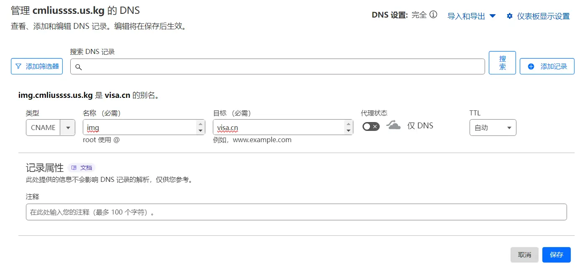

### 步骤2. 给 Workers 项目添加路由

1.选中 `cmliussss.us.kg` 域名后，左侧选择 **Workers 路由** 》 **添加路由** ；  

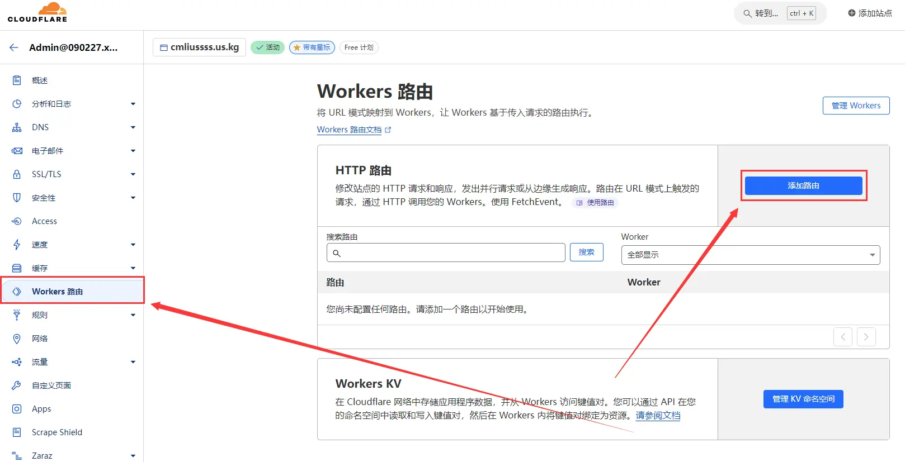

2.路由填入 Worker 项目最终使用的自定义域 `img.cmliussss.us.kg/*` ，Worker 选中对应的 **Worker项目名** 后点击 **保存** 即可。  

* 注意自定义域末位必须加上`/*`，也就是`img.cmliussss.us.kg/*`！
* 注意自定义域末位必须加上`/*`，也就是`img.cmliussss.us.kg/*`！
* 注意自定义域末位必须加上`/*`，也就是`img.cmliussss.us.kg/*`！！！

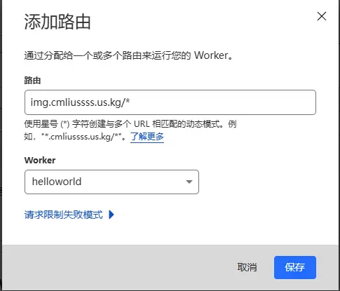

#### Workers 项目优选前后对比

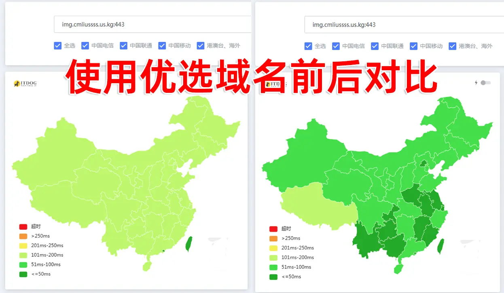

---

## Pages 优选

本教程演示的 Pages 使用的自定义域名示例为 `img.cmliussss.us.kg`。  

### 步骤1. 为 Pages 项目添加自定义域

先行给 Pages 项目添加自定义域，并记录 CNAME 目标域名 `telegraph-image-1if.pages.dev` ，并等待自定义域生效。  

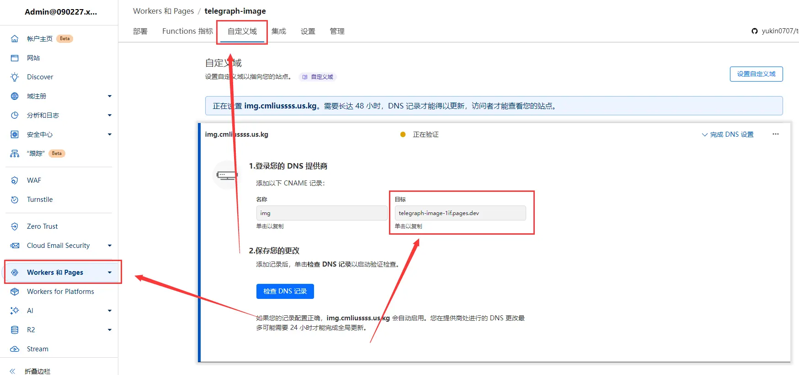

### 步骤2. 使用华为云国际版-云解析服务 DNS

1.注册华为云国际版-云解析服务 DNS：[链接](https://console-intl.huaweicloud.com/dns)  
（国际版不需要实名，如果注册时频繁跳转国内版本，请打开全局代理模式注册）。  

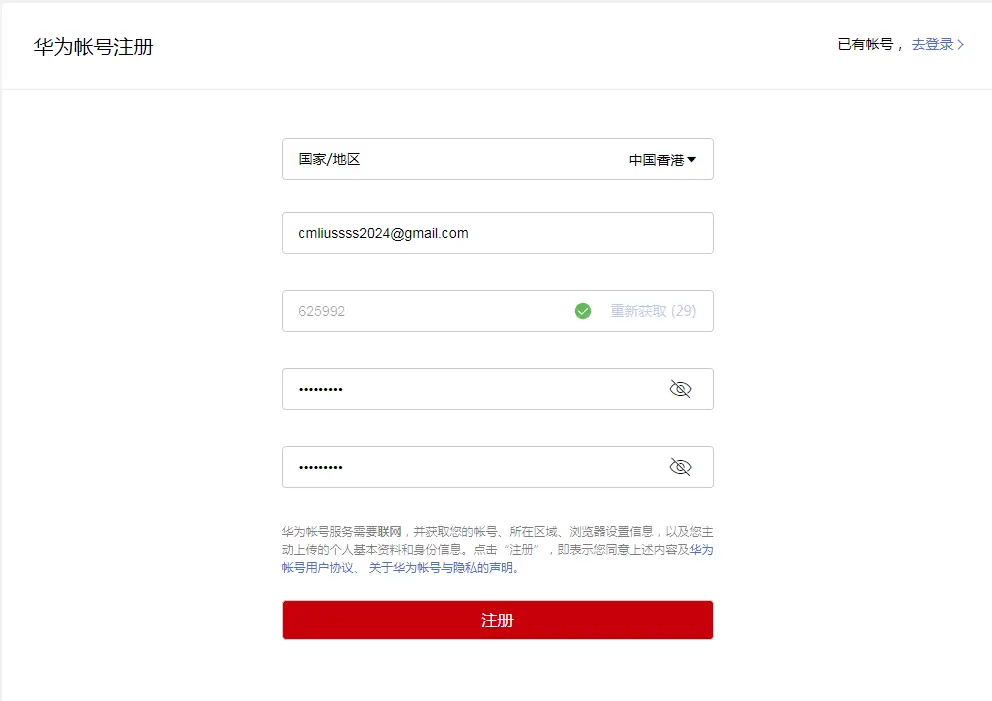

2.设置您的安全手机(跳过即可)  

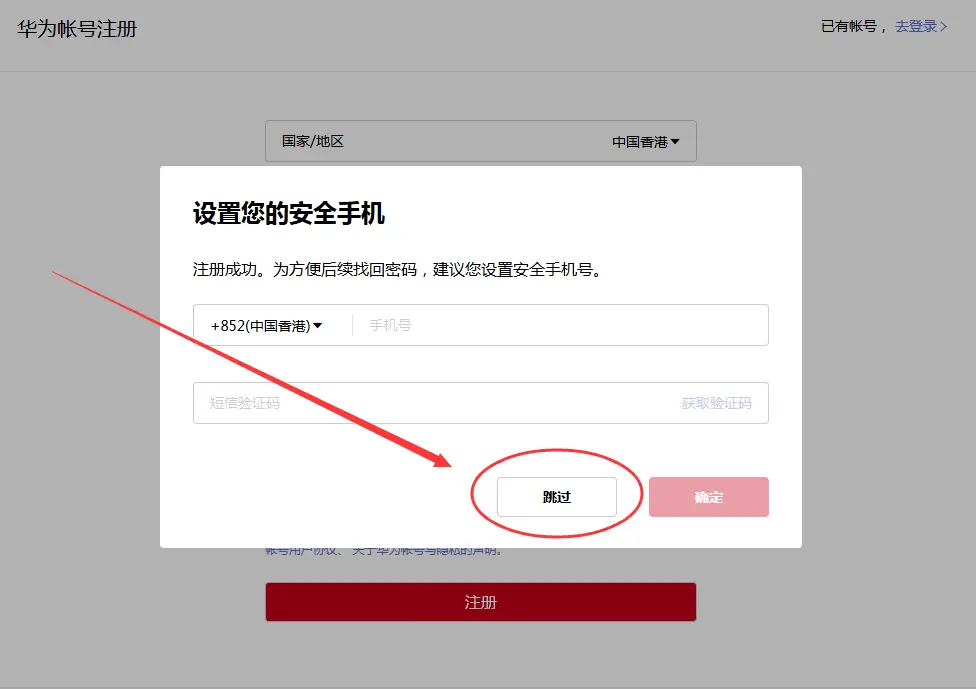

3.开通华为云。  

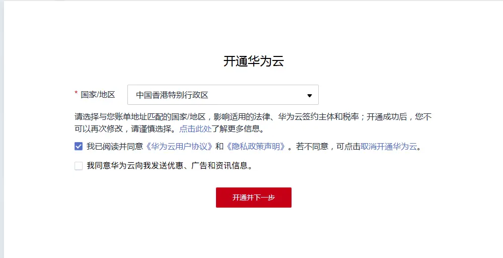

4.跳转到完善信息页面说明注册已完成，无视绑定提示即可。  

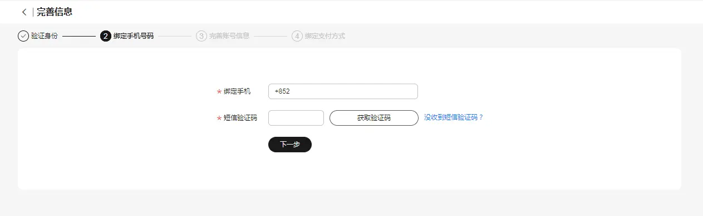


### 步骤3. 添加自定义域至云解析服务 DNS
1.点击前往 [云解析服务 DNS](https://console-intl.huaweicloud.com/dns)，后点击 **公网域名**  

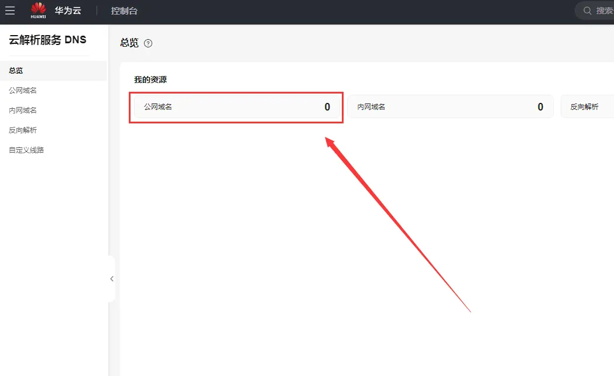

2.点击右上角 **创建公网域名**  


3.填入需要优选的 **Pages 自定义域名** `img.cmliussss.us.kg`，然后点击**确定**  

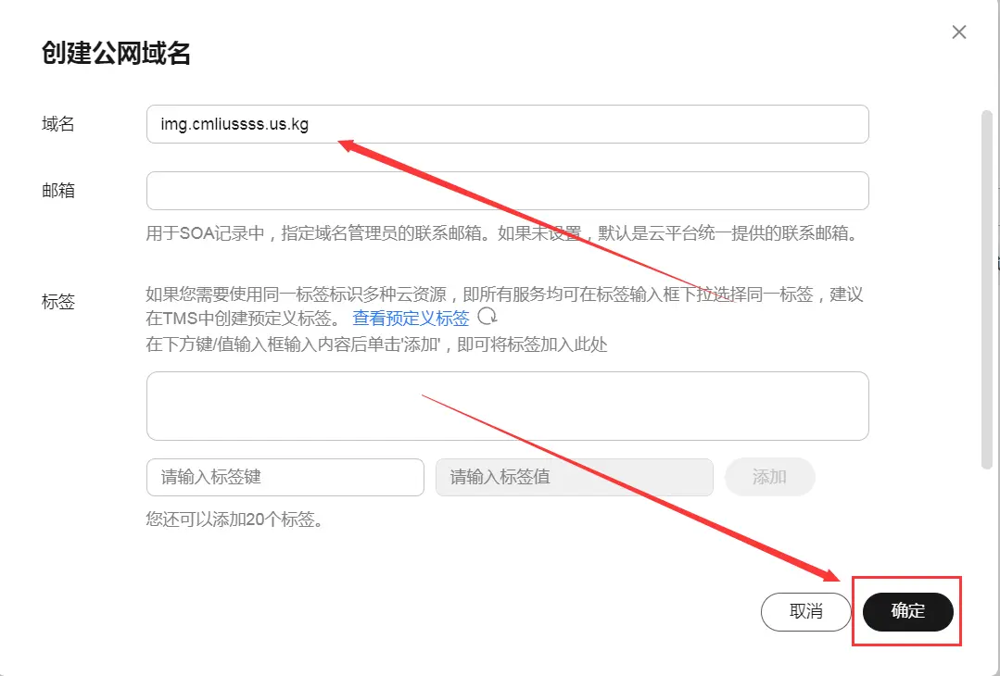

4.点击 `img.cmliussss.us.kg`的 **管理解析**  

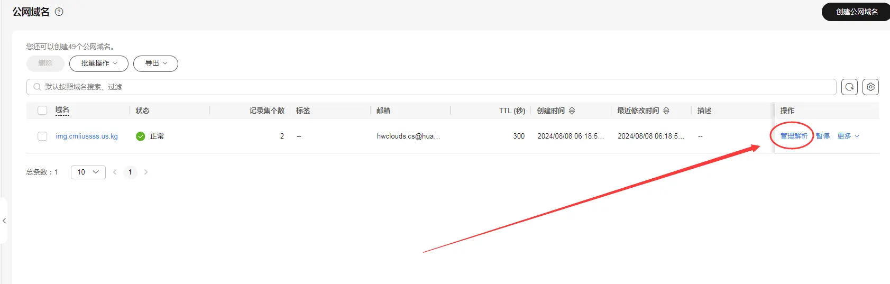

5.进入**管理解析**后点击**添加记录集**  

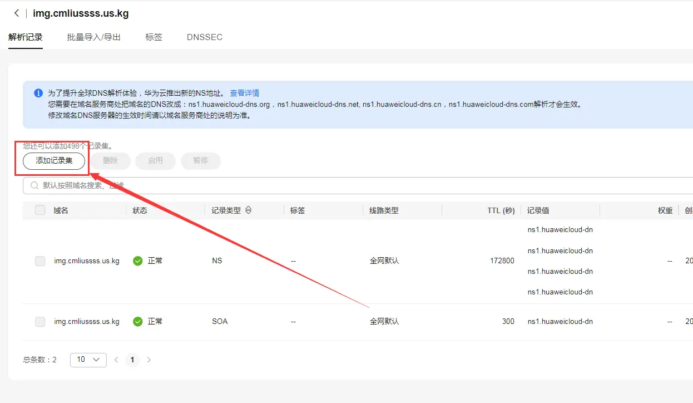

6.新添加一个 **CNAME 记录** ，线路类型为 **全网默认**，记录值为 **Pages 项目分配的域名** `telegraph-image-1if.pages.dev`。  

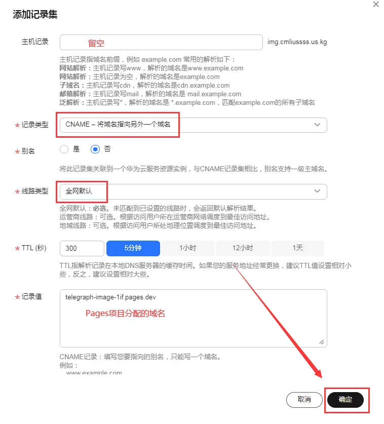

7.再添加一个 **CNAME 记录** ，线路类型为 **地域解析** 》 **中国大陆** ，记录值为**优选域名** `visa.cn`。

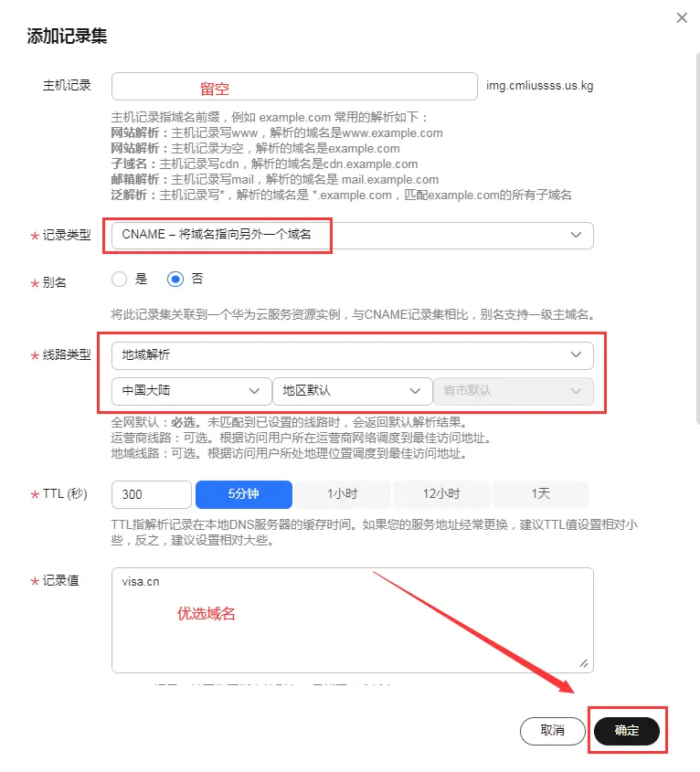

8.鼠标指向第一条NS记录，将4条NS记录值一一复制出来保存好。  

```
ns1.huaweicloud-dns.com.
ns1.huaweicloud-dns.cn.
ns1.huaweicloud-dns.net.
ns1.huaweicloud-dns.org.
```
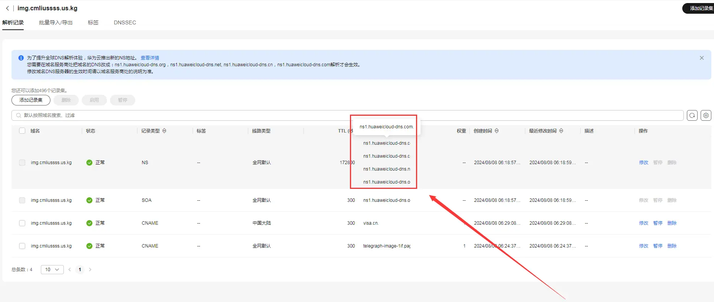

### 步骤4. 设置自定义域NS 记录至华为云 NS 记录

给你将要使用的域名 `img.cmliussss.us.kg` ，添加4条 **华为云NS类型** 的解析记录，即可生效。  

```
ns1.huaweicloud-dns.com.
ns1.huaweicloud-dns.cn.
ns1.huaweicloud-dns.net.
ns1.huaweicloud-dns.org.
```
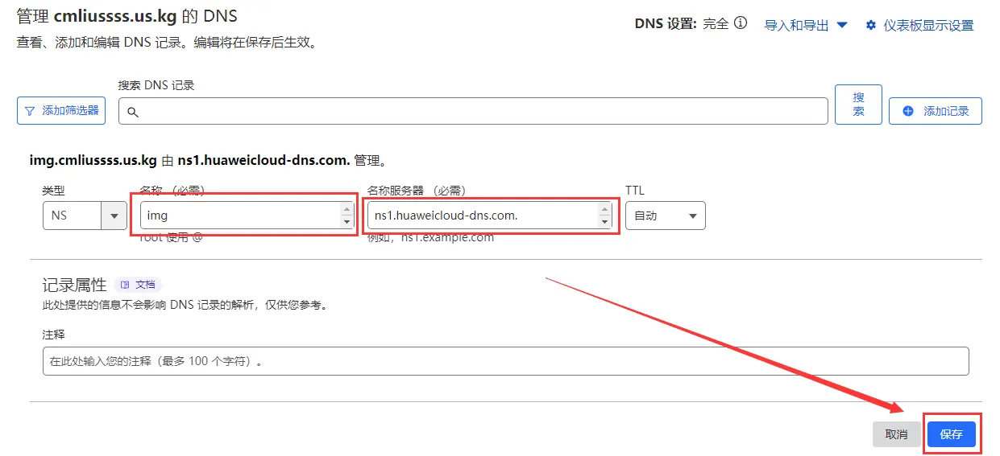
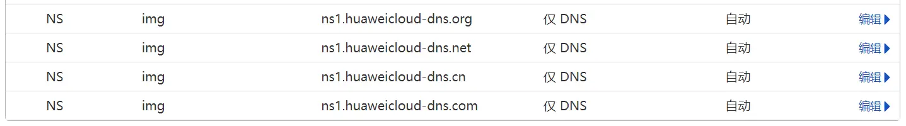

#### Pages 项目优选前后对比


