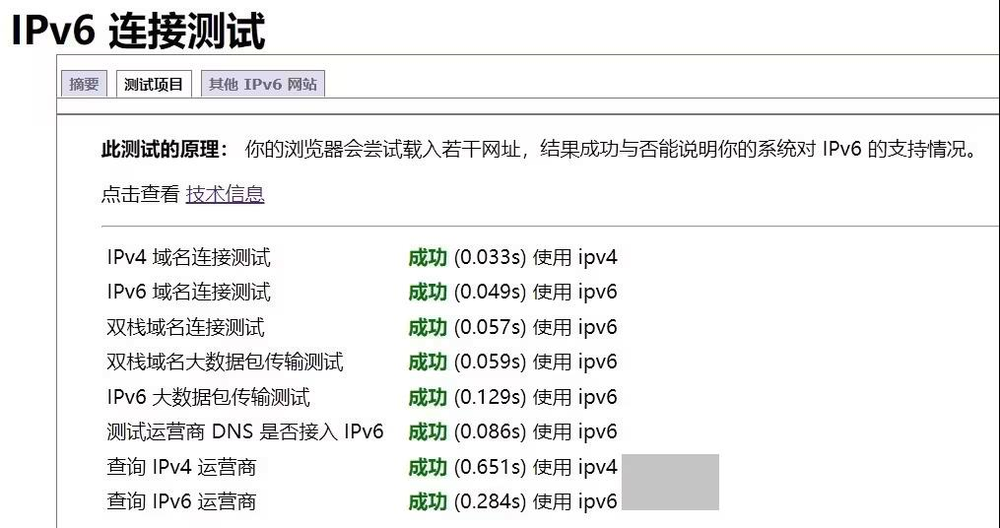
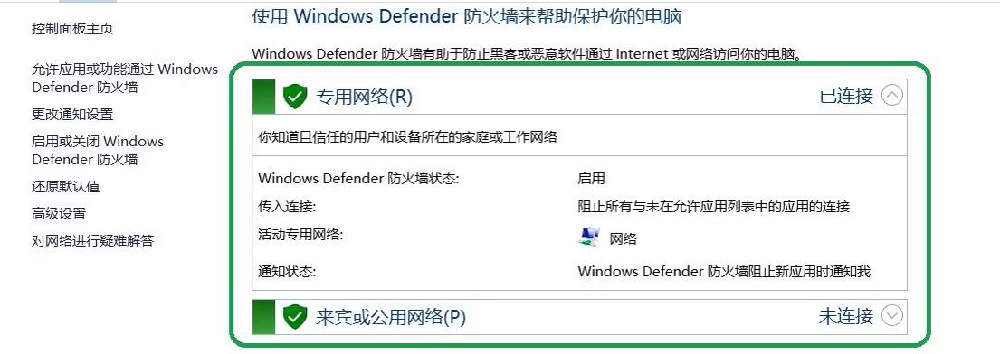
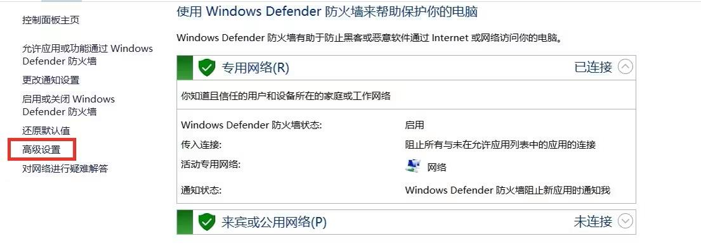
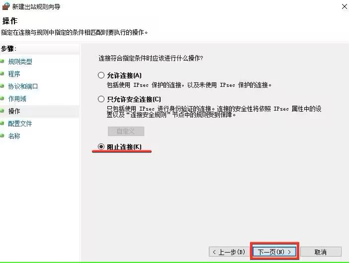
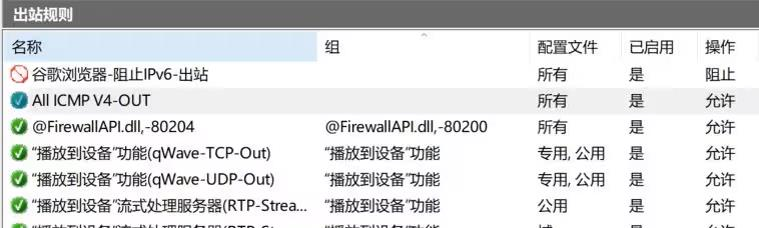

# 「权宜之计」使用Windows防火墙拦截浏览器IPv6请求迫使其使用IPv4

2024.05.29  

## 背景信息
随着IPv6的普及越来越多的家庭宽带用户使用上了IPv6网络  
IPv6拥有海量地址解决了在IPv4时期地址不足和NAT大量使用的问题  
为**BT下载 游戏联机 远程访问**等需要开放端口的场景提供了极大的便利  

---

## 遇到的问题
一些用户在开启IPv6后可能会遇到网页浏览变慢的情况
这不是IPv6自身设计的问题 而是在实际的配置中所产生的

----

### PMTU黑洞
若IPv6传输路径中存在PMTU黑洞  
会极大影响IPv6的使用体验 易出现网页无法打开等严重问题  
可通过开启**MSS钳制**加以解决 在硬路由上此功能基本都是默认开启的  

不过一些软路由似乎并没有默认开启此功能 所以在软路由上可能更容易遇到此问题  
详见：[链接](https://zhuanlan.zhihu.com/p/621371177)


### 网站支持问题
更为常见的问题其实是访问的网站对IPv6的支持不好  
在目前的过渡阶段一般使用双栈技术 即网站同时支持IPv6和IPv4访问  

一些网站有IPv6记录但实际无法访问 浏览器会尝试IPv6 直到超时后在用回IPv4  
这样从开始加载网页到最终显示出来花费了非常多的时间  
不过现在这种假双栈的情况应该比较少了  

现在的浏览器一般都会使用一种名为 **Happy Eyeballs**（快乐眼球） 的机制（RFC 6555）也叫 **Fast Fallback**（快速回退）  

其会尝试同时发起IPv4和IPv6连接  只要其中一个连接建立成功 就立即使用这个连接  
这样可以获得最短的连接建立时间从而提高用户体验  

但有些网页本身加载没有问题 但其上的图片或者视频等元素加载的很慢  
在IPv4下却十分迅速 这可能是由于 IPv6 CDN 节点的数量不足 质量不佳造成的  

### 代理失效问题
在开启IPv6后有可能**对代理效果产生一定的影响**  
一些需要通过代理访问的网站可能会出现无法访问或者加载缓慢的情况  
当然这要根据不同的代理方式分情况讨论  

如果使用的是socks5等代理协议进行代理则一般不会出现问题  
浏览器发送的流量全部由代理软件处理  

若使用的代理服务器支持IPv6则直接通过IPv6进行访问  
**若不支持 则IPv6请求立刻失败转而使用IPv4**  
会增加微量延迟但不会对使用体验造成大的影响  

但若是采用**在路设备上进行分流的方法（包括在本地使用TUN/TAP）**  
通过IP地址域名以及其他一些规则来判断是否让流量通过代理  

由于现在的系统和浏览器普遍采用IPv6优先策略  
可能导致浏览器发出的请求没有被代理规则命中  
被判断为了不需要代理的流量而使用了直连  

---

## 可用的解决方法
在本教程所设想的环境下IPv6已被用BT下载 远程访问等功能  
故不能关闭 IPv6 也不能丢弃 IPv6 DNS 解析  


### 使用注册表设置IPv4访问优先
使用注册表修改Windows连接发起的优先级由默认的IPv6优先改为IPv4优先  
这不会影响纯IPv6的访问  

设置方法可以查看之前的教程  
详见：[链接](https://www.bilibili.com/read/cv29101131/)

不过较高版本的浏览器（如Chrome）似乎**已经不再遵从Windows的IPv6访问优先级了**
其在IPv6可以的情况下**会强制使用IPv6访问**  


### 使用socks5等代理协议
使用socks5等代理协议接管浏览器的所有流量以避免IPv6请求没有被代理捕获  
而进行了直连 不过这需要修改现有的代理布局  

---

## 使用Windows防火墙拦截浏览器IPv6出站请求

通过防火墙拦截浏览器的IPv6出站请求使其立即失败  
迫使其使用IPv4进行连接 这只会增加微量的延迟  
无需第安装三方软件也不影响其他程序使用IPv6  


如有访问纯IPv6网站的需要  
则可以使用另外一个浏览器来连接纯IPv6站点  
这将是本教程要介绍的方法  

### 设置过程
运行IPv6测试以确定当前浏览器可以使用IPv6
访问 http://testipv6.cn/



搜索栏搜索 防火墙  
选择检查防火墙状态 打开  


检查防火墙是否启用  



点击左侧的 **高级设置** 以打开高级widows防火墙  



添加规则 选择**出站规则** 右键>新建规则  


选择 自定义规则  


程序路径选择浏览器主程序的路径  


直接通过 浏览 获得的路径中可能会像这样包含有 **变量**  
如 `%USERPROFILE%` 为保证效果应将其改为**绝对路径**  


Windows防火墙帮助手册中已说明了这种情况  


不过该手册在win10中已经不复存在 但有在线版本可以查看  
详见：[链接](https://forsenergy.com/zh-cn/authfw/html/ee8441ab-55b4-4ce3-b658-d4e28320a010.htm)  

协议类型 保持默认 即任何  


作用域
在远程IP中选择下列IP地址 并点击添加  


填写 `2000::/3` 此为 IPv6全球单播地址的前缀 可以理解为匹配所有公网IPv6地址  
曾经尝试使用 `::` 进行匹配 但并不成功 其表示所有IPv6地址  
IPv6前缀划分：[链接](http://https://www.iana.org/assignments/ipv6-address-space/ipv6-address-space.xhtml)  


操作 保持默认 即**阻止连接**  



配置文件 保持默认 即**全部勾选**  


名称任意填写  
这里使用 **谷歌浏览器-阻止IPv6-出站**  




再次运行IPv6测试 **其几乎立刻失败**  
**这说明防火墙规则已经生效**  


**可通过命令快速设置 需要管理员权限**  

**启用Windows防火墙**  

```
netsh advfirewall set allprofiles state on
```

**还原默认入站策略-阻止与规则不匹配的入站连接**  
netsh advfirewall set currentprofile firewallpolicy blockinbound,allowoutbound

**创建拦截规则**  
```
netsh advfirewall firewall add rule name="规则名称" dir=out program="浏览器主程序路径" action=block enable=yes profile=any protocol=any remoteip=2000::/3
```

**示例**  
```
netsh advfirewall firewall add rule name="谷歌浏览器-阻止IPv6-出站" dir=out program="C:\Program Files\Google\Chrome\Application\chrome.exe" action=block enable=yes profile=any protocol=any remoteip=2000::/3
```

至此我们完成了使用Windows防火墙拦截浏览器IPv6请求迫使其使用IPv4的设置  

---

参考

* [IPv6测试-为何倾向 IPv4](http://testipv6.cn/faq_avoids_ipv6.html)
* [win10有沒有辦法禁用指定軟件的ipv6鏈接](https://hostloc.com/thread-1136973-1-2.html)
* [如何禁止 Chrome 解析 IPv6 域名地址？](https://www.v2ex.com/t/914404)
* [开启 IPv6 后网速变得很慢？可能是 PMTU 黑洞的问题](https://v2ex.com/t/800024)
* [从原理到实践，彻底告别 IPv6 上网不稳定的问题](https://zhuanlan.zhihu.com/p/621371177)
* [edge 104.0.1293.47 微软windows系统自带浏览器访问网站变卡，好像这版本chrome开始强制网站走ipv6了](https://bbs.itzmx.com/thread-101252-1-1.html)
* [Happy Eyeballs-维基百科](https://zh.wikipedia.org/wiki/Happy_Eyeballs)


