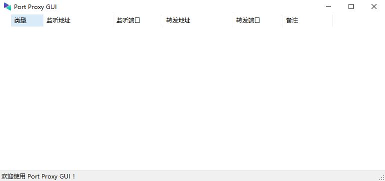
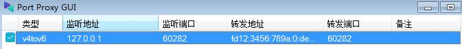

# 使用Windows自带的端口转发功能让不支持IPv6的程序间接的用上IPv6

2024.07.19  

## 遇到的问题

随着IPv6的普及 端到端的连接 再次成为可能  
也使的远程访问和游戏联机变得更加方便  
不过一些较旧的程序并不支持IPv6   

但我们依然可以使用一些方法使其间接的使用上IPv6  

## v6/v4 端口转发

通过端口转发的形式实现IPv6/IPv4协议之间的转换  
这样一来不支持IPv6的程序在内网发送和接受数据是依然使用IPv4  
而在公共网络传输的过程中使用IPv6 由两端转发器在其中进行转换  

但其只能处理单播而不能处理广播 不过胜在配置起来较为简单  
本教程将使用Windows自带的端口转发功能实现此目的  
（**注意！系统自带的转发只支持TCP**）

**工作流程图**  

---

## 专用客户端和浏览器

### 客户端和服务端

一般来说客户端和服务端都是成对使用的  
若服务端不支持IPv6则客户端一般也不支持  反之亦然  
此时需要在客户端和服务端侧均设置转发   

当然也有特殊情况 比如服务端程序已经停止更新  
但客户端程序还在更新   
就会出现服务端不支持IPv6但客户端支持的情况  

在此情况下只需要在服务端进行端口转发即可  
因为客户端原生支持IPv6比如此视频中的无线电软件：[链接](https://www.bilibili.com/video/BV1Kw411C7fY)  

### WEB UI

除了刚才所说的服务端/客户端 一方停更的情况外  
还存在一种特殊情况 就是 **WEB UI**  

一些老程序的 WEB UI只支持IPv4但现代浏览器都已经支持IPv6  
其与刚才所说的一方停更的情况类似也只需在服务端侧进行转发   
而且这种情况应该会更加的常见  

----

## 设置方法

### 使用命令行

在默认情况下 只能使用命令进行配置  
即`netsh interface portproxy`命令 详见：[链接](https://learn.microsoft.com/zh-cn/windows-server/networking/technologies/netsh/netsh-interface-portproxy)  
但使用命令进行操作并不方便 更好的方法是使用图形界面程序  

### 使用 PortProxyGUI

Github 项目地址: [链接](https://github.com/zmjack/PortProxyGUI)  
网盘链接： [链接](https://wwm.lanzoul.com/isoBS24pu7fe)   

**需要 .NET 运行环境** 下载解压后即可运行  
若缺少.NET则按照提示进行安装即可  

**主界面**  

---

## 转发演示 eMule WEB UI

eMule本身是不支持IPv6的  
且由于是WEB UI所以我们只需要在服务端侧进行转发即可

右键空白处可以新建 转发规则  
**类型：** 选择 v6tov4 即将传入的IPv6请求转换成IPv4  

**监听地址：** 默认为 星号 即监听所有地址  
这里使用 `::` 表示所有IPv6地址 其用于接收传入的IPv6请求  
 端口号 可自定义  但最好和下面 连接地址后面的端口号相同   

**连接地址：** 即转换后的请求所发往的地址  
这里选择127.0.0.1即本地环回地址 端口则是eMule WEB UI 所监听的端口  
这里用的是4777  

备注：相当于规则名称 可留空  
分组：可将多个规则分为一组方便识别可留空  
按下设置 以保存规则  

**还需要手动添加Windows防火墙规则**  
以放行流量 其不会自动添加  

**示例**  

#### 检视效果

在另一台电脑上使用IPv6地址进行访问  
为了方便演示这里使用的是内网IPv6地址  
实际访问时可以替换成解析到IPv6的域名  

**效果**  

---

## 转发演示 Minecraft Java

像MC这样的游戏需要服务端和客户端成对使用  
为了方便演示这里选择局域网联机  
需要在客户端侧和服务端（房主）侧均设置转发  

不过值得注意的是 Minecraft Java版**其实很早就支持IPv6了**  
早在1.4.4版本就已经支持在局域网联机使用中IPv6了（2012.12.14）  
最后一个局域网不支持IPv6的版本是1.4.2（没有1.4.3）  

而且服务器的多人模式和IPv6支持应该比局域网更早出现  
使用MC做演示主要是操作起来比较方便   
**1.4.4或更高版本以上就已经原生支持IPv6 无需使用此转换方法**  

### 服务端（房主）侧设置 

#### 创建房间

先创建房间再设置转发规则  
因为MC的局域网联机端口在默认情况下是随机的  
除非用mod加以固定  

注意一些程序可能只会监听某个IPv4地址  
且不包括本地环回地址`127.0.0.1`比如这个旧版的MC  

最好先用资源监视器看一下端口监听情况  
若显示的是未指定IPv4/IPv6地址  
即表示监听了所有的IPv4/IPv6地址   
    

 
#### 设置转发规则

**类型：** 选择 v6tov4 即将收到IPv6还原成IPv4  

**监听地址：** `::` （两个英文冒号）即所有IPv6地址  
端口 可自定义但一般与下方连接地址的端口相同  

**连接地址：** 为MC局域网联机监听的地址一般使用`127.0.0.1`   
但这个旧版MC 监听的是局域网IP   
端口为MC局域网联机监听端口 按下设置 以保存规则

**记得手动添加Windows防火墙规则**  
以放行流量其不会自动添加  
 

### 客户端侧设置

#### 设置转发规则

**类型：** 选择 v4tov6  

**监听地址：**  `127.0.0.1` 端口可自定义 不过一般与下方连接地址的端口相同  
客户端将连接这个本地IP和端口  

**连接地址：** 为服务端设备的IPv6地址 此处为方便演示使用IPv6内网地址  
端口为对端规则所监听的端口  
按下设置 以保存规则  
  

#### 加入游戏

多人游戏》直接连接》输入本地地址和监听端口》加入服务器  
若配置正确即可加入房间  

---

## 结尾

至此我们已经完成了使用PortProxyGUI操作  
Windows端口转发 以实现v6/v4之间的转换  
**不过其只支持TCP** 而不支持UDP  

在之后的教程中我们会介绍使用[lucky](https://lucky666.cn/)进行转发  
其支持UDP 甚至可以实现TCP和UDP之间的转换  

