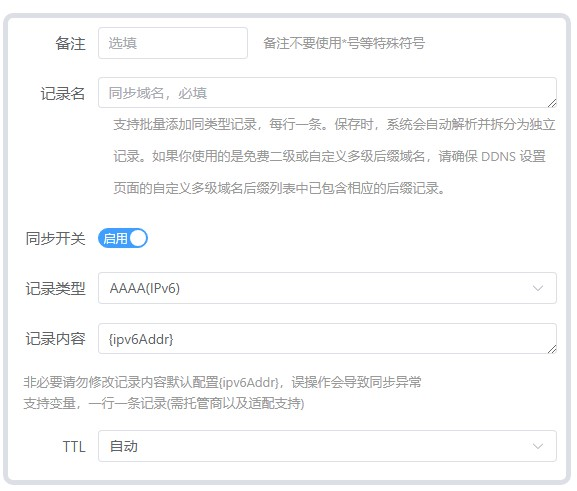
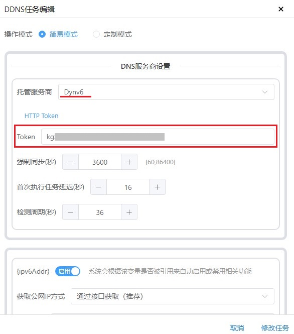
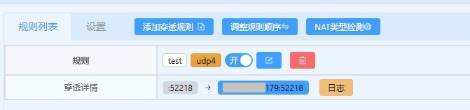
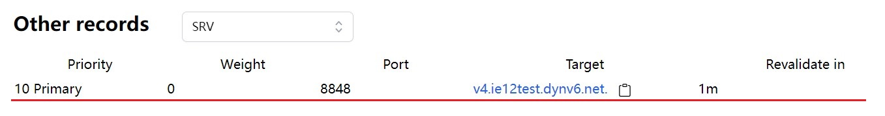
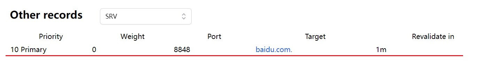

# Lucky v2.15 版本后的DDNS配置方法

2025.06.05  

## 新变化

在2.15后 lucky 对DDNS 模块进行了较大的调整  
现在DDNS模块的配置逻辑与WEB服务更接近 同时支持了更多的记录类型  

更新后单主条主规则可以同时更新IPv4和IPv6地址  
一条规则就可以为同一提供商下的域名完成IPv4和IPv6地址的解析  
在过去要实现这样功能则需要分别设置两条规则  

DNS服务商设置和过去没有什么太大的变化  
不过应该支持了更多的提供商  


新增了 `{ipv6Addr}` 和 `{ipv4Addr}` 两个变量用于记录IPv4和IPv6地址  
可调整获取方式 默认为 从接口获取 还支持 通过网卡 和 脚本获取  


DNS记录设置发生了较大变化 其在过去是一个大的文本框 每行一个填写要更新的记录  
现在改成了与web服务类似的子规则模式 每一个子规则对应一个记录  



目前已经支持的DNS记录类型：  

* A(IPv4)
* AAAA(IPv6)
* CAA
* CNAME
* HTTPS
* NS
* MX
* SRV
* SVCB
* TXT

---

## 更新IPv4和IPv6记录

**选择提供商**  

选择所使用的动态域名提供商并填写对应身份验证信息  
获取 token 令牌等身份验证信息的方法可查看之前的教程：[链接](./lucky-ddns.md)  
在之前的教程中演示了 dynv6 NOIP 和 cloudflare 的配置方法  

**此处使用dynv6进行演示**  



**启用IP获取功能**  

打开 `{ipv6Addr}` 和 `{ipv4Addr}` 两个变量的开关  
这样lucky便可获取对外的IPv4和IPv6地址并存入这个两个变量中以供后续使用  


**填写需要更新的域名**  

点击添加 **同步记录** 添加子规则  


* 记录名称：即要更新的域名  
* 选择记录类型：此处演示IPv6  
* 记录内容：因为记录类型选择了IPv6所以自动填上了`{ipv6Addr}`  


IPv4记录设置也是相同的方式  
值得注意的是一个域名可以同时拥有IPv4和IPv6记录  
这里为了方便演示 使用了两个不同的子域名  


**检视效果**  
`{ipv6Addr}` 和 `{ipv4Addr}` 已经正确获取到了地址  
同步状态为绿色则表示设置均正确且更新成功  


---


## TXT和SRV记录

2.15版本更新后lucky的DDNS功能已经支持更新TXT和SRV记录了  
这意味着我们不需要像过去那样使用 webhook 针对不同的提供商编写复杂的请求  
现在lucky已经为我们完成了这些工作  

**旧教程:**  
* [在dynv6上更新SRV记录](./stun-mc-srv.md)
* [在Dynv6和Cloudflare上更新TXT记录](./在dynv6和CF上更新TXT.md)
* [在Cloudflare上设置并更新SRV记录](./cf-srv设置.md)


### 更新TXT记录

其方法和更新IPv4/IPv6地址的方法差不多 甚至更简单  
更多操作》添加记录  

* 记录名称：要更新的域名  
* 选择记录类型：TXT  
* 记录内容：填写要添加到TXT记录中的内容 此处填写 "test" 作为演示  


**检视效果**  


在之前的教程中TXT主要用于记录STUN穿透后的端口  
这里也给出与STUN穿透联合使用的方法  

由于不在STUN规则内部我们需要通过全局变量来获取STUN穿透后的端口或者IP  
**可用全局变量：**[链接](https://lucky666.cn/docs/modules/globaldata)  

全局变量有很多 此处我们只需要下面的这几种  
只需要将"规则名"替换成实际STUN穿透规则的名称即可  
**在cloudflare上更新的方法基本相同 此处就不进行演示了**  

```
#STUN规则穿透地址(IP+端口)
{STUN_规则名_ADDR}

#STUN规则穿透IP
{STUN_规则名_IP}

#STUN规则穿透端口
{STUN_规则名_PORT}

```

**示例**  



### 更新SRV记录

相比起TXT记录SRV记录要稍微麻烦一点 主要是在格式方面  
需要按照 优先级、空格、权重、空格、端口、空格、主机名 的格式进行填写  

此处使用dynv6进行演示 值得注意的是使用lucky在dynv6上更新 SRV记录有一个"小特性"  
这可能是dynv6自身的问题 也可能是lucky没有处理这种特殊情况  
**此问题已在 v2.17.8beta 版本中解决 现在已经可以填写完整域名**  

使用lucky更新dynv6上的SRV记录时 主机名这项参数会缺失最后的一个点  
例如填写的是 `baidu.com.` 但实际更新后变成了 `baidu.com`
这个点的作用是告诉dynv6不要在后面附加当前的主域名  

**主机名加点**  


**主机名不加点**  


由于有这个"小特性"的存在 在dynv6上更新SRV记录时  
主机名这一项只能使用该主域名下的子域名 比如要以 `ie12test.dynv6.net`结尾  

不过在cloudflare上没有这个问题 可以填写完整的域名  
**此问题已在 v2.17.8beta 版本中解决 现在已经可以填写完整域名**  


**示例-子域名**  


**更新效果**  


**解析效果**  


---

**示例-完整域名**  


**更新效果**  


**解析效果**  

