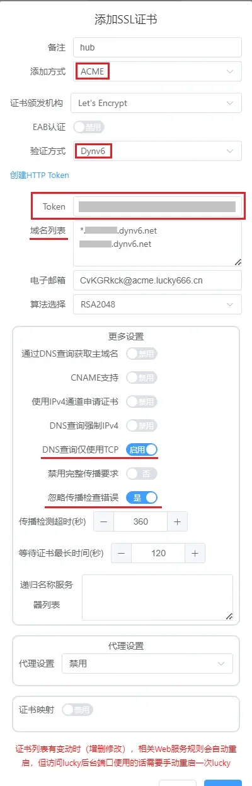
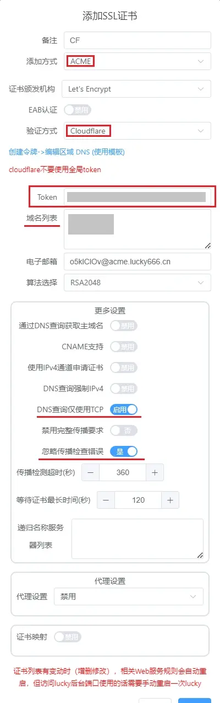
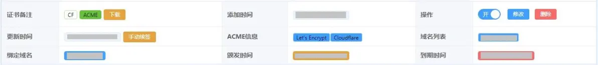
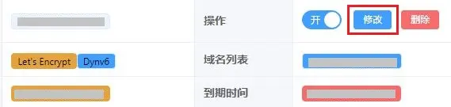
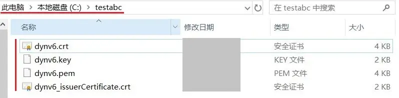

# 在Windows下使用lucky实现TLS/SSL证书自动化

2024.06.06  

## TLS和SSL

TLS 是传输层安全性协议 (Transport Layer Security) 的缩写  
他的前身是 SSL 即安全套接层 （Secure Sockets Layer）  
其目的是保障在互联网通信时数据的完整性和安全性  

**SSL 存在安全缺陷目前已经不再使用** 由升级后的安全性更高的TLS接替  
但由于习惯原因很多地方 **仍然在使用SSL的叫法**  

---

## HTTPS和TLS证书

HTTP（超文本传输协议）其是明文传输的 **在互联网上使用明文传输并不安全**  
而HTTPS（超文本传输协议安全协议） 算是HTTP的升级版本  

它并不是独立的协议 而是在HTTP 协议的基础上使用 TLS/SSL 进行加密  
以提高数据在传输的安全性  

TLS/SSL 证书被用于协商安全连接和验证网站或服务器的身份。  
当客户端访问网站时会验证网站提供的 TLS/SSL 证书以确保连接的安全性  

---


## 证书申请和续签

与过去相比证书的申请过程已经大幅度的简化了 **但仍然需要不少的手动操作**  
比如在域名托管处添加用于验证的TXT记录 以及等待记录更新等  

而且证书是有 **有效期** 的过期后需要进行 **续签** 这时就又需要重复之前的操作  
亦或者使用无图形界面的ACME自动化客户端  
这仍然比较麻烦 但lucky可以方便的自动化的完成这些工作  


**本教程将介绍以下内容**  

1. 为Dynv6下的动态域名申请证书
2. 为Cloudflare的域名申请证书
3. 映射证书以供其他程序使用
4. 常见问题排查

---

## Dynv6

### 获取API Token

此部分在之前的教程已经讲解过此次不再赘述 详见：[链接](./lucky-ddns.md)  


### 编辑规则

打开lucky选择点击左侧的 **安全管理**  


选择SSL证书选项卡 并点击 **添加证书**  


* 备注 任意填写
* 添加方式选择 **ACME**
* 验证方式选择 **dynv6**
* Token 填写上一步中获取的 API token

域名列表 **填写欲保护的（动态）域名**  
比如我这里有一个动态域名 `ie12test.dynv6.net`  
那就可以填写 :  

* `ie12test.dynv6.net`
* `*.ie12test.dynv6.net`

第一行表示包括域名 `ie12test.dynv6.net`  
第二行表示包括以 `.ie12test.dynv6.net` 结尾的域名  

例如:  
```
abc.ie12test.dynv6.net

xyz.ie12test.dynv6.net

2233.ie12test.dynv6.net
```

**但不包括再下一级的域名**  

例如:  
```
863.abc.ie12test.dynv6.net

5687.xyz.ie12test.dynv6.net
```


这样 `ie12test.dynv6.net`和以`.ie12test.dynv6.net 结尾的域名`  
都可以受到证书保护 当然这里可以填写更多的动态域名  
只要在dynv6托管下且在上面填写的token权限范围内就行  

**打开DNS查询只使用TCP 和 忽略传播检查错误**  
**保存规则**  


**示例**  



### 检视效果

耐心等待 申请过程需要花费一些时间  
若看到 **未申请到/申请中** 的字样 变成了时间日期  
同时多出了 绑定域名 颁发时间 和到期时间这三项 **表示申请成功**  


---

## Cloudflare

### 获取API Token

此部分在之前的教程已经讲解过此次不再赘述 详见：链接


### 编辑规则

打开lucky选择点击左侧的 **安全管理**  


选择SSL证书选项卡 并点击 **添加证书**  


* 备注 任意填写
* 添加方式选择 **ACME**
* 验证方式选择 **Cloudflare**
* **Token 填写上一步中获取的 API token**


域名列表 **填写欲保护的域名**  
比如我这里有一个域名 `ie12.net`那就可以填写   

```
ie12.net
*.ie12.net
```

第一行表示包括域名 `ie12.net`   
第二行表示包括以 `.ie12.net` 结尾的域名  

例如  
```
abc.ie12.net
xyz.ie12.net
2233.ie12.net
```

**但不包括再下一级的域名**  

例如  
```
mc.xyz.ie12.net
3610.2233.ie12.net
```

这样 `ie12.net` 和以 `.ie12.net` 结尾的域名 都可以受到证书保护  
当然这里可以填写更多的域名 不过要注意一下token权限  

**打开DNS查询只使用TCP 和 忽略传播检查错误**  
保存规则  


**示例**  



### 检视效果

耐心等待 申请过程需要花费一些时间  
若看到 **未申请到/申请中** 的字样 变成了时间日期  
同时多出了 绑定域名 颁发时间 和到期时间这三项 **表示申请成功**  


**示例**  


---

## 证书映射

成功申请到的证书被 **加密存储在lucky内部** 可被内置的web服务所使用  
当然我们也可以将证书和私钥其映射到指定目录 **以供其他的程序使用**  

转到证书列表 点击 **修改**  




打开证书映射开关 并填写目录   
申请到的证书和私钥将被映射到该目录中  


**检视效果**  

证书和私钥已输出 **请小心保管这些文件**  




---


## 常见故障排查

证书申请过程是全自动的 一般不会出什么问题  
如果申请时间较长且日志仍在刷新 **请继续耐心等待**  
**直到出现成功或失败的最终提示**  


申请失败 **一般是网络问题造成的**  
例如下图中就是连接 dynv6 的 API 超时引起的错误  


可以尝试用浏览器访问一下 dynv6 看是否能打开  
若lucky所在的设备无法使用浏览器则应使用其他方法验证  
可使用同网络下的其他设备访问网页以排查问题  

当然也可能出现下图中的情况  
这是由于TXT记录查询失败引起的  


**请关闭任何形式的代理、加速器等可能影响DNS查询的软件后再次尝试申请**  

