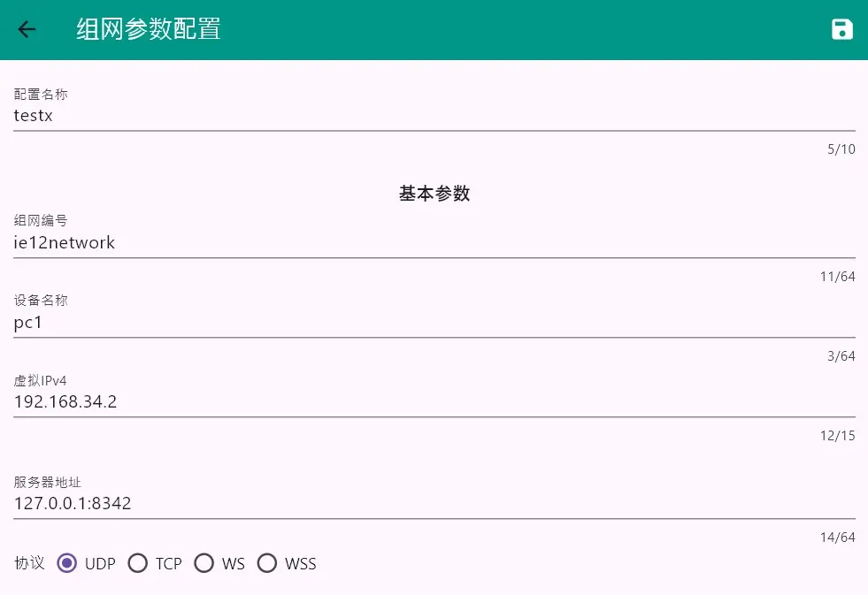
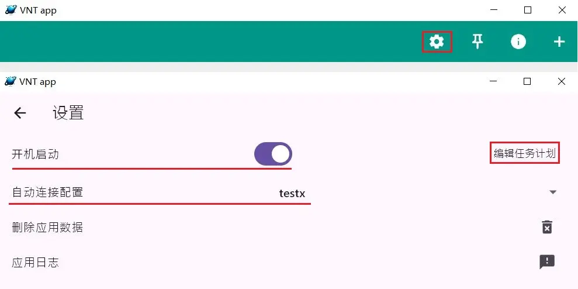
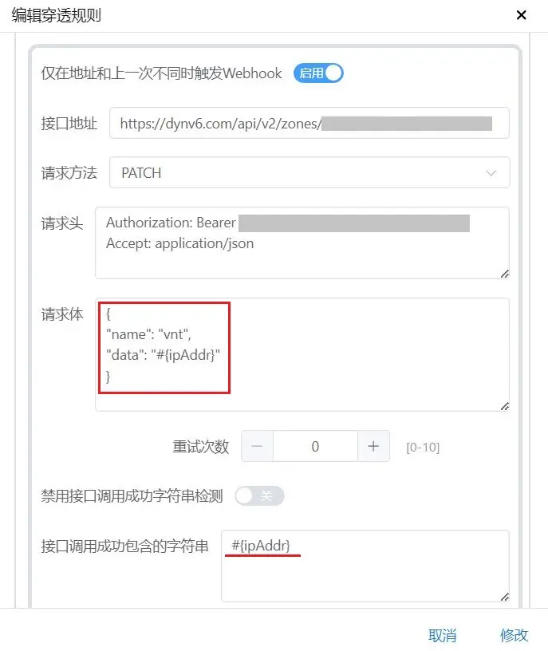
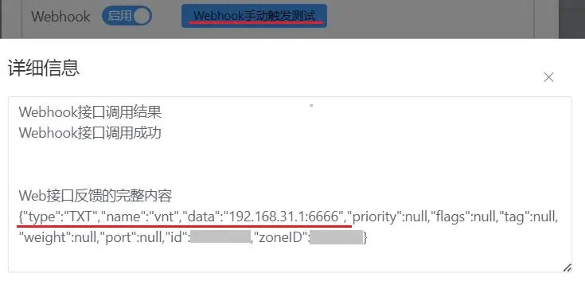
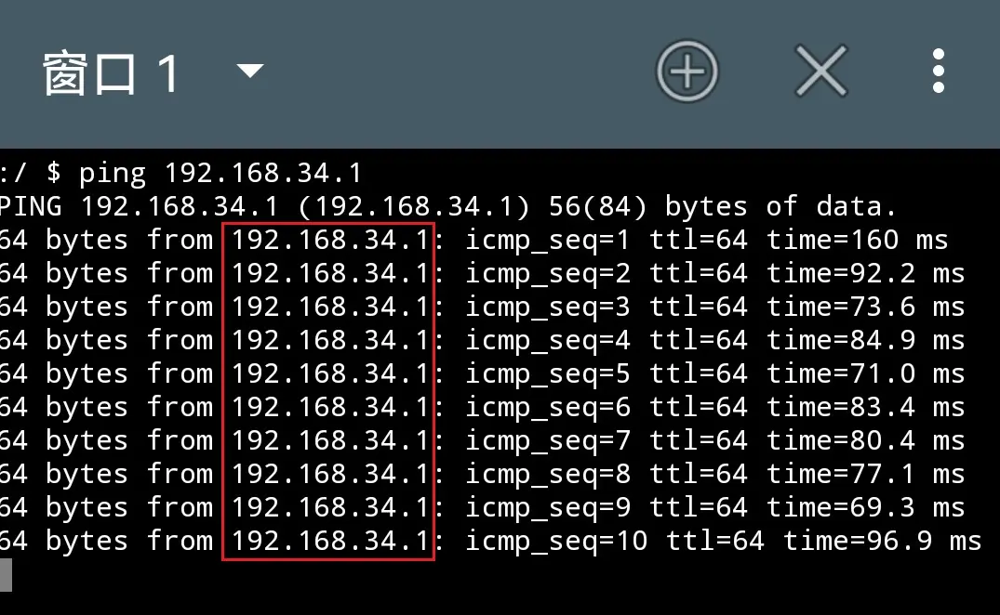

# 「LUCKY STUN穿透」在Windows下使用VNT组网为非HTTP服务固定STUN穿透端口

2024.10.23  

## 索引

<details>

<summary>文章结构</summary>

```
索引
│
├─关于本教程
│
├─已知的解决方法和遇到的问题
│
├─解决问题的思路
│
├─使用VNT组网为非HTTP服务固定STUN穿透端口
│   ├─配置服务端
│   │  ├─下载VNTS
│   │  ├─注册为服务
│   │  └─检视效果
│   ├─配置本地客户端
│   │  ├─下载客户端
│   │  ├─设置基础组网信息
│   │  ├─设置子网代理
│   │  └─其他设置
│   ├─设置STUN穿透规则
│   ├─更新TXT记录
│   ├─配置客户端
│   └─检视最终效果
│      ├─检视连接效果
│      ├─访问虚拟局域网
│      └─访问物理局域网
│
└─结尾
```

</details>


---

## 关于本教程

本教程将讲解使用 VNT 组网软件 **间接的解决**  
STUN穿透无法固定端口的问题  

---

## 已知的解决方法和遇到的问题

在之前的教程中我们已经实现了下列方案  

1. **使用Cloudflare的重定向功能 "固定" http服务的端口**  
    
   不过其只对http服务起效果 且要求客户端支持重定向  
   这对浏览器来说不是问题 其他的专用客户端对此却鲜有支持  
   [教程链接](./stun-web-serve-CF.md)  

2. **使用SRV记录连接Minecraft JAVA 服务器**  
    
   这要求客户端程序支持srv记录 虽然记录本身是标准化的  
   但日常使用中的绝大部分程序都不支持srv记录  
   像Minecraft Java 版这样支持srv记录的程序是极少的 [教程链接](./stun-mc-srv.md)  

3. **使用邮件通知端口变化**  
  
   每当STUN穿透端口发生变化后发送邮件通知端口变化情况  
   用户再根据邮件内容手动修改程序中的端口  
  
   这虽然可以适应于所有的程序 但其完全依靠人工修改端口  
   非常不便 而且若端口变化较为频繁或穿透规则较多  
   会产生大量的通知邮件 [教程链接](./email-notification-port.md)  

4. **使用端口转发**  
  
   在之前的一个废弃方案中尝试过使用lucky的端口转发功能  
   或操作路由设备上的NAT进行端口转发  
  
   使用此方法时客户端程序只需要连接到本地或NAT上的一个固定端口  
   在由NAT或lucky转发到服务端侧STUN穿透的端口  
  
   而传递STUN穿透端口号的任务则交由TXT记录完成  
   每当STUN端口变化后 其会被记录到一条TXT记录中  
   通过周期的查询这个TXT记录即可确定端口是否发生变化 并修改端口转发  
  
   但这些措施需要部署在客户端侧  
   使用lucky端口转发加TXT记录查询脚本的方法  
   可能在效率和稳定性上不是很理想  
  
   而操作NAT也较为困难 若使用软路由或已有的Linux设备则可能较为容易  
   但如果是只有Windows设备和硬路由就不是很方便了  
  
   虽然普通的Windows本身可以进行转发端口 但这仅限于TCP  
   若要转发UDP端口则需要使用winsever 相比之下使用lucky反而可能会更加简单  
   [旧方案链接](../research-logs/废弃方案-使用lucky端口转发固定STUN穿透端口.md)  


---

## 解决问题的思路

难点在于大部分的程序都没有适配端口需要动态更换的情况  
其端口不方便进行更换 毕竟这是一种相对少见的情况  
这也意味着我们不能在软件本身上下手  

更加可行的方法是使用组网 这样需要通信的  
服务端和客户端在同一个局域网中 无需软件本身更换端口  
更换端口的任务转移到了组网软件的身上  

一般的P2P组网软件都使用UDP进行穿透 其可以适应大部分NAT情况  
但使用UDP传输 似乎存在QOS现象 使用TCP虽然会增加延迟 但相对来说更稳定  
但要使用TCP传输则可能需要搭建较为复杂的中继服务器  

由于我们使用的是 **STUN穿透全锥形NAT其和公网效果基本相同**  
只是端口号不固定 但可以接受任意的地址和端口的连接  
**所以我们完全可以将两者组合使用**  

**即先通过STUN穿透获得一个可以用的TCP端口**  
**再使用这个端口进行组网**  

但这样意味着我们需要一个支持SRV或TXT记录的组网软件  
以实现像端口转发方案中那样使用TXT记录传递端口号  
本教程选择的这个组网软件是 **VNT**  


---

## 使用VNT组网为非HTTP服务固定STUN穿透端口

由于我们使用lucky的STUN穿透运营商的 NAT1  
除端口不能固定外 和公网效果几乎相同  
固不需要使用其自带的点对点穿透功能  

且VNT服务端和客户端完全分离 这也意味着  
服务端想要访问虚拟局域网或打通其和物理局域网的连接  
**需要在服务端侧同时部署服务端和客户端**  

**示意图**  


### 配置服务端

服务端的参数不多设置起来相对容易  
不过要注册为win服务的话则要多一些步骤  

#### 下载VNTS

Github 项目地址：[链接](https://github.com/vnt-dev/vnts/releases)

教程中使用的Windows平台  
根据系统位数选择要下载的版本  
64位系统选择x86-64 32位系统选i686  

**示例**  


解压后得到下列文件  
建议重命名一下文件夹 减少嵌套的文件夹层数  
让文件路径变的短一些 这会方便之后的设置  


#### 注册为服务

直接使用命令行运行服务端并不方便  
更好的方法是将其注册为系统服务  
**具体注册方法详见之前的教程** [链接](../virtual-private-network/setup-easytier-server-on-win.md)  

VNTS并不支持从配置文件启动  
不过其可调的参数并不多 并不会非常麻烦  

VNTS 文档：[链接](https://github.com/vnt-dev/vnts#vnts)  
也可通过 `-h` 查看可用命令  

**示例**  


最重要的两个参数是 **监听端口** 和 **网关地址**  

* **监听端口：** 为客户端连接时指定的端口 UDP和TCP同号  

* **网关地址：** 即为 VNTS 在虚拟网络中所使用的地址  
  与子网掩码配合 可确定虚拟网络的范围  
  这里使用`192.168.34.1`  

* **子网掩码：** 无特殊情况不需要进行修改 默认为`255.255.255.0`  
  与上面的网关相配合 得到的虚拟局域网范围为  
  `192.168.34.1-192.168.34.255`  

* **Web UI：** 仅用于查看已经连接的客户端  
  并没有修改参数的功能  

**WinSW配置文件设置参考**  

```
<service>
  <id>vntse</id>
  <name>VNT SERVER</name>
  <description>VNT服务端</description>
  <executable>C:\vnts-x86_64\vnts.exe</executable>
  <onfailure action="restart" delay="2 mins"/>
  <arguments>-p 8342 -g 192.168.34.1 -U ie12 -W 12345678</arguments>
<log mode="roll-by-size">
  <sizeThreshold>4096</sizeThreshold>
  <keepFiles>2</keepFiles>
</log>
</service>
```

值得注意的是vnt有自己的日志文件  
其在控制台上不会显示日志  
所以WinSW输出的日志内容不会很多  


#### 检视效果


### 配置本地客户端

在配置完服务端后 我们还需要配置一个本地客户端  
用于访问虚拟局域网和设备所在的物理局域网   
其一般和服务端部署于同一设备  


#### 下载客户端

VNT Github 项目地址：[链接](https://github.com/vnt-dev/vnt/releases)  


#### 设置基础组网信息

运行 vnt_app.exe 点击右上角的加号 添加组网配置  


* **配置名称：** 此组网配置文件的名称 可任意填写  

* **组网编号：** 用于区分 两设备是否在同一虚拟局域网  
  要组网的设备之间的组网编号必须相同  

* **设备名称：** 设置后可以更方便的确定虚拟局域网中设备  

* **虚拟IPv4：** 设备在虚拟局域网中使用的IP  
  使用的地址必须在服务端 设置的地址范围中  
  留空表示由服务器自动分配 建议 手动指定  
  **注意 服务端已经本身已经占用了一个IP**  

* **服务器地址：** 需要连接的服务器的地址和端口  
  这里填写之前部署好的本地服务器地址和端口  
  由于是在本地传输 协议保持默认的UDP即可  

**示例**  


#### 设置子网代理

填写完上述配置后就可以加入虚拟局域网了  
但还不能还不能访问物理局域网需要设置**子网代理**  
**在服务端侧的客户端设置转发出口**  

本教程中设置的是 “点对网” 式的组网方法 参考说明：[链接](https://rustvnt.com/guide/advanced.html#%E5%9B%9B%E3%80%81%E7%82%B9%E5%AF%B9%E7%BD%91)  
即虚拟局域网中的设备可以通过转发  
访问物理局域网中的 没有加入虚拟局域网的设备  

**ip-out** 即设置允许转出的流量  
这里选择`0.0.0.0`表示允许转出任意目标的流量  

**示例**  


但是若想要让物理局域网中未加入虚拟网络的设备  
主动的访问虚拟局域网中的设备 就需要配置更多的内容了  
详见：[链接](https://rustvnt.com/guide/advanced.html#%E5%85%AB%E3%80%81%E6%B5%81%E9%87%8F%E7%BB%9F%E8%AE%A1)  


#### 其他设置

**关闭打洞功能**  
VNT自带穿透功能 在NAT类型合适的情况下  
可以打通两客户端之间的P2P连接  

但我们用的STUN穿透NAT1持续开启一个端口  
达到一个近似公网的状态 故不需要这个功能  

所以要开启 **强制中继** 以防止节点之间  
不通过STUN穿透后的中继服务器 而是通过打洞直接进行P2P连接  

点击显示更多参数 传输模式勾选**仅中继**  
记得设置完成后 点击右上角的保存按钮保存规则  

**示例**  


**开机自动**  

由于其与VNTS配套使用 故需要设置自启动  
VTN本身集成了自启动选项  

使用计划任务实现 默认设置是需要有用户登录  
才会运行程序 当然也可以手动修改  

**示例**  



### 设置STUN穿透规则

由于是NAT1穿透 我们可以自由选择协议TCP和UDP都可以   
若稳定性优先可以选择TCP  
若对延迟有较高要求则可以尝试一下UDP  

STUN规则的设置方法可以参考之前的教程  
在转发时应尽可能的使用 路由设备上的端口转发功能  
详见：[链接](./stun-web-serve-CF.md)

### 更新TXT记录

当STUN端口穿透端口发生变化时  
我们可以通过webhook更新TXT记录中的端口号  
以方便客户端及时重新解析并重连  

为保证客户端可以及时更新端口  
此TXT记录的TTL时间应该尽可能的短  
更新TXT记录的方法详见之前的教程 [链接](./update-TXT-record-on-cf-and-dynv6.md)  

记录内容格式`IP:port` 示例：`1.2.3.4:8342`  
详见：[链接](https://rustvnt.com/guide/server.html#%E8%BF%9E%E6%8E%A5%E8%87%AA%E5%BB%BA%E6%9C%8D%E5%8A%A1%E5%99%A8)

**示例**  




### 配置客户端

设置完成服务端侧后还要设置客户端  
这里使用的是安卓客户端进行演示  
其设置和上文中服务端侧的客户端设置基本相同  

* **配置名称** 与组网编号和之前设置的相同  
  设备名称根据实际需求填写  

* **虚拟IPv4** 可以留空由服务端自动分配  
  但这里还是手动指定  

* **服务器** 填写之前更新的TXT记录并且在前面加上`txt:`  
  示例：`txt:vnt.ie12test.dynv6.net`  
  协议选择TCP 前面会自动加上TCP协议头  

* **关闭打洞功能**

* **设置路由表**
  `192.168.5.1/24,192.168.34.2`  
  表示将客户端访问 `192.168.5.1/24`网段的的流量  
  转发到`192.168.34.2`  
  
  其中的 `192.168.5.1/24`即为物理局的域网的网段  
  而`192.168.34.2`就是我们之前设置的在服务端侧  
  的客户端的虚拟IP 其为流量的出口  

**示例**  


### 检视最终效果

查看连接和访问效果 由于测试环境的网络情况不太好  
故延迟看起来比较高 实际使用时不会有这样的的有问题  

#### 检视连接效果


#### 访问虚拟局域网



#### 访问物理局域网


---

## 结尾

至此我们便实现了 在Windows下使用VNT组网为非HTTP服务固定STUN穿透端口  
事实上此方法并不局限于VNT这个软件  
其适用于任何支持srv或txt记录亦或是其他便于修改端口号的组网程序  


