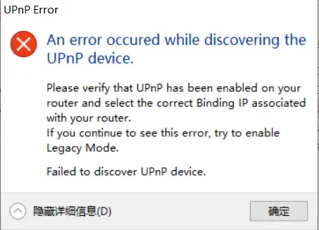
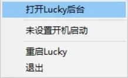
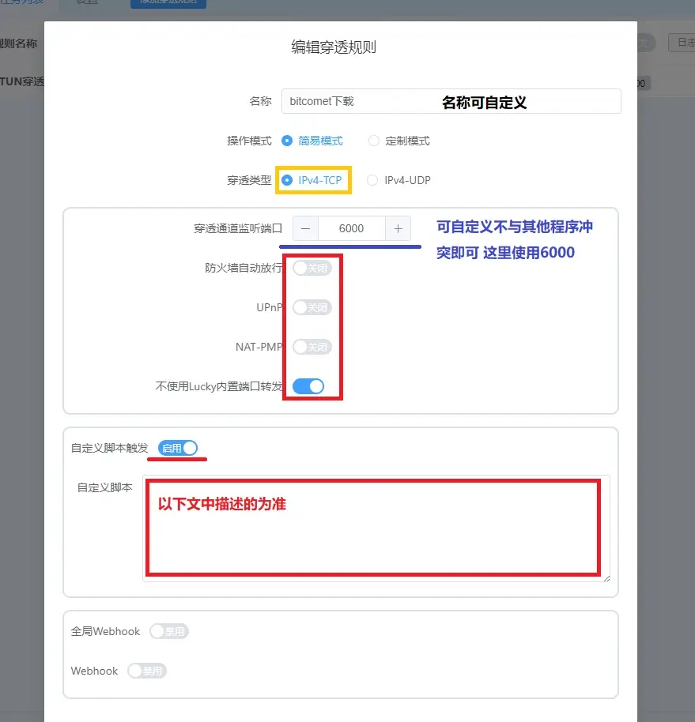
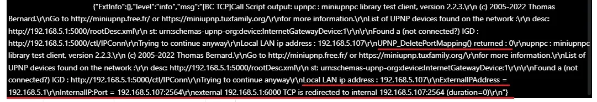
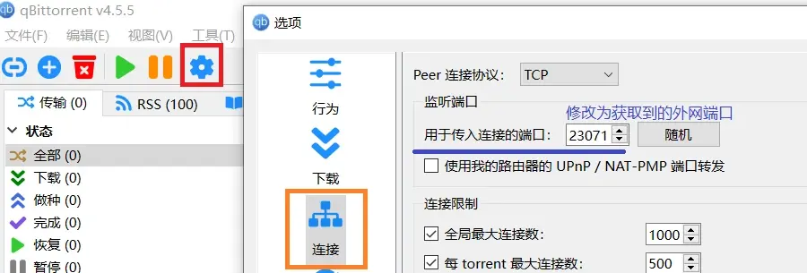
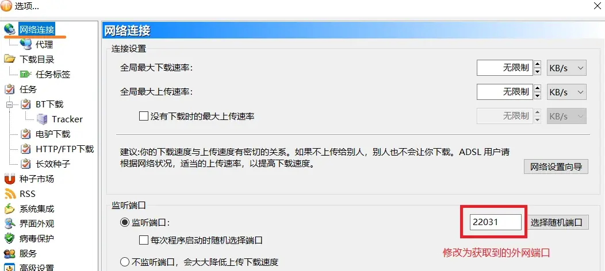
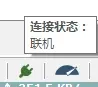

# LUCKY STUN穿透在Windows上使用UPnP工具为BT客户端自动添加内外端口号不同的映射规则

2024.02.07  

## 关于本教程

本教程基于：[基于stun穿透工具LUCKY，使BT客户端绿灯、开放TCP端口的办法（进化版）](https://www.bilibili.com/read/cv21198136/)  
在该教程中实现了使用 路由器/光猫 的端口转发功能处理流量  
其效率更高且可以使BT客户端正确的显示其他连入用户的IP地址  

但是其使用的是静态的端口转发/映射规则在stun穿透端口发生变化后  
**需要手动修改转发规则 无法实现自动化**  

**可以使用 UPnP 来替代 静态的端口转发规则**  
但是lucky内置的 UPnP 功能所添加的规则的内部端口和外部端口是相同的  
而我们所需要的映射是内外端口不同的  

尽管在 v2.5.3 版本中增加了 “自定义 UPnP/NAT-PMP内部端口” 的功能  
**但其内部端口号是静态的无法跟随外网端口变化**  

但好在 v2.5.1版本中 已经增加了 在STUN穿透变化时触发自定义脚本的功能  
这为使用其他程序实现自动添加内外端口号不同的UPnP映射规则提供了极大的便利  

lucky更新日志：[链接](https://www.lucky666.cn/docs/updateresearch-logs/v2.X)  
所以要实现 本教程中的效果 lucky版本要大于等于 2.5.1  

**在设置STUN穿透期间请不要开启任何形式的代理**  
**其极有可能影响到STUN穿透**  

---

## 软件下载

**Lucky**  
作者QQ群：602427029  
GitHub 项目地址：[链接](https://github.com/gdy666/lucky)  
各发布地址：[链接](https://release.66666.host/)  

**还需要下载工具 UPnP Wizard**  
官网地址：[链接](https://www.xldevelopment.net/upnpwiz.php)  
建议使用网盘下载 网盘：[链接](https://wwm.lanzoul.com/iaut01mmbmuj)  
官网下载版本需要安装网盘版解压即可使用  

**MiniUPnP Client**  
这是另一款UPnP工具 UPnP Wizard对一些设备的兼容性可能较差  
如果其无法使用则需要改用此软件具体内容在后面的教程中会讲述  
官方下载：[链接](http://miniupnp.free.fr/files/) 网盘下载：[链接](https://wwm.lanzoul.com/iEosp1mu8dfa)  

---

## 网络环境检测和优化

尽管大部分stun穿透教程**都会强调必须是全锥型NAT才能穿透**  
**但这其实指的是最外面一层的运营商NAT** 而大部分的运营商NAT都是全锥型的  

不过现在的家庭网络环境中几乎都存在多层NAT 而NAT类型测试只能测出其“最差”的一层  
其很可能显示为"端口受限（锥）型NAT" **这其实是由于 路由器/光猫上的NAT造成的**  

不过这并不会影响我们使用stun穿透 可以按照这篇教程进行网络优化  
教程：[网络环境检测和优化](../bitcomet-port-forwarding/BC阻塞_网络结构.md)  

**优化到只剩一层运营商NAT和 和一层光猫/路由器 NAT**  
**共两层NAT 且NAT类型检查结果不为对称型即可进行穿透**  


---

## 设置方法

### BT客户端设置

关闭 BT软件中的UPnP映射功能 **防止其影响自定义规则的添加**  
BC 在 选项>网络连接>端口映射 **取消勾选** “添加UPNP端口映射”  


qb在 选项>连接 取消勾选 “使用我的路由器的UPnP/NAT-PMP端口转发”  


确保路由器/光猫上的UPnP功能已经打开  

### Lucky和 UPnP Wizard  

建议把文件名改短一些 比如将 lucky_2.6.2_Windows_x86_64 改为 lucky_2.6.2  
文件路径过长会对接下来的设置造成麻烦  
同时下载解压 UPnP Wizard 建议与lucky放在一起  


来到 UPnP_Wizard 目录 打开 UPNPWizard.exe 后面没有C  
应该可以看到这样的窗口  


可以看到本地IP地址 UPnP设备名和地址以及一些映射规则  
这些说明光猫/路由器上的 **UPnP功能已经打开**  
若弹出 下面这个窗口说明 路由器/光猫上的 **UPnP功能没有开启**  



**UPnP_Wizard对一些设备的兼容性较差** 如果打开路由器/光猫上的 UPnP 功能后  
依然会看到此错误提示请尝试换用 MiniUPnP Client 其配置方法在后面会讲  

---

### 杀毒软件误报

lucky触发自定义脚本的行为可能会被一些杀毒软件误判（主要是Windows defender）  
**建议提前将lucky加为信任或者排除**  


### LUCKY上的设置

双击运行 lucky.exe任务栏会出现一个图标  


右键这个图标 弹出菜单 选择打开 lucky 后台  
**这里也可以设置 开机启动**  


弹出浏览器 显示lucky 登录界面  
使用默认的账户和密码登录 均为 666  


点开左侧的**STUN内网穿透**  


**点击 添加穿透规**则 并参照图中的方式填写  


自定义脚本内容如下 **部分参数按照实际情况修改**  

```
实际目录\UPnPWizardC.exe -remove -extport 穿透通道监听端口 -protocol 穿透类型 -legacy
实际目录\sleep1s.vbs
实际目录\UPnPWizardC.exe -add "rule name" -ip default -intport ${port} -extport 穿透通道监听端口 -protocol 穿透类型 -lease 0
```

使用的是UPnPWizardC.exe **后面有个C**  
实际目录为UPnPWizardC.exe和sleep1s.vbs的实际存放的目录  
rule name 换成你喜欢的名字 但不要使用中文 "" 要保留（英文状态下的双引号）  

**创建 sleep1s.vbs 脚本**
新建文本文档并写入下列内容 其表示等待1000毫秒即一秒  
写好后命名为sleep1s 扩展名改为.vbs  
原先使用的是timeout命令但是效果不佳故改用vbs脚本  

```
WScript.sleep 1000
```

如果目录中有空格的话要用 英文引号 "" 引起来 不然无法运行  
**目录中不能有中文不然会报错**  
`C:\abc\d e f\ （错误）`
`C:\abc\"d e f"\ （正确）`

* 第一条命令用于移除之前的映射规则
* 第二条命令表示延迟1秒
* 第三条命令用于添加映射规则（各参数详见UPnPWizard的帮助文件）

在大部分情况下其实可以直接添加新规则无需移除旧的映射规则  
新的映射规则会直接覆盖旧的映射规则  

但是一些路由器/光猫上的UPnP功能可能不能正确处理覆盖操作  
所以先移除旧规则再添加新规则会更加保险  

**示例**  

为比特彗星设置 stun 端口映射  

* 穿透类型：IPv4-TCP
* 穿透通道监听端口：6000
* UPnP规则名称：BC-TCP
* UPnP_Wizard 程序路径：C:\UPnP_Wizard\

```
C:\UPnP_Wizard\UPnPWizardC.exe -remove -extport 6000 -protocol TCP -legacy
C:\sleep1s.vbs
C:\UPnP_Wizard\UPnPWizardC.exe -add "BC-TCP" -ip default -intport ${port} -extport 6000 -protocol TCP -lease 0
```

**(这里的图是旧的 还在使用timeout命令)**  


## 使用 MiniUPnP Client 的配置方法

### 检查 UPnP是否启

解压文件 运行其中的 UPnP查询.bat 查看输出内容  
或者使用 `upnpc-static.exe -i -l` 也是一样的  

**应该可以显示出"List of UPNP devices found on the network "**  
或者UPNP映射规则列表即可 规则数量可能会有所不同 说明UPNP已经启用  
使用 MiniUPnP 应该不太会遇到兼容问题  


如果仍然显示 “No IGD UPnP Device found on the network !”  
**请再次检查 光猫/路由器上的UPnP功能是否开启**  


### 编辑命令

```
实际目录\MiniUPnP_Client\upnpc-static.exe -i -d 穿透通道监听端口 穿透类型
实际目录\sleep1s.vbs
实际目录\MiniUPnP_Client\upnpc-static.exe -i -e "rule name" -a @ ${port} 穿透通道监听端口 穿透类型
```
**注意事项和其他信息和之前配置UPnPWizardC.exe时一样**  

**示例**  

```
C:\MiniUPnP_Client\upnpc-static.exe -i -d 6000 TCP
C:\sleep1s.vbs
C:\MiniUPnP_Client\upnpc-static.exe -i -e "BC-TCP" -a @ ${port} 6000 TCP
```


### 检查配置效果

填写完成后保存一下 打开穿透开关  
**查看是否能成功获取到外网地址和端口**  
同时 打开 UPNPWizard.exe 或 upnpc-static.exe  
刷新一下 看看映射规则是否已经添加 刷新按钮在左上角  


**如果无法获取到外网端口**  
请按照 上文链接中的教程继续优化网络环境  
**如果端口获取成功但 UPnP添加失败** 请查看穿透规则日志（在开关后面）  


---


## 脚本运行错误原因排查

### 使用UPnPWizardC.exe

首次添加时用于删除旧端口的命令会报错 这是正常的  
主要看 下一行显示是否添加成功  


添加成功过一次后 下一次移除端口的命令就可以正常工作了  


### 使用MiniUPnP

MiniUPnP输出日志和UPnP_Wizard不太一样  
删除端口时会返回 `UPNP_DeletePortMapping() returned : 0`
规则创建成功后会返回规则的详细信息  



如果有 返回类似 `Call Script error: exit status 1` 这样的错误  
建议检查一下填写UPnPWizardC.exe或MiniUPnP的路径是否正确  
复制命令手动在命令提示符窗口中执行看看能不能成功  


---

## 修改BT软件监听端口

在成功获取外网端口和地址获取以及正确添加UPnP规则后  
**就可以设置BT软件中的监听端口为获取到的外网端口**




### 检查最终效果

BC在设置新端口后会自动从新检测端口 如果设置都
**重新检测完成后就能获得绿灯**  


qb没有主动端口检测功能  
只有在被动接受外部发起的连接后 状态栏才会显示 联机  
我们可以使用在线的端口扫描工具 链接：[链接](https://zh.infobyip.com/tcpportchecker.php)  

输入 **穿透获取到的IP和端口** 点击检查  
显示 **成功** 连接到XXX表明穿透成功 同时qb的状态栏中会显示 **联机**  

高版本显示为地球  


低版本则是插头  


至此我们就成功的实现了 自动添加内外端口号不同的映射规则  
**之后每当stun穿透发生变化后 都会自动更新UPnP映射规则**  
不过我们还需要手动修改BT软件的监听端口  


