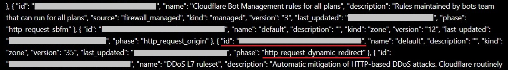
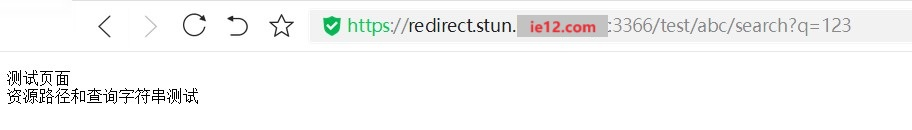

# 「扩展篇」使用Cloudflare的重定向规则传递资源路径和查询字符串

2024.08.29  

## 索引

<details>

<summary>文章结构</summary>

```
索引
│
├─关于本教程
│
├─设置DNS记录及其解析
│
├─创建重定向规则
│
├─更新重定向规则
│ ├─创建访问令牌
│ ├─获取区域ID
│ ├─获取规则集ID
│ ├─获取重定向规则ID
│ └─测试更新
│
├─在STUN穿透中更新规则
│
└─最终效果验证环节
```

</details>


---

## 关于本教程

在之前的教程中我们已经实现了使用Cloudflare的页面规则固定和隐藏  
STUN穿透后的网页端口 [链接](../../articles/lucky-STUN/stun-web服务-CF.md)  

不过之前教程中的方法只能处理域名而无法处理资源路径和查询字符串  
即重定向前链接中的资源路径和查询字符串不能继承到重定向后的链接中  

这个问题并非不能解决 但想使用页面规则来解决 就有些困难  
更好的方法是使用 **重定向规则**  

相比起页面规则 重定向规则的设置和更新方法会更加复杂  
但好处也是显而易见的 其拥有更多的规则容量和重定向方式  
可以处理资源路径和查询字符串  

当然如果没有传递资源路径和查询字符串的需求  
还是使用之前教程中的页面规则会更加简单方便  

**建议在阅读本教程之前先阅读之前的教程**  

---

## 设置DNS记录及其解析

在设置DNS记录和解析方面和之前教程中的差不多  
依然需要设置两组域名（子） 即重定向前的域名和重定向后的域名  
[链接](../../articles/lucky-STUN/stun-web服务-CF.md)  


---

## 创建重定向规则

登录CF 》 点击侧边栏中的网站 》 选择你的域名 》 点击侧边栏中的规则 》  
重定向规则 》 创建规则  

规则名称任意填写 这里使用 `stun-redirect`  
传入请求匹配 选择 **自定义筛选表达式**  

以 `ie12.com`为例 使用时以实际域名加以替换  
其中6666端口代表STUN穿透后的端口 之后会使用API进行更新  

**传入请求匹配：**  

* 字段：主机名  
* 运算符：wildcard （通配符）  
* 值：`*.ie12.com`

如果希望某些二级域名不被该规则匹配  可以继续添加条件  
按下后面的 `And` 再添加一个条件 关系为 **与**  

字段依然选择主机名 运算符改为 **不包含**  
值则填写不需要重定向的子域名 比如 `blog.ie12.com`

这样一来 输入请求的主机名以 `.ie12.com`结尾且不包括  
`blog.ie12.com` 的请求会匹配上这一条重定向规则  

**URL重定向：**  

* 类型：动态  
* 表达式：  
```
wildcard_replace(http.request.full_uri, "*://*.ie12.com/*", "https://${2}.stun.ie12.com:6666/${3}")
```
* 状态代码选择302  
* 勾选保留查询字符串  
* 保存规则  

**示例**  


**表达式含义**  
这个表达式看起来比较复杂但是含义并不复杂   
其将传入链接中的内容截取后拼接到新的链接中  

`wildcard_replace` 表示将输入的内容以一定的规则进行截取  
并组合输出新的内容  
`http.request.full_uri` 表示传入的完整的URL  

`"*://*.ie12.com/*"`就是一个匹配规则  
对传入的链接进行匹配  `*`的部分会被截取到变量中以供之后使用  

而后面的 `"https://${2}.stun.ie12.com:6666/${3}"`  
表示合成输出的内容 变量`${2}` `${3}` 为刚才存储截取部分的变量  

**图示**  


---

## 更新重定向规则

相比起更新页面规则 更新重定向规则要复杂一些  

### 创建访问令牌 

---
**2024-09-21**

CF对重定向的命名方式发生了改变  
原先的**动态重定向**已经改为**单一重定向**  


与此同时设置界面的描述也发生了变化 不过在设置方法上并没有变化  


---

与更新页面规则时不同 要获取并更新重定向规则需要两组权限  
创建令牌的前序过程和之前教程中的基本相同  
请参考之前教程中的设置 [链接](../../articles/lucky-STUN/stun-web服务-CF.md)  

需要的权限如下：  

* 账户 》账户规则集 》编辑
* 区域 》动态重定向 》编辑

**示例**  


### 获取区域ID

在侧边栏的**概况**里面有显示  
有了令牌和区域ID之后就可以开始获取规则集ID了  

**示例**  


### 获取规则集ID

与之前的教程中的相似 依然使用lucky计划任务中的  
callweb功能进行获取  

* 接口地址：  
`https://api.cloudflare.com/client/v4/zones/你的区域ID/rulesets`

* 请求方法 GET

* 请求头：
```
Authorization: Bearer 你的令牌
Content-Type: application/json
```

* 开启 禁用接口调用成功字符串检测 
* 保存规则


**示例**  


按下手动触发并查看日志中的返回结果  
其中的 `"http_request_dynamic_redirect"` 即为重定向规则集  
值得注意的是其ID是位于名字前面的 别看错了  


**示例**  



### 获取重定向规则ID

在获取了规则集中ID后就可以开始获取  
重定向规则集中的**规则ID**了  

* 接口地址：  
`https://api.cloudflare.com/client/v4/zones/你的区域ID/rulesets/重定向规则集ID`  

* 请求方法：GET
* 请求头：不变

**示例**  


按下手动触发并查看日志中的返回结果  
图中划线的ID即为重定向规则ID  

**示例**  


### 测试更新

在获取完上述的信息之后就可以开始更新重定向规则了  

* 请求接口：  
`https://api.cloudflare.com/client/v4/zones/你的区域ID/rulesets/重定向规则集ID/rules/重定向规则ID`  

* 请求方式：PATCH
* 请求头：不变

* 请求主体：
```
{
  "description": "stun-redirect",
  "expression": "(http.host wildcard \"*.ie12.com\" and not http.host contains \"blog.ie12.com\")",
  "action": "redirect",
  "action_parameters": {
    "from_value": {
      "status_code": 302,
      "target_url": {
        "expression": "wildcard_replace(http.request.full_uri, \"*://*.ie12.com/*\", \"https://${2}.stun.ie12.com:6666/${3}\")"
      },
      "preserve_query_string": true
    }
  }
}
```

上面的 `expression` 为匹配传入链接的表达式  

而下面的 `action_parameters` 里的 `expression`则是  
用于构建重定向后的链接的表达式  
其可以直接从上一步获取重定向规则ID时返回的内容中复制出来  

尽管其请求方法为PATCH 文档中也没有明确必填参数 应该只需要提交要修改的部分就行  
但是实际测试下来 发现还是要填写完整的信息  
不然会出现显示成功但实际上没有更新成功或部分项目被替换成某种默认值  


**图示**  


按下手动触发并查看日志中的返回结果  
若设置正确即可看到返回的重定向规则信息中目标URL的  
地址和端口号已经发生变化  

**示例**  


---

## 在STUN穿透中更新规则

与在计划任务中时基本相同  
当然最重要的就将测试时使用的固定端口改为STUN规则里的变量  

可以使用webhook手动触发测试进行验证  
其会使用6666作为测试时的端口号  

**示例**  
`"expression": "wildcard_replace(http.request.full_uri, \"*://*.ie12.com/*\", \"https://${2}.stun.ie12.com:#{port}/${3}\")"}`

**关闭** 禁用成功字符检测  
填写 `"success":true`  用于判断请求是否成功  

---

## 最终效果验证环节 

在浏览器中输入 `redirect.ie12.com/test/abc/search?q=123`  
应会跳转到 `redirect.stun.ie12.com:STUN穿透端口/test/abc/search?q=123`  
(lucky反向代理服务的前端地址 似乎不会匹配查询字符串)


**示例**  



---

参考：

* [Cloudflare API Documentation](https://developers.cloudflare.com/api/operations/listZoneRulesets)
* [Functions reference](https://developers.cloudflare.com/ruleset-engine/rules-language/functions/#wildcard_replace)
* [cloudflare 301重定向规则设置-Wood Chen](https://woodchen.ink/archives/cloudflare-301-redirectional-settings-2eod9f)


