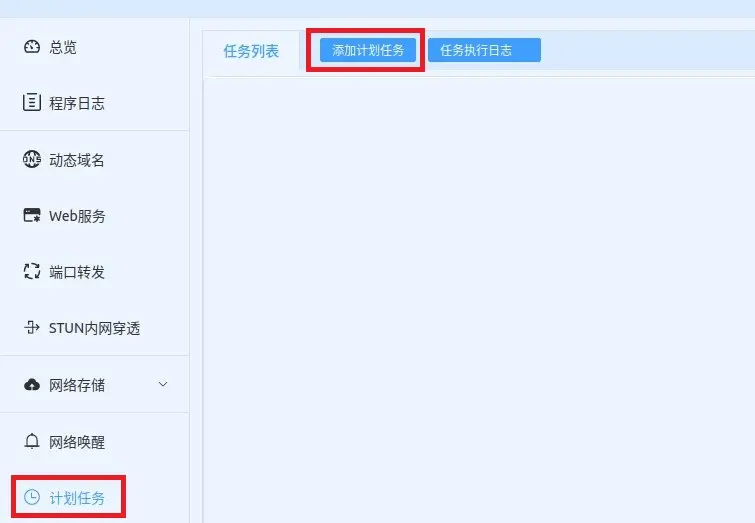
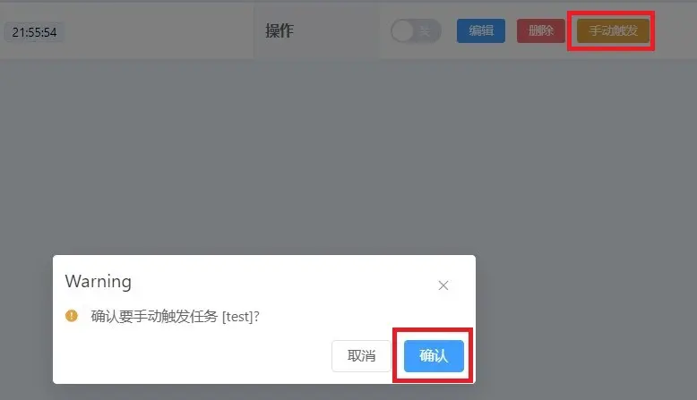
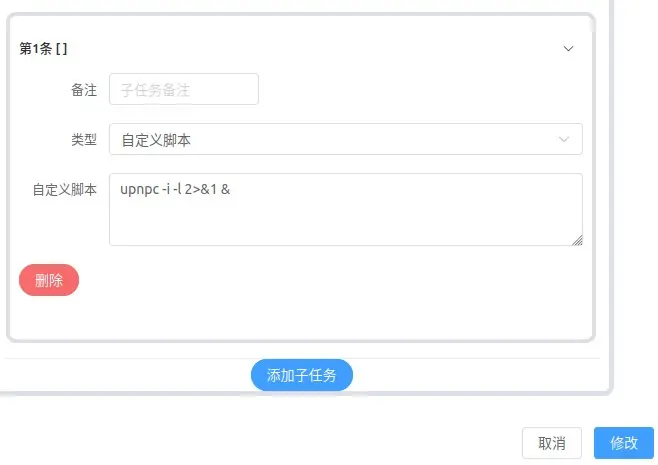
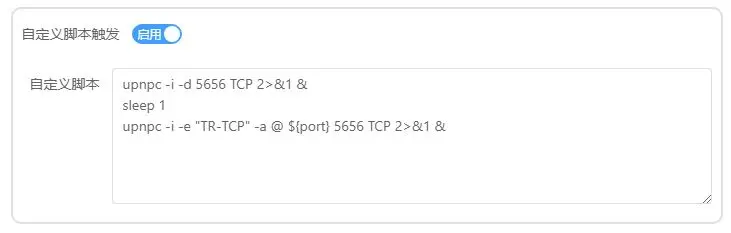
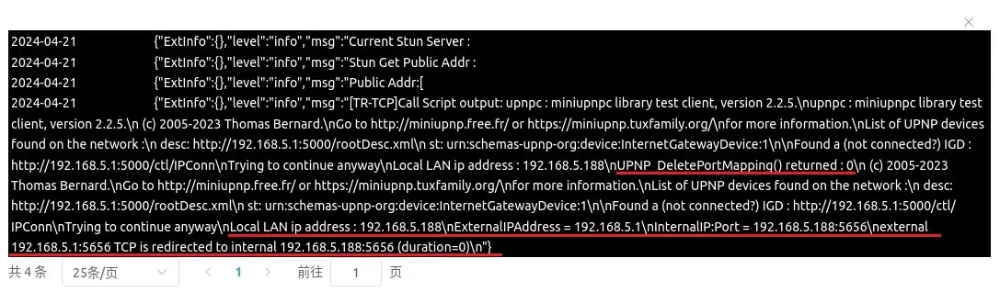

# 「LUCKY STUN穿透」在Docker中使用MiniUPnP为BT客户端自动添加内外端口不同的映射规则

2024.04.23  

## 关于本教程

在之前的教程中我们已经实现在Windows上使用UPnP工具为BT客户端添加端口  
[LUCKY STUN穿透在Windows上使用UPnP工具为BT客户端自动添加内外端口号不同的映射规则](./stun-bc-port-automation.md)  

考虑到很多lucky运行在Docker容器中（Linux）  
本教程中将介绍当lucky运行在docker容器中时通过MiniUPnP来添加映射规则的方法  
**建议先阅读之前在Windows上进行配置的教程后再阅读本教程**  

本文中的方法不仅适用于在docker容器中安装也适用于直接在Linux上安装的情况  
不过在其他Linux系统下安装MiniUPnP时请自行判断其使用的包管理器类型  
感谢[泥浆](https://space.bilibili.com/14913)提供的命令支持  

---

## 网络环境检测和优化

**为保证stun穿透的成功 请先探测和优化网络结构**  
建议先阅读之前的教程 或直接阅读此教程  
比特彗星-端口阻塞解决方案-2.3网络环境检测和优化  


### 其他要求

**lucky所在的Docker容器网络为host**  

---

## 配置方法

### 安装lucky

官方教程：[链接](https://lucky666.cn/docs/install#docker%E9%95%9C%E5%83%8F)

为容器安装MiniUPnP时我们可以进入到终端环境中进行安装  
但更简单的方法是使用lucky计划任务中的 **自定义脚本功能**  


### 创建计划任务

**子规则选择自定义脚本** 其他选项任意设置 不填写脚本内容先保存  




关闭规则开关 我们只使用 **手动触发**  


### 修改下载源

将软件包下载源修改为 **清华大学开源软件镜像站**  
以防止因为网络问题造成安装失败  
填写命令并保存

```
sed -i 's/dl-cdn.alpinelinux.org/mirrors.tuna.tsinghua.edu.cn/g' /etc/apk/repositories
```


按下手动触发按钮并查看日志 **此步的输出内容应为空白**  




### 安装MiniUPnP

重新填写以下命令后 手动触发运行  
```
apk add miniupnpc 2>&1 &
```


检查日志输出 有显示OK表示安装成功  


### 检查UPnP设置

填入以下命令 手动触发任务 观察输出结果  
```
upnpc -i -l 2>&1 &
```



如果有很多输出内容且其中包括 **“Status : Connected”**  
说明路由器/光猫上的UPnP功能 **已经正确打开**  


如果显示 **"No IGD UPnP Device found on the network"**  
则路由器/光猫上的UPnP功能尚未打开 **请检查其设置以及Docker容器的网络模式**  


### 设置STUN穿透规则

填写下列命令 其中的参数按照实际情况填写  
```
upnpc -i -d 穿透通道监听端口 穿透类型 2>&1 &
sleep 1
upnpc -i -e "rule name" -a @ ${port} 穿透通道监听端口 穿透类型 2>&1 &
```

示例  
```
upnpc -i -d 5656 TCP 2>&1 &
sleep 1
upnpc -i -e "TR-TCP" -a @ ${port} 5656 TCP 2>&1 &
```
如果在自定义脚本区域已经有命令则  
应按照流程顺序进行排列并使用sleep命令设置间隔  
  
**注意！如果lucky和BT客户端不在同一IP上则**
**需要将此处的@换成BT客户端所使用的IP地址**

**一般路由器设备上的UPnP网关都会开启安全模式**  
即A设备（IP）上的程序只能添加目标为A设备（IP）的映射规则  
不允许A设备（IP）上的程序添加指向B设备（IP）的映射规则

**大部分硬路由无法调整 故建议lucky和BT客户端设置在同一IP上则**  
openwrt可以 通过关闭UPnP的安全模式来解决出问题  




### 开启穿透规则并检查日志输出

应该会有显示 `UPNP_DeletePortMapping() returned : 0` 表示成功删除旧规则  
以及规则创建成功后返回的规则详细信息（由于是演示所以这里的端口号是内外相同的）  

**示例**  




**检视添加效果**  

若路由器/光猫支持查看UPnP映射规 则可以通过其网页直接查看  
若不支持查看则可通过在计划任务中再次运行下列命令查看添加效果  

`upnpc -i -l 2>&1 &`  
应该可以看到刚刚添加的规则  


至此我们就实现了在Docker中使用MiniUPnP为BT客户端自动添加内外端口不同的映射规则  

