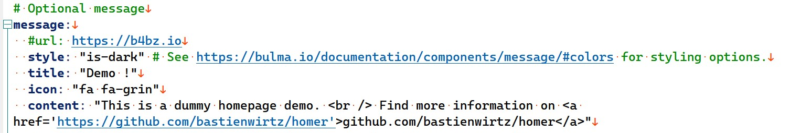
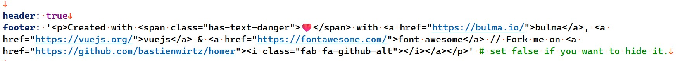
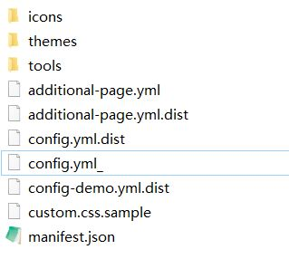
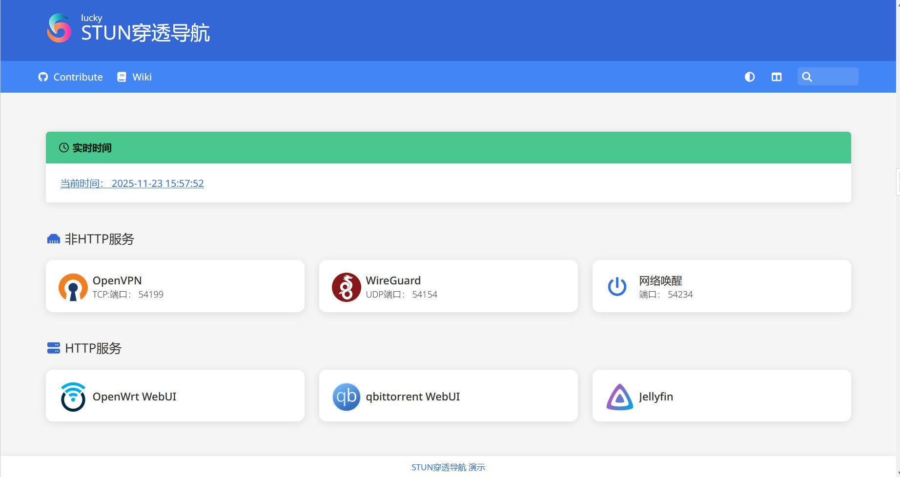

# 使用homer导航页指示stun穿透后的端口 WIP

2025.11.  

## 关于本教程

在之前的一系列教程中我们介绍了许多“固定”stun穿透端口的方法  

主要用于 MC java 版联机的 **SRV 记录**  
* [[LUCKY]在Windows下使用STUN穿透实现Minecraft联机并设置SRV记录](./stun-mc-srv.md)

适用于大部分HTTP(S)服务的**重定向方案**  
* [「LUCKY STUN穿透」使用Cloudflare的页面规则固定和隐藏网页端口](./stun-web-serve-CF.md)
* [「扩展篇」使用Cloudflare的重定向规则传递资源路径和查询字符串](./stun-cf-redirection.md)

几乎使用于一切服务的 **VPN组网方案**  
* [「LUCKY STUN穿透」在Windows下使用VNT组网为非HTTP服务固定STUN穿透端口](./stun-VNT-networkin.md)
* [「EasyTier」使用SRV TXT HTTP重定向获取对端IP端口](../virtual-private-network/easytier-get-port-form-dns-record.md)

以及邮件端口通知方案  
* [「LUCKY STUN穿透」使用邮件通知端口变化情况](./email-notification-port.md)

但是有些服务 **不支持 srv记录 不使用http协议**  
也不方便安装VPN客户端  

而使用邮件通知的方案在长期运行和端口变化较为频繁的情况下  
**会积累大量的通知邮件 查看起来并不方便**  

我们需要一个更好的方案来实时的查看穿透端口  
**这里将使用动态的网页来实时的显示穿透服务的端口**  

---

## 目标效果和原理

导航页面应是一个纯前端页面 **使用纯文本配置文件来控制显示条目内容**  
此处使用 [homer](https://github.com/bastienwirtz/homer) 作为导航页  
可以换用 其他类型的导航页面 纯前端页面对部署环境的要求低 适应性强  

之所以强调用纯文本配置文件来控制显示条目内容  
是因为要使用lucky web 服务中的 **文本输出功能** 替代磁盘上的配置文件  
将配置文件的内容写入到 文本输出功能中 以便在其中引用stun穿透端口号变量  

以实现实时显示最新STUN穿透端口号的目的  
**此外建议带上time变量 用于显示实时的时间**  
以防止页面或者配置文件被缓存  

### 非HTTP服务

在连接服务前通过查看导航页以获取最新的穿透端口号  
手动输入此端口号 连接服务  

### HTTP服务

对于HTTP服务来说也能提供方便  
无需要记忆每个服务所对应的子域名  

**直接点击导航页上的链接就可以实现跳转**  
导航页只适用于浏览性的HTTP服务 webdev之类的非浏览性服务是不行的  
当然配置反向代理和泛域名解析依然是需要的  


### 极简方案

在牺牲美观性和一定的实用性的前提下 可以极大的简化配置方法  
直接使用lucky的文本输出功能显示内容 **即以纯文本的形式输出服务名称和端口号**  


---

## 下载和挂载Homer

homer项目地址：[链接](https://github.com/bastienwirtz/homer)  
下载项目压缩包：[链接](https://github.com/bastienwirtz/homer/releases/)  并解压  

在lucky web 服务中添加**新的子规则**  
有关lucky web规则设置的具体方法详见之前的教程：[链接](./lucky-web.md)  


类型选择 **文件服务**  
挂载目录选择解压后 homer 所在的文件夹  


前端域名可以先填写一个简短的不存在的域名 用作测试  
在host文件将其指向 `127.0.0.1` 这里使用 `homer.lan`  
不建议使用 `.local` 其有特殊用途  


访问页面应该可以看到以下内容  


转到 homer 目录下的 assets 文件夹  
找到 config.yml.dist 文件 复制一份 去掉名称中的 `.dist`  

在是一个预设的配置文件 我们将在这个配置文件的基础上进行修改  
（其实那个 config-demo.yml.dist 也可以 不过那个预设文件更复杂 此处我们用不到）


完成上述操作后 回到浏览器刷新页面应该可以看到 这些预设内容  


## 配置 homer

我们将在这个预设配置文件的基础上进行修改  
以使其适应我们的需要  
此处对这个默认配置文件进行了简单的翻译

<details>

<summary>配置文件翻译</summary>


```
---
# 主页配置
# 查看 https://fontawesome.com/search 获取图标选项

# 可选：使用外部配置文件
# 使用此选项将忽略此文件中的其余配置
# externalConfig: https://example.com/server-luci/config.yaml

title: "App dashboard"
subtitle: "Homer"
# documentTitle: "欢迎" # 自定义浏览器标签页文本
logo: "assets/logo.png"
# 也可以使用 Font Awesome 图标：
# icon: "fas fa-skull-crossbones"

header: true # 设置为 false 可隐藏顶部标题栏
# 可选：为搜索功能设置不同的热键，默认为 "/"
# hotkey:
#   search: "Shift"
footer: '<p>Created with <span class="has-text-danger">❤️</span> with <a href="https://bulma.io/">bulma</a>, <a href="https://vuejs.org/">vuejs</a> & <a href="https://fontawesome.com/">font awesome</a> // Fork me on <a href="https://github.com/bastienwirtz/homer"><i class="fab fa-github-alt"></i></a></p>' # 设置为 false 可隐藏页脚

columns: "3" # "auto" 或数字（必须是12的因数：1、2、3、4、6、12）
connectivityCheck: true # 是否在应用无法访问时显示消息（例如VPN断开连接）。
                        # 当使用身份验证代理时，应将其设置为true，它还会在检查连接性时检测到重定向时重新加载页面。

# 可选：代理/托管选项
proxy:
  useCredentials: false # 获取服务特定数据时发送cookies和授权头。如果使用身份验证代理，请设置为`true`。可在服务级别覆盖。
  headers: # 获取服务特定数据时发送自定义头。也可以在服务级别设置。
    Test: "Example"
    Test1: "Example1"

# 设置默认布局和配色方案
defaults:
  layout: columns # 可选 'columns' 或 'list'
  colorTheme: auto # 可选 'auto', 'light', 或 'dark'

# 可选主题
theme: default # 'default' 或 'src/assets/themes' 中可用的主题之一。

# 可选自定义样式表
# 将加载自定义CSS文件。对于自定义图标集特别有用。
# stylesheet:
#   - "assets/custom.css"

# 以下是详尽的自定义参数列表
# 但是所有值都是可选的，如果未设置将回退到默认值。
# 如果您只想更改部分颜色，请随意删除所有未使用的键。
colors:
  light:
    highlight-primary: "#3367d6"
    highlight-secondary: "#4285f4"
    highlight-hover: "#5a95f5"
    background: "#f5f5f5"
    card-background: "#ffffff"
    text: "#363636"
    text-header: "#424242"
    text-title: "#303030"
    text-subtitle: "#424242"
    card-shadow: rgba(0, 0, 0, 0.1)
    link: "#3273dc"
    link-hover: "#363636"
    background-image: "/assets/your/light/bg.png" # 如果有子路径请添加前缀（例如：/homer/assets/...）
  dark:
    highlight-primary: "#3367d6"
    highlight-secondary: "#4285f4"
    highlight-hover: "#5a95f5"
    background: "#131313"
    card-background: "#2b2b2b"
    text: "#eaeaea"
    text-header: "#ffffff"
    text-title: "#fafafa"
    text-subtitle: "#f5f5f5"
    card-shadow: rgba(0, 0, 0, 0.4)
    link: "#3273dc"
    link-hover: "#ffdd57"
    background-image: "/assets/your/dark/bg.png" # 如果有子路径请添加前缀（例如：/homer/assets/...）

# 可选消息
message:
  # url: "https://<my-api-endpoint>" # 可以从端点获取信息以覆盖下面的值。
  # mapping: # 允许将字段从远程格式映射到Homer期望的格式
  #   title: 'id' # 使用字段'id'的值作为标题
  #   content: 'value' # 使用字段'value'的值作为内容
  # refreshInterval: 10000 # 可选：刷新消息的时间间隔
  #
  # 使用 chucknorris.io 显示 Chuck Norris 事实作为消息的实际示例：
  # url: https://api.chucknorris.io/jokes/random
  # mapping:
  #   title: 'id'
  #   content: 'value'
  # refreshInterval: 10000
  style: "is-warning"
  title: "可选消息！"
  icon: "fa fa-exclamation-triangle"
  # 内容也接受HTML内容，因此您可以添加div、图像或任何您需要的内容。
  content: "Lorem ipsum dolor sit amet, consectetur adipiscing elit."

# 可选导航栏
# links: [] # 允许没有链接的导航栏（暗模式、布局和搜索）
links:
  - name: "链接 1"
    icon: "fab fa-github"
    url: "https://github.com/bastienwirtz/homer"
    target: "_blank" # 可选的html标签target属性
  - name: "链接 2"
    icon: "fas fa-book"
    url: "https://github.com/bastienwirtz/homer"
  # 这将链接到第二个homer页面，该页面将从page2.yml加载配置，并保留config.yml文件中的默认配置值
  # 查看此示例中使用的url字段和assets/page.yml：
  - name: "第二页"
    icon: "fas fa-file-alt"
    url: "#page2"

# 服务
# 第一级数组代表一个分组。
# 如果不使用分组，则仅保留"items"键（分组名称、图标和标签样式是可选的，将不显示分组分隔）。
services:
  - name: "应用"
    icon: "fas fa-code-branch"
    # 也可以提供图像路径。注意，如果同时设置了图标和徽标，则图标优先。
    # logo: "path/to/logo"
    # class: "highlight-purple" # 可选的在服务分组上添加的CSS类。
    items:
      - name: "Awesome app"
        logo: "assets/tools/sample.png"
        # 也可以使用 Font Awesome 图标：
        # icon: "fab fa-jenkins"
        subtitle: "书签示例"
        tag: "app"
        keywords: "自托管 reddit" # 用于搜索的可选关键字
        url: "https://www.reddit.com/r/selfhosted/"
        target: "_blank" # 可选的html标签target属性
      - name: "另一个应用"
        logo: "assets/tools/sample2.png"
        subtitle: "另一个应用程序"
        tag: "app"
        # 可选的标签样式
        tagstyle: "is-success"
        url: "#"
  - name: "其他分组"
    icon: "fas fa-heartbeat"
    items:
      - name: "Pi-hole"
        logo: "assets/tools/sample.png"
        # subtitle: "网络广告屏蔽" # 可选，如果未定义副标题，将显示PiHole统计信息
        tag: "other"
        url: "http://192.168.0.151/admin"
        type: "PiHole" # 可选，加载提供额外功能的特定组件。必须匹配`src/components/services`中可用的文件名（不带文件扩展名）
        target: "_blank" # 可选的html a标签target属性
        # class: "green" # 可选的自定义卡片CSS类，与自定义样式表一起使用很有用
        # background: red # 可选的自定义卡片背景色，无需自定义样式表即可直接设置颜色
```
</details>

### 服务卡片

最重要的部分自然是 `services` 部分 它控制着这些服务卡片的内容  


其中缩进少且带 `items` 项的为 **分组** 可以对服务卡片进行归类  
`items` 下的内容就是服务卡片了  

* `name` 用于控制显示名称
* `subtitle` 副标题 但在服务卡片中其更像是描述
* `url` 用于填写超链接 非http服务可留空
* `target` 在其中填写 `_blank` 可使链接在新窗口中打开
* `icon` 和 `logo` 用于显示 图标 

其中 `icon` 表示使用 `https://fontawesome.com/search` 上的字体图标  
可以在改网站上搜索其他的字体图标对应的名称 复制到此处即可  
而 `logo` 则表示使用图像文件作为图标  

对于 **非HTTP服务** 来说我们不需要 `url` 项 直接在 `subtitle` 中写端口即可  
为了动态的显示 STUN 穿透端口 我们需要使用**全局变量来实现**  
写法为 `{STUN_规则名_PORT}` 其中的规则名称 要替换为具体的STUN规则名称  

lucky的全局变量详见：[链接](https://lucky666.cn/docs/modules/globaldata)  
至于IP地址应交由 **动态域名解析（DDNS）** 处理  此处不填写  
域名其应已预先输入带需要的服务中 其不需要每次都进行输入  

而对于 **HTTP服务** 而则需要填写 `url` 项 以实现跳转  
建议先按照之前的教程 **设置反向代理 使所有HTTP服务共用同一个端口**  
这样 **只需要一条STUN穿透规则** 就能承载所有HTTP服务  

* [在Windows下使用lucky配置反向代理以实现较为安全的WEB访问](./lucky-web.md)

如果在之前 已经使用了重定向或页面规则方案  
则在此处 填写 **重定向后的域名** 即可  

* [「扩展篇」使用Cloudflare的重定向规则传递资源路径和查询字符串](./stun-cf-redirection.md)
* [「LUCKY STUN穿透」使用Cloudflare的页面规则固定和隐藏网页端口](./stun-web-serve-CF.md)

若之前未使用过重定向方案 则请先按照 **页面规则方案** 中方法  
为所有服务设置 **重定向后的域名** 及其解析  

对于 **不支持重定向的HTTP服务** 来说其设置与非HTTP服务相同  


### 标题


* `title` 主标题内容
* `subtitle` 副标题内容
* `logo` 图标内容 

图标文件在 `\assets\icons\` 中 之后自定义的图片资源也可以存放在此处  

### 消息




可以用于显示一些提示消息  

在本教程中此处将用于显示实时时间  
当然显示显示的功能也可以放到服务卡片中  
若不需要显示则 全部使用 `#` 注释掉即可  

* `style` 用于控制消息框的显示样式  
* `content` 为消息内容 以html格式写成  

### 菜单栏


可添加一些常用的链接  

### 页脚




页面底部的信息显示 可修改 填写的内容为html格式  


### 图标资源

除了 上文中提到的 `fontawesome.com` 所提供的字符图标外  
这个两个存储库也提供许多常见服务的矢量图或高分辨率位图  

* [NX211/homer-icons](https://github.com/NX211/homer-icons)
* [edent/SuperTinyIcons](https://github.com/edent/SuperTinyIcons)

如果这些地方没有合适的图标 那就只能自己寻找了  
能找到矢量图(svg)是最好的 高分辨率的位图次之  


### 示例效果


<details>

<summary>配置文件翻译</summary>

```
---
# Homepage configuration
# See https://fontawesome.com/search for icons options

title: "STUN穿透导航"
subtitle: "lucky"
logo: "/assets/icons/lucky.svg"
# icon: "fas fa-skull-crossbones" # Optional icon

header: true
footer: '<a>STUN穿透导航 演示</a>' # set false if you want to hide it.

# Optional theme customization
theme: default

# Optional theme customization (color overrrides)
# overrrides can also be done using CSS vars 
colors:
  light:
    highlight-primary: "#3367d6"
    highlight-secondary: "#4285f4"
    highlight-hover: "#5a95f5"
    background: "#f5f5f5"
    card-background: "#ffffff"
    text: "#363636"
    text-header: "#ffffff"
    text-title: "#303030"
    text-subtitle: "#424242"
    card-shadow: rgba(0, 0, 0, 0.1)
    link: "#3273dc"
    link-hover: "#363636"
  dark:
    highlight-primary: "#3367d6"
    highlight-secondary: "#4285f4"
    highlight-hover: "#5a95f5"
    background: "#131313"
    card-background: "#2b2b2b"
    text: "#eaeaea"
    text-header: "#ffffff"
    text-title: "#fafafa"
    text-subtitle: "#f5f5f5"
    card-shadow: rgba(0, 0, 0, 0.4)
    link: "#3273dc"
    link-hover: "#ffdd57"

# Optional message
message:
  #url: https://b4bz.io
  style: "is-success" # See https://bulma.io/documentation/components/message/#colors for styling options.
  title: "实时时间"
  icon: "fa-regular fa-clock"
  content: "<a>当前时间： {time} </a>"

# Optional navbar
# links: [] # Allows for navbar (dark mode, layout, and search) without any links
links:
  - name: "Contribute"
    icon: "fab fa-github"
    url: ""
    target: "_blank" # optional html a tag target attribute
  - name: "Wiki"
    icon: "fas fa-book"
    url: ""
  # this will link to a second homer page that will load config from additional-page.yml and keep default config values as in config.yml file
  # see url field and assets/additional-page.yml.dist used in this example:
  #- name: "another page!"
  #  icon: "fas fa-file-alt"
  #  url: "#additional-page" 

# Services
# First level array represent a group.
# Leave only a "items" key if not using group (group name, icon & tagstyle are optional, section separation will not be displayed).
services:
  - name: "非HTTP服务"
    icon: "fa-solid fa-ethernet"
    items:
      - name: "OpenVPN"
        logo: "/assets/icons/openvpn.png"
        subtitle: "TCP:端口： {STUN_openvpn_PORT} "
        url: ""
      - name: "WireGuard"
        logo: "/assets/icons/wireguard.png"
        subtitle: "UDP端口： {STUN_wg_PORT} "
        url: ""
      - name: "网络唤醒"
        icon: "fa-solid fa-power-off"
        subtitle: "端口： {STUN_wol_PORT} "
        url: ""
  - name: "HTTP服务"
    icon: "fa-solid fa-server"
    items:
      - name: "OpenWrt WebUI"
        logo: "/assets/icons/openwrt.png"
        subtitle: "https://对应服务的重定向后域名:{STUN_http_PORT}"
        url: ""
        target: "_blank"
      - name: "qbittorrent WebUI"
        logo: "/assets/icons/qbittorrent.svg"
        subtitle: "https://对应服务的重定向后域名:{STUN_http_PORT}"
        url: ""
        target: "_blank"
      - name: "Jellyfin"
        logo: "/assets/icons/jellyfin.png"
        subtitle: "https://对应服务重定向后域名:{STUN_http_PORT}"
        url: ""
        target: "_blank"
```

</details>

不难注意到 这些变量事实上并没有实际生效  
这是因为它们写在了文件中而不是lucky内  
接下来我们就需要使用lucky的 **文本输出功能** 来输出这些配置文件  

---

## 挂载配置文件

要想使配置文件中的 **全局变量** 生效我们需要将配置文件  
迁移到 lucky的 **文本输出功能** 中  

在web规则中添加新的子规则 类型选择 **文本输出**  
前端地址为 `homer主域名/assets/config.yml`  
与之前在磁盘上的配置文件路径相同  


输出内容为之前的写好的配置  
防止冲突修改原有配置文件的扩展名 使其失效  



完成这些设置后刷新页面 应该可以看到之前的变量已经起作用了  
若刷新后无效 则需要在F12中禁用缓存再刷新 或在隐私/无痕 模式打开  



如果变量依然无法显示 请检查对应的STUN穿透规则是否穿透成功  

---

## 访问控制

为提高安全性可为包括导航页面主体和配置文件 添加basic 验证  
主体挂载和都配置文件挂载规则都需要设置相同的用户名和密码  

用户名和密码以英文冒号隔开 每行一条 允许配置多条  
在登录后才能显示页面和读取配置文件  


---

## 导航页对外访问

在完成上述设置后 接下来就是要让导航页面本身 **可以方便的被访问到**  
由于导航页面本身也是依靠stun穿透实现对外访问的  

因此我们也需要给导航页面本身 “固定”一下端口  
比较好的方法就是沿用之前的 CF的页面规则和重定向方案  
两个方案二选一即可 更推荐重定向方案其扩展性更强  

* [「扩展篇」使用Cloudflare的重定向规则传递资源路径和查询字符串](./stun-cf-redirection.md)
* [「LUCKY STUN穿透」使用Cloudflare的页面规则固定和隐藏网页端口](./stun-web-serve-CF.md)


---

## 结尾

至此我们就完成了使用homer导航页指示stun穿透后的端口的设置  
事实上 homer 还有一些更高级的功能没有介绍 可自行探索  

