# 「LUCKY STUN穿透」使用Homer导航页指示stun穿透后的端口 

2025.11.24  

## 关于本教程

在之前的一系列教程中我们介绍了许多“固定”stun穿透端口的方法  

主要用于 MC java 版联机的 **SRV 记录方案**  
* [[LUCKY]在Windows下使用STUN穿透实现Minecraft联机并设置SRV记录](./stun-mc-srv.md)

适用于大部分HTTP(S)服务的 **重定向方案**  
* [「LUCKY STUN穿透」使用Cloudflare的页面规则固定和隐藏网页端口](./stun-web-serve-CF.md)
* [「扩展篇」使用Cloudflare的重定向规则传递资源路径和查询字符串](./stun-cf-redirection.md)

几乎适用于一切服务的 **VPN组网方案**  
* [「LUCKY STUN穿透」在Windows下使用VNT组网为非HTTP服务固定STUN穿透端口](./stun-VNT-networkin.md)
* [「EasyTier」使用SRV TXT HTTP重定向获取对端IP端口](../virtual-private-network/easytier-get-port-form-dns-record.md)

以及邮件端口通知方案  
* [「LUCKY STUN穿透」使用邮件通知端口变化情况](./email-notification-port.md)

但是有些服务 **不支持 srv记录 不使用http协议**  
**也不方便安装VPN客户端**  

而使用邮件通知的方案在长期运行和端口变化较为频繁的情况下  
**会积累大量的通知邮件 查看起来并不方便**  

我们需要一个更好的方案来实时的查看穿透端口  
**这里将使用动态的网页来实时显示穿透服务的端口**  

---

## 目标效果和原理

该导航页面应是一个纯前端页面 **使用纯文本配置文件来控制显示条目内容**  
此处使用 [homer](https://github.com/bastienwirtz/homer) 作为导航页  
可以换用 其他类型的导航页面 纯前端页面对部署环境的要求低 适应性强  

之所以强调用纯文本配置文件来控制显示条目内容  
是因为要使用lucky web 服务中的 **文本输出功能** 替代磁盘上的配置文件  

将配置文件的内容写入到文本输出功能中 以便在其中加入用于指示stun穿透端口号的变量  
**同时建议添加上time变量 用于显示实时的时间** 以防止页面或者配置文件被缓存  

### 非HTTP服务

连接这些服务前通过查看导航页面以获取最新的穿透端口号  
在其服务的连接界面手动输入此端口号 以连接服务  

### HTTP服务

对于HTTP服务来说也能提供方便  
无需要记忆每个服务所对应的子域名  

**直接点击导航页上的链接就可以实现跳转**  
导航页只适用于浏览性的HTTP服务 webdev之类的非浏览性服务是不行的  
还是需要依靠重定向来实现 反向代理和泛域名解析配置依然是需要的  


### 极简方案

在牺牲美观性和一定的实用性的前提下 可以极大的简化配置方法  
直接使用lucky的文本输出功能显示内容 **即以纯文本的形式输出服务名称和端口号**  

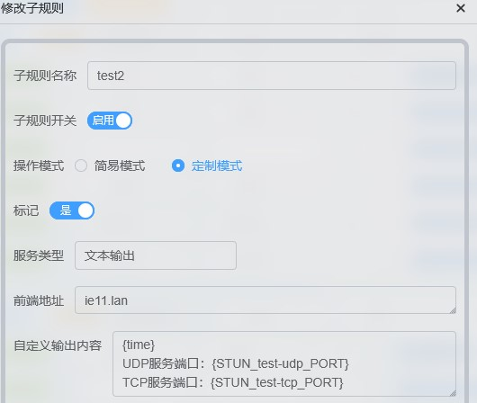
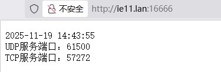


---

## 下载和挂载Homer

Homer项目地址：[链接](https://github.com/bastienwirtz/homer)  
下载项目压缩包并解压：[链接](https://github.com/bastienwirtz/homer/releases/)    

在lucky web 服务中添加**新的子规则**  
有关lucky web规则设置的具体方法详见之前的教程：[链接](./lucky-web.md)  

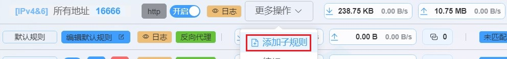

类型选择 **文件服务**  
挂载目录选择解压后 homer 所在的文件夹  

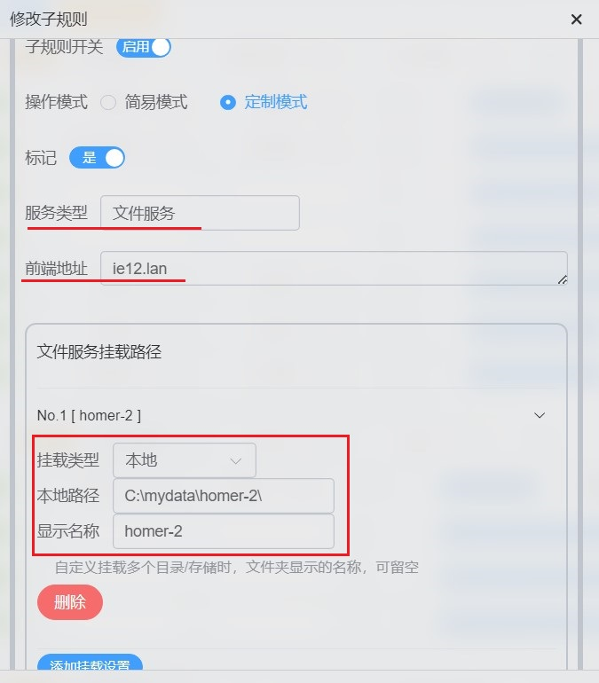

前端域名可以先填写一个简短的不存在的域名 用作测试  
在host文件将其指向 `127.0.0.1` 这里使用 `ie12.lan`  
不建议使用 `.local` 其有特殊用途  

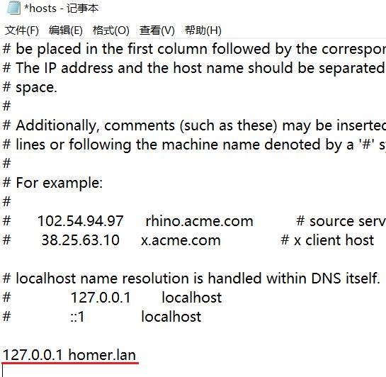

访问页面应该可以看到以下内容  

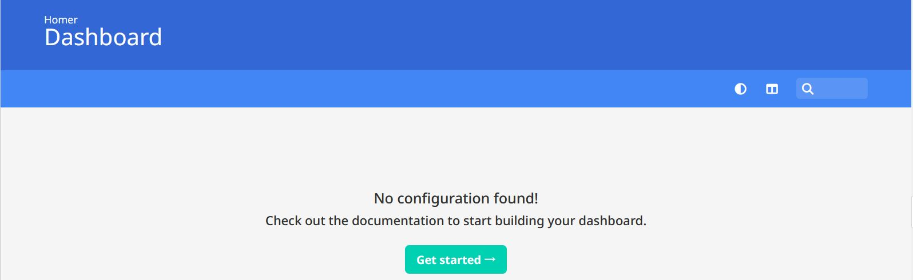

转到 homer 目录下的 assets 文件夹  
找到 `config.yml.dist` 文件 复制一份 去掉名称中的 `.dist`  

这是一个预设的配置文件 我们将在这个配置文件的基础上进行修改  
（其实那个 config-demo.yml.dist 也可以 不过那个预设文件更复杂 此处我们用不到）

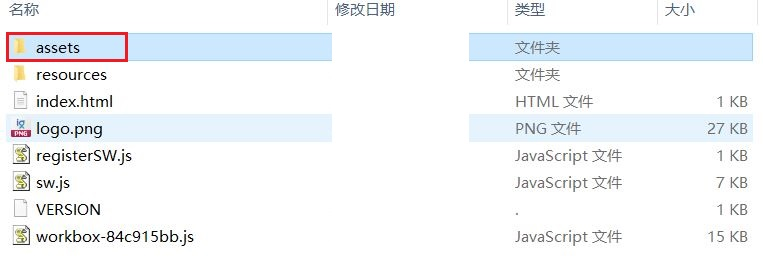
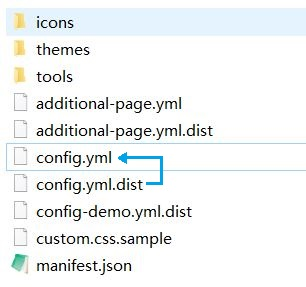

完成上述操作后 回到浏览器刷新页面应该可以看到 这些预设内容  

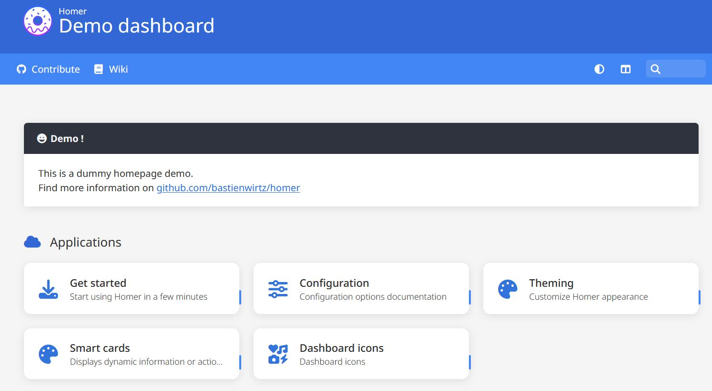


---

## 配置 Homer

我们将在这个预设配置文件的基础上进行修改 以使其适应我们的需要  
此处对这个默认配置文件进行了简单的翻译  

<details>

<summary>配置文件翻译</summary>


```
---
# 主页配置
# 图标选项请参阅 https://fontawesome.com/search

title: "演示仪表盘"
subtitle: "Homer"
logo: "logo.png"
# icon: "fas fa-skull-crossbones" # 可选图标

header: true
footer: '<p>使用 <span class="has-text-danger">❤️</span> 与 <a href="https://bulma.io/">bulma</a>, <a href="https://vuejs.org/">vuejs</a> 及 <a href="https://fontawesome.com/">font awesome</a> 创建 // 在 <a href="https://github.com/bastienwirtz/homer"><i class="fab fa-github-alt"></i></a> 上 Fork 我</p>' # 设为 false 可隐藏

# 可选主题定制
theme: default

# 可选主题定制（颜色覆盖）
# 也可使用 CSS 变量进行覆盖
colors:
  light:
    highlight-primary: "#3367d6"
    highlight-secondary: "#4285f4"
    highlight-hover: "#5a95f5"
    background: "#f5f5f5"
    card-background: "#ffffff"
    text: "#363636"
    text-header: "#ffffff"
    text-title: "#303030"
    text-subtitle: "#424242"
    card-shadow: rgba(0, 0, 0, 0.1)
    link: "#3273dc"
    link-hover: "#363636"
  dark:
    highlight-primary: "#3367d6"
    highlight-secondary: "#4285f4"
    highlight-hover: "#5a95f5"
    background: "#131313"
    card-background: "#2b2b2b"
    text: "#eaeaea"
    text-header: "#ffffff"
    text-title: "#fafafa"
    text-subtitle: "#f5f5f5"
    card-shadow: rgba(0, 0, 0, 0.4)
    link: "#3273dc"
    link-hover: "#ffdd57"

# 可选消息
message:
  #url: https://b4bz.io
  style: "is-dark" # 样式选项请参阅 https://bulma.io/documentation/components/message/#colors
  title: "演示！"
  icon: "fa fa-grin"
  content: "这是一个示例主页演示。<br />更多信息请访问 <a href='https://github.com/bastienwirtz/homer'>github.com/bastienwirtz/homer</a>"

# 可选导航栏
# links: [] # 允许创建无链接的导航栏（暗黑模式、布局和搜索）
links:
  - name: "参与贡献"
    icon: "fab fa-github"
    url: "https://github.com/bastienwirtz/homer"
    target: "_blank" # 可选的 html a 标签 target 属性
  - name: "维基"
    icon: "fas fa-book"
    url: "https://www.wikipedia.org/"
  # 此链接将指向第二个 homer 页面，该页面将从 additional-page.yml 加载配置，并保留 config.yml 文件中的默认配置值
  # 参见 url 字段及此示例中使用的 assets/additional-page.yml.dist：
  #- name: "另一个页面！"
  #  icon: "fas fa-file-alt"
  #  url: "#additional-page" 

# 服务
# 第一级数组代表一个分组。
# 如果不使用分组，则仅保留 "items" 键（分组名称、图标和标签样式是可选的，不会显示分组分隔）。
services:
  - name: "应用程序"
    icon: "fas fa-cloud"
    items:
      - name: "快速开始"
        icon: "fa-solid fa-download"
        subtitle: "几分钟内开始使用 Homer"
        tag: "setup"
        url: "https://github.com/bastienwirtz/homer?tab=readme-ov-file#get-started"
      - name: "配置"
        icon: "fa-solid fa-sliders"
        subtitle: "配置选项文档"
        tag: "setup"
        url: "https://github.com/bastienwirtz/homer/blob/main/docs/configuration.md"
      - name: "主题定制"
        icon: "fa-solid fa-palette"
        subtitle: "自定义 Homer 外观"
        tag: "theming"
        url: "https://github.com/bastienwirtz/homer/blob/main/docs/theming.md"
      - name: "智能卡片"
        icon: "fa-solid fa-palette"
        subtitle: "显示动态信息或操作。"
        tag: "setup"
        url: "https://github.com/bastienwirtz/homer/blob/main/docs/customservices.md"
      - name: "仪表盘图标"
        icon: "fa-solid fa-icons"
        subtitle: "仪表盘图标"
        tag: "setup"
        url: "https://github.com/walkxcode/dashboard-icons"
```
</details>

### 服务卡片

最重要的部分是 `services`  它控制着这些服务卡片的内容  

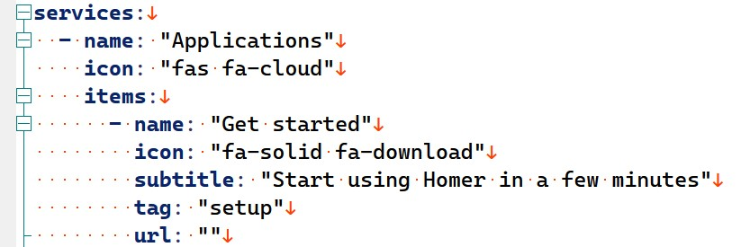

其中缩进少且带 `items` 项的为 **分组** 可以对服务卡片进行归类  
`items` 下的内容就是服务卡片了  

* `name` 用于控制显示名称
* `subtitle` 副标题 但在服务卡片中其更像是描述
* `url` 用于填写超链接 非http服务可留空
* `target` 在其中填写 `_blank` 可使链接在新窗口中打开
* `icon` 和 `logo` 用于显示 图标 

其中 `icon` 表示使用 `https://fontawesome.com/search` 上的字体图标  
可以在该网站上搜索其他的字体图标 将其对应的名称复制到此处即可  
而 `logo` 则表示使用图像文件作为图标  

对于 **非HTTP服务** 来说我们不需要 `url` 项 直接在 `subtitle` 中写端口即可  
为了动态的显示 STUN 穿透端口 我们需要使用**全局变量来实现**  
写法为 `{STUN_规则名_PORT}` 其中的规则名称 要替换为具体的STUN规则名称  

lucky的全局变量详见：[链接](https://lucky666.cn/docs/modules/globaldata)  
至于IP地址的更新应交由 **动态域名解析（DDNS）** 处理  此处不填写  
该域名应已预先输入到需要的服务中 其不需要在每次连接时都进行输入  

而对于 **HTTP服务** 而则需要填写 `url` 项 以实现跳转  
建议先按照之前的教程 **设置反向代理 使所有HTTP服务共用同一个端口**  
这样 **只需要一条STUN穿透规则** 就能承载所有HTTP服务  

* [在Windows下使用lucky配置反向代理以实现较为安全的WEB访问](./lucky-web.md)

如果在之前 已经使用了重定向或页面规则方案  
则在此处 填写 **重定向后的域名** 即可  

* [「扩展篇」使用Cloudflare的重定向规则传递资源路径和查询字符串](./stun-cf-redirection.md)
* [「LUCKY STUN穿透」使用Cloudflare的页面规则固定和隐藏网页端口](./stun-web-serve-CF.md)

若之前未使用过重定向方案 则请先按照 **页面规则方案** 中方法  
为所有服务设置 **重定向后的域名** 及其解析  

对于 **不支持重定向的HTTP服务** 来说其设置与非HTTP服务相同  


### 标题


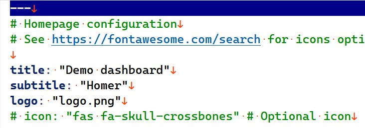

* `title` 主标题内容
* `subtitle` 副标题内容
* `logo` 图标内容 

图标文件在 `\assets\icons\` 中之后自定义的图片资源也可以存放在此处  

### 消息

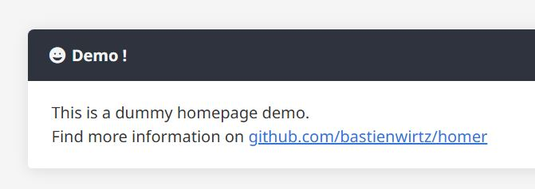


可以用于显示一些提示消息  在本教程中此处将用于显示实时时间  
当然显示时间的功能也可以放到服务卡片中  
若不需要显示则 全部使用 `#` 注释掉即可  

* `style` 用于控制消息框的显示样式  
* `content` 为消息内容 由html格式写成  

### 菜单栏

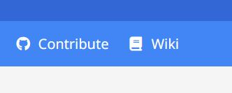
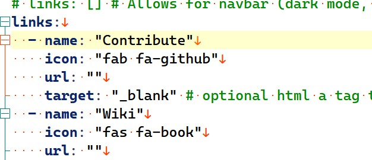

可添加一些常用的链接  

### 页脚

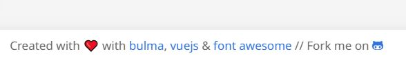


页面底部的信息显示 可修改 填写的内容为html格式  


### 图标资源

除了 上文中提到的 `fontawesome.com` 所提供的字符图标外  
这些存储库也提供了许多常见服务的矢量图或高分辨率位图  

* [homarr-labs/dashboard-icons](https://github.com/homarr-labs/dashboard-icons)
* [NX211/homer-icons](https://github.com/NX211/homer-icons)
* [edent/SuperTinyIcons](https://github.com/edent/SuperTinyIcons)


### 示例效果

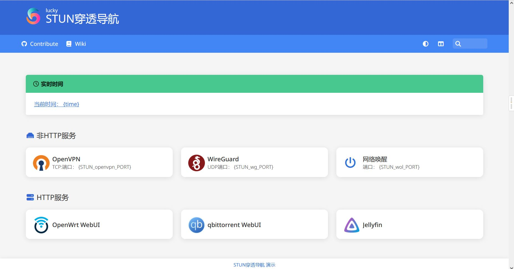

<details>

<summary>配置文件展示</summary>

```
---
# Homepage configuration
# See https://fontawesome.com/search for icons options

title: "STUN穿透导航"
subtitle: "lucky"
logo: "/assets/icons/lucky.svg"
# icon: "fas fa-skull-crossbones" # Optional icon

header: true
footer: '<a>STUN穿透导航 演示</a>' # set false if you want to hide it.

# Optional theme customization
theme: default

# Optional theme customization (color overrrides)
# overrrides can also be done using CSS vars 
colors:
  light:
    highlight-primary: "#3367d6"
    highlight-secondary: "#4285f4"
    highlight-hover: "#5a95f5"
    background: "#f5f5f5"
    card-background: "#ffffff"
    text: "#363636"
    text-header: "#ffffff"
    text-title: "#303030"
    text-subtitle: "#424242"
    card-shadow: rgba(0, 0, 0, 0.1)
    link: "#3273dc"
    link-hover: "#363636"
  dark:
    highlight-primary: "#3367d6"
    highlight-secondary: "#4285f4"
    highlight-hover: "#5a95f5"
    background: "#131313"
    card-background: "#2b2b2b"
    text: "#eaeaea"
    text-header: "#ffffff"
    text-title: "#fafafa"
    text-subtitle: "#f5f5f5"
    card-shadow: rgba(0, 0, 0, 0.4)
    link: "#3273dc"
    link-hover: "#ffdd57"

# Optional message
message:
  #url: https://b4bz.io
  style: "is-success" # See https://bulma.io/documentation/components/message/#colors for styling options.
  title: "实时时间"
  icon: "fa-regular fa-clock"
  content: "<a>当前时间： {time} </a>"

# Optional navbar
# links: [] # Allows for navbar (dark mode, layout, and search) without any links
links:
  - name: "Contribute"
    icon: "fab fa-github"
    url: ""
    target: "_blank" # optional html a tag target attribute
  - name: "Wiki"
    icon: "fas fa-book"
    url: ""
  # this will link to a second homer page that will load config from additional-page.yml and keep default config values as in config.yml file
  # see url field and assets/additional-page.yml.dist used in this example:
  #- name: "another page!"
  #  icon: "fas fa-file-alt"
  #  url: "#additional-page" 

# Services
# First level array represent a group.
# Leave only a "items" key if not using group (group name, icon & tagstyle are optional, section separation will not be displayed).
services:
  - name: "非HTTP服务"
    icon: "fa-solid fa-ethernet"
    items:
      - name: "OpenVPN"
        logo: "/assets/icons/openvpn.png"
        subtitle: "TCP:端口： {STUN_openvpn_PORT} "
        url: ""
      - name: "WireGuard"
        logo: "/assets/icons/wireguard.png"
        subtitle: "UDP端口： {STUN_wg_PORT} "
        url: ""
      - name: "网络唤醒"
        icon: "fa-solid fa-power-off"
        subtitle: "端口： {STUN_wol_PORT} "
        url: ""
  - name: "HTTP服务"
    icon: "fa-solid fa-server"
    items:
      - name: "OpenWrt WebUI"
        logo: "/assets/icons/openwrt.png"
        subtitle: ""
        url: "https://对应服务的重定向后域名:{STUN_http_PORT}"
        target: "_blank"
      - name: "qbittorrent WebUI"
        logo: "/assets/icons/qbittorrent.svg"
        subtitle: ""
        url: "https://对应服务的重定向后域名:{STUN_http_PORT}"
        target: "_blank"
      - name: "Jellyfin"
        logo: "/assets/icons/jellyfin.png"
        subtitle: ""
        url: "https://对应服务重定向后域名:{STUN_http_PORT}"
        target: "_blank"
```

</details>

不难注意到 这些变量事实上并没有实际生效  
这是因为它们写在了文件中而不是lucky内  
接下来我们就需要使用lucky的 **文本输出功能** 来输出这些配置文件  

---

## 挂载配置文件

要想使配置文件中的 **全局变量** 生效 我们需要将配置文件  
迁移到 lucky的 **文本输出功能** 中  

在web规则中添加新的子规则 类型选择 **文本输出**  
前端地址为 `homer主域名/assets/config.yml`  
其路径与之前在磁盘上的配置文件路径相同  

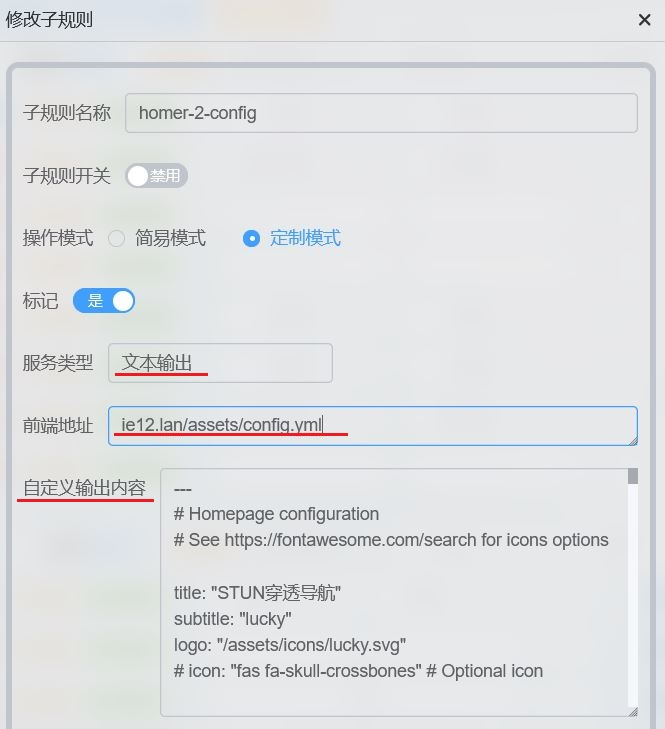

输出内容为之前的写好的配置  
为防止冲突 要修改原有配置文件的文件名 使其失效  


完成这些设置后刷新页面 应该可以看到之前的变量已经起作用了  
若刷新后无效 则需要在F12中禁用缓存再刷新 或在隐私/无痕 模式打开  


如果变量依然无法显示 请检查对应的STUN穿透规则是否穿透成功  

---

## 访问控制

为提高安全性可为导航页面主体和配置文件 添加 **basic验证**  
主体页面和配置文都件都设置相同的用户名和密码  

用户名和密码以英文冒号隔开 每行一条 允许配置多条  
这样只有在登录后才能显示页面并读取配置文件  

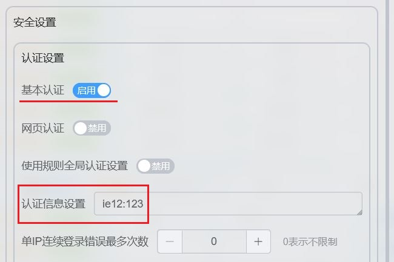
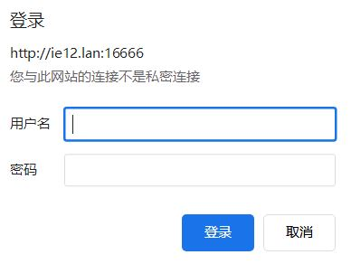

---

## 导航页对外访问

在完成上述设置后 接下来需要做的是要让导航页面本身 **可以方便的被访问到**  
由于导航页面本身也是依靠stun穿透实现对外访问的  

因此我们也需要给导航页面本身 “固定”一下端口  
比较好的方法就是沿用之前的 CF的页面规则和重定向方案  
两个方案二选一即可 更推荐重定向方案其扩展性更强  

* [「扩展篇」使用Cloudflare的重定向规则传递资源路径和查询字符串](./stun-cf-redirection.md)
* [「LUCKY STUN穿透」使用Cloudflare的页面规则固定和隐藏网页端口](./stun-web-serve-CF.md)


---

## 结尾

至此我们就完成了使用Homer导航页指示stun穿透后的端口的设置  
事实上 homer 还有一些更高级的功能没有介绍到有兴趣的用户可自行探索  

