# 「LUCKY STUN穿透」解决WebDAV重定向问题

2026.1.17  

## 关于本教程

在之前的教程中我们介绍了大量与HTTP服务有关的stun穿透设置  
这是因为HTTP支持重定向可以十分方便的方便修改端口  

* [「扩展篇」使用Cloudflare的重定向规则传递资源路径和查询字符串](./stun-cf-redirection.md)
* [「LUCKY STUN穿透」使用Cloudflare的页面规则固定和隐藏网页端口](./stun-web-serve-CF.md)

组网方案可以通过DNS记录更新端口 当然这需要组网软件本身支持此功能  
组网方案几乎适用于任何服务 不过需要在两端安装专用客户端  

* [「LUCKY STUN穿透」在Windows下使用VNT组网为非HTTP服务固定STUN穿透端口](./stun-VNT-networkin.md)
* [「EasyTier」使用SRV TXT HTTP重定向获取对端IP端口](../virtual-private-network/easytier-get-port-form-dns-record.md)

对于非HTTP和不使用组网的服务可以使用导航页方案 通过web页面实时显示穿透端口端口  
在连接服务时手动修改端口  

* [「LUCKY STUN穿透」使用Homer导航页指示stun穿透后的端口](./stun-home-page.md)

**但并非所有HTTP服务都支持重定向** 例如 WebDAV协议  
WebDAV协议用于对远程web服务器上的文件进行编辑和管理  
各种存储服务基本都支使用持WebDAV协议进行访问  

**事实上这并不是WebDAV协议本身的问题**  
其本身使用的是标准的HTTP请求 可以兼容之前的重定向方案  

**问题在于很多webdav客户端并不支持重定向**  
这不是因为技术上的困难 而是没有意识到这种使用场景  

当然这种问题在其他一些使用HTTP协议的 **专用客户端** 上也广泛存在  
这些服务大都使用标准的HTTP协议 **但没有考虑到处理重定向响应的问题**  

有两条路线可以解决这个问题：  

1. **更换支持重定向的客户端**
2. **设置本地反向代理**

若只是执行文件传输 那客户端可以随意替换  
**但有些专用客户端无法替代** 只能通过反向代理 使其正常工作  

本地反向代理的原理也很简单  
在本地设置反向代理 **由这个反向代理程序处理重定向工作**  
不支持重定向的专用客户端 连接本地的反向代理程序  
在专用客户端看来其在直接与目标服务器通信  
本教中使用lucky作为本地反向代理程序  

之所以让反向代理服务器运行在本地是因为  
**在使用反向代理时所有的流量都会通过反代服务器**  

若反代服务器在本地 则不会增加额外的流量  
如果在是远程 那就意味着需要一个开放固定端口且有足够带宽和流量的服务器  
如果是这样的话其就相当于是中转方案了  

---

## Windows系统

Windows上对于传输文件而言 建议使用 [WinSCP](https://winscp.net/eng/docs/lang:chs)  
虽然其并不具备挂载webdav为驱动器的能力  

若要挂载webdav为驱动器仍建议使用 RaiDrive 但其本身不支持重定向  
我们需要为其在本地设置反向代理  

[Cyberduck](https://cyberduck.io/) 这个软件原生支持重定向 也可以挂载webdav为驱动器  
**唯一的缺点是要钱**  

---

## 配置 WinSCP

### 下载和安装

下载：[链接](https://winscp.net/eng/download.php)  
一路单击“下一步”即可完成安装  

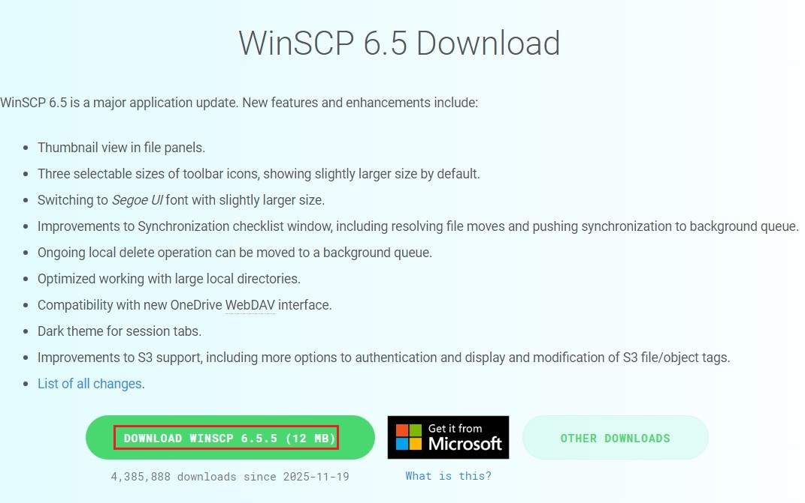

### 连接站点

**新建连接**  

为方便观察重定向效果 **这里使用本地的lucky重定向** 替代实际中cloudflare的重定向  
本地重定向没有使用TLS 在使用CF重定向时需要启用TLS  

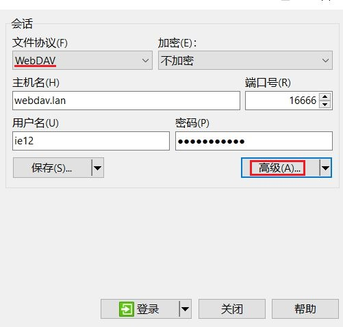

对于openlist（原alist）的webdav服务来说 其目录在 `/dav/` 路径下 **而非根目录下**  
若使用根目录请求会收到405错误 根目录下的路径是给浏览器访问使用的  

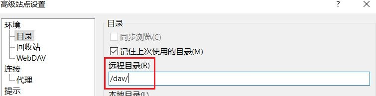
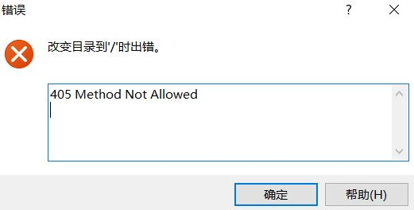

**登录成功**  

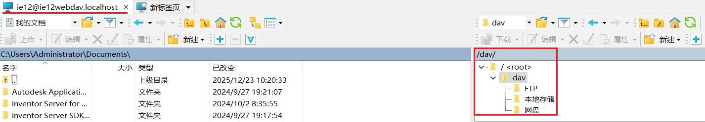

WinSCP默认是 双面板布局 即同时显示本地文件和远程文件  
可以修改成单面板模式即只显示远程文件  

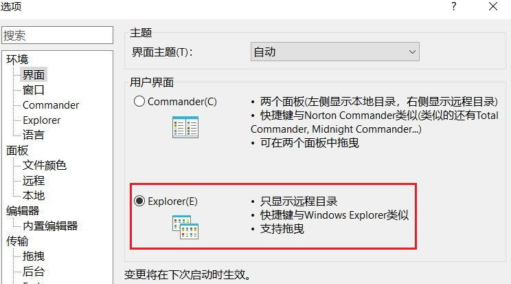

### 检视重定向信息

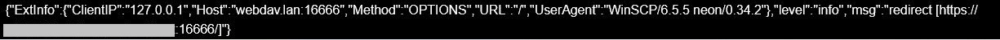

---

## RaiDrive 本地反向代理设置

RaiDrive支持将webdav挂载为本地驱动器且使用较为广泛  
RaiDrive 的下载和安装不是本教程讲述的内容  
**此方法对其他不支持重定向的专用客户端也是适用的**  

### 设置本地域名

在设置lucky前建议通过host文件添加一些本地域名  
这些域名并不真实存在 只是方便之后设置反向代理时 区分不同服务  
如果只有一个webdav服务需要反向代理也可以跳过此步骤  

此处使用 `.localhost`作为这些域名的后缀  

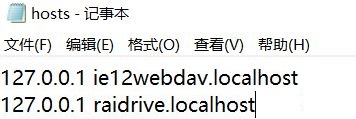

### lucky 反向代理

下载lucky：[链接](https://github.com/gdy666/lucky/releases)  

**添加web服务规则**  
由于是本地连接选择HTTP即可  

若之前已添加过主规则 则只需要添加子规则即可  
详见之前的教程：[链接](./lucky-web.md)  

主规则名称可自定义 **默认不勾选IPv4 要手动勾选一下**  
不建议使用80端口 最好使用其他高位端口  

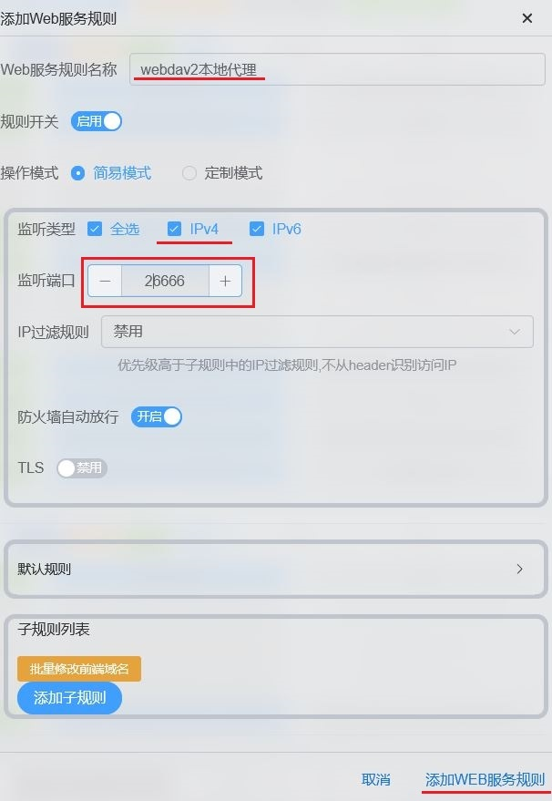

**添加反向代理子规则**  

添加完主规则后添加用于实现反向代理的子规则  
每个主规则其实有一个默认响应规则 不过我们不用那个  
右键弹出菜单 添加子规则  

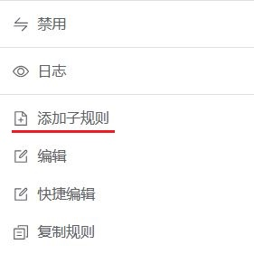

服务类型选择 **反向代理** 前端地址填写之前设置的 **本地域名**  
后端地址则是解析到CF的 **重定向前地址**  详见：[链接](./stun-cf-redirection.md)  
打开 使用目标地址Host请求头 开关  

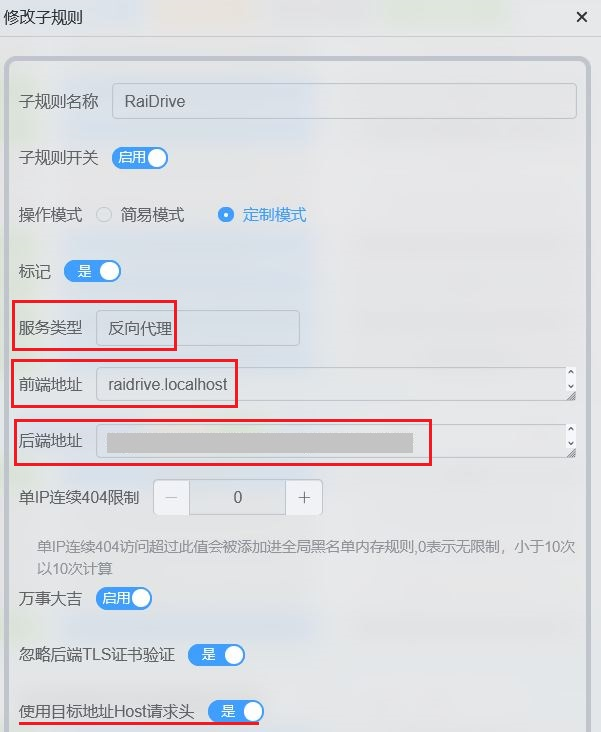

### RaiDrive 连接测试

新建连接 协议选择webdav  
取消勾选地址后面的复选框 以使用HTTP 默认为HTTPS  
输入地址端口和资源路径  

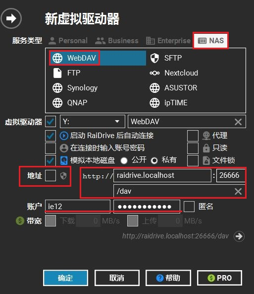

**连接成功**  

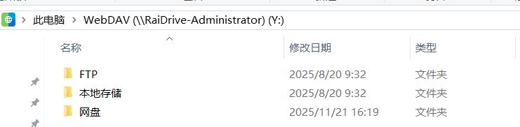

### 检视反向代理日志

---

## 安卓系统

在安卓上传输文件时较多的使用各类文件管理器  
这里使用 **CX文件管理器** 其webdav服务支持重定向  

不过 CX文件管理器有一个缺点  
在连接远程存储发生错误时 **不会显示错误原因**  
这对排查故障来说是非常不利的  

此处使用流舟文件进行辅助故障排除  
其也是一个支持webdav重定向的文件管理器 且支持显示连接错误信息  
不过这个文件管理器有很多冗余功能 **此处仅作为排障使用**  

### 下载软件

CX文件管理器：[官网](https://cxfileexplorer.com/)|[谷歌商店](https://play.google.com/store/apps/details?id=com.cxinventor.file.explorer&hl=zh)  
流舟文件：[果核剥壳](https://www.ghxi.com/lzwj.html)|[谷歌商店](https://play.google.com/store/apps/details?id=com.liuzho.file.explorer&hl=zh)  

### CX文件管理器

**添加webdav连接**  
为了方便观察重定向效果 这里依然连接本地的lucky重定向  

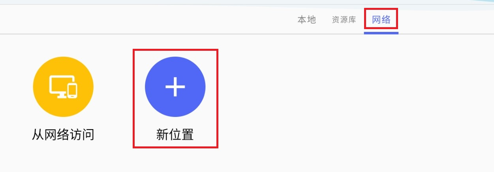
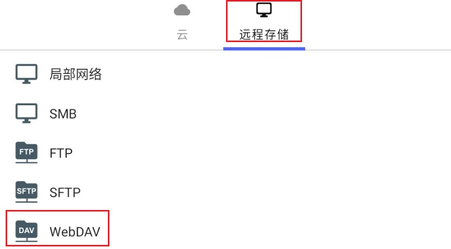
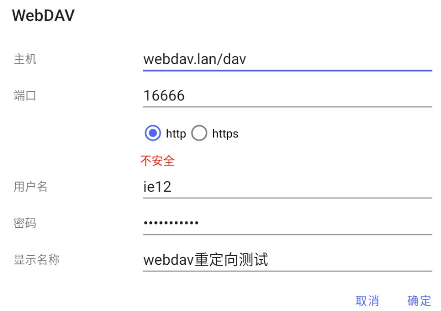

**连接成功**  

**检视重定向效果**  
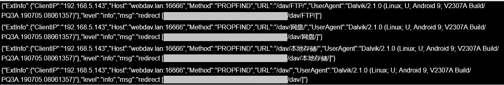

值得注意的是CX文件管理器对重定向的处理和WinSCP不同  
WinSCP在接受重定向后新的请求都会发向新的地址  
而CX文件管理器在接受重定向后依然会请求之前的地址  

即WinSCP只需要在连接时进行一次重定向即可  
而CX需要在请求每个目录和文件时进行重定向  

### 流舟文件

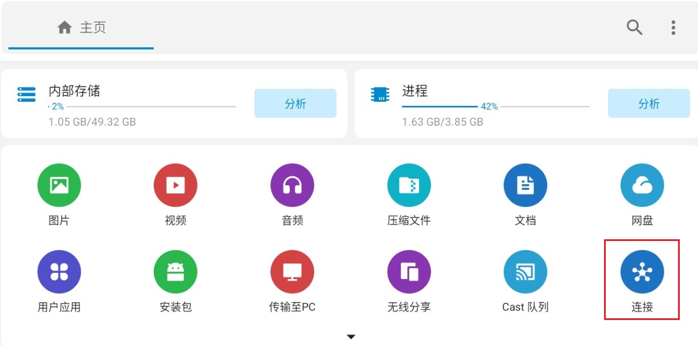
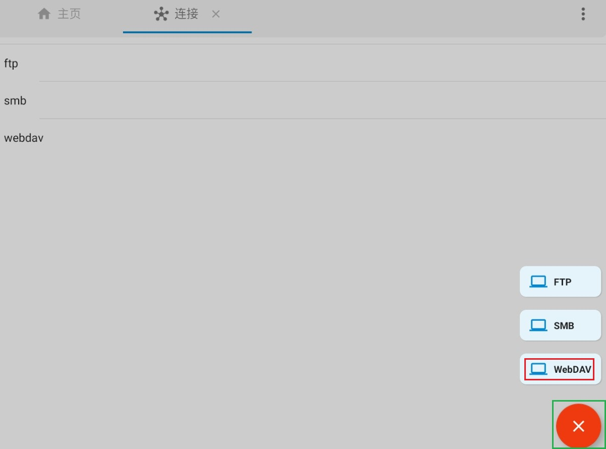

需要输入 HTTP/HTTPS协议头以指定协议  
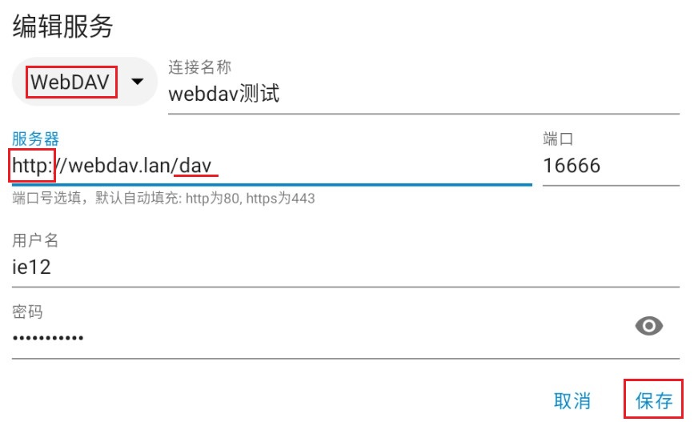

登录成功  
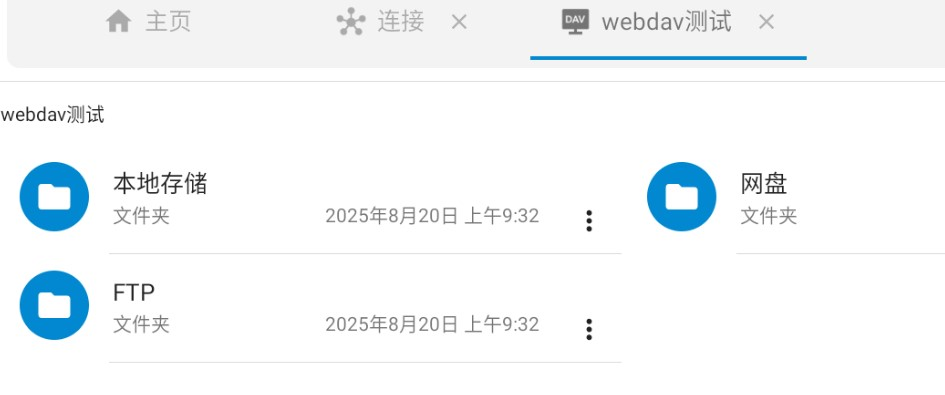

其可以显示连接错误信息方便排障  
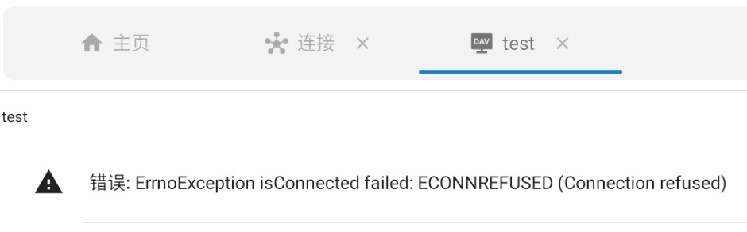

---

## 参考

* [WebDAV client RFC4437 Redirection vs other Hosts-WinSCP](https://winscp.net/forum/viewtopic.php?t=26553)
* [HTTP 的重定向 - HTTP | MDN](https://developer.mozilla.org/zh-CN/docs/Web/HTTP/Guides/Redirections)

