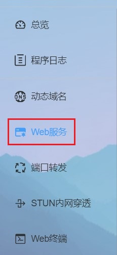
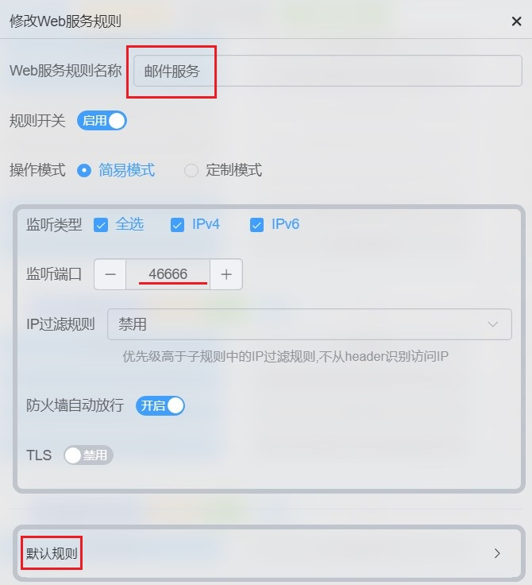
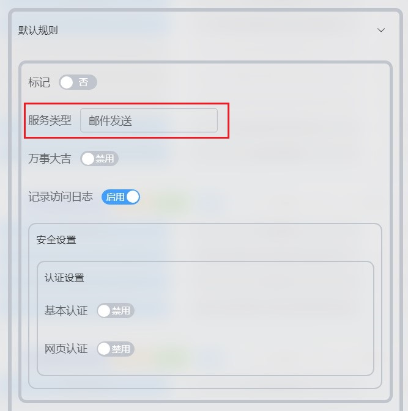
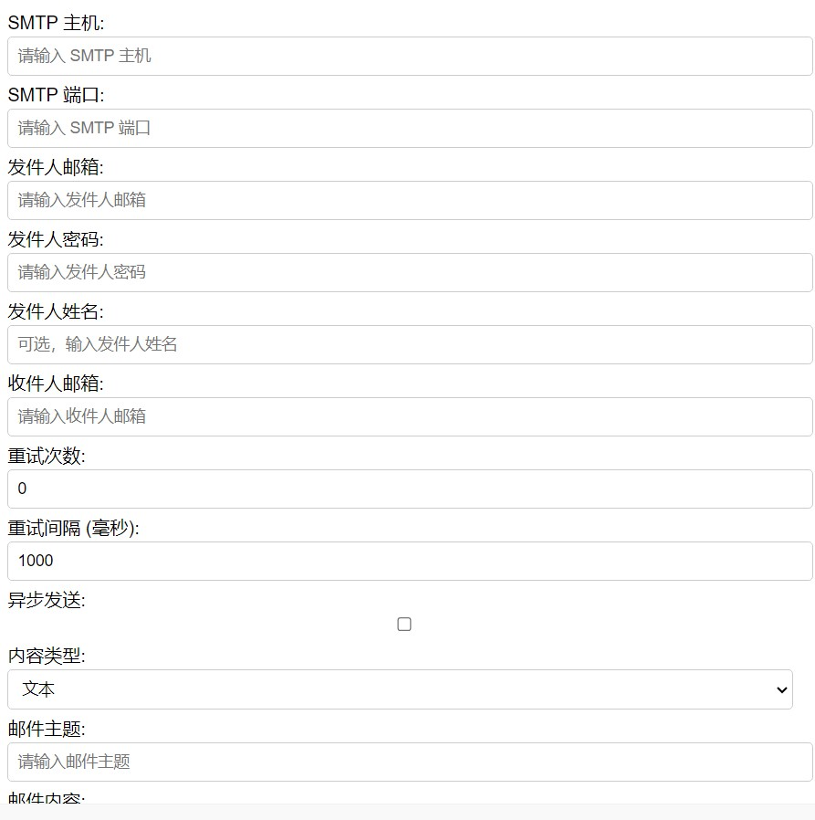
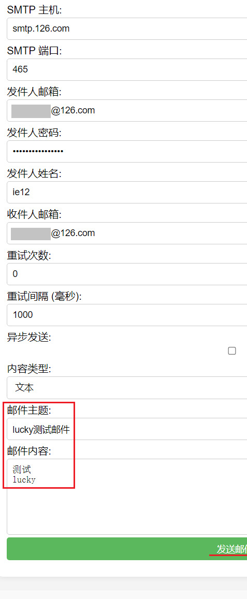
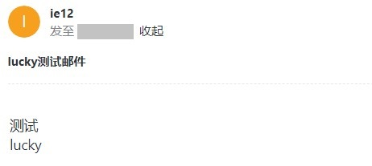
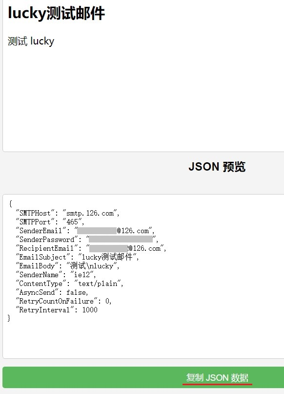
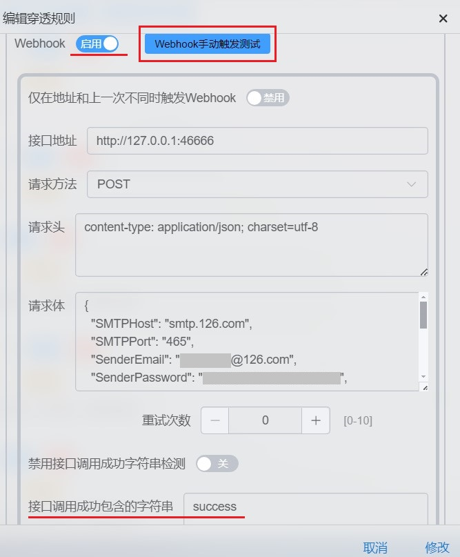
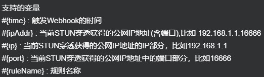
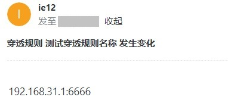

# 「LUCKY STUN穿透」 使用邮件服务发送电子邮件

2026.4.8  

在之前的教程中我们已经成功使用 curl 来发送邮件  
以通知stun穿透端口的变化 [「LUCKY STUN穿透」使用邮件通知端口变化情况](./email-notification-port.md)  

不过使用 curl 发送邮件在配置上是较为麻烦的  
需要编写脚本并传递参数 在不同平台上脚本的语法也不同  
还需要防止授权码中存在特殊字符影响脚本运行  
调试和维护较为不便  

其实lucky v2.13.7 中（2024-11-17）  
就已经在web服务内添加了 **邮件服务功能**  
可以通过发送 HTTP POST 请求来实现邮件的发送  
由邮件服务处理 SMTP 相关的过程  

这也意味着我们不再需要通过脚本来操作 curl  
直接使用 stun 规则中的 webhook 功能即可完成请求  
极大的简化了设置 便于调试消除了不同平台上的设置差异  

---

## 添加邮件服务

我们可以复用之前的web规则 即作为已有web规则的子规则  
但若是添加子规则 则需要为其设置本地域名  
即在host文件中添加 一个不存在的域名/主机名  

并指定到本地IP 以便在访问的时候实现分流  
这样设置较为麻烦 有些平台上修改host文件并不方便  
再考虑到其服务类型的特殊性  

**这里建议直接新建一个主规则**  
使用单独的端口并设置其为默认规则  
这样直接使用IP加端口就可以进行访问  

### 添加 Web规则



设置规则名称和监听端口  


编辑默认规则 设置类型为 **邮件服务**  


现在在浏览器中访问的这个端口 应该可以看到这样一个界面  
通过此界面 可进行邮件发送的测试  




---

## 测试配置

填写邮箱配置 获取邮箱授权码的方法 详见之前的教程  
[「LUCKY STUN穿透」使用邮件通知端口变化情况](./email-notification-port.md)  



按下发送邮件按钮 若设置都正确 应该可以收到邮件  



此处测试完成后 可以右侧可以看到对应的 JSON 配置  
复制下来方便之后 在webhook中进行调用  



---

### 编辑STUN穿透规则

* 编辑 stun穿透规则 打开webhook开关
* 地址填写 之前设置的邮件服务器的地址
* 请求方式选择 POST
* 请求头填写 `content-type: application/json; charset=utf-8`
* 请求体填写之前 复制出来的JSON
* 接口调用成功包含的字符串 填写 `success`

**示例**  




可将请求体中 邮件的标题和内容替换成 stun穿透规则的局部变量  
可用局部变量在悬浮提示中查看  



**示例**  

```
{
  "SMTPHost": "smtp.126.com",
  "SMTPPort": "465",
  "SenderEmail": "XXXXXX@126.com",
  "SenderPassword": "XXXXXXXXXXXXXXX",
  "RecipientEmail": "XXXXXX@126.com",
  "EmailSubject": "穿透规则 #{ruleName} 发生变化",
  "EmailBody": "{ipAddr}",
  "SenderName": "ie12",
  "ContentType": "text/plain",
  "AsyncSend": false,
  "RetryCountOnFailure": 0,
  "RetryInterval": 1000
}
```

按下测试按钮 webhook手动触发测试按钮  
若配置正确应能收到测试邮件  



至此我们便完成了 lucky 邮件服务发送电子邮件的设置  


---

## 参考


* https://lucky666.cn/docs/modules/web#%E9%82%AE%E4%BB%B6%E5%8F%91%E9%80%81
