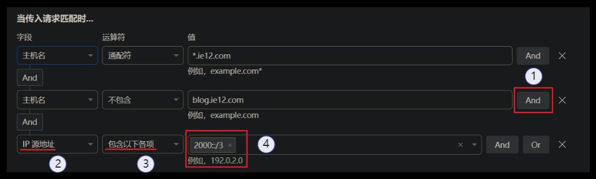

# 「LUCKY STUN穿透」IPv4和IPv6分离重定向

2025.07.19  

## 关于本教程

在之前的教程中我们已经实现了通过cloudflare的页面规则  
以及重定向规则实现实现stun穿透端口的“固定”  

使用页面规则：[「LUCKY STUN穿透」使用Cloudflare的页面规则固定和隐藏网页端口](./stun-web服务-CF.md)  
使用重定向：[「扩展篇」使用Cloudflare的重定向规则传递资源路径和查询字符串](./stun-cf重定向.md)  

### 新的需求

在源服务器已经开放IPv6端口的情况下可通过IPv6直接访问  
当然在没有IPv6的环境下就只能使用IPv4通过穿透通道进行访问  

在一些地区的IPv6访问效果已经优于IPv4  
分离重定向方案也算是为纯IPv6做过渡准备  

在之前的教程中没有考虑到IPv6直接访问的需求  
所有请求都通过IPv4穿透隧道传输 即使是在发起端有IPv6的情况下  

**本教程将对IPv6和IPv4请求进行分离处理**  
即使用IPv6发起连接 重定向到IPv6地址和端口  
使用IPv4发起连接 重定向到IPv4地址和stun穿透端口  

---

## 配置方法

### 说明

本教程是在之前重定向规则教程上进行的拓展  
若之前使用的的是页面规则来实现重定向则需要改用重定向规则  

页面规则可设置的内容较少无法实现访问源IP的判断  
且可用规则数量较少 现在建议改用重定向规则来实现  

在继续阅读前 建议先阅读之前的重定向规则教程  
[「扩展篇」使用Cloudflare的重定向规则传递资源路径和查询字符串](./stun-cf重定向.md)  

### Cloudflare 配置

自上次的重定向教程后 Cloudflare的重定向规则界面又发生了不小的变化  
不过好在设置方法上的变化不大  


为了分别处理IPv6和IPv4请求  
我们需要两条重定向规则  

**在配置新的规则之前 先禁用之前的规则**  


**复制旧规则** 先点击 部署 之后再进行编辑  
复制出来的规则默认是启用状态 先禁用编辑完成后再启用  


**编辑旧规则** 修改规则名称 这里加上v4后缀  


联立新的条件 逻辑选择 `And`  
字段选择 IP源地址 运算符 选择 包含以下各项  
值填写 `0.0.0.0/0` 表示所有IPv4地址 **保存规则**  


**编辑复制的规则** 修改名称 添加v6后缀   


联立新的条件 和之前的设置基本一致  
逻辑选择 And 字段选择 IP源地址  
运算符 选择 包含以下各项  

值填写 `2000::/3` 其为IPv6全球单播地址  
相当于表示所有的IPv6公网地址  


**此外重定向的目标子域名和端口号也需要修改**  

这里使用的是`*.v6.ie12.com`  
对应STUN穿透所使用的`*.stun.ie12.com`  
其余部分不变  

端口号可自定义 填写实际开放的IPv6端口  
一般为lucky web 规则所监听的端口号  
其是固定的 无需动态更新 记得保存规则  


此外要设置DNS记录将这个新的子域名（泛域名）指向源服务器的IPv6地址  
模式为仅DNS 只填写IPv6地址即可  


---

### Lucky 设置

**DDNS更新设置**  

需要为刚设置的v6子域名设置更新  
具体的方法详见之前的动态域名更新教程   
[Lucky v2.15 版本后的DDNS配置方法](./lucky-ddns-2.15.md)  

**Web 服务更新设置**  

在调整完cloudflare的设置后  
还需要修改 lucky web服务的前端地址  
将新的子域名添加到前端地址栏中  

以保证新的子域名请求匹配上对应服务  
前端地址 可填写多个地址 每行一个  

例如之前使用的泛域名是：  
`*.stun.ie12.com`  

对应的具体服务的前端地址为：
```
op.stun.ie12.com
alist.stun.ie12.com
```

新的泛域名为:`*.v6.ie12.com`  
对应具体服务为：
```
op.v6.ie12.com
alist.v6.ie12.com
```


**TLS证书配置**  

在修改完web服务的前端地址后  
还需要添加新的证书 之前的证书  
无法覆盖到现在新的子域名  

即为新的泛域名设置证书  
TLS证书的设置方法详见之前的教程：
[在Windows下使用lucky实现TLS/SSL证书自动化](./lucky-tls-自动化.md)  


