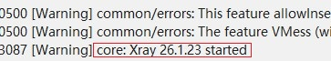
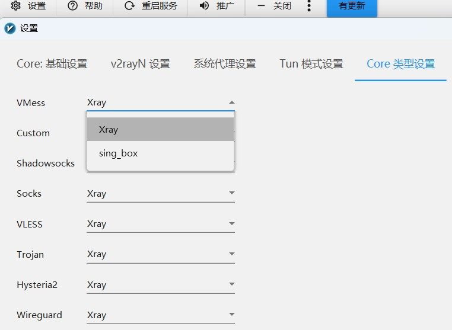

# Xray allowInsecure 参数移除过渡

xray 正在移除 `allowInsecure` 参数  
现在携带此参数会导致核心拒绝启动 详见：[链接](https://github.com/2dust/v2rayN/discussions/9460)  

若上游服务器为自建则可以进行迁移 迁移方法 详见上文中的链接  
若服务器不受自己控制即无法修改 则只能采用其他方法进行过渡  

由于上游依然在下发含有 `allowInsecure` 参数的配置  
此选项会导致 xray 核心报错无法启动 解决有二 分别是 **xary 降级和换用 sing_box**  

## Xary 核心降级

将 xray 核心降级的到不会因为 `allowInsecure` 参数而报错的版本  
可以使用 v26.1.23 版本 发布地址：[链接](https://github.com/XTLS/Xray-core/releases/tag/v26.1.23)  

* [Xray-windows-32.zip](https://github.com/XTLS/Xray-core/releases/download/v26.1.23/Xray-windows-32.zip)
* [Xray-windows-64.zip](https://github.com/XTLS/Xray-core/releases/download/v26.1.23/Xray-windows-64.zip)

下载后解压文件 复制文件夹内的所有文件  
退出 v2rayN 打开 v2rayN 的安装目录 找到 bin 文件夹 点开 找到 xray 文件夹  
删除文件夹中的所有内容 粘贴刚才复制的文件  

启动 v2rayN 检视运行日志查看 xray 版本  
若显示 26.1.23 则替换成功  
  

截图

---

## 换用 sing_box

如果降级不成功或者嫌麻烦 可以直接换用 sing_box 核心  
点开 设置 》参数设置 》 core类型设置  
将用到TLS的协议所使用的核心修改为 sing-box 即可  

截图

