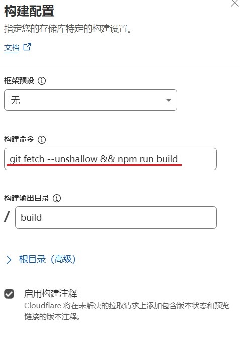

# Docusaurus-解决showLastUpdateTime总是显示相同日期问题

在Docusaurus中可以通过 `showLastUpdateTime` 在文章的末尾自动显示其最后更新时间  
具体配置方法：[链接](https://docusaurus.io/docs/next/api/plugins/@docusaurus/plugin-content-pages#showLastUpdateTime)  

## 本地测试

在本地进行构件后本地服务端  

切换到所在目录后 进行构建  
`npm run build`  

运行本地服务端  
`npm run serve`  

检查各篇文章末尾的时间显示是否正常  

**注意不能使用**  
`npm run start`  

其相当于调试状态 在此状态下所有的文章总是显示相同时间  
且与文件时间的修改时间不相符 其只起到占位符的作用  

## Cloudflare Pages

此处使用 Cloudflare Pages + Github存储库 + 预设Docusaurus 框架参数的部署方法  
在此情况下 所有文章末尾显示的最后修改时间 **都会变成Github新一次提交的时间**  

这其实是由于“浅层克隆”导致的 所谓浅层克隆指在拉取存储库的时候只拉取最新的一个提交  
而不会去获取所有历史提交 这是 CF pages 拉取存储库的默认行为  
而在使用Github存储库时 Docusaurus 依赖历史提交git中来确定修改时间  

所以我们需要让 pages 进行“深度克隆”  
在pages的设置中修改构件配置 将默认的 `npm run build` 改为  
`git fetch --unshallow && npm run build`  
在构建前先进行深度克隆 修改后文章末尾的时间应能正常显示  

---

参考：  

* https://jimhuang.dev/docusaurus/showLastUpdateTime
* https://www.answeroverflow.com/m/1141603660007211149
* https://discourse.gohugo.io/t/lastmod-from-gitinfo-shows-correctly-with-hugo-serve-locally-but-is-overwritten-on-cloudflare-pages-deploy/46009
* https://community.cloudflare.com/t/shallow-clone-of-git-repo/297243
* https://community.cloudflare.com/t/git-last-modified-front-matter-attribute-not-respected-with-11ty/408853
* https://github.com/facebook/docusaurus/discussions/7229

