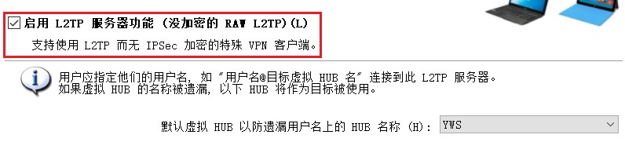
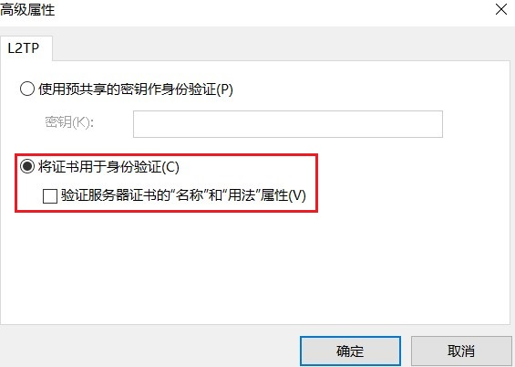
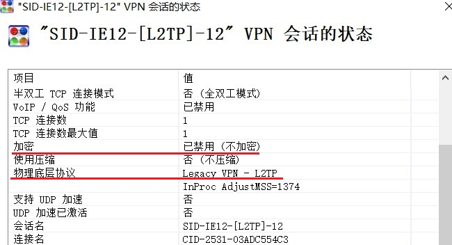

# L2TP 特性研究

其实这些内容发现的比较早 但直到现在才想到将其记录下来  
这些内容其实已经过时了  

## L2TP对IPv6的支持

即L2TP是否可以使用IPv6建立连接 先说结论 **可以**  
这本不应该是一个问题 但是之前在win7上的测试却出现了问题  

当使用IPv6地址作为服务器时 好像会出现 “找不到元素”的报错  
这应该是win7系统的问题而非L2TP的问题  

而且在IPv6上建立L2TP的研究似乎比较少 当然着可能本身就不需要讨论  
外加win7上的实验 使我得出了 L2TP不支持IPv6的错误结论  

其实想要验证 非常简单  在新一些的系统上设置连接即可 比如win10  
如果那时就使用win10系统做测试就不会有这样的问题了  

---

## 在 NAT-T 设备后面配置 L2TP/IPsec 服务器

在之前的教程中 配置 Windows 上的 L2TP 过程中需要调整注册表  
以防止出现 809错误  [链接](https://www.bilibili.com/read/cv21625563/)  

参考：[链接](https://learn.microsoft.com/zh-cn/troubleshoot/windows-server/networking/configure-l2tp-ipsec-server-behind-nat-t-device) 

>默认情况下，Windows Vista 和 Windows Server 2008 不支持 Internet 协议安全性 (IPsec) 
>网络地址转换 (NAT) 遍历 (NAT-T) 安全关联到 NAT 设备后面的服务器。 如果虚拟专用网络 (VPN) 服务器位于
>NAT 设备后面，则 Windows Vista 或基于 Windows Server 2008 的 VPN 客户端计算机无法与 VPN 服务器
>建立第 2 层隧道协议 (L2TP) /IPsec 连接。 此方案包括运行 Windows Server 2008 和 Windows Server 2003 的 VPN 服务器。

不过在win10和win11下似乎已经不再需要该注册表项  
系统就可以正确处理 服务器在NAT后面的情况  

---

## 配置无IPsec 加密的 L2TP连接 

之前的教程 [链接](https://www.bilibili.com/read/cv21625563/)

L2TP本身不提供加密 需要由IPsec完成  

在早期由于对IPsec 加密时使用的端口和映射方法缺乏了解  
导致在连接时总是会出现 789 安全层协商错误  

这其需要开放服务端的 500 (IKE) 和 4500 (IPsec NAT-T) UDP端口  
这一步并不困难 问题出在端口映射上 在映射这两个端口的时候 **协议必须选择 UDP**  
而不能选择 类似于UDP和TCP 这样的选项  

具体的原因 并没有研究查出来 也许 选项不同的协议时 NAT在转发数据包时  
有不同的行为？不管怎么说这个问题算是解决了  

这里仍然记录一下 配置无IPsec 加密的 L2TP连接  
服务端softether 客户端win10 内置客户端  

**示例**

IPsec/L2TP设置 》 勾选 启用 L2TP 服务器功能 （没有加密的 RAW L2TP）  

客户端部分的设置和之前softether 联机教程中的基本相同  
不过需要修改一些设置  

在L2TP 的高级属性中 选择将证书用于身份验证  
不要勾选下面的复选框 （因为softether 的L2TP 是不支持证书验证的）  

同时在身份验证 选项中 允许使用这些协议里  
至少勾选一种协议  

至此我们便基本完成了设置  
连接VPN并在服务端查看加密情况  

**加密已经禁用**  

**启用加密时的显示内容**  

