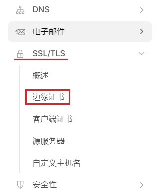
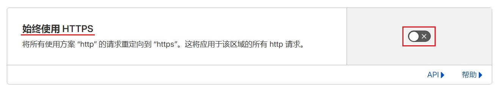
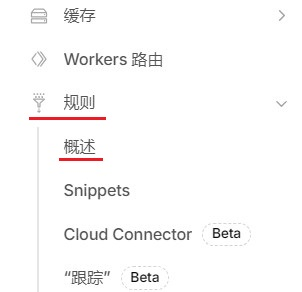
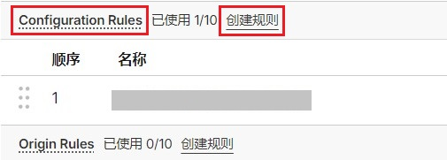
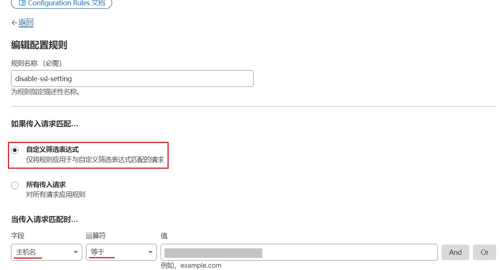
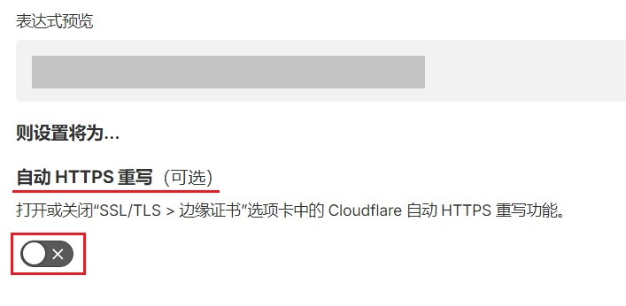
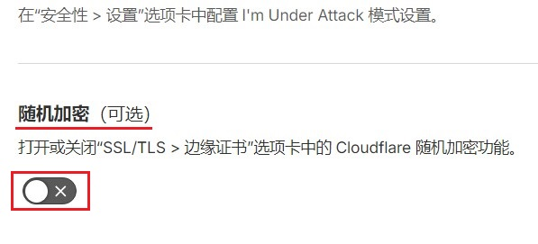
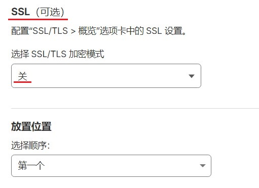

# Cloudflare 在指定域名下禁用SSL/TSL

2026.4.4  

Cloudflare 提供网站加速服务和免费的SSL/TLS证书  
在现在的网络环境下使用 HTTPS 加密是非常有必要的  

不过在一些特殊的情况下 我们需要关闭TLS  
比如 **设置一个可供老旧浏览器访问的站点**  

这些老旧浏览器不支持TLS 1.2/1.3 这样的新式加密方法  
但明文的HTTP还是没有问题的  

在cloudflare已经代理域名的情况下 可以通过调整CF设置  
**来实现在指定的域名下不使用HTTPS**  

---

## 基础设置

1.打开cloudflare 仪表板 `选择域名 》侧边栏 》SSL/TSL 》边缘证书`  

3.找到 “始终使用 HTTPS” 设置为 **关闭**  

`侧边栏 》规则 》概述 》Configuration Rules` 创建新规则  

* 规则名称可自定义  
* 传入请求选择 **自定义筛选表达式**  
 如果需要设置多个子域名 可以通过联立多个条件
* 匹配请求 字段选择 **主机名**
* 运算符 选择 **等于**
* 值填写 **需要禁用SSL的子域名**

当然更重要的是后面的选项  

3.**自动HTTPS重写** 设置为关闭  

4.**随机加密** 设置为关闭  

5.**SSL** 设置为 关  

设置完成后 **在CF侧HTTP请求将不再会被重定向到HTTPS**  

不过要想保持HTTP连接 要求源服务器支持 HTTP  
确切来说是要求源服务器不强制重定向HTTP到HTTPS  
**如果源服务器强制重定向HTTP** 那在CF侧所做的设置将变得没有意义  

---

## 源站点重定向

刚才所说的这个情况其实是和CF的 SSL设置也有很大的关系  
CF的SSL选项支持一下几种设置  

这些选项控制着 浏览器 cloudflare 和 源服务器之间的连接是否使用SSL  
在 `侧边栏》SSL/TLS》概述` 中也可以看到  

* 完全（严格）浏览器与cloudflare间使用HTTPS（加密） cloudflare与源服务器间使用HTTPS（加密）  
  要求源服务器使用已认证书
* 完全 浏览器与cloudflare间使用HTTPS（加密） cloudflare与源服务器间使用HTTPS（加密）  
  允许源服务器使用自签名证书
* 灵活 浏览器与cloudflare间使用HTTPS（加密） cloudflare与源服务器间使用HTTP（不加密）
* 关闭（不安全） 浏览器与cloudflare间使用HTTP（不加密） cloudflare与源服务器间使用HTTP（不加密）

在之前的配置上使用的就是 **关闭** 选项  
在这种情况下 浏览器和CF之间使用HTTP 源服务器和 CF之间也使用 HTTP 

此时如果 源服务器设置了将HTTP重定向到HTTPS则  
浏览器通过HTTP连接到CF CF在通过HTTP连接到源服务器  
源服务器返回重定向给CF CF再将重定向响应传达给浏览器  

如果有一种模式允许在cloudflare和源服务器之间使用HTTPS  
而在cloudflare于浏览器之间使用HTTP的话 就能解决这个问题  

可惜CF并不提供这种模式 其实可以通过引入第三方反向代理来解决  
不过这样一来 配置就会变得非常复杂  

---

## 不同类型的源站点

不同的源站点类型 对HTTP自动重定向到HTTPS的处理不同  

### 传统服务器

传统服务器指运行在 Linux 或 Windows 操作系统上  
使用 Nginx Apache IIS 等web服务器软件  

此情况下操作系统和服务端软件 用户可以完全或基本控制  
不存在调整上的困难 不人为设置HTTP自动重定向到HTTPS即可  

### Cloudflare Tunnel

Cloudflare Tunnel的情况和传统服务器差不多  
tunnel 本身只是提供一个穿透 只需要在CF仪表台完成上述设置即可  
运行在tunnel后面的本质上还是一个受用户控制的web服务器软件  

### 静态托管站点

静态托管站点的情况和之前的两种有所不同  
其本质上是一个不完全受用户控制的 web服务器或者反向代理程序  
**是否允许HTTP访问完全取决于平台的设置**  

这里先说cloudflare pages  
cloudflare pages的情况比较特殊 虽然其隶属于cloudflare  
但在上一节的流程图中属于 “源站点” 而非 “cloudflare”  
即其并不受用户仪表台中的SSL选择控制 也就是说 Configuration Rules 对其无效  

它只能使用HTTPS访问 且最低加密协议为 TLS1.2  
**这使得我们无法使用HTTP访问cloudflare pages**  
除非使用其他方法搭建反向代理  

相比之下Github page情况会好很多 [Github page官方教程](https://docs.github.com/zh/pages/getting-started-with-github-pages/creating-a-github-pages-site)  
Github pages 在添加自定义域名后 可以关闭强制使用HTTPS的选项  
这样通过HTTP和HTTPS都可以访问  

不过每个账户只能创建一个站点 后续再创建的页面会变成主页面下的路径  
其实也可以通过一些方法绕过这种限制 可参考：[创建多个GitHub Pages并且利用GoDaddy分别配置子域名](https://lucumt.info/post/github/create-multiple-github-pages-and-config-godaddy-subdomain/)  

至于其他静态托管站点 要求也是相同的  
只要能设置为 **不强制HTTP重定向到HTTPS** 就行  

---

## 参考

* [Support Older Browsers on HTTP](https://community.cloudflare.com/t/support-older-browsers-on-http/437996)
* [Cloudflare Pages sites are HTTPS Only](https://community.cloudflare.com/t/cloudflare-pages-sites-are-https-only/674248)
* [Fix Page with Redirect: A Solution for Vercel + Cloudflare Users](https://en3sis.com/blog/vercel-cloudflare-google-search)