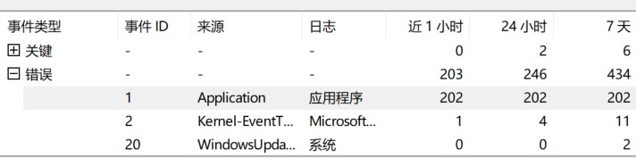
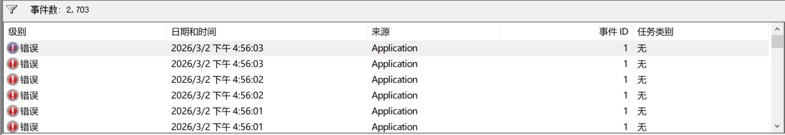
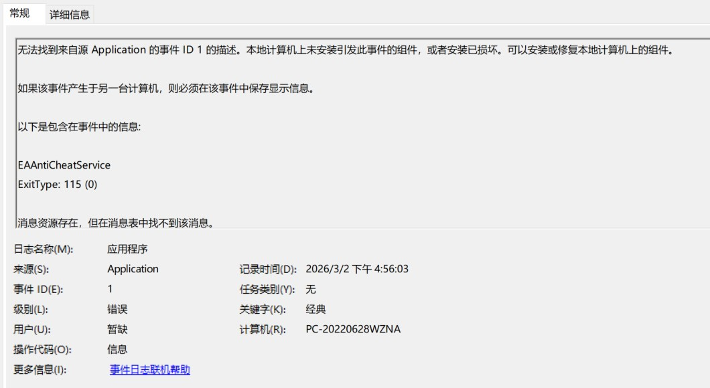

# 战地1 EA反作弊无法启动问题 ExitType: 115 (0)

20226.3.4  

## 新反作弊程序

随着战地新作的推出 如战地2042 战地6 等 EA为其添加了新的反作弊程序  
甚至连 战地1 战地五 这样的老作品 也加上了这个新的反作弊程序  

战地1作为一个2016年就已经发布的老游戏  
在2018年就已经停止了新内容的更新  

这个反作弊能不能防住外挂 暂且不说  
其防止玩家启动游戏的效果 倒是立竿见影  
反作弊程序 加载失败造成 无法启动游戏的情况数不胜数  

---

## 无法启动游戏

**更新了反作弊程序后我的战地1就没法打开了**  
症状表现为在steam上启动游戏后 联动启动 EA app  
再之后就是等待游戏窗口出现 然而等待了很长时间游戏窗口 也没有出现  

继续等待后 EA app 界面弹出 就像游戏正常退出时那样  
到steam看 游戏状态也已经从正在运行中退了出来  
**就像什么都没有发生一样 其没有任何报错**  

---

## 尝试解决

由于没有报错 于是便开始胡乱尝试 网上的各种方法  
什么 设置程序兼容性 检查文件完整性 关闭游戏内覆盖 退出杀毒软件  
从新安装 C++运行库 等各种方法 折腾了半天无一例外的都没有效果  

虽然没有报错 但是这并不意味着没有其他的症状 在反复多次尝试启动游戏的过程中  
最明显的症状就是在等待期间 系统的卡顿 以及任务管理器界面冻结  
看起来有什么东西拖慢了系统的运行  

抱着试试看的心态 打开了 Windows事件查看器 展开错误一项   
问题的答案就呈现在眼前了 **是EA反作弊服务在不停的崩溃重启**  
其在短时间内反复崩溃重启了200多次 间隔时间极短 也难怪系统会出现卡顿






**日志内容**  

```
无法找到来自源 Application 的事件 ID 1 的描述。本地计算机上未安装引发此事件的组件，或者安装已损坏。可以安装或修复本地计算机上的组件。

如果该事件产生于另一台计算机，则必须在该事件中保存显示信息。

以下是包含在事件中的信息: 

EAAntiCheatService
ExitType: 115 (0)

消息资源存在，但在消息表中找不到该消息。

```

---

## 错误代码

虽然反作弊程序启动失败的原因找到了  
但是真的这个错误代码的有用信息却并不多  

其主要部分是代码 115 错误 后面还有一个 (0) 可能表示更具体的某种情况   
但是搜索这个115错误代码  基本都是让你从新安装或者更新反作弊程序  
ea的反作弊帮助页面没有记录此错误代码 [链接](https://help.ea.com/zh/articles/platforms/pc-ea-anticheat/)  

但反复重新安装反作弊程序后也没有效果  
且如果是缺少或反作弊程序存在错误的话其应该是有弹窗提示的  

而现在的情况 是反作弊程序在启动时发生错误  
之后一直重试并继续发生错误 且没有弹窗提示  

从一篇reddit的帖子可看出 115 的含义应该是 "EA AntiCheat has detected an unacceptable configuration"  
即 “EA反作弊系统检测到不可接受的配置” 不过这个帖子里面 没有提供截图 不确定是否是弹窗错误  
不过考虑到这个提示信息的样式其应该是一个弹窗错误 而非事件查看器中的错误 [链接](https://www.reddit.com/r/battlefield_one/comments/1gukf8h/error_115/?show=original)  

在搜索过程中还看到了另外一种错误 "115(37)" 后面括号中的值发生了变化  
链接3明确显示出其来源于事件查看器而非弹窗 但相同的是这些帖子到最后都没有找到解决方法  
* [链接1](https://forums.ea.com/discussions/battlefield-6-technical-issues-en/bf6-error-115-the-latest-version-of-ea-anticheat/12821216)
* [链接2](https://steamcommunity.com/app/1517290/discussions/0/6149189044494416747/)
* [链接3](https://forums.ea.com/discussions/battlefield-2042-technical-issues-en/re-error-ea-anticheat-unacceptable-configuration-115/7043006)

此外还有 115 (254) [链接](https://forums.ea.com/discussions/battlefield-2042-technical-issues-en/easy-anti-cheat-aint-being-so-easy-why/7013235)  

---

## 解决方法

在寻找解决方法的过程中看到了b站和知乎的两个帖子  
其中提到了 可以尝试在游戏启动期间断网 从评论来看似乎有一定的效果  
[b站专栏](https://www.bilibili.com/opus/1145889547931877382) [知乎帖子](https://zhuanlan.zhihu.com/p/1994512224904041141)  

在b站的这篇专栏的评论区有人留言提到 “开着加速器就能通过，开梯子也不行，什么鬼原理”  
看起来这似乎和系统代理有关 再结合之前看到的AI生成的 一般性的提示 包括关闭代理和虚拟专用网络程序  

清除代理这项操作还没有尝试过  
我也确实在使用Windows代理 来充当加速器  

再一次抱着试一试的心态 清除Windows系统代理后  
**EA 反作弊服务不再崩溃 游戏可以成功启动了**  

但是由于没有开启代理导致无法连接 EA online 服务  
经过进一步的尝试后发现使用TAP适配器而非win代理  
来处理网络流量 可以解决问题 其不会导致报错  

更有趣的时其似乎 **只会在启动阶段进行检查**  
**而在游戏启动后 再配置系统代理则不会影响**  

至于加速器 应该是这些游戏加速器为了加速效果  
会自动清除系统代理以及host文件 使得在开启加速器时不会触发此问题  

至此 EAAntiCheatService ExitType: 115 (0) 的含义已经完全揭晓了  
其可以被翻译为 "EA反作弊系统检测到不可接受的配置：Windows系统代理"


