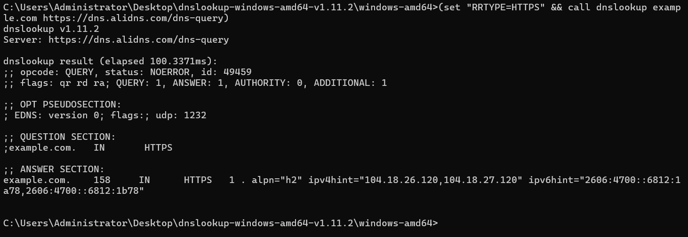
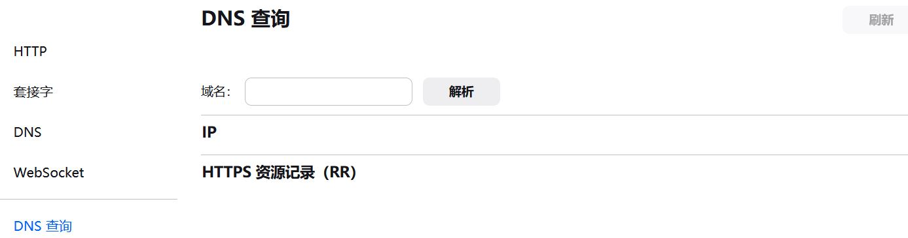
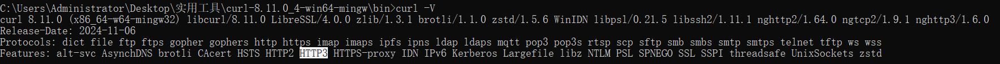
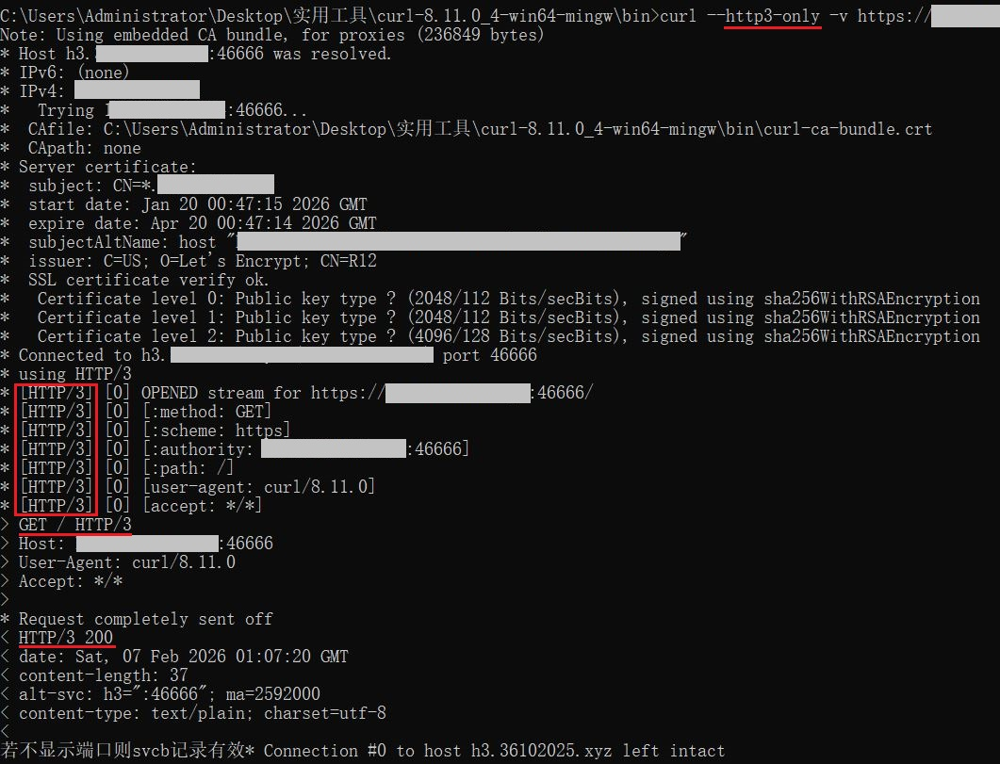
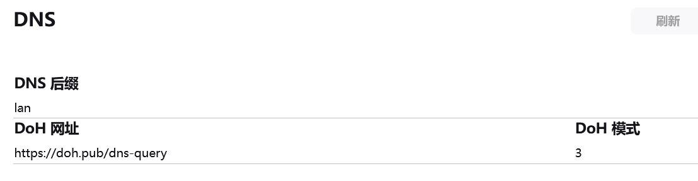

# HTTPS/SVCB记录和HTTP3/QUIC排障

2026.2.8

## 关于

在之前的教程 [使用SVCB/HTTPS记录隐藏和固定Web服务端口](../lucky-STUN/svcb-records-hidden-ports.md)  
我们实现了了通过HTTPS记录来隐藏非标准HTTPS端口  

而此教程 [使用SVCB/HTTPS解析和HTTP3搭配Lucky的STUN穿透实现无端口号自用完美访问Web服务](https://www.ytca.top/stun/2331/)  
实现了通过HTTPS记录直接发起HTTP3请求到非标准https端口 从而连接到只开放了UDP端口的web服务器  

HTTPS记录目前只能在火狐浏览器和 Safari 浏览器 **Chrome 浏览器尚不支持**  
此处记录一些排查  HTTPS/SVCB记录和HTTP3/QUIC排障经验和方法  

---

## 测试HTTPS记录和DOH服务器解析

在Linux上可以使用 dig 工具进行解析  
Windows的上nslookup.exe 不支持查询HTTPS记录  
在线HTTPS查询工具返回的结果有时并不准确  

这里找到一个第三方工具 支持doh服务器和HTTPS记录  
且可以 在Windows和Linux 等多个平台上运行的工具  
有了这个工具就能同时测试 HTTPS记录设置情况 和 DOH 服务器解析情况  

dnslookup：[链接](https://github.com/ameshkov/dnslookup)  

```
// 请求方法
(set "RRTYPE=DNS记录类型" && call dnslookup 需要查询的域名 DOH服务器URL)

// 示例
(set "RRTYPE=HTTPS" && call dnslookup example.com https://dns.alidns.com/dns-query)
```
其中的 RRTYPE 为环境变量 而非参数 所以需要用这种方法书写  
在Linux中的请求方法为：`RRTYPE=HTTPS dnslookup example.org tls://127.0.0.1`  



进一步研究发现火狐其实内置DNS查询工具 地址为：`about:networking#dnslookuptool`  
可以直接在浏览器内部查询记录内容 顺便测试填写到浏览器中的DoH服务器情况  




---

## 服务端HTTP3/QUIC测试

可以通过curl 强制发起 HTT3请求 来测试服务器的HTTP3连接情况  
这不仅用于测试 服务器的HTTP3支持情况 **也测试目标UDP端口是否打开或正确转发**  
UDP端口的测试没有TCP来的方便 很多时候不通可能是UDP端口的问题 相比之下服务端本身一般不容易出现问题  

### 使用curl进行测试

运行 `curl -V` **V要大写** 查看输出内容中是否有 `HTTP3` 字样  
Windows中预装的curl可能并不支持HTTP3 下载curl：[链接](https://curl.se/download.html#Win32)  



强制使用HTTP3连接站点 `curl --http3-only -v URL` **V要小写** 其中的v参数用于显示连接详情  
**注意URL要加上https协议头** `--http3-only`表示强制使用 HTTP3 且不允许降级  

**示例**  


---

## 其他问题

### 火狐浏览器代理设置

实验发现 在火狐浏览器中若需要使用代理 则只有 **设置socks5代理且不勾选通过代理查询DNS时**  
SVCB/HTTPS记录才能正常工作  

**设置为socks4/HTTPS代理时始终不能正常工作** 而HTTP代理不会用于HTTPS连接  
这与之前通过ECH进行间接测试的结果相同 在这些代理下DoH查询似乎不起作用  
若设置为使用系统代理则依然无法正常工作 Windows的系统代理 应该接近于socks4代理  

在勾选通过代理查询DNS时 可能会使火狐浏览器使用传统的UDP查询方法  
DoH被跳过 导致SVCB/HTTPS记录不起效果  

不过在开启通过 通过代理查询DNS 后连接的错误信息总是 `PR_END_OF_FILE_ERROR`  
这是TLS握手问题 而非DNS问题 不过尝试搜索错误信息后  
一些解决方法也提到关闭代理和虚拟专用网络  


### 火狐浏览器DoH模式

参考：[链接](https://support.mozilla.org/en-US/questions/1273281)  

>
>```
>...
>0 - Off (default). use standard native resolving only (don't use TRR at all)
>1 - Reserved (used to be Race mode)
>2 - First. Use TRR first, and only if the name resolve fails use the native resolver as a fallback.
>3 - Only. Only use TRR. Never use the native (This mode also requires the bootstrapAddress pref to be set)
>4 - Reserved (used to be Shadow mode)
>5 - Off by choice. This is the same as 0 but marks it as done by choice and not done by default.
>...
>```

```
0 - 关闭（默认）。仅使用标准原生解析（完全不使用 TRR）。
1 - 保留（以前称为竞速模式）。
2 - 优先。首先使用 TRR，仅当名称解析失败时才使用原生解析器作为备用方案。
3 - 仅使用。仅使用 TRR。从不使用原生解析器。（此模式还需要设置 bootstrapAddress 首选项。）
4 - 保留（以前称为影子模式）。
5 - 可选择性关闭。这与 0 相同，但表示此操作由用户选择而非默认关闭。
```


测试发现即使在3模式下 勾选通过代理查询DNS后 连接依然会失败  
入口：`about:networking#dns`  




### ipv4hint ipv6hint 问题

记录中的 `ipv4hint` 和 `ipv6hint` 字段似乎能替代A类记录或AAAA记录 
但火狐浏览器目前应该是并不支持此操作的 即必须要有A类记录或AAAA记录才行  
苹果的Safari有可能已经支持  

### ECH 问题

在测试过程中发现若是设置了ECH 似乎会影响到浏览器通过HTTPS记录  
直接使用QUIC(UDP)连接到仅支持HTTP3的服务器（仅开放UDP端口的服务器） 其具体原因尚不明确  


### 证书和地址输入问题

排查是否设置tls证书 证书是否受信任 证书是否过期  
~~输入时一定要写明 `https://` 协议头~~  
在输入时是否添加https协议头 对记录生效与否无影响  
