

# 「转」基于爱奇艺HCDN视频分发网络的开放缓存

2025.8.24  

> 为通过Internet向海量用户传输高清晰度、高码率的视频节目，爱奇艺融合CDN和P2P技术，开发
> 出一套适合多终端的混合分发传输网络——HCDN。本文来自爱奇艺高级技术总监庹虎在
> LiveVideoStackCon 2018大会中的演讲，由LiveVideoStack整理而成。

文 / 庹虎  
整理 / LiveVideoStack  
原文链接：<a href="https://mp.weixin.qq.com/s/glH_8yGGXGbq6DAVmUoMuA">微信公众号</a> 

大家好，我是庹虎，目前在爱奇艺负责着跨平台的P2P业务、播放器内核及直播云业务等
团队，本次分享将主要围绕HCDN技术介绍开放缓存的架构与生态。

主要内容包括以下几个方面：  

一、iQIYI视频业务挑战；  
二、HCDN网络分发技术；  
三、IOCP开放缓存及共享经济生态；  

## 一、iQIYI视频业务挑战

### 1、爱奇艺视频业务

 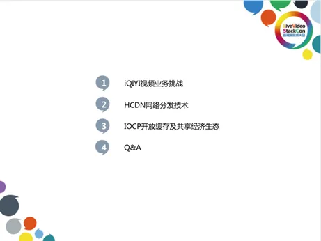 

爱奇艺成立于2010年，一直以来禀承着"悦享品质"的理念，致力于让人们平等、便捷的
享受更多、更好的视频服务。在2010年时，视频业务是以网页视频为主，大部分公司仍
然在用Adobe Flash技术做视频，包括土豆、优酷等。从2012年开始，爱奇艺顺应移动
互联网快速发展了移动视频业务，将越来越多的用户聚集在手机端观看视频，一直到最
近三年里，更进一步融合发展了移动、OTT和PC、Pad等多终端视频业务。回首来看，
实际上现在网页类的用户占比就已经非常小了。

  

目前，爱奇艺在移动市场的用户量与用户时长，以及在PC端的装机量都是第一位的，并
且在OTT市场也是第一位的，采用的是银河牌照的奇艺果APP的合作形式。爱奇艺的主
要营收来自于会员与广告两大类，加起来占比达8成以上。视频业务涵盖长视频、短视频
信息流以及各类直播等。

### 2、并发用户量波动及挑战

  

上图是典型的用户并发的状态图，横向代表时间，纵向代表并发量。从上图中可以观察
到前面一组代表着工作日，后面的两组代表着周末。在白天的同一时段，周末的用户量
会比工作日要高一点；在晚高峰时段，工作日与周末的用户量同样都是非常高的。而典
型的互联网视频分发与传统的HFC广播电视网络有很大的差别。广播网络无论是在高峰
还是低峰时段，都占用了固定的频段传送固定数量的节目频道，它的压力是完全恒定
的，跟用户数量无关。但是，基于TCP/IP网络传输视频在不同时段要传输给用户的字节
量是不一样的，在网络的拥塞程度上是有很大差别的，尤其是在晚高峰。

## 二、HCDN网络分发技术

### 1、New Network and New Strategy

  

为了应对用户量的压力，从2014年我们就开始着手准备一个新的P2P+CDN混合架构，
与大家看到的目前各大公有云宣讲的PereCDN技术是一样的。从存储的角度看待，相当
于构建了一个混合的分布式存储网络，用于分发大量的长、短视频。

 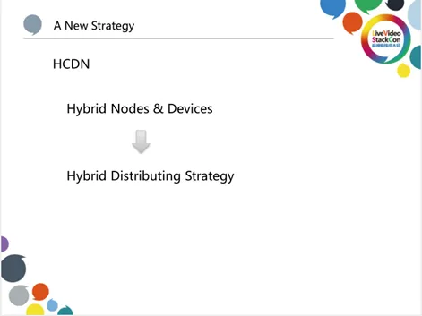 

同时，在这个网络里面，混合有大量不同类型的节点和设备，包括大的缓存设备、小的
缓存设备，可以采用多种不同的策略对视频进行均衡性的分发。

### 2、APP Stack

  

在爱奇艺APP中，HCDN出现在整个播放流程的关键环节上，中间有一些播放的SDK，
它们都是基于HCDN的网络SDK来进行一些数据的下载，底层也会包含一些增强网络的
库，包括QTP（HTTP over UDP）、MSS（即MultiCDN策略）等模块。

### 3、From C/S to Mesh

 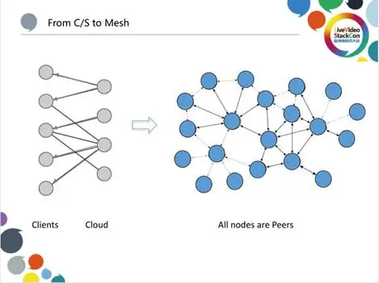 

对于绝大多数移动互联网APP来说，不管是视频还是非视频都如上图（左）展示的一
样，云和端是泾渭分明的。一端是客户端，即手机APP，另一端是云，客户端会连接不
同的云服务，客户端和云的角色是完全分开的，像一个二分图一样。但是对于视频分发
来讲，我们将其构建成一个网状结构，APP可以是客户端，同时也可以作为一个微小的
Server端服务。大量APP以及一些HCDN程序运行在大大小小不同的设备上构成一个
Mesh网络。  

### 4、Galaxy View

 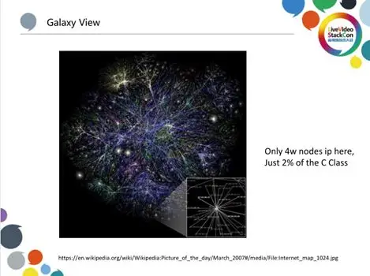 

如果将网络中所有IP的连接渲染成可视化的图，则如上图所示，其中仅包含四万个连接
关系，就看起来就像是一个星系一样丰富繁杂。而以爱奇艺当前的业务规模，每时每刻
都会有几千万的HCDN节点这样连接着，并且节点的热度状态都是变化的，如果将它们
渲染出来，就会形成一张非常庞大的星系动图。  

### 5、Marketplace View

  

在构建HCDN的过程中，实际上我们将其视为一个数据市场。在左边，我们把那些具有
上传能力的节点，称为seed（种子）；在右边，把大量只需要下载数据的节点，称为
peer，它们主要是用来不停地及时下载数据以满足播放器解码渲染的数据需求，进而为
用户带来流畅的观看体验。而我们所做的事情就包括不停地重新再平衡具有上传能力的
节点数量，平衡它们的位置、存储数据的分布，使其可以时刻满足另外一些需要下载数
据的节点的需求。为此，我们添加了一些强干预的策略和措施来更好地平衡资源的供应
和需求。在这里，我们主要从供应端进行再平衡，因为需求主要是由于内容对用户在不
同周期的吸引力变化导致的，是因用户兴趣行为导致的，所以是不可预知的。

### 6、Nodes act as Seed & Peer

 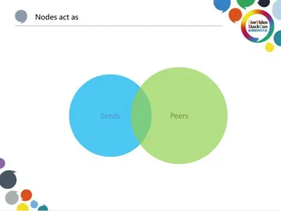 

seed种子节点与下载方的peer节点有一个交集，但是在移动互联网的持续爆发的过程
中，这个交集并不大。因此，我们在不停的从一些终端向另一些终端跨端转移供应数据
和带宽。

### 7、Supply-Demand Rebalancing in HDS

 " /> 

当我们把HCDN看作一个存储市场时，节点包括那些不同的PC、BOX等等，它们构成了一个Hybird Distributed Storage集群，Hybird是指这些节点本身的类型不一样，存储容量、上传能力等等也都是多样性的；节点是分布式的，在线与否也是不固定的。整体看这个网络，当我们调动它为Client APP服务时，相当于执行了存储系统中的"读操作"；而当我们不停的在网络中推送平衡数据时，相当于存储系统的"写操作"。整体上来讲，就是一个分布式存储，只不过存储量非常大，规模可能有几百个TB。我们通过云端的Tracker实时的追踪这些资源的上传、存储和分布状态，进行存储的再平衡。

### 8、What/How to Push

 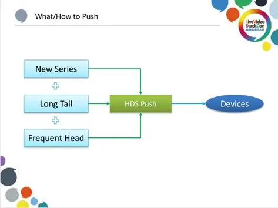 

那么，有哪些内容会不停地推送到存储网络里面呢？这里包括一些我们所能够追踪到的新连续剧的剧集、综艺的剧集。每天会有大量的新节目产生，我们会按照预测的热度进行推送，同时，会把一些过去分析的长尾资源通过不同的设备分发，以及在当前有热度较高的节目（我们称之为热门的头部内容）时，也会将其按照策略推送到不同的存储节点上。因为存储节点容量大小不一，在存储不同类型的文件时，存储策略和淘汰策略也不同。

### 9、HCDN客户端架构

HCDN客户端整体上围绕着downloading task的管理过程，同时会加载一个P2P engineering和一个CDN engineering，无论有多少CDN供应商连接到爱奇艺的系统中，都可以按照一个性价比相对较高的机制进行筛选。在这个系统中，有一个QTT的增强网络库，它包含HTTP over UDP的能力，因为大部分商业CDN是标准HTTP协议的服务。P2P 除了策略模块还包含对连接时的管理，包括对穿透的协助过程、任务的调度。因此，策略里面包括拥塞控制、上传的松驰探测、节点的交换PEX以及节点的淘汰；比如说，高丢包的节点需要丢掉，因为它的网络Over Head会比较高一点。系统整体还有一个存储模块，对于直播不需要太多的存储，但是点播是需要存储的，并且这个存储是根据用户的设备情况来动态调整的，它会去考虑分块、分片的存储以及存储之间的校验过程。除了满足围绕TaskManager去做的下载过程以外，它还会去做推送。我们的主动干预机制全部通过HDS推送模块来实现，它也会用到Strategy、P2P和CDN。在上层的接口中，我们会同时暴露一个文件的服务接口和一个Local Server的服务接口，可以使得不同类型的播放模块都能够正常的使用。

### 10、Cross Platform

  

HCDN是跨平台、跨终端的，市面上能够支持的不管是服务器还是客户端类型的一些X86、ARM、MIPS设备，我们都能够支持，操作系统包括Windows、Android、iOS、Mark、Linux以及OpenWrt。

### 11、HCDN Peer Strategy

 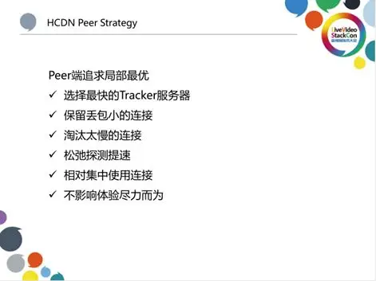 

从客户端来看，我们追求的是局部的最优。局部最优就是P2P的客户端只需要追求下载能力的最大化，这个最大化是完全围绕播放器的Buffer需要能力的最大化，它会去选择最快的下载服务器，这样也就带来了一个局部质量最优效应。因为同样选择了最快的服务器节点，在网络上也有一定的临近性，包括快速淘汰丢包高的连接，因为丢包高的连接会带来比较大的浪费，还有淘汰太慢的连接，太慢的连接影响了加载Buffer的速度，此外还有相当集中地使用一些连接。总的来说，下载的局部最优也是不影响播放体验尽力而为的策略。松驰探测的提速是只针对上传节点的局部最优而言，它并不会一开始就将带宽跑到一个最大化，而是一边跑一边去试探，如果过高就会降速，如果过低就会提速。

### 12、HCDN Tracker Strategy

 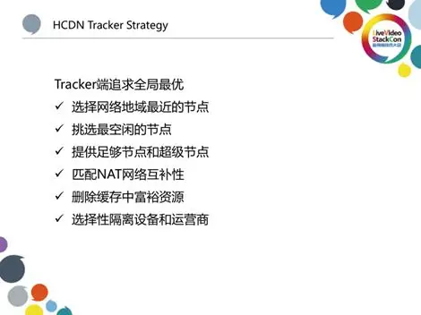 

同样在云端我们也有一套追求全局最优的策略。在给用户选择种子时，会给用户选择网络地域最临近的节点。如果是一个相对大的局域网的节点，则会去挑选最空闲的节点，尽可能地让多的节点来分担流量。此外，还会挑选非常充足的小节点和超级节点进行搭配组合，这样能保证整个下载的多条链路能更好一点。由于有一些NAT网络很难穿透，如果把对称性和对称性的节点分布在一起，基本上就跑不起来，因此，会去平衡不同的NAT类型的节点之间连接的互补性。在淘汰删除的策略上，也会尽可能尽早的去清除那些已经冗余掉的资源，因为每一个节点的存储是有限的，为了平衡，需要淘汰里面的富裕资源。我们为运营商提供的是一个友好的策略，几乎没有什么跨运营商的带宽选择，甚至都不跨地域的去调度节点，这对客户端下载方来讲，也是一个连接速度上的最优化。

### 13、HCDN Offload

 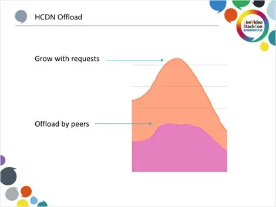 

上图是两个图叠加在一起，上面的是P2P带宽，下面的是CDN带宽。可以看出，到了晚高峰，CDN带宽不再往上涨，但是P2P带宽还在上涨，如果把它叠加起来，意味着晚高峰用户量还是在上涨的，如果没有HCDN的P2P机制来Offload这些带宽的话，这些带宽叠加到CDN上是非常高的，是非常重的一个压力和成本负担。

## 三、IOCP开放缓存及共享经济生态

### 1、IOCP对象

  

爱奇艺在HCDN网络成熟稳定后，进一步地延伸发展了HCDN Inside业务，将它推广部署到我们的一些缓存类合作伙伴的设备中，其中包括一些小运营商的合作伙伴、小区宽带的服务商、闲置的专线带宽商家以及一些存储盒子和路由器包括小米、华为等，一起构建了爱奇艺开放缓存计划，使各类合作伙伴能够带着自己的优势、富裕资源加入到爱奇艺的视频分发生态，获取相应的收益。

### 2、IOCP中小运营商

 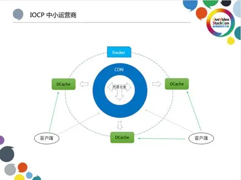 

对于中小运营商而言，我们会提供免费的硬件和软件，使其能够免干预的直接将机器挂上线，挂上网络后就可以分发爱奇艺的一些内容。这样对他们来说，减少了一些跨网的流量，因为我们提供的这些内容的整个分发过程都是不需要运维的，所以对他们来说，操作起来也非常的简单。我们将节点称为DCache超级节点，我们把它直接挂在P2P网络里面，通过HCDN技术为中小运营商网内的爱奇艺用户客户端提供流量。

### 3、IOCP单位/小区带宽

  

同样地，对小区宽带的服务商来讲，它的规模相对更小，可能只是服务于某个小区的几千户家庭。我们也会给他们提供软件，让他们部署到设备上去，减少小区宽带的一些网络拥塞情况，给他们带来一个更好的上行流量改善，给用户带来一个更好的观看体验。

### 4、IOCP家庭存储设备商

  

IOCP家庭存储设备商是指那些做存储盒子、OTT盒子的商家，他们有一些做出来的盒子可以群组成一个盒子的矿场或者集群。在这类设备上也有大量部署我们的软件，可以把与其一起组编成一个大的存储来服务在那个区域的用户。

### 5、IOCP网络集成服务商

  

IOCP网络集成服务商是指做单位或园区宽带接入的服务商，他们会集成爱奇艺的HCDN Inside软件，在它的X86的服务器下面，就可以存主动的、动态的存很多爱奇艺的内容。同时，也可以服务它内网的用户，以此来节省一些上行链路带宽，如果还有冗余，它也能服务一些外网的用户，这样就会带来一些营收。我们的开放缓存计划IOCP（iQIYI Open Cache Program），实际上是一个资源流量分账的业务。 

### 6、IOCP HDS资源错峰更新

  

在管理这些缓存时，我们会预测它的内容热度变化，去帮它去主动更新淘汰。在上图中的蓝色部分是指在低峰时段去帮它更新内容的带宽，绿色部分是指在高峰时段去帮它为用户提供带宽，赚取收益的一些行为。错峰运营的绿色模式对网络内的其他网络行为影响也就非常小。

## 7、HDS资源可视化分析

  

我们对于内容的分析，实际上就是对资源热度变化分布的分析，在内部会有非常多的工作。其中包括热度的变迁过程，上图（右）为热度迁移图。

### 8、不同终端从HDS上获取数据的能力

 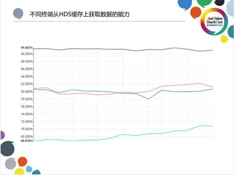 

在HCDN分布式网络中，不同的客户端能够获取视频数据的比例是不一样的。如上图所示，最高的可以做到90%以上，中间的几类平台也能做到80%以上，并且部分在网络方面有局限性的设备也能够做到70%以上，这里特指下载方的设备如移动端的手机。对于开放缓存的供应商合作伙伴来讲，可以通过接入HCDN网络获得非常大的总带宽份额

### 9、视频行业发展对更大规模分发的需要

 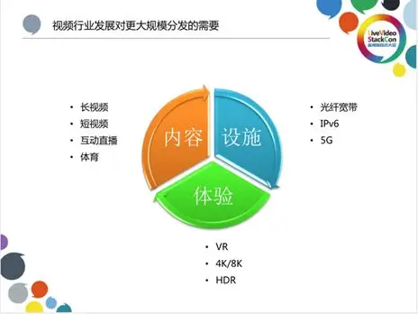 

就当前行业来说，随着基础设施越来越好，光纤宽带、宽带中国政策的推进，很多家庭接入的带宽可以达到50M~100M。另外，IPV6的快速推进以及5G网络的发展，也都使得带宽变得越来越高。对于用户来讲，他们对内容的需要会变得更加多样化，包括VR视频、4K/8K的超高分辨率的视频、HDR视频。VR视频带来的带宽的急速翻倍， 4K/8K的超高分辨率的视频和HDR视频都会使得用户对体验越来越苛刻，也会使得视频服务平台的带宽进一步上涨。从内容的角度来讲，我们提供长视频、短视频、互动直播并引入优秀的体育赛事节目，整体上会带动对大规模分发、大规模带宽的需要。所以对IOCP更大规模的分发业务来说，现在并不是发展结束，而是代表着新一轮发展的开始。

### 10、HCDN+IOCP的产学结合

 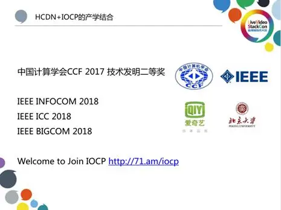 

在做技术的过程中，我们也会与国内的一些高校合作。比如2018年与北京大学的一系列合作也已经产生了一些产学研的结果。在过去，高校大多会重点研究国外公司的技术，不过由于目前国内的用户量和业务量都非常大，并且在复杂程度上也并不输于国外，因此对国内技术与业务生态的研究也可以得到很好的发展。欢迎大家关注和参与IOCP计划和HCDN Inside业务。

 

