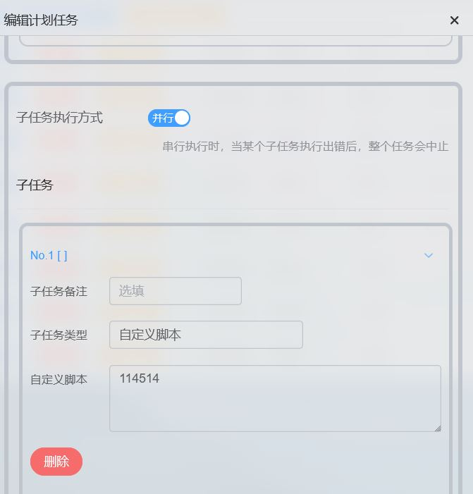
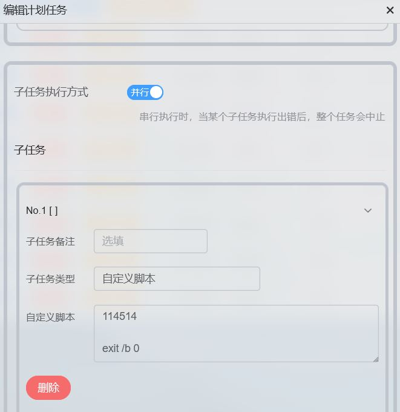
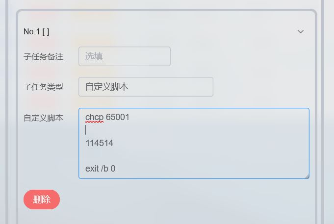

# Lucky 执行批处理报错和乱码问题

2026.2.18  

在之前的教程中我们大量使用了lucky的自定义脚本功能   
此部分记录解决lucky运行批处理时报错和乱码问题  

## 解决脚本报错时不显示错误信息

当lucky调用的批处理脚本执行错误时只会返回退出代码  
而不会显示执行过程中的任何信息  

可通过将退出代码设置为 0 即正常退出来解决此问题  
在尾部添加 `exit /b 0`即可  

---

## 解决日志乱码问题

问题表现为输入的中文字符显示是正常的 而cmd提示的中文字符  
"不是内部或外部命令，也不是可运行的程序"显示出来是却是乱码的  

这其实又是一个编码问题 lucky在创建批处理脚本和读取返回内容时  
使用的都是utf8 而cmd在执行批处理时的默认编码不是utf8  
对于简体中文环境下来说一般是 936 区域即 GBK 编码  

这导致 "不是内部或外部命令，也不是可运行的程序" 这段系统提示  
使用的是GBK编码 通过utf8解码后会变成一堆菱形带上的问号乱码  
而批处理文件使用的是utf8保存的其中的中文显示是正常的  

有趣的是如果手动创建一个以utf8编码保存的批处理文件并双击运行后  
输出的情况则是完全相反的 系统提示的中文内容显示正常  
而批处理脚本内的中文字符变成了乱码  

在开始部分添加 `chcp 65001` 切换区域为utf8即可解决乱码问题  
此时系统提示变成了英文  

