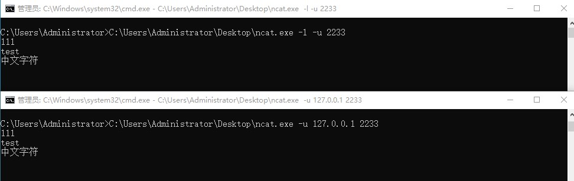

# 在Windows上使用ncat测试UDP端口

2025.11.5  

## UDP端口扫描问题

在之前的教程中我们常使用TCP端口扫描工具来探测TCP端口是否已经打开  
但是较少涉及到UDP端口的检查  
由于UDP的无连接性（无法进行SYN扫描）提供UDP扫描的网站少之又少  

事实上我们需要测试的并不是UDP端口本身  
而是防火墙/NAT上指定的UDP端口转发/放行规则是否生效  
为实现此目的我们所需要的是**一个便于收发UDP包的程序**  

这里使用ncat：[链接](https://nmap.org/ncat/) 其是natcat工具的延续：[链接](https://sectools.org/tool/netcat/)  

## ncat

Linux上可以安装 nmap 软件包 其中就包含了 ncat  
在Windows上也可以安装nmap软件包对应的Windows版本：[链接](https://nmap.org/download.html#windows)  

不过更简单的方法其实是 使用静态链接后的单文件程序  
就像之前使用 [tcping](https://www.elifulkerson.com/projects/tcping.php) 那样 下载：[链接](https://nmap.org/ncat/)  

值得注意的是官方提供的这个版本已经十分陈旧  
当然如果只是来收发UDP的话其实问题不大  

ncat 本身是有建立htpps连接功能的  
这个旧版本中openssl组件已经过期 应该已经无法正常建立https连接  
此处找到一个较新编译的版本：[链接](https://github.com/jangotek/netcat)  

## UDP消息收发

测试时需要运行两个 ncat  
一个用于监听需要转发/开放的端口 另一个向此端口发送UDP数据包  
可以先在局域网中测试 为确保测试效果两个客户端最好不在同一个网络内（同一NAT下）  

监听UDP端口：`ncat -l -u 端口号`  
回车后进入监听状态 会将接收到内容显示在终端内  

发送UDP消息：`ncat -u IP 端口 `  
回车后进入发送模式 输入要发送的消息后回车以发送消息  

**检视效果**  

## 参考

 [使用 netcat 读写 TCP UDP 数据包](https://mjd507.github.io/2018/01/15/Use-netcat-to-transfer-TCP-UDP-Data/)