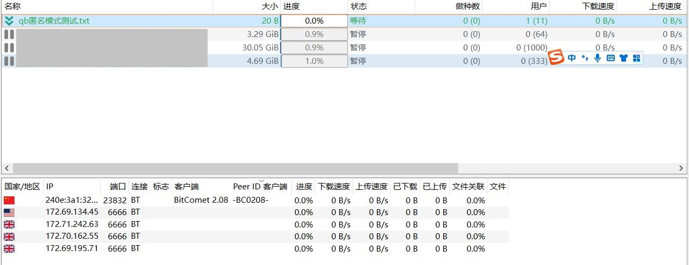

# 关于 qbittorrent 在匿名模式下能否以被比特彗星正确识别问题的研究

2024.9.8  

[原帖地址](https://www.cometbbs.com/t/208%E6%B5%8B%E8%AF%95%E7%89%88/92328/77)  

>zhuxiaoying85309  
>显示n/a是对方没有汇报自己的客户端名称，比如qb启用了匿名模式后，由于设置匿名后不进行汇报客户端名称也会显示为n/a  
>  
>zhuxiaoying85309  
>其实是对方启用了匿名模式，你可以测试一下qb打开匿名后，就显示不出客户端名称信息了  

---

### 实验准备

**qbittorrent 客户端信息**  

**比特彗星 客户端信息**  

### qbittorrent 开启匿名模式

两客户端同时下载相同的测试资源  
观察两客户端的用户栏信息  

**比特彗星**  

**qbittorrent**  

观察比特彗星中对端 qbittorrent 的客户端名称  
qbittorrent 被正确识别  

>hz6615997184904  
>一个辨认方法是，通常扩展标识是带斜杠的。  
>下图中qB版本都一样，但是中间两个显示的客户端标识没有斜杠，应该是关闭了扩展消息中的项目。  

其版本号中没有斜杠 应该是通过 peer ID 来判断的  

### 检查 peer ID

**十六进制原始ID**
`2d7142343535302d654474704d732a4975427365`  

解码后的字符串：  
`-qB4550-eDtpMs*IuBse`  
peer ID 为标准的 qbittorrent ID  

查看 qbittorrent 文档中对匿名模式的解释：[链接](https://github.com/qbittorrent/qBittorrent/wiki/Anonymous-Mode)

从文档来看在匿名模式下 qbittorrent 确实不会通过通告自己的客户端名称  

不过没有对更旧版本的 qbittorrent 进行测试  
但从文档来看即使在更旧的版本中 匿名模式下  
**客户端依然会正确传递 peer ID**  

>hz6615997184904  
>没有扩展消息的客户端标识时  
>–若peerid能被识别，则显示peerid识别的标识  
>–若peerid无法识别，则显示n/a（无括号）  

而比特彗星可以在对端没有通告客户端名称的情况下  
通过 peer ID 识别客户端类型 若其在已知列表中  

**结论：qbittorrent 在匿名模式下可以被比特彗星正确识别不会出现 n/a 的情况**  