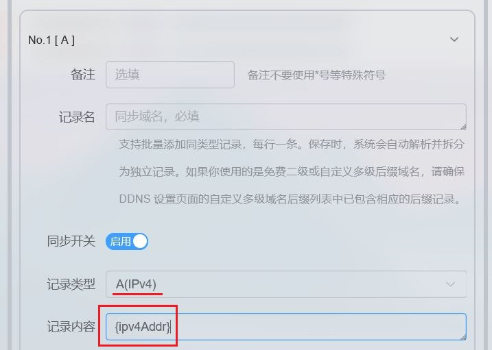
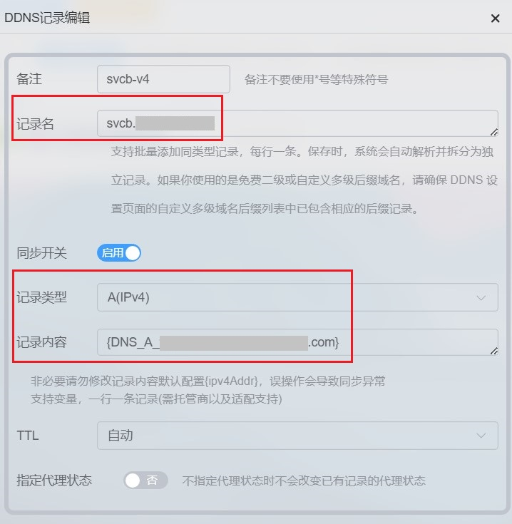
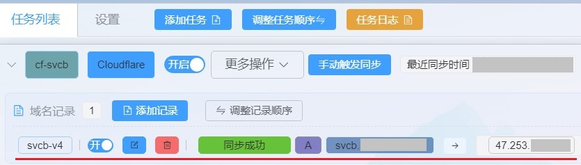

# SVCB/HTTPS记录与免费FRP穿透配合使用

2026.2.13  

## frp穿透和web服务

在之前的教程中 [使用SVCB/HTTPS记录隐藏和固定Web服务端口](../lucky-STUN/svcb-records-hidden-ports.md)  
我们已经实现了通过SVCB/HTTPS隐藏HTTPS非标准端口以及免端口号输入  

不过STUN穿透并不能总是成功 在这种情况下  
中继方案就成为了唯一的选择  

SVCB/HTTPS记录与frp的使用与stun类似  
只不过数据通道由STUN穿透隧道 变成了frp转发隧道  

值得注意的是 若要使用国内节点进行穿透  
原则上需要进行备案 但有趣的是这仅限于HTTP(s)隧道  

使用TCP隧道则不需要 但由于HTTP是明文传输 未备案的域名可能会被阻断  
HTTPS则不会 尽管理论上可以通过SNI进行阻断  
但是目前似乎没有采用这样这样的措施  

这样一来就可以使用免费frp节点加HTTPS  
在没有备案的情况下搭建WEB服务  

但针对SVCB/HTTPS记录的应用还有一个更大的问题需要解决  
**那就是IP解析问题**  

---

## 遇到的问题

与STUN通过穿透服务器获得本地对外IP不同  
ftp连接的是专门的穿透节点   
在穿透成功后会显示对外的IP或者域名  

**问题就出在如何将这样IP传递给自己使用的域名**  
在过去解决方法很简单使用 cname 记录 或者干脆用IP进行连接  

**如若需要长期运行的话 使用域名会更加稳妥**  
以防止节点IP变化后无法及时更新 造成访问中断  

但是在此基础上使用 SVCB/HTTPS 时就会遇到问题  
**cname 具有极强的排他性** 与之同名的其他记录  
无论是 A类记录 MX记录或者其他什么类型的记录都会失效  

因为 cname 是别名 **本质上是让系统去查询其指向的域名**  
所有内容都从指向的域名中获取 这会导致SVCB/HTTPS记录失效  

虽然SVCB/HTTPS 中有别名模式 但其更像是 一个小的cname  
只适用于SVCB/HTTPS记录 即去查询其他的SVCB/HTTPS记录  

---

## 可用的解决方法

这里使用的方法是 通过程序定时检查给定记录的IP  
并同步到自己的域名下 此处使用lucky进行更新  

其中最重要的是全局变量 `{DNS_记录类型_记录名}`  
用于查询 DNS 记录，若存在多个记录，则随机返回一条  
全局变量：[链接](https://lucky666.cn/docs/modules/globaldata)  

将此变量填写入lucky的动态域名规则中即可 替代默认规则的中的 `{ipv4Addr}`  
有关lucky 动态域名 的使用方法请参考之前的教程：[链接](../lucky-STUN/lucky-ddns-2.15.md)  
举例 `DNS_A_example.com` 表示查询并返回 `example.com` 的A类记录  

**示例**  

---

## 纯HTTP3可能遇到的问题

此问题似乎仅出现在 使用纯HTTP3才能到连接的站点 即只进行了UDP穿透  
且同号TCP端口未打开 与此同时 SVCB/HTTPS 记录内alpn的值仅填写了 h3  

在这种情况下火狐浏览器似乎会优先使用TCP访问 443端口  
而不是直接向记录中指定的端口发起 HTTP3连接  

导致连接上了穿透节点的HTTPS代理入口  
又因为未设置对应的HTTPS隧道和域名导致名称不匹配返回报错  

存在这样的行为也不难理解 毕竟现在纯HTTP3站点几乎不存在  
可以通过在本地阻断目标IP的 443 端口 来解决此问题  
但就目前的情况而言还是应该主要使用h2而非h3  

