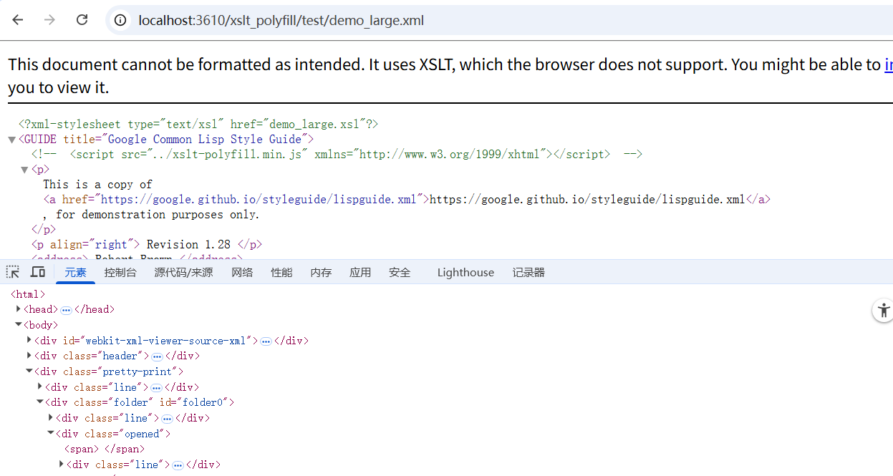
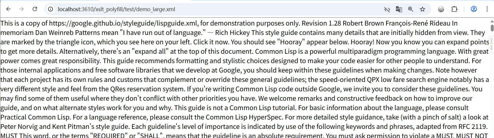
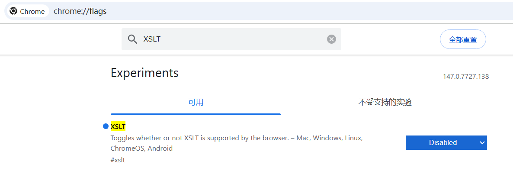
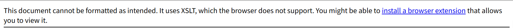

# XSLT被移除后的RSS美化方案

2026.5.7  

## RSS美化

RSS本质是XML文件 其在用浏览器中打开后 只会显示一个XML 文档树  
这其实并不是什么问题毕竟XML文件的主要职责是传递数据  
而不是展示数据 展示工作是HTML的工作  

有关RSS 的内容可以看之前的文章：[Feed RSS ATOM 以及 Feed JSON](./feed-rss-atom-json.md)  
在阅读了[在Google杀死XSLT之后的XML美化方案](https://mabbs.github.io/2026/02/08/xslt.html)后了解到了一种 技术名为 **XSLT**  

其可以将XML文件按照一定的规则转换成HTML  
这样在浏览器上就可以看到一个较为友好的界面  
于是乎我也对自己的RSS订阅源进行了美化  

---

## XSLT与xsl样式表

XSLT（Extensible Stylesheet Language Transformations）可扩展样式表转换语言  
其主要用于将一个 XML 文档转换为另一种形式的文档如 XHTML HTML 或其他格式  

而xsl文件则用来记录转换规则 其使用.xsl 或 .xslt 作为后缀  
两者在功能上没有区别 类似于 .html 和 .htm  

若需要对一个RSS订阅源（XML文件）进行美化需要在其头部添加声明  
以表示使用指定的xsl样式表进行转换 这个转换过程浏览器完成  
`<?xml-stylesheet type="text/xsl" href=".xsl文件路径"?>`  

参考：  

```
<?xml version="1.0" encoding="utf-8"?>
<?xml-stylesheet type="text/xsl" href="/rss.xsl"?>
<rss version="2.0">
    <channel>
    ...
```
事实上 XSLT 有 1.0 2.0 3.0 等多个版本 而主流浏览器目前只支持 1.0  
2.0 和 3.0 更多用于数据处理方面  

---

## XSLT 转换流程

简单来讲 xsl样式表 允许你以 XML的数据为基础  
自由的构建新的内容 在此处是 HTML 内容  

其允许添加和引入新的内容 包括 HTML元素 js脚本和CSS样式表  
如果不需要XML中的某些元素及内容 那在写 xsl文件的时候就不设置对应的匹配规则  
这样那些不被需要的内容就不会被带到新生成的 HTML文件中  

<details>
<summary>本博客中使用的xsl样式</summary>

```
<?xml version="1.0" encoding="utf-8"?>
<xsl:stylesheet version="1.0" xmlns:xsl="http://www.w3.org/1999/XSL/Transform">
  <xsl:output method="html" encoding="utf-8" indent="yes" />

  <xsl:template match="/">
    <html lang="zh-CN">
      <head>
        <meta charset="utf-8" />
        <title>ie12sBlog - Windows Internet Explorer</title>
        <link rel="shortcut icon" href="/favicon.ico" type="image/x-icon" />
        <link rel="stylesheet" href="/rss-style/xp.css" />
        <link rel="stylesheet" href="/rss-style/rss-style.css" />
      </head>
      <body>
        <!-- 模拟浏览器窗口 -->
        <div class="window ie-window-frame">
          <!-- 标题栏 -->
          <div class="title-bar">
            <div class="title-bar-text">
              <div class="title-bar-icon"></div>
              <span>ie12sBlog - Windows Internet Explorer</span>
            </div>
            <div class="title-bar-controls">
              <button aria-label="Minimize"></button>
              <button aria-label="Maximize"></button>
              <button aria-label="Close"></button>
            </div>
          </div>

          <div class="ie-client-area">
            <!-- 导航区 -->
            <div class="ie8-nav-zone">
              <div class="ie8-nav-buttons" title="后退/前进"></div>
              <div class="address-bar-container">
                <div class="address-favicon"></div>
                <select class="ie8-address-select">
                  <option selected="selected">https://ie12blog.36102025.xyz/rss.xml</option>
                </select>
              </div>
              <div class="action-button-group">
                <div class="address-action-div" title="刷新"><div class="action-icon" id="ie-go-btn-icon"></div></div>
                <div class="address-action-div" title="停止"><div class="action-icon" id="ie-stop-btn-icon"></div></div>
              </div>
            </div>

            <!-- 菜单栏 -->
            <div class="ie8-menu-bar">
              <menu role="tablist" style="margin:0; padding: 2px 10px; display:flex; gap:15px; list-style:none;">
                <li style="font-size:12px; cursor:default;">文件(F)</li>
                <li style="font-size:12px; cursor:default;">编辑(E)</li>
                <li style="font-size:12px; cursor:default;">查看(V)</li>
                <li style="font-size:12px; cursor:default;">收藏夹(A)</li>
                <li style="font-size:12px; cursor:default;">工具(T)</li>
                <li style="font-size:12px; cursor:default;">帮助(H)</li>
              </menu>
            </div>

            <!-- 网页主内容 (包含嵌入式提示) -->
            <div class="web-page-content">
              <div class="rss-info-banner">
                <div class="rss-icon-small">RSS</div>
                <div>
                  这是一个RSS订阅源。 复制当前URL到RSS阅读器，即可订阅本博客的所有文章。
                </div>
              </div>

              <div class="feed-container">
                <div class="feed-header">ie12sBlog</div>
                <xsl:for-each select="/rss/channel/item">
                  <div class="entry-item">
                    <a class="entry-title" href="{link}">
                      <xsl:value-of select="title" />
                    </a>
                    <div style="color:#666; font-size:12px; margin-bottom:12px;">发布日期: <xsl:value-of select="pubDate" /></div>
                    <div style="line-height: 1.6; color: #333; font-size: 13px;">
                      <xsl:value-of select="description" disable-output-escaping="yes" />
                    </div>
                  </div>
                </xsl:for-each>
              </div>
            </div>

            <!-- 状态栏 -->
            <div class="status-bar">
              <p class="status-bar-field">完成</p>
              <p class="status-bar-field field-zone">Internet</p> 
              <p class="status-bar-field field-zoom">100%</p>
            </div>
          </div>
        </div>

        <!-- 窗口之外，网页最底部的信息行 -->
        <div class="global-footer-info">
          Powered by <a href="https://botoxparty.github.io/XP.css/" target="_blank">XP.css</a>
        </div>
      </body>
    </html>
  </xsl:template>
</xsl:stylesheet>
```
</details>


---

## Chrome正在计划移除XSLT

[移除 XSLT 以打造更安全的浏览器](https://developer.chrome.com/docs/web-platform/deprecating-xslt?hl=zh-cn) Chrome计划从版本 158（2026 年 11 月 17 日）开始移除XSLT支持  

谷歌方面给出的移除原因可以被简单总结为 “XSLT在浏览器用的很少 没有必要继续维护了”  
其统计指出 "如今只有大约 0.02% 的网页加载会实际使用 XSLT，而使用 XSLT 处理指令的网页加载不到 0.001%"  
此外除了Chrome 其他两个主要浏览器引擎也支持从 Web 平台移除 XSLT：[WebKit](https://github.com/whatwg/html/issues/11523#issuecomment-3149280766)（苹果Safari浏览器）、[Gecko](https://github.com/whatwg/html/issues/11523#issuecomment-3149788558)（火狐浏览器）  


### 可用的解决方法

在移除计划中 也提到了解决方法 对RSS订阅源来说  

可以在网页中使用 `<link rel="alternate" type="application/rss+xml">`  
使用此链接后 在订阅时直接输入HTML页面地址 阅读器可以通过其自动发现RSS订阅源  

而不是使用`<a>`普通标签 让用户去点击 这样用户就看不到XML文件 也就不需要XSLT转换了  
但既然做了 RSS美化 那肯定是希望别人看到的 所以此方案不可行  

剩下两个比较现实可行的方法分别 **CSS样式表法 和 混合XHTML法**  

---

## CSS样式表法

用于设置 XML样式表的 `xml-stylesheet` 声明 除了支持xsl样式表还支css样式表  
移除XSLT支持只是不能再使用 xsl样式表了 我们还可以使用 CSS样式表  

不过只CSS样式表的局限性极大 因为CSS不能添加新的元素  
其只能是修饰现有的XML元素 虽然可以使用  `::after` 和 `::before` 伪元素添加少量新的内容  
但最致命的问题是由于不能添加 **超链接** 这使得仅使用css优美化的 xml 页面上的内容只能看不能点  

虽然 rss xml 中的内容包含了有效的超链接内容 但是其被放在 xml的link元素内  
浏览器只会认为其是纯文本 而不是链接  

---

## 混合XHTML法

XTLS移除后xml美化的最大问题是 **xml中的各项元素在浏览器中只会被当做纯文本处理**  
而无法被作为html元素处理 又因为xml语法的严格性 我们也无法在其中直接加入html元素  
这会破坏xml文件的规范性 导致浏览器报错并停止解析  

所以我们需要一种 既符合xml语法又可以被浏览器当做html元素来处理的东西  
而XHTML就完美符合我们的需要 **XHTML简单来说就是用XML的语法来书写的HTML**  

我们可以使用 **命名空间** 将XHTML元素引入 RSS 订阅源  
这样既不会破坏xml文档格式 又可以让浏览器以html的方式处理这些新的元素  

这样我们可以使用任何XHTML元素即html元素 **包括 javascript 元素**  
**解锁了js脚本后就解锁了无限的可能性**  

---

## 本地JS脚本解析方案


### 使用JS脚本进行XSLT转换
 
此方案和原先的XSLT方案基本一致  
只是将浏览器内置XSLT的处理功能转移到了外挂的js脚本中  

只需要在原有的订阅源中插入一个XHTML的script元素  
引入用于进行XSLT转换的js处理脚本即可   
这个js脚本会读取xml头部声明的xsl样式表以完成XSLT转换工作  

其插入的位置应该在 rss 根节点下 channel 节点上  
其不能放在rss根节点元素之上 其属于元素而不是声明  
chrome迁移方案中给出的插件是[ **polyfill** ](https://github.com/mfreed7/xslt_polyfill) 

**示例**  
```
<?xml version="1.0" encoding="utf-8"?>
<!--注意 .xsl样式表声明需要保留-->
<?xml-stylesheet type="text/xsl" href="/rss-style/rss-style.xsl" ?>
<rss version="2.0" xmlns:atom="http://www.w3.org/2005/Atom">
<script src="/xslt_polyfill/xslt-polyfill.min.js" xmlns="http://www.w3.org/1999/xhtml"></script>
    <channel>
    ...
```


### 使用自定义js脚本

既然都已经用上js脚本了 那其实也不再需要依赖xsl样式表了  
完全可以编写自定义的js脚本 让网页按照喜欢的方式变成喜欢的样子  

当然如果已经编写了xsl样式表 那还是用上一个方案会比较好  
这样就可以继续使用之前的样式表而不用从头开始写js了  

---

## 服务端预生成方案

除了在客户端侧进行转换外 也可以在服务端 提前将xml转换成一个html文件  
再通过js脚本来显示这个预生成的html页面 这样转换过程就转移到了服务端  

在本博客中使用js创建了一个iframe窗口用于覆盖原有xml内容 以显示预生成的美化页面  
当然也可以用js把预生成 html内容复制过来替换现有内容  

至于在服务端如何进行xml文件的转换其实和之前在客户端上方法差不多  
如果已经编写了xsl文件 那就使用可以进行XSLT转换的脚本或程序  
如果还没有创建xsl文件 那就可以自己实现xml到html的转换过程  

之所以使用iframe是因为担心在xml文档浏览器下会使用非标准渲染方法  
从而产生布局偏移或其他奇奇怪怪的问题 但是实测下来发现  
**其是以标准模式渲染的** 不会有显示方面的问题  

---

## CSS 兜底方案

若用户的浏览器禁用了 javascript 功能  
则所有js脚本都无法运行 此时用户会看到xml文本内容  
确切的来讲是以纯文本形式显示的xml内容 所有的内容会胡在一起  

事实上在直接打开没有样式表的xml文档时  
所看到的能够展开和折叠XML文档树也并不是XML文件的本来的样子  

其也是经过转换后所生成的HTML页面 浏览器内置了一套默认的转换样式  
以处理那些没有声明样式的xml文件 不过在 **混合XHTML** 后  
浏览器就不会再使用这一套默认样式 导致看到XML内容变成一堆纯文本  




这一堆胡在一起的纯文本比xml文档树还难阅读  
我们可以使用css解决这个问题 为这些 “纯文本”赋予样式  

与纯css方案的设置相同 只不过此处 其不作为主力显示  
只是为了在js脚本无法运行时维持住页面样式而已  

与html中的css不同 在RSS源中没有class和id  
主要通过元素的层级来进行选择 当然直接作用于元素的选择器依然可用  

<details>
<summary>参考css配置</summary>

```
/* 针对 RSS 根节点及 channel 的基础布局 */
rss, channel {
    display: block;
    background: #3b70b3; /* 还原经典 XP 蓝色背景 */
    font-family: "Microsoft YaHei", "微软雅黑", sans-serif;
    margin: 0;
    padding: 0;
}

/* 调整 rss 容器，通过 padding 让内容区与上下边缘产生间距 */
rss {
    padding: 30px 0; /* 上下预留 30px 的间距 */
    min-height: 100vh;
    box-sizing: border-box;
}

/* 模拟网页主内容区容器 */
channel {
    max-width: 1000px;
    margin: 0 auto;
    /* 修改 min-height，确保高度自适应内容且不再强制撑满全屏 */
    min-height: calc(100vh - 60px); 
    border: 1px inset #716f64;
    background: white;
    box-shadow: 10px 5px 5px rgba(0, 0, 0, 0.2); 
}

/* --- 顶部黄色 RSS 提示横幅 --- */
channel > description {
    display: block;
    background: #ffffcc; /* 浅黄色背景 */
    border-bottom: 1px solid #e1d2b8;
    padding: 15px 25px;
    margin: 0 0 25px 0;
    font-size: 0; 
    line-height: 1.8; 
}

/* 插入指定的提示文字，并强制换行 */
channel > description::after {
    content: "这是一个RSS订阅源。 复制当前URL到RSS阅读器，即可订阅本博客的所有文章。\A 如果您看到此段内容说明 JavaScript 已经禁用，为获得更好的显示效果请启用 JavaScript 功能。";
    color: #000;
    font-size: 13px; 
    display: inline-block;
    /* 修改为 middle 以实现与图标的中线对齐 */
    vertical-align: middle; 
    white-space: pre; 
    font-weight: bold;
}

channel > description::before {
    content: "RSS";
    background: #ff6600;
    color: white;
    font-weight: bold;
    font-size: 10px; 
    padding: 2px 6px;
    margin-right: 12px;
    border-radius: 2px;
    display: inline-block;
    /* 修改为 middle 实现垂直居中对齐 */
    vertical-align: middle; 
}

/* --- 订阅源标题 (Feed Header) --- */
channel > title {
    display: block;
    padding-top: 20px;
    padding-left: 40px;
    padding-bottom: 5px;
    color: #2b579a;
    font-size: 24px;
    height: 45px;
    font-weight: bold;
    border-bottom: 1px solid #2b579a;
    background: #ebe9d7; 
}

/* --- 文章条目 (Entry Item) --- */
item {
    display: block;
    padding: 0 40px 15px 40px;
    margin-bottom: 30px;
    border-bottom: 1px dotted #ccc;
}

item > title {
    display: block;
    font-size: 18px;
    color: #2b579a;
    font-weight: bold;
    text-decoration: underline;
    margin-bottom: 8px;
    cursor: pointer;
}

/* 发布日期容器 */
item > pubDate {
    display: block;
    color: #666;
    font-size: 12px;
    margin-bottom: 12px;
}

/* 使用伪元素添加“发布时间：”字样 */
item > pubDate::before {
    content: "发布时间：";
}

item > description {
    display: block;
    line-height: 1.6;
    color: #333;
    font-size: 13px;
    white-space: normal;
}

/* --- 隐藏元素 --- */
link,
guid,
docs,
generator,
copyright,
lastBuildDate,
language {
    display: none;
}
```

</details>


---

## 闪烁问题解决

由于外联js脚本加载和处理需要时间 在处理完成前 浏览器可能会显示出纯文本的xml内容  
或者用于兜底效果的css美化页面 显示内容切换就会造成页面闪烁  

解决方法是在rss的xml内加入一段内联js脚本  
给xml节点设置样式以将其隐藏起来 外联js脚本处理完成后再删除此样式  

**参考**  

```
<script xmlns="http://www.w3.org/1999/xhtml">
//<![CDATA[
    (function() {
        var head = document.getElementsByTagName('head')[0] || document.documentElement;
        var style = document.createElementNS('http://www.w3.org/1999/xhtml', 'style');
        style.textContent = 'rss, channel, item { display: none !important; }';
        head.insertBefore(style, head.firstChild);
    })();
//]]>
</script>
```

---

## 测试方法

目前 XSLT 功能还没有被禁用 浏览器依然会通过xsl样式表对xml文件进行转换  
这会影响对我们测试 css 和 js脚本的效果  

在Chrome 浏览器中的实验性功能页面 `chrome://flags ` 内搜索 "XSLT"  
将XSLT设置为 disable 重启浏览器即可  



有趣的是在关闭 XSLT功能后Chrome浏览器会提示 **浏览器不支持XSLT功能**  
引导你去安装一个浏览器插件来实现XSLT转换  



---

## 参考


[为什么你应该使用 XSLT 3.0](https://www.reddit.com/r/programming/comments/1n3mou2/why_you_should_be_using_xslt_30/?tl=zh-hans)
[Displaying XML Using CSS](https://www.geeksforgeeks.org/css/displaying-xml-using-css/)
[使用XSLT为博客XML文件编写主题一致的样式](https://mabbs.github.io/2025/07/01/xslt.html)
[在Google杀死XSLT之后的XML美化方案](https://mabbs.github.io/2026/02/08/xslt.html)
[Style XML Feeds Without XSLT](https://github.com/dfabulich/style-xml-feeds-without-xslt)
[使用XSLT转换XML](https://www.cnblogs.com/qi-dian-ao/p/8470774.html)
[XSLT 转换（保姆级教程）](https://www.exception.site/article/8357)
