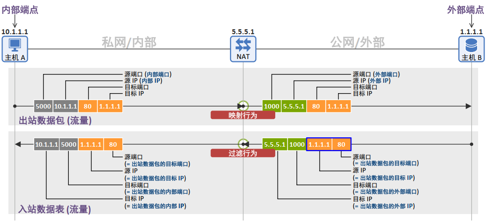

# IETF 定义的 NAT 行为要求 (RFC 4787) — 第二部分：过滤行为

2013年9月23日 | 作者：Netmanias (tech@netmanias.com)

---

由 IETF 定义的 NAT 行为要求 (RFC 4787)

* [第一部分：映射行为](#)
* **[第二部分：过滤行为](#)**
* [第三部分：确定性质](#)

---

&emsp;在上一篇文章中我们了解了 NAT 的映射行为，下面我们将学习 RFC 4787 中定义的过滤行为。  
&emsp;有关下文中涉及的术语（内部端点、外部端点、出站流量、入站流量等），请参阅前一篇文章中给出的定义。  

## 2. 过滤行为

&emsp;如果说上一篇文章讨论的是如何对出站数据包进行映射，那么本文讨论的就是如何对入站数据包进行过滤。也就是说上次我们讨论了 NAT 如何根据出站数据包的目标 IP 和目标端口值来映射/转换其外部端口，而这一次我们重点关注 NAT 在收到入站数据包时，如何根据该数据包的源 IP 和源端口值（如上图蓝框所示）进行过滤，并决定是将数据包放行（PASS）给内部端点，还是直接丢弃（DROP）。  

### 端点无关过滤 (Endpoint-Independent Filtering)

&emsp;在“端点无关过滤”中，所谓的“端点”是指外部端点。  

&emsp;“端点无关过滤”在决定是否放行外部端点发送的入站数据包时，仅检查该数据包的 1) **目标 IP** 和 2) **目标端口**。因此，它完全不在意外部端点的源 IP 或源端口值是什么（即任何 IP 和端口均可）。换言之在入站方向上，外部端点的信息（源 IP 和源端口）不会被作为过滤条件考虑。  

&emsp;如下图所示，当主机 A 向主机 B 发送数据包时，会生成如下绑定表项和过滤表项：  

* 绑定表项：\{内部 IP : 内部端口\} <-> \{外部 IP : 外部端口\} = \{10.1.1.1:5000\} <-> \{5.5.5.1 : 1000\}
* 过滤表项：如果入站数据包为 \{**任意 IP : 任意端口**\} 发往 \{5.5.5.1 : 1000\} 则允许放行

&emsp;只要主机 B 或主机 C 发送的入站数据包的目标 IP 和目标端口为 5.5.5.1 和 1000，无论其源 IP 是什么（1.1.1.1 或 2.2.2.2），源端口是什么（80 或 8080），NAT 都会将其放行给主机 A。  

### 地址相关过滤 (Address-Dependent Filtering)

&emsp;在“地址相关过滤”中，所谓的“地址”是指外部端点的源 IP 地址。  

&emsp;“地址相关过滤”在决定是否放行外部端点发送的入站数据包时，仅检查该数据包的 1) **目标 IP**、2) **目标端口** 以及 3) **源 IP**。它不在意外部端点的源端口值是什么（即任意端口均可）。因此，仅放行曾作为出站目标地址的外部端点所发送的数据包。  

&emsp;如下图所示，当主机 A 向主机 B 发送数据包时，会生成如下绑定表项和过滤表项：  

* 绑定表项：\{内部 IP : 内部端口\} <-> \{外部 IP : 外部端口\} = \{10.1.1.1:5000\} <-> \{5.5.5.1 : 1000\}
* 过滤表项：如果入站数据包为 \{**1.1.1.1 : 任意端口**\} 发往 \{5.5.5.1 : 1000\} 则允许放行

&emsp;NAT 会放行由主机 B（源 IP = 1.1.1.1）发送的入站数据包（即目标 IP/目标端口 = 5.5.5.1/1000），而丢弃由主机 C（源 IP = 2.2.2.2）发送的数据包。在此过程中，源端口的值不会被作为过滤条件。  

### 地址和端口相关过滤 (Address and Port-Dependent Filtering)

&emsp;在“地址和端口相关过滤”中，“地址”和“端口”分别指的是外部端点的地址和端口（源 IP 和源端口）。  

&emsp;“地址和端口相关过滤”在决定是否放行外部端点发送的入站数据包时，会检查该数据包的 1) **目标 IP**、2) **目标端口**、3) **源 IP** 以及 4) **源端口**。只有作为对内部端点先前发送的出站数据包的响应数据包（即这四个值完全匹配的数据包），才会被允许放行。  

&emsp;如下图所示，当主机 A 向主机 B 发送数据包时，会生成如下绑定表项和过滤表项：  

* 绑定表项：\{内部 IP : 内部端口\} <-> \{外部 IP : 外部端口\} = \{10.1.1.1:5000\} <-> \{5.5.5.1 : 1000\}
* 过滤表项：如果入站数据包为 \{**1.1.1.1 : 80**\} 发往 \{5.5.5.1 : 1000\} 则允许放行

&emsp;NAT 仅会放行为了响应主机 A 此前发送给主机 B 的出站数据包（即从 5.5.5.1:1000 发往 1.1.1.1:80）而返回的响应数据包（即从 1.1.1.1:80 发往 5.5.5.1:1000），并丢弃所有其他数据包。  

 

> **RFC 4787 规范要求 (REQ-8)**：如果应用的透明性最为重要，推荐（RECOMMENDED）NAT 具备“端点无关过滤”行为。如果更严格的过滤行为最为重要，推荐（RECOMMENDED）NAT 具备“地址相关过滤”行为。

&emsp;根据 RFC 4787，采用端点无关过滤或地址相关过滤的 NAT 可以通过交互式连接建立（ICE, RFC 5245）点对点（P2P）通信。然而，对于同时采用地址和端口相关映射和地址和端口相关过滤的 NAT 而言，直接进行点对点通信是不可能的。因此，所有流量都不可避免地需要通过中继服务器（TURN 服务器）进行转发。  

## 3. 回流行为 (Hairpinning Behavior)

&emsp;回流（Hairpinning）机制允许位于同一个 NAT 后面的两个内部端点通过该 NAT 直接与彼此通信。最常见的应用例子是 Skype。在使用这些应用时，两个移动设备可以通过 3G/LTE 网络中部署的大规模 NAT（LSN，也称为运营商级 NAT (CGN)）进行相互通信。  

回流行为主要分为以下两种类型：  

### 外部源 IP 与端口 (External Source IP Address and Port)

假设主机 A 发送给主机 B 并由 NAT 接收的如下数据包：  

* 目标 IP = 主机 B 的外部地址 (5.5.5.2)
* 目标端口 = 主机 B 的外部端口 (1001)
* 源 IP = 主机 A 的内部地址 (10.1.1.1)
* 源端口 = 主机 A 的内部端口 (5000)

&emsp;当 NAT 收到该数据包后，会通过查找绑定表将其修改为如下内容，然后转发给主机 B。这里需要特别注意的是，此时主机 A 的外部地址和外部端口被用作了新的源 IP 和源端口：  

* 目标 IP = 主机 B 的内部地址 (10.1.1.2)
* 目标端口 = 主机 B 的内部端口 (5001)
* 源 IP = 主机 A 的外部地址 (5.5.5.1)
* 源端口 = 主机 A 的外部端口 (1000)

&emsp;上述情况可以被视为一种理想的 NAT 行为，因为主机 A（发送方）收到的响应数据包（源 IP/端口 = 5.5.5.2/1001）正是来自其先前发送数据包的目标 IP/端口 (5.5.5.2/1001)。因此，两者之间的通信没有任何问题。  

&emsp;尽管在下图中主机 A 和主机 B 拥有不同的外部地址（5.5.5.1 和 5.5.5.2），但根据 NAT 的实际行为，它们也可能会拥有相同的外部 IP 地址。  

### 内部源 IP 与端口 (Internal Source IP Address and Port)

同样地，再假设由主机 A 发送给主机 B（并由 NAT 接收）的相同数据包。  

&emsp;当 NAT 收到该数据包后，会通过查找绑定表将其修改为如下内容，然后转发给主机 B。与前一种情况不同的是，此时主机 A 的内部地址和内部端口被用作了新的源 IP 和源端口：  

* 目标 IP = 主机 B 的内部地址 (10.1.1.2)
* 目标端口 = 主机 B 的内部端口 (5001)
* 源 IP = 主机 A 的内部地址 (10.1.1.1)
* 源端口 = 主机 A 的内部端口 (5000)

&emsp;在这种情况下，主机 A（发送方）收到的响应数据包（源 IP/端口 = 10.1.1.2/5001），并非来自其先前发送数据包的目标 IP/端口 (5.5.5.2/1001)。因此，该数据包会在内核的 TCP/IP 协议栈中直接被丢弃。  

 

 

> **RFC 4787 规范要求 (REQ-9)**：NAT 必须（MUST）支持“回流（Hairpinning）”。
> a) NAT 的回流行为必须（MUST）采用“外部源 IP 地址和端口”模式。