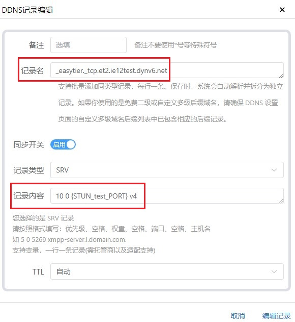

# 「EasyTier」使用SRV TXT HTTP重定向获取对端IP端口

2025.06.19  

## 关于此功能

在版本 [v2.2.3](https://github.com/EasyTier/EasyTier/releases/tag/v2.2.3) 中EasyTier添加了对SRV TXT 记录和HTTP重定向的支持  
这使得ET在连接其他节点时可以不直接指定端口号而是从DNS记录或者HTTP响应中获得  
此功能设计的初衷是与 NAT1 的 TCP 穿透配合使用（lucky）  

TCP穿透成功后可开放一个TCP端口 除了端口号不固定其访问效果和公网无异  
不过这个不定期变化的端口号 给其他节点的连接带来了很大的麻烦  

在端口变化后手动修改端口号过于繁琐  
我们可以从TXT SRV 记录和HTTP响应中取得这一端口号以实现完全自动化  
此方法在VNT上已经通过TXT记录实现：[教程](https://www.bilibili.com/read/cv39549245/?jump_opus=1)  

---

## 地址格式

其格式并不复杂以不同的协议头来区分  
通过这些记录和响应来获取实际要连接的地址和端口  

* TXT记录 `txt://example.com` 
* SRV记录 `srv://example.com`
* Http(s)响应 `http://example.com` `https://example.com`

---

## TXT 记录配置方法

TXT记录是最简单最灵活的方法 就像在客户端中连接时那样  
在TXT记录中写入 协议 地址 端口即可 `协议://地址:端口`  
例如：`tcp://et.ie12test.dynv6.net:11010`

得益于lucky的DDNS模块更新TXT记录的更新 大幅简化  
无需再向过去那样进行繁琐的配置  
使用lucky更新 TXT记录的具体方法:[教程](https://www.bilibili.com/read/cv41904858/?jump_opus=1)  

**STUN规则**  


**设置TXT记录更新**  


**检视更新效果**  


**连接测试**  


**连接成功**  


----

## SRV 记录配置方法

SRV 记录的配置方法与TXT相似不过会稍微复杂一些  
尽管SRV在设计时就考虑到了故障转移和均衡负载 但目前ET的SRV记录还不支持  
也许在未来会支持此功能 所以目前 权重 和 优先级 两项参数可以随意填写 无实际应用  

得益于lucky的DDNS模块更新SRV记录的更新也大幅简化  
无需再向过去那样进行繁琐的配置  
使用lucky更新 SRV记录的具体方法：[教程](https://www.bilibili.com/read/cv41904858/?jump_opus=1)  

ET目前支持的连接协议有：  
* TCP
* UDP
* WS (Websocket)
* WSS (WebSocket Secure)
* WG (‌WireGuard)

但本质上就是TCP和UDP两种  
WS(S)以TCP为基础进行传输 而WG则是UDP  

以`et2.ie12test.dynv6.net`为例  
ET会自动尝试查询所有支持协议所对应的SRV记录  

```
_easytier._tcp.et2.ie12test.dynv6.net
_easytier._udp.et2.ie12test.dynv6.net
_easytier._ws.et2.ie12test.dynv6.net
_easytier._wss.et2.ie12test.dynv6.net
_easytier._wg.et2.ie12test.dynv6.net
```

我们在设置的时候只需要选择其中一种协议即可  
此处使用TCP协议进行演示  

值得注意的是SRV记录中**主机名字段只能使用域名**  
**不能使用IP地址** 而且这个域名需要直接指向IP地址  

也就是说这个域名应该是一个 A记录（IPv4）或一个 AAAA记录（IPv6）  
其不能是 CNAME 详见：[链接](https://www.cloudflare.com/zh-cn/learning/dns/dns-records/dns-srv-record/)  

**STUN规则**  


**设置SRV记录更新**  


**检视更新效果**  


**解析效果**  


**连接测试**  


**连接成功**  


---

## HTTP 响应

目前ET支持从 HTTP 200 和 30x 重定向 中获取要连接的IP和端口  

### HTTP 200 响应

创建一个简单的纯文本网页 其内容依然是 协议加地址和端口  
这里使用lucky 制作一个本地网页  

**示例**  


不过其在外置STUN场景下可能用处不大  
因为访问网页也需要固定端口即进行重定向  

相比之下直接使用重定向来获取配置会更方便  
也许其可以再局域网中起到集中下发配置的作用  


### HTTP 30X 重定向
 
HTTP重定向方法根据格式有可以分为两种  
**请注意这些是重定向响应即重定向后的地址**  

* `http(s)://tcp://IP:port`  
* `http(s)://example.com/?url=tcp://IP:port`  

在第一种格式中 实际连接用配置占据了标准url中域名的位置  
而第二中格式其本身是标准的url 由合法的域名和询字符串组成  
实际用于连接的参数被置于查询字符串中  

第一种格式较为简单 但由于不是标准的url  
所以不是所有重定向服务提供商都支持  
第二中格式由于是标准url 任何提供商都会支持  

值得注意的是第二中格式中前部的域名可以随意填写  
其不起实际作用 但必须要有  
不然ET无法正确读取后部的查询字符串  

在cloudflare进行重定向只能使用第二种格式  
尝试在页面规则中填写第一种格式时会报错 提示输入了无效的url  

而在重定向规则中第一种格式可以被填入并保存  
但在实际重新的返回结果中 后面协议头部分的冒号会被删去  
即`http(s)://tcp://IP:port`变成了`http(s)://tcp//IP:port`导致ET无法正确读取配置  

在cloudflare上配置页面规则和重定向规则的方法详见之前的教程：  

* [「LUCKY STUN穿透」使用Cloudflare的页面规则固定和隐藏网页端口](../lucky-STUN/stun-web-serve-CF.md.md)
* [「扩展篇」使用Cloudflare的重定向规则传递资源路径和查询字符串](../lucky-STUN/stun-cf-redirection.md)

**第一种重定向格式效果演示**  


**第二种重定向格式效果显示**  


