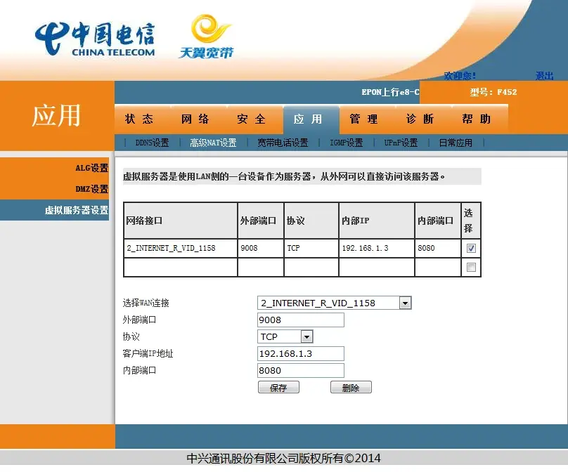

# 2.2 可用的解决方法（路由器部分）

2023.12.28  

## 2.2.3.1 宽带拨号（PPPoE）设置 

**问：** 那路由器上要如何设置 **宽带拨号/PPPoE 上网呢？**  

**答：** 虽然不同品牌的路由器设置的位置不同  
但都需要填入 之前提到过的宽带账户和密码 填写完后保存应用  
这里收集了一些路由器的设置方法 **其他品牌的设置方法也是差不多的**  

```
#小米路由器：
https://blog.csdn.net/Jaina_Proudmoore/article/details/52584582

#华为路由器：
https://consumer.huawei.com/cn/support/content/zh-cn00225456/

#水星/tplink路由器：
https://service.mercurycom.com.cn/article-205.html
https://resource.tp-link.com.cn/pc/docCenter/showDoc?id=1655112487571267

#360路由器:
https://bbs.360.cn/thread-15267456-1-1.html

#华硕路由器
https://www.asus.com.cn/support/FAQ/1011715#a3
```

路由器 **拨号成功** 后就可以上网了  
**如果出现报错可以搜索一下其含义**  
并检查  

* **宽带账号/密码 是否输入正确?**
* **光猫内的接口绑定设置是否正确 ?**
* **光猫内VLAN设置是否正确?**

---

## 2.2.3.2 端口转发 UPnP 以及 DMZ

**问：** 那路由器上其他的问题要如何解决呢？  

**答：** 在IPv4方面 路由器里的设置没有什么困难  
不过需要设置端口转发 UPnP 或 DMZ 以开放IPv4端口  

其在之前 1.6 端口转发 中有所讲解建议先看一下这篇：  
[端口转发 DMZ 以及 UPnP 的作用和原理](./BC阻塞_端口转发DMZ和UPnP.md)  

端口转发 UPnP 以及 DMZ 针对IPv4  
三选一即可 不要同时设置会产生冲突  


端口映射一般有以下几个 **核心的参数：**  

* **「外部端口」** 外网访问时使用的端口
* **「IP地址」**  局域网内设备的IP地址
* **「内部端口」** 内网设备上程序监听的端口
* **「协议」**     允许通过的协议


**IP地址 ：** 要映射的程序所在设备的IP 如正在运行比特彗星的电脑  

**内部端口和外部端口** 一般保持一致 **为要映射的程序使用的端口**  
若使用比特彗星就填写右下角监听的端口  

**协议** 一般选择 TCP和UDP 也有的显示为 both、任何、全部  

**问：** 好像还有一些规则名称和 常用服务之类的选项要如何填写？

**答：** 规则名称 可随意填写 只是方便你记忆 这条规则是为谁设置的就行
而 常用服务 其实是一些预先设置好的规则，一般都用不到 **留空即可**  

**问：UPnP和DZM** 又要如何设置呢？  

**答：** UPNP设置较为简单 只需要在路由器中将UPnP开关打开即可  

不同的路由器设置位置不同 简单搜索一下对应型号即可  
注意 tplink 的云路由界面 的路由器是没有修改upnp选项的地方的 其始终开启 详情：[链接](https://resource.tp-link.com.cn/pc/docCenter/showDoc?id=1655112527113938)  

**DZM** 的设置和 **端口转发** 有些相似不过 **只需要设置IP地址即可**  
**其会转发所有协议的所有端口** 所以不需要选择协议和端口  
这里收集了一些路由器的设置方法 **其他品牌的设置方法也是差不多的 可自行搜索**  

```
##端口转发

#小米：
https://hsk.oray.com/news/3696.html

#tplink:
https://resource.tp-link.com.cn/pc/docCenter/showDoc?source=search&id=1655112481787390

#华为：
https://consumer.huawei.com/cn/support/content/zh-cn00225381/

#360路由：
https://hsk.oray.com/news/3654.html

#华硕
https://www.asus.com.cn/support/FAQ/1037906

####

#UPnP和DMZ设置方法合集 :
https://help.onethingcloud.com/9dd6/e9ec
```

**问：** 光猫中也可以设置 这些吗？在光猫拨号 电脑直连光猫的情况下  

**答：** 一般有超级管理员权限就可以修改  

### 启用UPnP（光猫）

应用>UPnP设置 勾选启用UPnP 后保存即可  


### 设置DMZ 和虚拟服务器（光猫）

应用>高级NAT设置>DMZ设置/虚拟服务器设置  



**问：** 为什么DMZ和端口转发（虚拟服务器）设置后一段时间有效果 **时间久了就失效了呢？**  

**答：** 可能是因为 **电脑获取的内网IP发生了变化**  
导致电脑的实际IP和规则中的IP不一样了 映射自然就失效了  

**问：** 为什么 电脑获取到的内网IP会变化呢？

**答：** 这就要说到 **DHCP协议了**  

---

## 2.2.3.3 IP与MAC地址绑定以及设置静态IP

**问：** DHCP又是什么呢？  

**答：** **DHCP 即 动态主机配置协议** (Dynamic Host Configuration Protocol)  

简单的来讲DHCP服务器（一般在家用路由器中）可以自动的为局域网中的设备分配IP地址  
设备连入就可以互相通信了 无需手动设置IP地址  

**问：** 这挺方便的 那为什么电脑获取的 **内网IP会变化呢？**  

**答：** 因为它分配的IP地址是动态分配的  

当你的电脑连上网的时候它会为你的电脑分配一个IP地址   
**而电脑关机以后这个地址就会被收回 下一次再获得的时候就不一定是这个地址了**  
因为在电脑关机期间可能有其他的设备加入网络 比如手机 **那这个地址就有可能被别的的设备占了**  

**问：** 原来如此 可是分配的IP地址有某种规律吧？  
192.168.1.10和192.168.1.11 靠的很近啊  

**答：** 对 是有规律的 这和DHCP的地址池有一定的关系  

**问：** 这个地址池又是什么什么？  

**答：** 简单的来说这个地址池就是地址范围  

设备获取的IP会在这个范围内里也就是在这个"池子"内  
比如一个地址池的范围为 192.168.1.2-192.168.1.254  
那设备获取到的地址必然在这个范围内  

**问：** 那要如何固定设备的IP地址呢？

**答：** 在路由器上一般可以设置 **IP和MAC地址绑定**（静态DHCP分配）  
这样DHCP服务器每次给电脑分配的内网IP地址就是固定的  
(两者不完全相同 但一般硬路由在此处的差别不大)  

**即使设备不在线的时候也会保留这个地址不分配给其他的设备**  
其主要的参数就是 电脑网卡的MAC地址即物理地址 和想分配的内网IP  

**问：** MAC地址是什么？

**答： MAC地址** （Media Access Control address）是 **用于识别网络设备的物理地址**  
一般来讲是全球唯一的   

简单来讲 **其相当于设备的身份证** 有了这个地址 路由器就知道这是哪个设备了  
这里收集了一些路由器的设置方法 **其他品牌的设置方法也是差不多的 可自行搜索**  

```
#tplink
https://resource.tp-link.com.cn/pc/docCenter/showDoc?id=1655112511768617
https://smb.tp-link.com.cn/service/detail_article_1976.html

#华为路由器
https://consumer.huawei.com/cn/support/content/zh-cn00225397/

#小米路由器
https://jingyan.baidu.com/article/6766299728f1e515d41b8421.html

#360路由器
https://bbs.360.cn/thread-15953094-1-1.html
https://www.jiayongluyou.com/shezhi/360/360p1ipmac.html

#华硕
https://www.asus.com.cn/support/FAQ/1000906
```

**问：** 那在光猫里怎么设置呢（电脑直连光猫）/我的路由器 **没有这样的功能**  

**答：** 大部分光猫可能并没有 IP和MAC地址绑定 这项功能 部分的路由器可能也没有  
这就需要再电脑的网卡上设置 **静态IP上网了**  

**问：** 静态IP地址就是不使用DHCP了吗？  

**答：** 对 **直接使用指定的IP地址** 所以叫静态IP  

**问：** 如何设置？  

**答：** 要先确定现在电脑的IPv4配置  

win+R 弹出运行 输入 **ncpa.cpl** 点击 确定  


弹出 **网络连接** 窗口  
选择 正在使用的网卡 **右键** 选择 **状态**  


点开 **详细信息**  


**记录以下项目：**  

* **IPv4地址**
* **IPv4默认网关**
* **IPv4 DNS服务器**
* **子网掩码**


点击 关闭 回到 **网络连接** 窗口  
再次右键网卡 选择 **属性**  


**Internet协议版本4**（TCP/IPv4）点击 **属性**  
选择 **使用下面的IP地址** 和 **使用下面的DNS服务器地址**  


* **默认网关 ：**  填写的内容和刚才记录下的相同 即 上级路由器/光猫本身的地址
* **首选DNS服务器：** 填写的内容和刚才记录下的相同 即 上级路由器/光猫本身的地址
 备用DNS服务器可以不用填写
* **子网掩码 ：** 填写的内容和刚才记录下的相同
* **IPv4地址：** 这里填写的地址 最好和之前的不同但仍在同一个“范围”中
 （涉及到网段问题这里只讲解设置方法 ）

例如原先的 `192.168.1.10` 那网段就是 `192.168.1.X`  
可用范围从 `192.168.1.2-192.168.1.254`  

若为 `192.168.31.20` 网段就为 `192.168.31.X`  
可用范围 `192.168.31.1-192.168.254`  


**即要修改的是从左往右的最后一组数字** 建议使用 100-200之间的范围  
而前三组数字要和之前一致（根际实际情况填写不要直接抄教程里的地址）  
**使用较高的位的地址 以防止和现有设备的地址发生冲突**  

**例如**  
原先 `192.168.1.10` 变为 `192.168.1.200`  
原先 `192.168.31.20` 变为 `192.168.31.150`  

修改完成后记得点确定（其实最好是同时调整DHCP地址池的范围 ）  


**问：** 还有点复杂 不过除了IPv4地址这一项和之前使用自动获取时略有不同  
其他的选项其实差不多 ？这样就不用担心内网IP变化了吧？  

**答：** 是的 不过要正确设置上述这些选项 不然会无法上网  
**若设置后无法正常上网请改回自动获得IP**  

---

### 2.2.3.4-NAT层数优化（路由器）

**问：** NAT层数也可以优化？  

**答：** 是的现在大多的家庭网络中都存着 **多层NAT**  
多次的NAT转换是没有必要且拖累网络效率的  
我们可以通过减少NAT层数的方式进行优化 **即取消不必要的NAT转换**  

**问：** 那具体该怎么做呢？  

**答： 即为修改路由器为桥接模式**  

**问：** 路由改桥接？不一般都是光猫改桥接吗？  

**答：** 是的 **一般是修改光猫为桥接**让路由器来负责拨号  
以避免光猫性能差  影响网络稳定性  

**但是在一些特殊情况下我们需要桥接路由器:**  

* **不得不使用光猫拨号**
* **多个路由器串联**
* **路由器不支持IPv6或无法关闭IPv6防火墙**

路由器改为桥接后其NAT不起作用  
当不得不使用光猫拨号时 **在光猫处已经进行过一次NAT了** 路由器上就没有必要再进行一次  
而有多个路由器串联的时候也是一样的道理 **NAT在其中一个路由器上已经进行了**  

**问：** 那该如何桥接路由器呢？  

**答：** 一些路由器可以直接设置 上网方式为 **桥接** 也有的叫 **AP** 或 **bridge**  
可以在路由器的 **上网设置** 中寻找一下  
这里收集了一些路由器的设置方法 **其他品牌的设置方法也是差不多的 可自行搜索**  

```
#小米路由器
#https://www.mi.com/service/miwifi/miwifi1/Repeater

#华为路由器
#https://consumer.huawei.com/cn/support/content/zh-cn00225456

#中兴路由器
#https://192-168-1-1.com.cn/howto/2928.html
```

**问：** 我的路由器好像在修改上网方式的地方 **没有桥接选项**  

**答：** 如果路由器不支持的话就 **只能进行 “手动桥接了”**  

**问：** 手动桥接是什么？  

**答：** 还记得在 [1.4路由器交换机和光猫的作用](./BC阻塞_交换机和路由器.md) 中所讲的内容吗？  

**问：** 记得 说的是 **路由器的LAN口其实是交换机** 而交换机可以用来将多台电脑连在一起？  

**答：** 对 所以我们要做的就是 使用 其中的交换机功能和无线功能 而不使用路由功能  

**问：** 那这样就是把路由器 **变成了一台带无线功能的交换机？**  

**答：** 是的

**问：** 那该如何操作呢？  

**答：**  


1. **关闭 DHCP 服务器**
 一个网络内不能同时有两个DHCP服务器不然会和光猫/上级路由器的DHCP服务器起冲突 
 就不知道应该听谁的了  

2. **修改路由器的LAN地址范围**
将 LAN IP 修改为光猫/上级路由器 相同网段 这样不影响访问管理界面  
不过要注意修改的IP不能和已有的设备冲突可以 参考上面为电脑设置静态IP的部分  
原理是一样的  

3. **将原来 WAN 口 的网线连接到 LAN口** 就像使用交换机一样  

**这里可以参考一下 tplink 的教程其他的品牌的路由器也是相同的原理**  

```
#tplink 经典界面：
#https://service.tp-link.com.cn/detail_article_2844.html

#tplink 云路由器界面
#https://resource.tp-link.com.cn/pc/docCenter/showDoc?id=1655112585159408

#修改后无法上网排查
#https://resource.tp-link.com.cn/pc/docCenter/showDoc?id=1655112504006126
```

---

### 2.2.3.5 路由器上的IPv6上网设置

**问：** 路由器上要如何设置IPv6呢？  

**答：** 这里我我们先讲解在路由器拨号模式下的设置  

一般选择正确的IPv6获取方式后就无需额外设置了  
但有些地区可能会出现无前缀下发 这样只有路由器能获得地址  
而其他设备无法获得地址 这个要去找运营商让他们修复  

还有可能出现DNS没有下发的问题 即获取不到IPv6 DNS  
这个解决起来相对简单在 路由器设置中将 **DNS获取方式改为手动并填入公共的IPv6 DNS即可**  
若运营商下发的DNS效果不佳也可以在此处替换为效果更好的第三方 IPv6 DNS  

```
#IPv6上网设置

#华为
启用后保持默认的自动获取即可
https://consumer.huawei.com/cn/support/content/zh-cn00685838/

#部分路由器设置方法合集

看路由模式下的设置方法 IPv6获取方式选择 宽带拨号
部分设置存在错误 仅供参考
小米路由器在拨号模式下要选择 native模式

https://www.luyouwang.net/8519.html
https://help.onethingcloud.com/9dd6/dfcb
```

**问：** 那如果是光猫拨号的情况要如何设置呢？  

**答：** 如果是光猫拨号的话其实也 **可以将路由器桥接**  

**问：** 桥接路由器？就像之前优化NAT那样？IPv6也有NAT吗  

**答：** 对就像之前优化NAT那样 IPv6下其实也有NAT不过比较少见  

这里设置桥接的原因主要 **是为了避开路由器上的IPv6防火墙**  
同时优化网络结构 防火墙的问题后面会讲毕竟这整个系列教程的 **最终目的是打开端口**  
使用桥接的方法最简单 也可以防止路由器固件存在一些奇怪的问题  

**问：** 那如果我的 **路由器不支持IPv6怎么办？**  

**答： 最好的方法是换一个支持IPv6且可以调整IPv6防火墙的路由器**  

**问： 有不换路由器的方法吗？**  

**答：** 如果是在光猫拨号的情况下 还是可以用 **桥接** 路由器的方法来解决  

**问：** 还可以用桥接？  

**答：** 对 还记得之前说的 改为桥接以后相当于一个无线交换机？  

**问：** 所以交换机都是支持IPv6的？  

**答：** 确切的来说 是因为普通交换机并不关心它是IPv4协议  
还是IPv6协议亦或者是IPv114514协议（）  
普通交换机工作在 第二层即 数据链路层 而IP属于第三层即网络层  

其在处理数据的时候相当于快递员，负责将根据包裹上的地址将它们送到正确的目的地
它只需要关注包裹上的地址，而不需要知道包裹里面的具体内容是什么 

而在 **第二层** 时包裹上的地址是MAC地址 交换机只关心这个MAC地址  
而不关心里面的IP地址（第三层）是什么 
它只需要根据 **MAC地址表** 来决定将数据发送到那个接口上就行  

**问：** 所以说从实际效果上来看就是都支持了？  

**答：** 对  

---

### 2.2.3.6 路由器上的IPv6防火墙设置

**问：** 那是不是获得了IPv6地址之后就可以开放端口了呢？毕竟在IPv6上一般没有NAT

**答：** 其实还不行 确实在IPv6上一般没有NAT 别忘了在路由器上大概还是有IPv6防火墙的

**问：** 那路由器上的IPv6防火墙会阻止外网的主动访问？

**答：** 是的

**问：** 那就设置放行规则或者直接关掉防火墙呗 不过要如何设置呢？

**答：** 一些路由器确实可以

```
IPv6 防火墙

#小米
https://www.gebi1.com/thread-302837-1-1.html
较新的固件有IPv6防火墙开关 若没有可以尝试更新固件或破解ssh

#华为
https://consumer.huawei.com/cn/support/content/zh-cn00225377/
关闭防火墙总开关即可

#华硕
https://www.asus.com.cn/support/FAQ/1013638/
可以控制单个端口

#中兴
在“高级模式”-“安全”-“防火墙”中设置为“低”即可

#tplink
tp的情况较为复杂
一些型号/固件有IPv6防火墙且完全无法调整
一些型号/固件 没有IPv6防火墙 无需调整 但也无法直观看出其状态
一些型号/固件 有IPv6防火墙开关可以 设置为关闭即可关IPv6防火墙 其在IPv6设置选项卡中
https://www.right.com.cn/forum/thread-8236769-1-1.html

建议先升级一下路由器固件 然后询问tplink的客服 对应型号和固件的路由器是否有IPv6防火墙 以及是否可以关闭IPv6防火墙 亦或者是提供可关闭防火墙或无防火墙的特殊固件
```
不过目前许多路由器虽然支持IPv6上网功能  
**但是不支持调整IPv6防火墙即无法设置放行也无法关闭**  

**问：** 那该怎么办？  

**答：** 依然可以用桥接路由器的方法来解决  

**问：** 那只能在光猫拨号的情况下才行吧？  

**答：** 对  

**问：** 要是这种情况下 **不换路由器的话只能让光猫来拨号了吗？**  

**答：** 是的 即上文中提到的不得不使用光猫拨号的情况  

**问：** 那这样光猫的IPv6防火墙必须要关闭吧？  

**答：** 对 不然端口依然无法打开  

**问：** **要是光猫的防火墙也关不掉路由器又不支持IPv6怎么办？**  

**答：** 那就只想办法 **桥接光猫** 并且 **换一个支持IPv6且可以关闭防火墙的路由器了**  

**问：** 不过关闭IPv6防火墙后不会有安全问题吗  

**答：** 安全方面的问题可以看看这篇  
「特别篇」在关闭光猫、路由器IPv6防火墙后可能遇到的安全问题  
下一篇将讲解Windows上的设置以及简单讲解STUN穿透  

---

参考：  
* https://resource.tp-link.com.cn/pc/docCenter/showDoc?id=1655112482235742
* https://blog.51cto.com/hatech/2521226
* https://www.idcbest.com/idcnews/11007620.html
* https://www.jb51.net/network/512428.html
* https://www.v2ex.com/t/958813
* https://cloud.tencent.com/developer/article/2154283
* https://danteng.org/peking-unicom-epon-tewa-800e-bridged/
* https://post.smzdm.com/p/a30eo9vr/
* https://www.right.com.cn/FORUM/thread-4095899-1-1.html
* https://drunkfish.me/modem/
* https://www.sciencesoft.cn/china-mobile-routing-to-bridge-mode/
* https://www.cnblogs.com/yaoyue68/p/16815152.html
* https://post.smzdm.com/p/a4pk5pr8/
* https://smb.tp-link.com.cn/service/detail_article_89.html
* https://bbs.360.cn/thread-15045395-1-1.html
* https://www.cnblogs.com/xuzy630/p/11281374.htm
* https://www.luyouwang.net/8992.html
* https://www.taoyouh.cn/archives/2256


