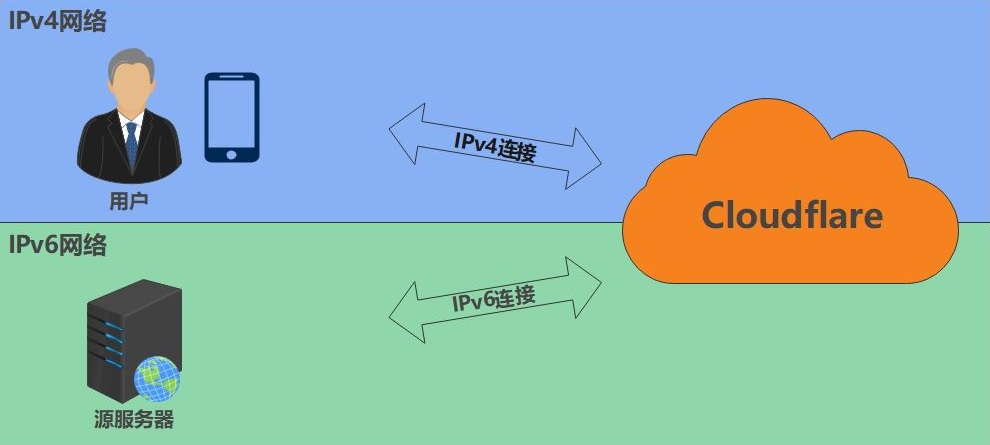
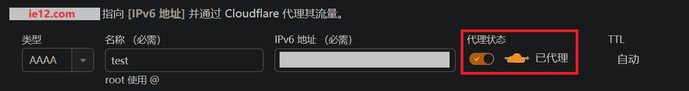
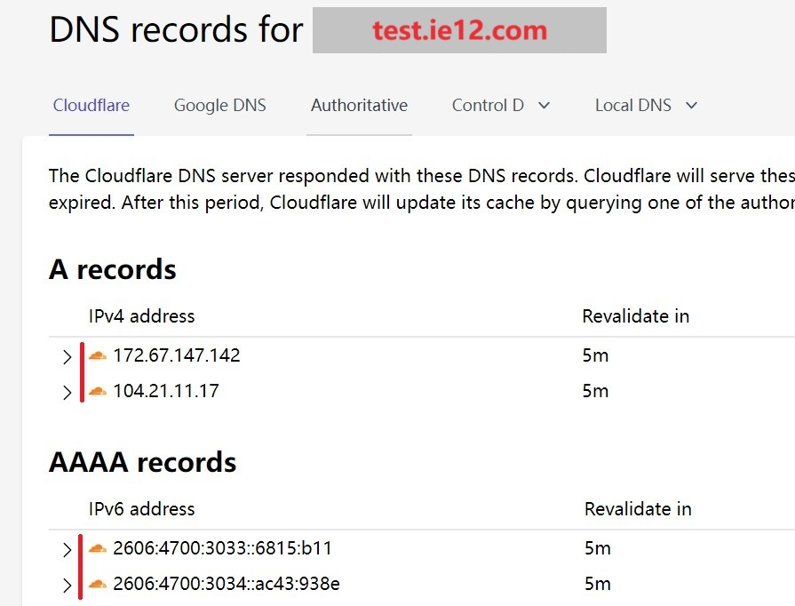
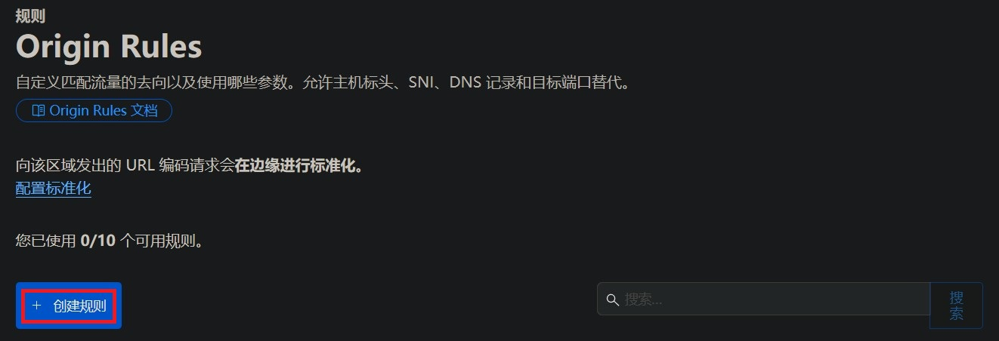
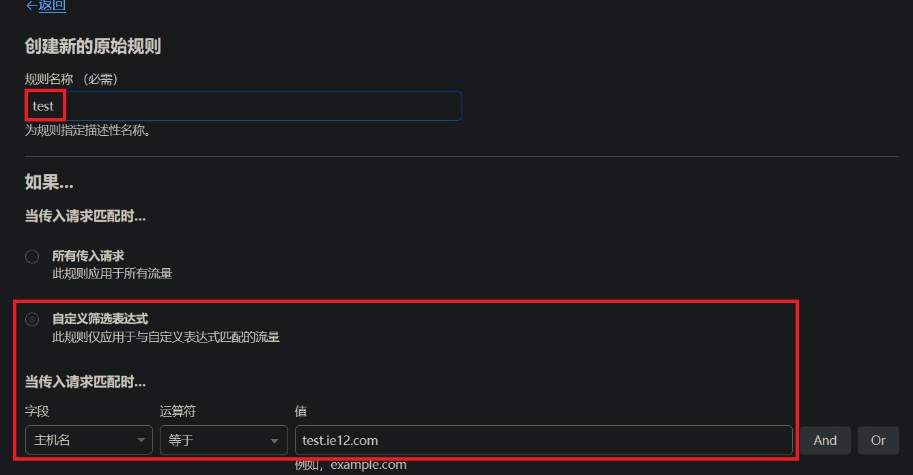
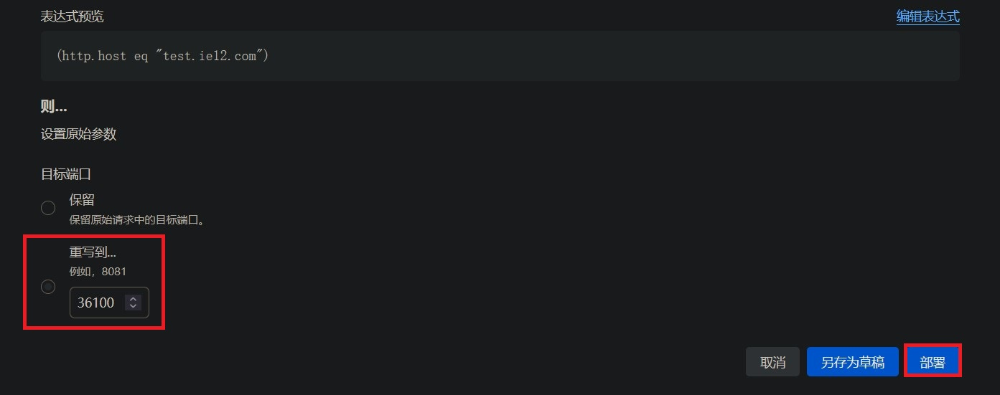

# 使用Cloudflare代理为纯IPv6站点添加IPv4访问

## 关于本教程

随着IPv6的普及 使用家庭宽带进行建站变得更加容易  
这免去了获取IPv4公网或者使用STUN进行穿透的麻烦   
**相当于纯IPv6站点**   

不过需要注意光猫和路由器上的防火墙  
IPv6教程开放端口教程：[链接](https://www.bilibili.com/read/cv32811550/)  

而在客户端侧 也就是访问方面  
移动设备主要是手机 其移动数据（也就所谓的手机流量）  
几乎都已经提供IPv6了  

家庭宽带方面 情况略差 但IPv6的渗透率也在不断的增加  
尤其是新办理的宽带  

而公共网络方面的情况就比较复杂了  
一些学校/公司/大型商业场所 的公共网络可能已经在提供IPv6了  
不过更多的地方可能还没有   

在IPv6推广上这些公共网络可能是 最迟一批提供IPv6支持的  
**所以在无IPv6的环境下访问纯IPv6站点就成为了一个亟待解决的问题**  

---

## 可用的解决方法

要解决在无IPv6环境下访问纯IPv6站点 主要有两条路线  

* **为服务端添加 IPv4 访问性**  
* **为客户端添加 IPv6 访问性**  

### 服务端侧

* **使用STUN 穿透获得IPv4访问性**  

  通过STUN 穿透运营商NAT获得可被外界访问的端口  
  此方案在之前的教程中已经有所讲解: [链接](https://github.com/ie123610/ie12sBlog/blob/main/%E6%96%87%E7%AB%A0/lucky-STUN%E7%B3%BB%E5%88%97/stun-web%E6%9C%8D%E5%8A%A1-CF.md)  
     
  优点：若能成功穿透则延迟则速度与相当于IPv4公网  
  缺点：设置相对较为复杂且对NAT类型有要求 穿透后的端口是随机的需要额外设置  

* **使用FRP穿透 获得IPv4访问性**  

  通过有IPv4公网的FRP服务器进行中转  
  一般需要在服务端侧安装FRP客户端以与FRP服务器连接  

  优点：可以适用于任意网络环境 甚至包括对称型NAT以及无IPv6环境  
        配置较为简单 方案较为成熟可参考案例多
  
  缺点：速率和稳定性受FRP服务器节点影响 尤其是免费节点 延迟略有增加  
        要获得更好的体验可能需要付费 且需要实名认证 使用HTTP(S)  
        穿透需要备案  

* **CloudFlare双栈代理 获得IPv4访问性**  

  与FRP方案类似 使用CloudFlare节点进行中转也可以达到目的  
  （CloudFlare下文称CF）
 
  优点： 免费CF 的大部分节点都是免费的且  
        无明显速率限制 主要取决于服务端侧的上传能力  
  
  缺点：在不优选IP的情况下延迟较高且部分地区可能存在屏蔽  

  **这也是本教程将要介绍的方案**  

其实本教程原本设计于 家庭影音服务器器  纯IPv6无IPv4公网不能使用STUN穿透  
且无法使用或不想组网的用户  由于观看视频所耗费的流量较多 故不太适合使用移动数据   
需要使用公共网络进行观影 所以其设计指标被定为 无额外花费 拥有较高传输速率 可以忍受较高延迟  

从实践上来看使用CF进行双栈代理确实可以解决在  
不过由于CF节点的问题其稳定性和速度其实较难保障  

### 客户端侧

* **使用IPv6过度技术获得IPv6访问性**

  这些技术用于在IPv6部署的早期时候在IPv4上传输IPv6  
  主要包括 6in4 6to4 6over4 等 但其本质上还是一种双栈代理技术  
  
  这意味着需要一个稳定的服务器支持 而这样的服务器并不好找  
  比较知名的供应商如 Hurricane Electric 等国外隧道服务要求客户端的IPv4网络  
  可以收发ICMP数据包 这对处于运营商NAT后面的设备来说是几乎不可能的  
  
  而且这些服务器位于国外 速度和稳定性都难以保证  
  至于国内方面 在早期其实也有类似的服务 比如清华大学的ISATAP隧道服务  
  但这些国内的隧道服务几乎都已经关闭或转为仅教育网可用  

  所以这一设想尽管这在理论上可行 **但在实际中不太可能实现**  

* **使用虚拟专用网络进行组网**

  相比起上述的IPv6过度技术使用虚拟专用网络的方案就要成熟和可靠的多了  
  不过其本质还是在IPv4上做内网穿透 让服务器和客户端处在一个虚拟的局域网中  
  其本身和IPv6并没什么关系  
  
  但这种方案使用的更加广泛 案例和教程也很多 比较常用的软件就是 zerotier和tailscale   
  且相比起之前所说的 使用STUN穿透获得IPv4访问性 的方案对网络的要求会更低一些  
  一般来说两侧不为对称型NAT（NAT4）即可穿透 不过需要在服务端和客户端侧安装专门的组网客户端  

---

## 设置CloudFlare代理

使用CloudFlare代理可以解决这个问题 （CloudFlare下文称CF）  
CF 服务器（节点）同时拥有IPv4和IPv6地址 其起到桥梁作用以沟通纯IPv4的客户端 和纯IPv6的服务端  

**流程图**

客户端发起IPv4请求到达CF节点  CF节点收到请求后将其转换成IPv6请求发往源服务端  
源服务端使用IPv6接受并应答请求来自CF节点的请求 CF节点再将这个应答转换成IPv4发回给客户端  

---

### 设置DNS解析

要想使用CF的代理服务则必须将域名解析到CF  
在之前教程中已经讲解过如何在CF上设置和更新DNS记录以及其他的一些WEB设置  

* [在Windows下使用lucky更新动态域名](https://www.bilibili.com/read/cv35021955/)  
* [在Windows下使用lucky配置反向代理以实现较为安全的WEB访问](https://www.bilibili.com/read/cv35702797/)  

与之前不同的是这里还需要打开后面的**代理开关** 这样域名的地址就会被解析到CF的节点上  
而CF则可以通过其中填写的IPv6地址连接源服务器  

这里可以选择AAAA记录（IPv6）也可以选择CNAME  
使用CNAME可以兼容已有的其他（子）域名  

**检查解析效果** 

可以使用Windows自带的nslookup功能检查解析效果  
也可以使用在线DNS解析检查网站 比如 [nslookup-io](https://www.nslookup.io/)  
若设置正确则可以看到CF的地址以及前面的图标  

---

## 设置回源规则

### 关于回源规则

CF的代理功能在默认情况下使用下列的这些端口去连接源服务器  
但由于家庭宽带大概率是封80/443端口的 因此我们需要使用其他端口 当然有些地区不封  

比较好的方法是使用**回源规则**（Origin Rules）来自定义回源端口  
当然也可以使用列表中的其他端口 这样就可以不设置回源规则  

默认使用的HTTP端口

* 80
* 8080
* 8880
* 2052
* 2082
* 2086
* 2095

默认使用的HTTPS端口

* 443
* 2053
* 2083
* 2087
* 2096
* 8443

其他端口（禁用缓存）

* 2052
* 2053
* 2082
* 2083
* 2086
* 2087
* 2095
* 2096
* 8880
* 8443

### 添加回源规则

登录CF 》侧边栏-网站 》选择你的域名 》 侧边栏-规则 》Origin Rules 》创建规则  

规则名称 任意填写  

匹配传入请求按照实际情况选择   
这里选择匹配二级域名 `test.ie12.com`  
表示当传入的请求为`test.ie12.com`的时候触发此规则  

接下来设置 **回源端口** 也就是CF节点连接你的的源服务器使用的目标端口  
填写源服务器实际使用的端口 这里使用36100作为演示 部署规则  

---

## 设置 SSL/TLS 加密模式

在完成回源规则设置后我们还需要设置CF的SSL/TLS 加密模式  
选择侧边栏中的 SSL/TLS 加密模式 其与刚才设置的回源规则在同一个侧边栏  

此处用于设置 访问客户端-CF节点-源服务器 之间的TLS加密模式  

默认为灵活即浏览器与CF节点之间的连接使用加密（HTTPS）  
而CF节点和源服务器之间不使用加密（HTTP）
如果源服务器不支持HTTPS则保持此选项为灵活 直接开放

 

## 设置CF IP 优选

### 关于IP 优选

### Windows 优选方法

### 安卓设备 优选方法

### 在线优选

---

参考

HE 提供的 tunnel ipv6，可以直连吗？

https://cn.v2ex.com/t/1023138

My ISP uses CGNAT. Can I configure an IPv6 tunnel?
https://ipv6.he.net/certification/faq.php

国内有没有类似tunnelbroker免费提供IPV6隧道的？
https://www.nodeseek.com/post-7322-1

​​Network ports compatible with Cloudflare’s proxy
https://developers.cloudflare.com/fundamentals/reference/network-ports/#network-ports-compatible-with-cloudflares-proxy

---

