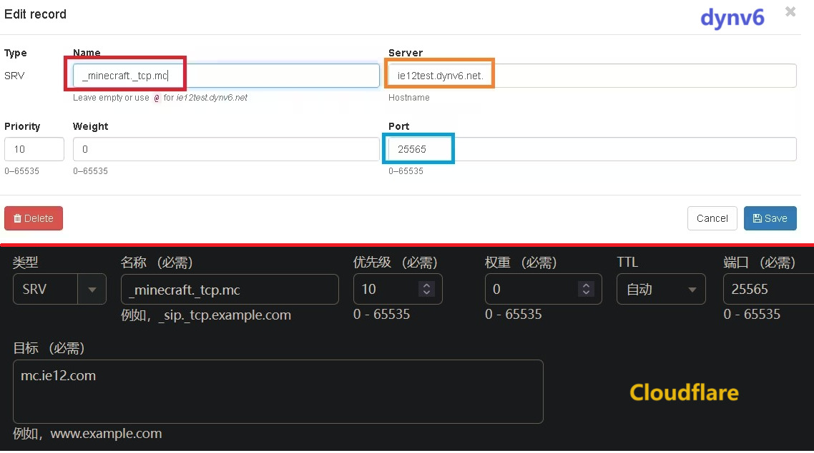
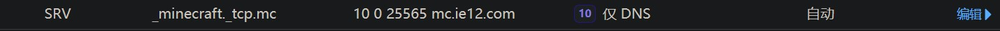
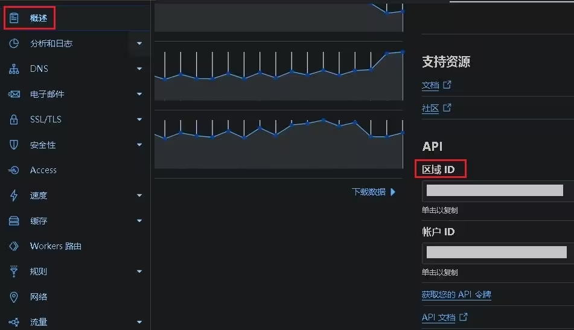
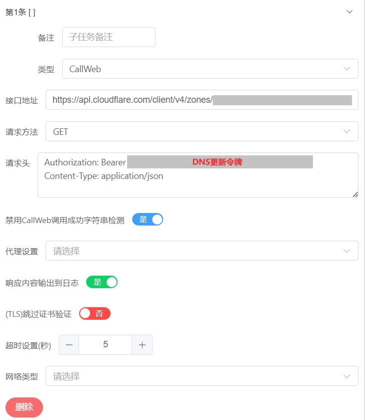
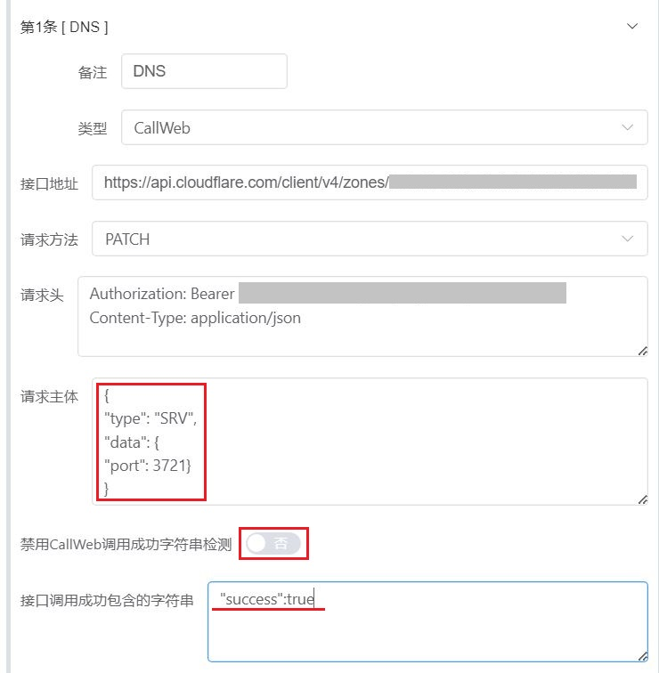
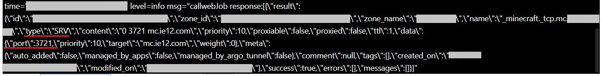

# 「补充篇」在Cloudflare上设置并更新SRV记录

```
索引
│ 
├─关于本教程
├─创建SRV记录
├─获取DNS更新令牌
├─获取区域ID
├─获取DNS记录ID
├─更新SRV记录
└─结尾
```

## 关于本教程

在之前的教程中我们已经介绍了使用lucky的STUN穿透功能  
配合dynv6创建并更新SRV记录以供Minecraft Java版 联机使用  [链接](https://www.bilibili.com/read/cv31482590/)  

而在本教程中我们将介绍如何在Cloudflare上设置并更新SRV记录  
**建议先阅读之前的教程后再阅读本教程**  
（Cloudflare 下文简称CF）  

---

## 创建SRV记录

当然进行下列设置的前提是 **有个已经托管在CF的域名**  
创建和更新SRV记录的方法与之前在dynv6时的差不多的  
这里将使用 `ie12.com` 进行举例  

登录CF 》 点击侧边栏中的网站 》 选择你的域名 》 点击侧边栏中的DNS  
点击添加记录 》 类型选择SRV 》 填写名称  

值得注意的是CF这里的目标地址最后不用像dynv6那样  
需要添加加一个英文句号  

**示例**  




---

## 获取DNS更新令牌

**DNS更新令牌**用于在更新DNS记录时进行身份验证  
获取令牌的方法在之前的DNS解析教程中已经有所讲解 此处不再赘述  
[链接](https://www.bilibili.com/read/cv35021955/)  

---

## 获取区域ID

要更新DNS记录我们还需要域名所对应的**区域ID**  
相比起dynv6 在CF上获取区域ID会更加容易 在浏览器中即可查看  

点击侧边栏中的 **概述** 页面向下滚动 在右侧即可查看区域ID



---

## 获取DNS记录ID

在获取了区域ID后仍需要获取**DNS记录ID**  
其对应我们之前创建的SRV记录  
这里的设置和之前的教程中的相类似 使用lucky的 callweb功能进行获取  

转到lucky 》 计划任务 》添加计划任务  

1. 开关：关闭
2. 执行周期和时间：任意 
3. 添加子任务
4. 类型: callweb
5. 接口地址：`https://api.cloudflare.com/client/v4/zones/你的区域ID/dns_records`
6. 请求方法：GET
7. 请求头：
  
```
   Authorization: Bearer 之前获取的令牌
   Accept: application/json
```
  
8. 开启 禁用成功字符检测
9. 保存任务 


**示例**  



关闭任务开关并点击 手动触发 查看日志中输出的内容  
应可以查看到当前域名下所有的DNS记录以及其对应的ID  
其中的ID就是我们需要的DNS记录ID  

**示例**  


---

## 更新SRV记录

在获取到令牌以及区域和DNS记录ID 后就可以开始更新SRV记录了  
与之前类似 还是先在计划任务中测试  

**设置计划任务**  
  
* 接口地址：`https://api.cloudflare.com/client/v4/zones/你的区域ID/dns_records/你的DNS记录ID`  
* 请求方法：**PATCH**  
* 请求头：与之前相同  
* 请求主体：  
  
```
{
"type": "SRV",
"data": {
"port": 8086}
}
```
  
* 由于是测试 这里的端口号可以随意填写  
  
* 关闭 禁用成功字符检测  
  填写下列内容 其用于判断请求是否成功  
```
"success":true 
```

**示例**  



保存任务后 关闭任务开关并点击 手动触发 查看日志中的输出内容  
若设置正确则可以看到返回的规则中端口号已经改变  

**示例**  




## 结尾

至此我们基本就完成了在CF上更新SRV记录的设置  
之后只需要将计划任务中的设置移动到STUN穿透规则中即可  

---

参考

[Cloudflare API Documentation|Update DNS Record](https://developers.cloudflare.com/api/operations/dns-records-for-a-zone-patch-dns-record
)

---

## 评论区

前往评论区 》 链接

