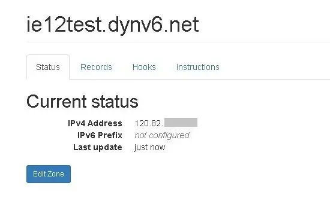
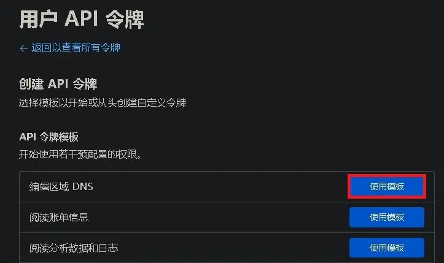
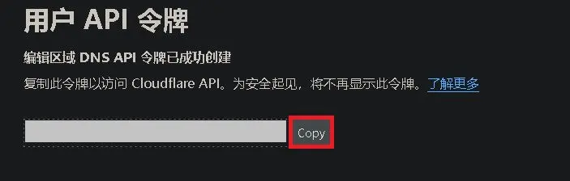
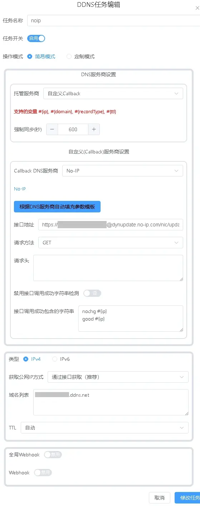
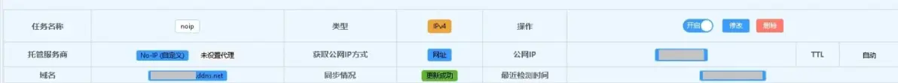

# 在Windows下使用lucky更新动态域名

2024.06.03  

---
2.15版本之后DDNS配置进行了较大的更新  
配置不再向后兼容 若进行降级 DDNS配置会丢失  
配置方法详见新教程：[链接](./lucky-ddns-2.15.md)  

---

## 关于本教程

lucky内置的DDNS功能 **支持多家DDNS提供商**  
也允许使用 **自定义方式更新** 更支持多种对外IP方式获取方式  

本教程将分别介绍  

* **Dynv6**
* **Cloudflare**
* **NOIP**

这三家（动态）域名提供商的 **更新方法**  
不过账户创建和（动态）域名创建/购买的方法 并不是本教程讲解的重点  
若图片 显示不清楚 可在新标签页中打开图片  

---

## Dynv6

dynv6创建账户和动态域名的方法 其实在之前的教程中已经讲解过  
不过其是SRV记录教程的一部分现进行单独的讲解  

创建dynv6账户和动态域名的方法不在此处讲解  
但可以看看之前的教程：[链接](./stun-mc-srv.md)  

### 获取API token

要使用dynv6的更新API 我们需要获取用于验证的token  
点击右上角的账户名选择 **keys**  

在HTTP Tokens 应该已经有了一个默认的Token  
点开 **details** 查看内容 **注意不要泄露token** 如果泄露应马上更换  
将token复制下来我们马上就要用到  

### 编辑更新规则

打开lucky》选择左侧的动态域名解析》添加任务  

* 规则名称任意
* 托管服务商：dynv6
* **Token 填写之前获得的token**  
* 类型：选择IPv4

**若要更新IPv6地址则选择IPv6**  
需要同时更新IPv6和IPv4地址则 **需要分别设置两条规则**  

域名列表：**填写要更新的动态域名地址**  
获取公网方式 保持默认 **即通过接口获取**  
保存规则  

**示例**  

### 检查更新结果

等待片刻后显示 **公网IP未改变** 或 **更新成功** 即设置正确  

如果出现 **公网IP获取失败** 请检查网络是否可以正常访问  
这种问题可能较多的出现在IPv6上 请检查IPv6网络是否畅通  

### 检视最终效果

**IPv4地址**  

**IPv6地址**  

不是IPv4地址下面的那个选项 **而是在记录选项卡里中的AAAA记录**  

---

## Cloudflare

Cloudflare下文称CF  
CF的设置方法和dynv6的基本相同  
不过在token的获取上要稍微多一些步骤  

### 获取API token

访问下列地址以设置API token  
`https://dash.cloudflare.com/profile/api-tokens`

点击 **创建令牌**  

选择 编辑区域DNS》 **使用模版**  

在区域资源中的特定区域选择要更新的的域名（顶级域名）  
其他保持默认 点击 **继续以显示摘要**  

继续点击 **创建令牌**  

令牌已创建 **复制下来** 我们马上就需要使用  
**其只会显示一次** 要保存好 关闭页面  

### 编辑规则

打开lucky》选择左侧的动态域名解析》添加任务  

规则名称任意  
托管服务商：Cloudflare  
**Token 填写之前获得的token**  
类型：选择IPv4  

**若要更新IPv6地址则选择IPv6**  
需要同时更新IPv6和IPv4地址则需要分别设置两条规则  

域名列表：**填写要更新的动态域名地址**  
获取公网方式 保持默认 **即通过接口获取**  
保存规则  

**示例**  

### 检查更新结果

等待片刻后显示 **更新成功** 即设置正确  

---

## NOIP

与之前的两家提供商不同  
NOIP并不使用token而是直接 **使用账户名和密码进行验证**  
因此我们需要 **设置自定义请求**  

NOIP其实有自己的专用更新客户端  
**不过其并不算很好用而且不支持IPv6**  

### 编辑规则

打开lucky》选择左侧的动态域名解析》添加任务  

规则名称任意  
托管服务商： **自定义callback**  
Callback DNS服务商 : **NOIP**  
点击 **根据DNS服务商自动填充模版**  

参数会自动填充完毕但是我们仍然需要进行一些修改  
**比如NOIP的账户和密码**  

以及将更新地址的 **HTTP** 换成 **HTTPS**  
账户密码直接明文传输还是有些危险  

类型：选择IPv4
**若要更新IPv6地址则选择IPv6**  
需要同时更新IPv6和IPv4地址则 **需要分别设置两条规则**  
域名列表：**填写要更新的动态域名地址**  
获取公网方式 保持默认 **即通过接口获取**  
保存规则  

**示例**  

### 检查更新结果

等待片刻后显示更新成功即设置正确  
至此我们便完成了动态域名的更新设置  

