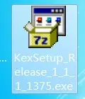
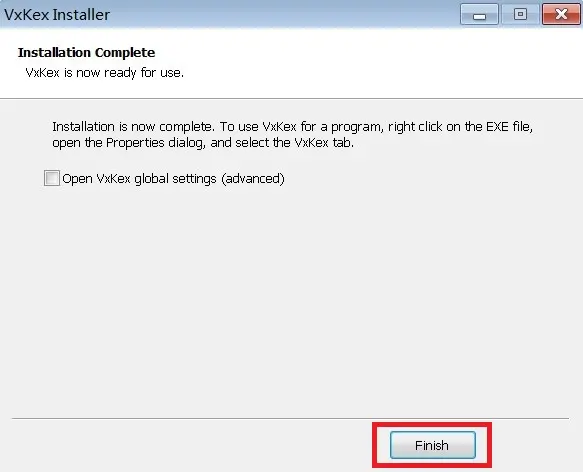
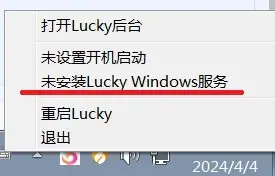
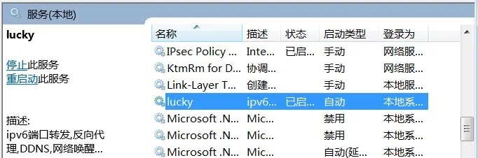
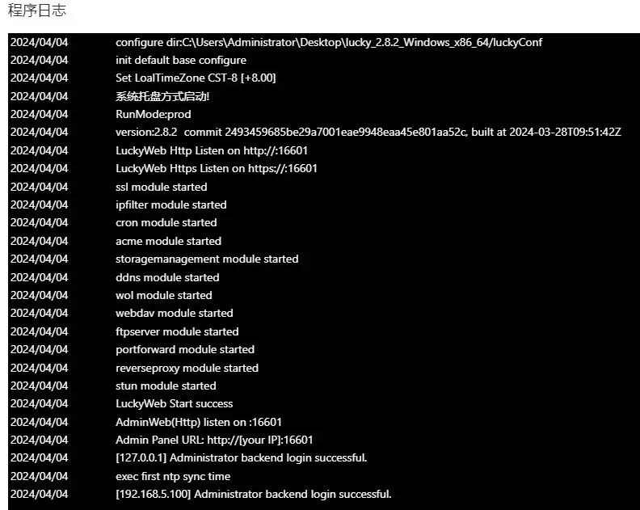

# 使用VxKex使高版本LCUKY可在win7上运行

2024.04.07  

## 关于本教程

较高版本的lucky已经无法在Windows7上运行了  
双击EXE文件不会有任何反应  

这其实是由于lucky所使用的编程语言GO语言更新导致的  
[GO语言在1.20更新日志](https://tip.golang.org/doc/go1.20) 中说明了 **这将是最后一个支持Windows7的版本**  
从之后的1.21版本开始对Windows系统的最低要求是 Windows10 或 WinServer 2016  

而lucky大概在2.5.2版本开始使用go1.21或更新版本  
**不过我们可以使用VxKex使lucky继续在Win7上运行**  
GitHub项目地址：[链接](https://github.com/vxiiduu/VxKex/)

VxKex可能的工作原理：  
低版本的Windows缺乏一些高版本中所新增的系统接口  
而VxKex可以为程序提供这些缺失的接口从而使其正常运行  

当然VxKex不仅可以用于lucky也可以使其他一些  
最低要求为win10的程序在win7上运行起来  
详情见其github项目地址 不过目前其对游戏的效果不佳  

---

## 配置教程

### 下载VxKex

* GitHub：[链接](https://github.com/vxiiduu/VxKex/releases)  
* 网盘：[链接](https://wwm.lanzoul.com/i1IaR1u7zgkf)  

### 安装

运行安装程序  

其体积很小只有十几兆直接安装在C盘即可  

安装过程中杀毒软件可能会进行拦截允许即可   
若强制拦截则需要在安装时退出杀毒软件  

安装完成  

### 配置VxKex

下载并解压lucky  
lucky下载地址：https://release.66666.host/  

找到lucky.exe 右键弹出菜单 选择属性  
会发现多了一个VxKex的选项卡  

勾选 **Enable VxKex for this program**  
然后点击确定即可  

再次运行lucky.exe  
不出意外的话右下角系统托盘处已经可以看到图标了  

右键弹出菜单 选择打开后台即可进入web管理界面  

这里再测试一下安装为Windows服务  

确认安装为系统服务  

安装成功  

查看服务运行状态  

登录到web界面查看日志 各模块都已经正常启动  

### 更新lucky

**更新时直接使用webUI中的上传新版本即可**  
上传新版本的压缩包后会进行自动替换 完成后会lucky自动重启  
无需再次到属性中启用VxKex  

---

参考：  
* https://www.appinn.com/vxkex/

