# 在Windows下使用lucky配置反向代理以实现较为安全的WEB访问

2024.06.22  

## 关于本教程 

本文将主要介绍以下内容：  
若图片显示不清楚可 在新标签页中打开图片 或 保存到本地查看  

<details>

<summary>文章结构</summary>

```
关于本教程
├─反向代理和正向代理的区别
├─使用简单反向代理的好处
│ ├─"端口复用"
│ ├─TLS加密
│ └─访问控制
├─域名设置
│ ├─在Dynv6中设置记录
│ ├─在Cloudflare中设置记录
│ └─配置地址解析
├─配置基础反向代理规则
├─配置HTTPS
│ ├─开启TLS
│ └─配置HTTP重定向
├─防范恶意扫描
│ ├─来自网络扫描器的威胁
│ ├─为未匹配域名的请求设置重定向
│ └─配置Basic认证
├─常见问题
└─参考
```

</details>

---

## 反向代理和正向代理的区别

相比起反向代理**正向代理**更为人所知  
我们也一般直接简称为代理  

即通过用户通过代理服务器来连接想要访问的目标服务器  
其实光从连接流程上来看正向代理和反向代理是差不多的  
都是 用户-代理服务器-目标服务器  

但正向代理 代理的是（用户的）**客户端** 即代替客户端与目标服务器连接  
这样在目标服务器看来代理服务器就是来访问的用户  
而真正的客户端没有和目标服务器"直接接触"被隐藏了起来  

而反向代理代理的是 **服务端** 即代替真正的服务器接受用户的连接  
这样在用户看来代理服务器就是要访问的目标服务器  
而真正的目标服务器没有和用户"直接接触"被隐藏了起来  

**正向代理隐藏了客户端而反向代理隐藏了服务端**

---

## 使用简单反向代理的好处

在家庭网络环境下使用反向代理主要有以下三点好处  

### “端口复用”

在一般情况下是**使用端口来区分服务**  
即用不同的端口号对应不同的服务  
比如 路由器管理界面 NAS管理界面 BT软件webUI界面  

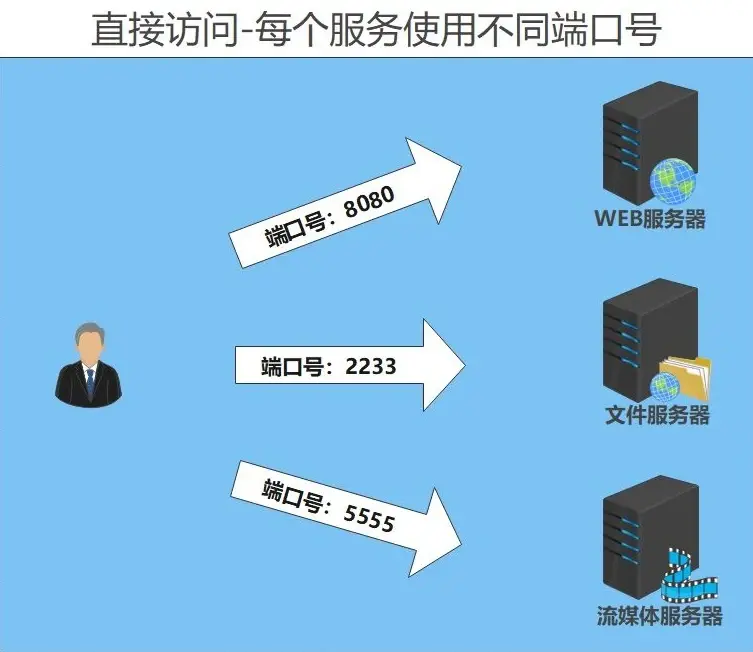

不过服务一多起来就需要记忆很多端口而且端口是纯数字并 **不方便记忆**  
使用反向代理可以实现"端口复用"让 **多个服务使用同一个端口**  

由反向代理接受用户的请求之后再转发到对应的服务端  
当然这意味着反向代理也需要一种方法来区分 **用户究竟想要访问什么**  

常见的区分后端服务的方法分别是:  

* 域名区分
* 资源路径区分

比如这里有一个域名 `ie12.net`
根据域名来区分 **即根据二级（多级）名称来区分**  

* `qb.ie12.net`
* `op.ie12.net`
* `alist.ie12.net`

通过资源路径区分:  

* `ie12.net/qb/`
* `ie12.net/op/`
* `ie12.net/alist/`

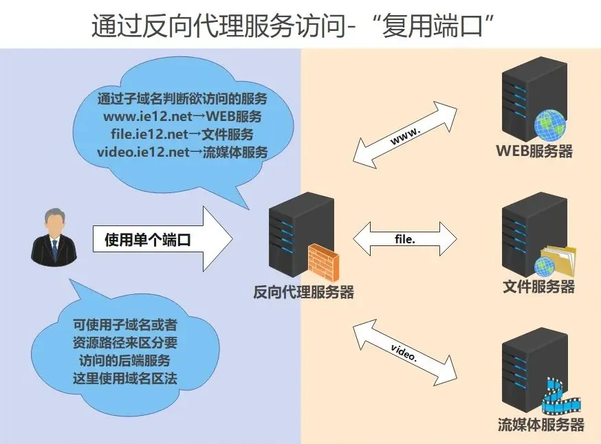

### TLS加密

关于TLS在之前的教程中已有所讲解 详见：[链接](./lucky-tls-自动化.md)   

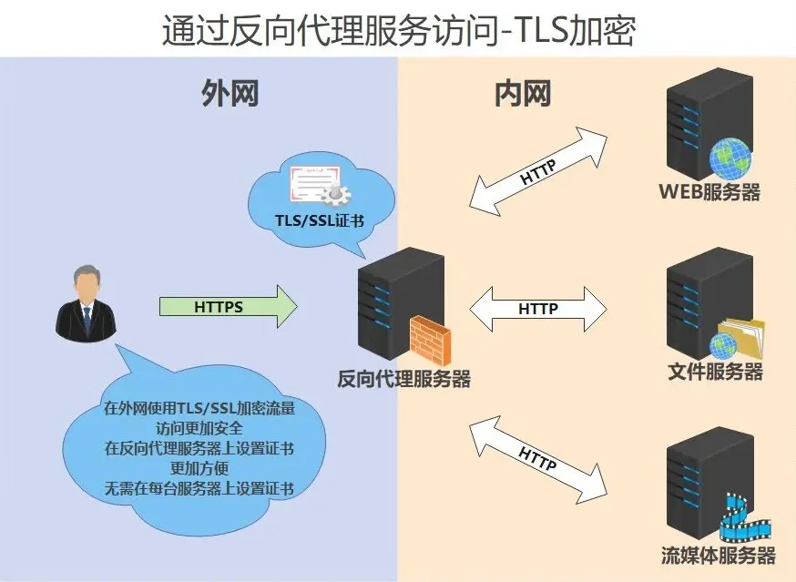

### 访问控制

由于反向代理隐藏了真正的源服务器所以用户在**访问时连接的是反向代理服务器**  
可以在其上**进行统一的访问控制**而无需在每一台服务器上都设置一遍  

其实之前的“端口复用”法就能起到一定的访问控制效果  
**必须要匹配上域名或者资源路径才能访问到对应的服务**  

若匹配不上就不能访问 可以有效防范扫描攻击  
当然除此之外也还能设置更多的访问控制条件  

---

## 域名设置

在本教程中将使用**域名法**区分法来区分后端服务  

即通过不同的子域名来对应不同的后端服务  
当然这些子域名只是名字不同它们**指向的IP都是相同的**  

我们可以为每个子域名都设置IP地址并使用DDNS来更新  
但这样太麻烦了 更好的方法是使用 **CNAME记录** 即别名记录  

其不指向IP地址而是指向**另一个域名**  
比如这里有域名 ie12.net 则可以设置CNAME记录  

```
www.ie12.net   ┐
video.ie12.net ├─ ie12.net
file.ie12.net  ┘ 
```

这样这三个域名的IP地址即为ie12.net所记录的IP地址
更新IP地址时**只需要更新 `ie12.net` 即可**

### 在Dynv6中设置记录

有关Dynv6的部分配置方法在之前的教程中有所讲解 详见：[链接](./lucky-ddns.md)   
登录Dynv6 》 点击 My Zones 》 选择你的动态域名 》 添加CNAME记录  

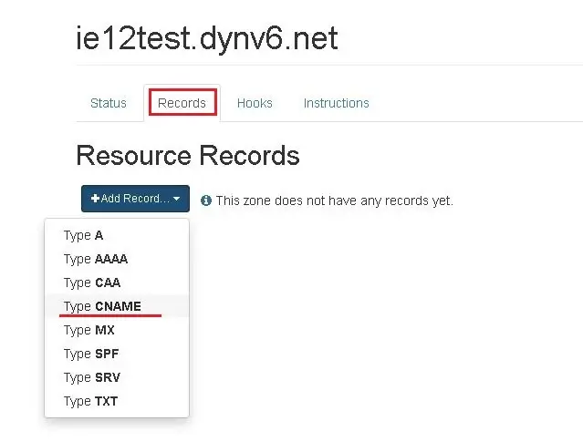

填写二级域名 host部分可以留空即使用上级主域名


**检视效果**  


当然我们也可以将其指向其他域名 不过要在指向的域名后加上英文点号 `.`  


如果不加上英文点号的话 整个欲指向的域名就就会被加到前面  


**若需要多个子级域名则重复上述设置即可**  
**若服务数量较多可以使用 泛域名解析替代**  
更新IP地址时**只需更新主动态域名**（`ie12test.dynv6.net`）即可  


### 在Cloudflare中设置记录

有关CF的部分配置方法在之前的教程中有所讲解 详见：[链接](./lucky-ddns.md)   
登录CF 》 点击侧边栏中的网站 》 选择你的域名 》 点击侧边栏中的DNS  
（Cloudflare下文简称CF）相比起Dynv6 CF上的设置更加简单  


点击添加记录 》 类型选择CNAME 》 名称自定义 方便记忆和区分服务即可 》  
代理状态关闭即仅DNS 》 目标直接填写主域名即可 》 保存  

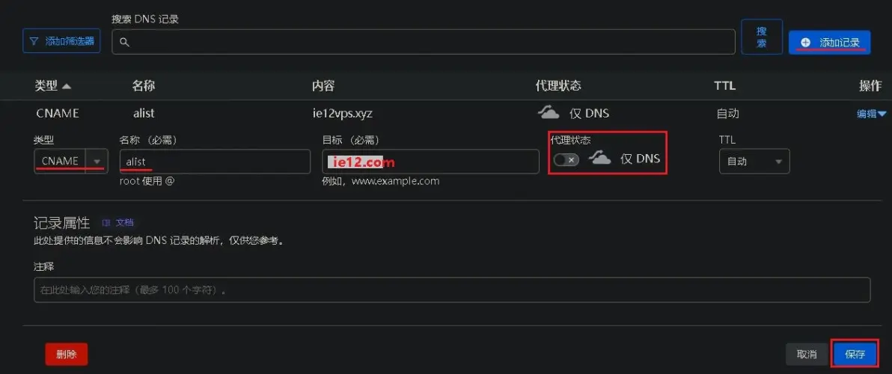

**检视效果**  


**若需要多个子级域名则重复上述设置即可**  
**若服务数量较多可以使用 泛域名解析替代**  
更新IP地址时**只需更新主域名**（`ie12.com`）即可  

---

## 配置地址解析

完成上述配置后我们只需要更新主域名就可以同步更新所有子域名的IP  
DDNS更新方法在之前的教程中已讲解过 详见：[链接](./lucky-ddns.md)   

---

##  配置基础反向代理规则 

在完成了（动态）域名设置的工作后我们就可以开始配置反向代理规则了  

### 创建WEB规则

登录lucky 》 点击侧边栏的WEB服务 》 添加WEB服务规则  


1. 名称可自定义 这里使用"反向代理"
2. 监听类型 **全选**
3. 监听端口可自定义 这里使用默认的16666此端口为之后访问各服务的**共用端口**
4. 确保该端口已经打开**可在外网被访问到**
5. 此处的防火墙放行选项是为Linux系统下iptable设计的在windows、docker下无效
6. 保存规则

**示例**  
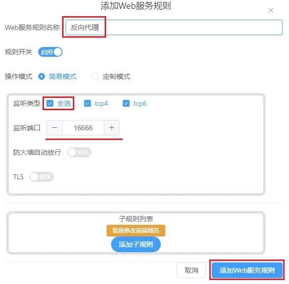

为服务添加子规则 点击添加子规则  


### 编辑规则内容

1. 子规则名称 可自定义 建议使用方便区分的名字  这边使用alist网盘服务进行演示
2. 服务类型：**反向代理**
3. 前端地址 填写之前配置好用于**代表服务的子（二级）域名**这里用的是 `alist.ie12test.dynv6.net`  
  （只填域名即可不用加HTTP或者端口号）
4. 后端地址 则是在内网访问服务时所使用的IP和端口 这里使用 `192.168.5.120:5244`  
  若lucky和被反代的服务运行在同一设备上则可以使用127.0.0.1若不是则应使用局域网IP
5. 打开万事大吉的开关 自动添加常见HTTP 请求头
6. 保存规则

**示例**  
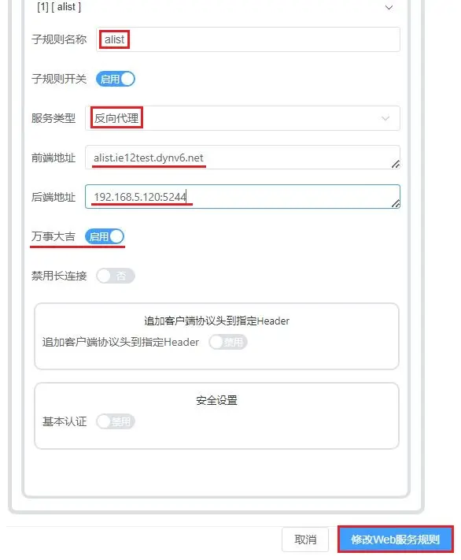

**检视效果**  


### 访问测试

在浏览器中输入 前端域名和端口 **查看访问效果**  
示例：`http://alist.ie12test.dynv6.net:16666/`  


多规则效果演示  


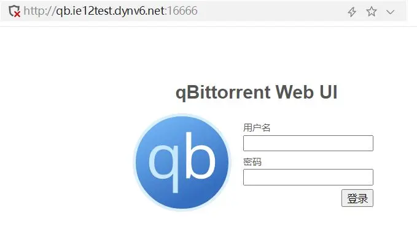

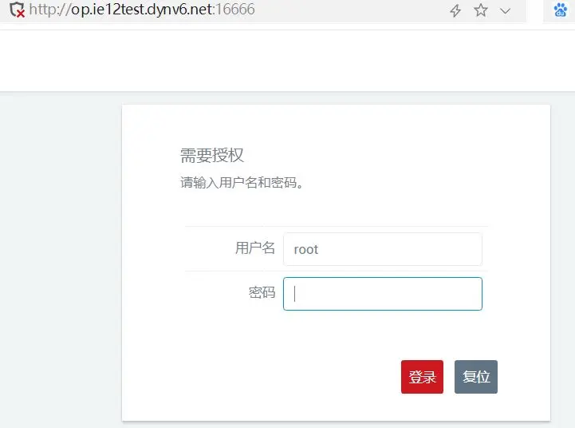


**！注意！** qb需要关闭host header验证或打开定制模式中的 使用目标地址host请求头  
否则会出现 Unauthorized 的报错 至此我们已经**完成了最基本的反向代理设置**  

---

## 配置HTTPS

### 开启TLS

在互联网中使用HTTP明文访问并不安全 我们需加密的HTTPS  
关于TLS和HTTPS的讲解请看之前的教程 完成链接中的内容后再继续接下来的步骤  
详见：[链接](./lucky-tls-自动化.md)  

编辑反代规则 **开启TLS开关**  


检视效果 前端地址**已经变成HTTPPS开头**  

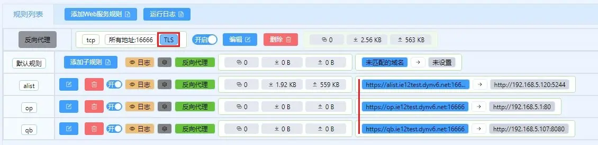

**访问测试**


**查看证书**  


### 配置HTTP重定向

在开启HTTPS后 **直接输入域名访问可能会失败**  
因为在不指明协议的情况下**默认使用HTTP协议** 我们当然可以手动加上 `https://`  
不过这样比较麻烦（也有的浏览器支持自动跳转到HTTPS）  

更好的方法是设置重新定向规则 **自动的将HTTP重定向到HTTPS上**  

**创建重定向规则**  

1. 添加一个新的WEB服务规则
2. 规则名称可自定义 这里使用 HTTP重定向
3. 监听类型全选
4. 监听端口 **与之前设置的反向代理规则使用相同的端口**
5. 保存规则

**示例**  
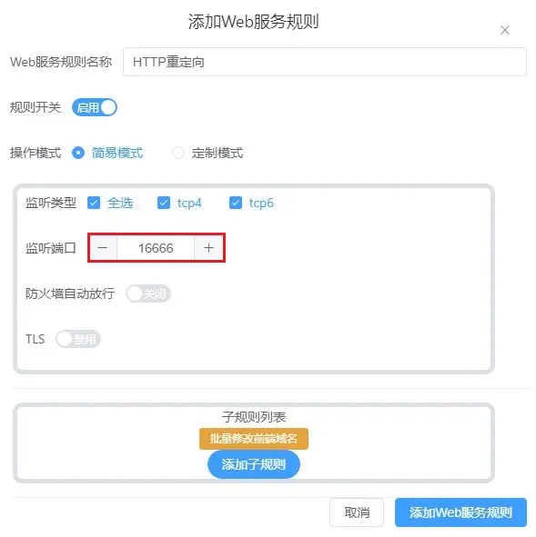

**接着添加子规则**  

1. 规则名称可自定义这里使用 一般重定向
2. 服务类型选择 **重定向**
3. 前段地址填写 所使用域名的泛域名 这里使用的是 `*.ie12test.dynv6.net`
4. 后端地址填写 `https://{hostAndPort}`
5. 打开 万事大吉开关
4. 保存规则

后端地址中的 https:// 表示使用HTTPS协议   
而变量 `{hostAndPort}` 则表示 **请求的主机名/域名以及端口**  
其他可用变量：[链接]( https://lucky666.cn/docs/modules/web#%E5%8F%AF%E7%94%A8%E5%8F%98%E9%87%8F)  

**示例**  


**检视效果**  
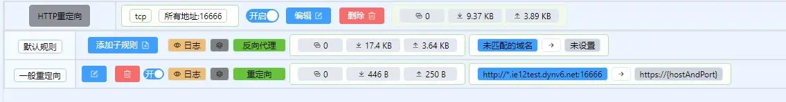

**测试重定向效果**  
在浏览器中直接输入域名应该可以自动跳转到HTTPS  

---

##  防范恶意扫描

### 来自网络扫描器的威胁

在完成了上述的设置后我们已经基本实现了安全的WEB访问  
不过在互联网上运行着许多的**自动化的端口扫描与刺探程序（网络扫描器）**  
它们全天候的扫描和记录着全球设备上开放的端口及其上面的服务  

这主要发生在IPv4上 IPv4的地址数量较少 在除去各种特殊地址后就更少了  
通过逐个IP和端口的扫描这些扫描器可以**轻松扫描完全球的设备**  

当然这些扫描器并不知道 我们设置的前端域名 其应只会使用IP和端口来访问  
固不能匹配上前端域名 这样一来**藏在反代后方的真正服务不会被发现**  

只不过在默认情况下lucky在遇到没有匹配任何域名的请求时会返回一个404错误页面  
尽管这个页面并不会泄露什么 即使是HTTPS也不用担心证书/域名泄露   
当没有域名匹配时lucky会使用一张自签名证书 **不用担心域名泄露问题**  

但是通过这个404错误页面 依然能发现该端口上有**名为 lucky 的WEB服务在运行**  
比较理想的状态是nginx的 444响应 即不发送响应**直接关闭连接**  
但现在这个还不能实现 作者以后可能会更新类似的功能 **（此功能已经更新 请看后文）**  

当下比较好的方法是：  
**将这些无法匹配前端域名的非法请求重新定向到其他网站**比如百度之类的  
其实网络扫描器也并非百害而无一利 一些 **端口搜索引擎** 也会使用其来记录端口  

例如：  

* [Shodan](https://www.shodan.io)
* [Censys](https://search.censys.io)
* [Fofa](https://fofa.info )


我们可以使用这些端口搜索引擎来**检查自己IP上暴露出的端口和服务**以做到提前预防  

### 为未匹配域名的请求设置重定向

编辑反向代理主规则 **切换到 定制模式**  


滚动页面 》 点开默认规则 》 修改服务类型为 重定向 》  
填写默认目标地址 `https://www.baidu.com` 》 **保存规则**  


**检视效果**  
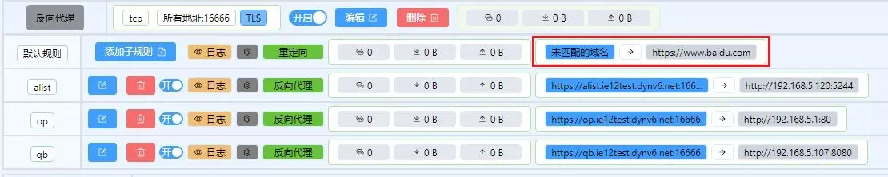

----

### v2.10.5之后

在v2.10.5版本更新了 **关闭连接功能** 可以直接切断连接不发送响应  
比重定向到百度的效果更好  

**设置方法**  
在默认规则中将服务类型设置为 **关闭连接**即可 默认目标地址不用填写  
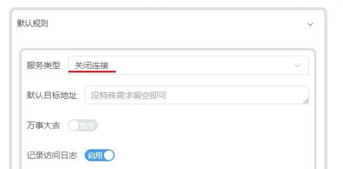

**检视效果**  


**访问测试**  
直接使用IP+端口进行访问  **连接直接关闭**没有发出任何响应  


---

### 编辑HTTP重定向主规则

修改方法和反向代理规则相同  

**检视效果**


**测试重定向效果**
直接使用IP加端口访问应会被重定向到百度  

**配置Basic认证**  

对一些不带登录认证的网页 可以添加Basic认证 **以起到额的外保护作用**  
在开启 Basic认证后会多一个登录验证的过程  

设置Basic认证之前  


编辑子规则 **开启Basic认证开关** 设置用户名和密码  
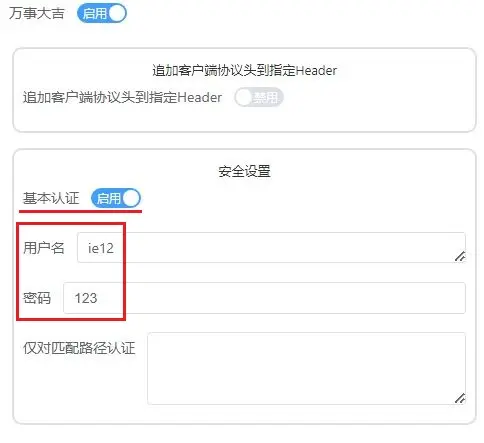

**检视效果**  
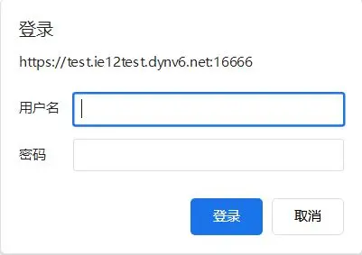

---

## 常见问题

请参考官方说明：[链接](https://lucky666.cn/docs/modules/web)  

---

## 参考资料

* [Top 5 search engines for internet-connected devices and services](https://www.welivesecurity.com/2023/05/18/5-search-engines-internet-connected-devices-services/)
* [What is HTTP “Host” header?](https://stackoverflow.com/questions/43156023/what-is-http-host-header)

