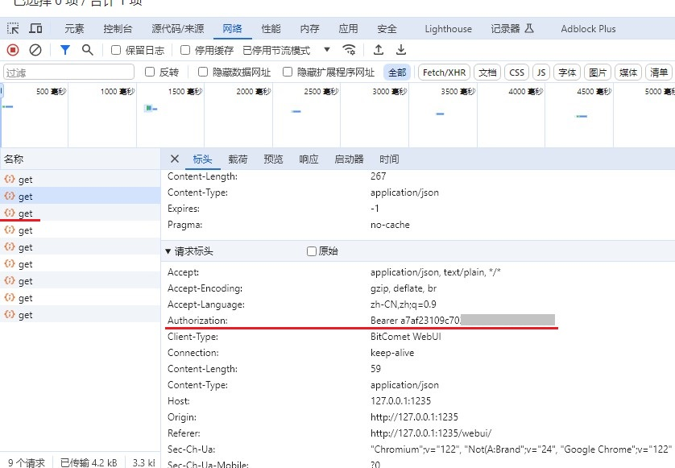
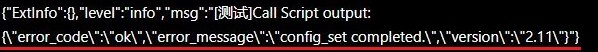

# 「LUCKY STUN穿透」使用脚本自动修改比特彗星的监听端口

2024.12.05  

在之前的教程中我们已经实现了 为qbittorrent 和 Transmission 自动更换监听端口  

* qb自动更换端口教程：[链接](./stun-qb端口自动化.md)  
* tr自动更换端口教程：[链接](./stun-tr修改端口.md)  

而在本教程中将讲解如何自动化的更换 **比特彗星** 的监听端口  
在2.10版本中比特彗星更新 WebUI 其提供了更换监听端口的接口  
这使得使用脚本自动化的更换端口成为了可能  

由于Windows批处理自身的限制 以及 BC API的一些特性  
使其相对于qb和Tr的更新方法会更复杂一些  
比特彗星 Web API接口定义：[链接](https://wiki-zh.bitcomet.com/webui_api%E8%B0%83%E7%94%A8%E6%8E%A5%E5%8F%A3)  

有关 curl 的安装 和部分lucky的设置方法  
在之前的教程中已经讲解过本文中不再赘述  
**建议先阅读之前的教程**  

---

## 检查比特彗星版本

要想使用此更新方法则比特彗星的版本要**大于等于2.10**  

**检查软件版本号**  


---

## 获取认证令牌

使用新式API接口 需要令牌进行验证  
其可以从新版WebUI的请求中获取到令牌 其长期有效  

### 登录新版 WebUI

启用 远程下载 设置 用户名和密码 并检查端口号  


先登录到旧版  再通过下方的链接跳转到新版WebUI  


显示出新版 WebUI 后需要再次登录  


### 检视HTTP请求

登录到新版 WebUI 后即可通过开发人员选项  
查看HTTP请求获取用于验证的令牌  

打开 开发人员选项（F12）选择任意请求  
查看 请求标头 寻找 `Authorization` 字段  
以 `Bearer`开头的部分即为令牌 **复制 Bearer 之后的字符**  



---

## 编辑和设置自动更新脚本

在获取完成令牌后就可以开始编辑更新脚本了  
与之前教程中的一样先手动创建并运行批处理 进行测试  
确保可用后再填入lucky stun 的自定义脚本中  

感谢 [泥浆](https://space.bilibili.com/14913) 提供的脚本支持  

**示例**  

```
set TOKEN=YOUR_TOKEN
set WEBUI=http://127.0.0.1:1235

for /F %%a in ('curl -Lks "%WEBUI%/api/config/connection/get" -H "Authorization: Bearer %TOKEN%" -H "Client-Type: BitComet WebUI"') do (set BODY=%%a)

set PORTSTR=%BODY:*"listen_port_tcp":=%
set OLDPORT=%PORTSTR:~0,4%

echo %PORTSTR:~0,5%| findstr "^[0-9]*$" >nul && set OLDPORT=%PORTSTR:~0,5%

call set BODY=%%BODY:"listen_port_tcp":%OLDPORT%="listen_port_tcp":${port}%%

curl -Lks "%WEBUI%/api/config/connection/set" -H "Authorization: Bearer %TOKEN%" -H "Client-Type: BitComet WebUI" -d %BODY:"=\"%

```

按照实际情况修改脚本  
**将刚才获取的token填入其中**  
修改WebUI参数的地址和端口 为比特彗星实际使用的端口  

若lucky和比特彗星在同一设备上则使用`127.0.0.1`即可  
若不在同一设备上填写则BC所在设备的局域网地址  
若lucky运行在docker容器中 也建议使用局域网地址  

因为是手动测试 我们需要暂时将 预备给lucky传递端口的变量  
`${port}`替换成直接的端口号  
测试端口号可以任意填写 **但不要低于4位数**  

最后加上 `pause` 保持窗口以便于检视运行效果  

**示例**  


### 测试效果

运行刚才保存好的批处理文件 检查输出效果  
若设置都正确 则可以看到脚本成功获取到了旧的端口号  
并成功的提交了新端口 与此同时BC弹出了设置更新的通知  


---

## 在STUN穿透中设置脚本

在测试完成后就可以将其写到STUN穿透规则中  
将之前换掉的端口变量换回来 并去掉最后的 `pause`  

**示例**  


若设置都正确则STUN规则在穿透成功后  
其会自动的修改BC的监听端口 BC也会在右下角弹出通知  

**检视STUN穿透日志**  


---

## 在Linux设备上进行更新 

若lucky运行在Linux设备上（含docker） 则需要通过shell脚本进行更新  
得益于其更强大的功能 使用sh脚本进行更新会更加简单  

**示例**  

```
TOKEN=YOUR_TOKEN
WEBUI=http://127.0.0.1:12345

BODY=$(curl -Lks "$WEBUI/api/config/connection/get" -H "Authorization: Bearer $TOKEN" -H "Client-Type: BitComet WebUI" | sed -E 's/"listen_port_tcp":[0-9]{1,5}/"listen_port_tcp":'${port}'/')

curl -Lks "$WEBUI/api/config/connection/set" -H "Authorization: Bearer $TOKEN" -H "Client-Type: BitComet WebUI" -d $BODY
```


